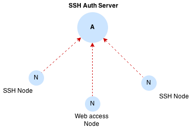

# Teleport

Teleport is a SSH infrastructure for clusters of Linux servers. Teleport extends 
traditional SSH with the following capabilities:

* Provides coordinated and secure access to multiple Linux clusters by multiple teams 
  with different permissions.
* Enforces cluster-specific security policies.
* Includes session record/replay and keeps audit logs.

It also contains a few nice conveniences like built-in command multiplexing, web-based
administration and more. `Teleport` is a standalone executable.

Teleport uses [Etcd](https://coreos.com/etcd/) in HA mode or [Boltdb](https://github.com/boltdb/bolt) in standalone mode.

## Deploying

Every commit to `master` branch triggers Jenkins to deploy to https://teleport.gravitational.io
You can also deploy via Slack by sending a `/deploy` message like this:

```
/deploy teleport staging master
```

## Status

**Teleport is not ready to be used in production yet**

We are currently fixing outstanding security issues, and working on hardening.

## Design document

Take a look at [Teleport design document](https://docs.google.com/a/gravitational.io/document/d/10-DjtvKFjsiPHcMDArHtjvepdQg5iZUWSafAF03OBbE/edit?usp=sharing)

## Developer Docs

Take a look at [Developer API](docs/api.md)

## Overview



Teleport system consists of several independent parts that can be set up in various combinations:

**Teleport Auth**

Auth server acts as Authentication and Authorization server, SSH host and user certificate authority, stores audit logs and access
records and is the only stateful component in the system.

*Note* Read more about SSH authorities in this [intro article](https://www.digitalocean.com/community/tutorials/how-to-create-an-ssh-ca-to-validate-hosts-and-clients-with-ubuntu)
*Note* Auth server does not itself provide any support for interactive sessions and remote command execution

**Teleport SSH**

Teleport SSH server is a simple stateless server written in Go that only supports SSH user certificates as authentication method,
generates structured events and supports interactive collaborative sessions.

**Teleport Proxy**

Teleport Proxy is a stateless SSH proxy that implements 2-factor web authentication and proxies traffic to the remote SSH nodes.

## Installation

Teleport is open source, however it   and should be cloned from the repository.

**Prerequisites**

* `go >= 1.4.2`
* `etcd >= v2.0.10` (in case of HA mode)

**Clone the latest master**

```shell
mkdir -p $(GOPATH)/src/github/gravitational
cd $(GOPATH)/src/github/gravitational
git clone git@github.com:gravitational/teleport.git
```

**Compile**

```shell
make install
```

This should install `teleport` and `tctl` binaries, check that the binaries are installed.

```shell
ls ${GOPATH}/bin/tctl ${GOPATH}/bin/teleport
```

## Quickstart

```shell
# create the directory where auth server will keep it's local state
mkdir -p /var/lib/teleport
# make sure it is not owned by root
chown <<USER>>:<<GROUP>> /var/lib/teleport

# start teleport in embedded mode
teleport start
```

**Note:** `run-embedded` executes teleport with configuration file in `examples/embedded.yaml` check it out for more details

### Web access via proxy

Teleport allows to access the cluster via web portal. The web portal is guarded by 2-factor authentication. Here's how to log in:


* Create a user entry:

```shell
tctl users add alex root,centos
```

And follow instructions.


### OpenSSH client -> Teleport Proxy

To use OpenSSH client with Teleport you need to run Teleport ssh agent on your local machine.

1. Login into proxy

```shell
tsh --proxy=<addr> login
```

This command will retrieve and store user certificates signed by the proper certificate
authority

2. Start the agent
  
```shell
tsh --proxy=<addr> agent
```

It will output something like:

```shell
SSH_AUTH_SOCK=/tmp/316b647c-a81c-4d7c-a916-1c80f38ce0f6.socket; export SSH_AUTH_SOCK;
```

You can simply copy and paste this into terminal to tell your SSH client to use agent

3. Tell OpenSSH to use proxy as a jump host using config
  
```shell
Host *
     ForwardAgent no

# tells open ssh to use proxy.example.com as a jumphost when logging
# to any server matching patter *.node.example.com
# beware of recurison here (when proxy name matches your pattern)
Host *.node.example.com
  ProxyCommand ssh -p 3023 %r@proxy.example.com -s proxy:%h:%p
```

4. Tell OpenSSH client to trust hosts managed by teleport

```shell
tctl authorities --type=host export >> ~/.ssh/authorized_keys
```

5. Then you can connect to your ssh nodes as usual:
  
```shell
  ssh -p 22 user@a.node.example.com
```

### Teleport Proxy -> OpenSSH server

1. Export user certificate authorities used by Teleport to a file

```shell
tctl authorities --type=user export > /etc/ssh/user-ca.pub
```

2. Tell OpenSSH to trust exporeted authorities

In your /etc/ssh/sshd_config

```shell
# this instructs OpenSSH to trust certificates signed by teleport's user authorities
TrustedUserCAKeys /etc/ssh/user-ca.pub
```

### Ansible

By default Ansible uses OpenSSH client. To make Ansible work with Teleport you need:

* config your OpenSSH client
* enable scp mode in the Ansible config file(default /etc/ansible/ansible.cfg):
 
```
scp_if_ssh = True
```
