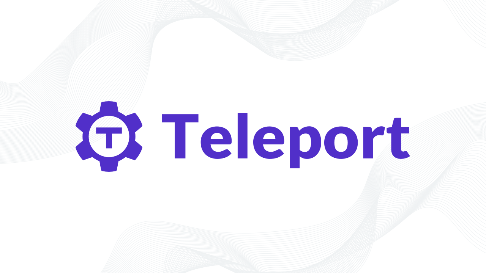

<div align="center">
   
   <div align="center" style="padding: 25px">
      <a href="https://goteleport.com/teleport/download">
      
      </a>
      <a href="https://golang.org/">
      
      </a>
      <a href="https://github.com/gravitational/teleport/blob/master/CODE_OF_CONDUCT.md">
      
      </a>
      <a href="https://www.apache.org/licenses/LICENSE-2.0">
      
      </a>
   </div>
</div>
</br>

> Read our Blog: https://goteleport.com/blog/

> Read our Documentation: https://goteleport.com/docs/getting-started/

## Table of Contents

1. [Introduction](#introduction)
1. [Installing and Running](#installing-and-running)
1. [Docker](#docker)
1. [Building Teleport](#building-teleport)
1. [Why Did We Build Teleport?](#why-did-we-build-teleport)
1. [More Information](#more-information)
1. [Support and Contributing](#support-and-contributing)
1. [Is Teleport Secure and Production Ready?](#is-teleport-secure-and-production-ready)
1. [Who Built Teleport?](#who-built-teleport)

## Introduction

Teleport is the easiest, most secure way to access all your infrastructure.
Teleport is an identity-aware, multi-protocol access proxy which understands
SSH, HTTPS, RDP, Kubernetes API, MySQL, MongoDB and PostgreSQL wire protocols.

On the server-side, Teleport is a single binary which enables convenient secure
access to behind-NAT resources such as:

* [SSH nodes](https://goteleport.com/docs/getting-started/) - SSH works in browsers too!
* [Kubernetes clusters](https://goteleport.com/docs/kubernetes-access/introduction/)
* [PostgreSQL, MongoDB, CockroachDB and MySQL databases](https://goteleport.com/docs/database-access/introduction/)
* [Internal Web apps](https://goteleport.com/docs/application-access/introduction/)
* [Windows Hosts](https://goteleport.com/docs/desktop-access/introduction/)
* [Networked servers](https://goteleport.com/docs/server-access/introduction/)

Teleport is trivial to set up as a Linux daemon or in a Kubernetes pod. It's rapidly
replacing legacy `sshd`-based setups at organizations who need:

* Developer convenience of having instant secure access to everything they need
  across many environments and cloud providers.
* Audit log with session recording/replay for multiple protocols
* Easily manage trust between teams, organizations and data centers.
* Role-based access control (RBAC) and flexible access workflows (one-time [access requests](https://goteleport.com/features/access-requests/))

In addition to its hallmark features, Teleport is interesting for smaller teams
because it facilitates easy adoption of the best infrastructure security
practices like:

- No need to manage shared secrets such as SSH keys: Teleport uses certificate-based access with automatic certificate expiration time for all protocols.
- Two-factor authentication (2FA) for everything.
- Collaboratively troubleshoot issues through session sharing.
- Single sign-on (SSO) for everything via Github Auth, OpenID Connect, or SAML with endpoints like Okta or Active Directory.
- Infrastructure introspection: Use Teleport via the CLI or Web UI to view the status of every SSH node, database instance, Kubernetes cluster, or internal web app.

Teleport is built upon the high-quality [Golang SSH](https://godoc.org/golang.org/x/crypto/ssh)
implementation. It is _fully compatible with OpenSSH_,
`sshd` servers, and `ssh` clients.

|Project Links| Description
|---|----
| [Teleport Website](https://goteleport.com/) | The official website of the project. |
| [Documentation](https://goteleport.com/docs/) | Admin guide, user manual and more. |
| [Demo Video](https://www.youtube.com/watch?v=b1WHFW0NIoM) | 3-minute video overview of Teleport. |
| [Blog](https://goteleport.com/blog/) | Our blog where we publish Teleport news. |
| [Forum](https://github.com/gravitational/teleport/discussions) | Ask us a setup question, post your tutorial, feedback, or idea on our forum. |
| [Slack](https://goteleport.com/slack) | Need help with your setup? Ping us in our Slack channel. |
| [Cloud-hosted](https://goteleport.com/pricing) | We offer Enterprise with a Cloud-hosted option. For teams that require easy and secure access to their computing environments. |


## Installing and Running

| Follow the [Installation](https://goteleport.com/docs/installation/) Guide

Download the [latest binary release](https://goteleport.com/teleport/download),
unpack the .tar.gz and run `sudo ./install`. This will copy Teleport binaries into
`/usr/local/bin`.

Then you can run Teleport as a single-node cluster:

```bash
$ sudo teleport start
```

In a production environment, Teleport must run as `root`. For testing or non-production environments, run it as the `$USER`:

`chown $USER /var/lib/teleport`

* In this case, you will not be able to log in as another user.

## Docker

| Follow the Docker-Compose [Getting Started](https://goteleport.com/docs/setup/guides/docker-compose/) Guide

### Deploy Teleport

If you wish to deploy Teleport inside a Docker container:
```
# This command will pull the Teleport container image for version 8
$ docker pull quay.io/gravitational/teleport:8
```
View latest tags on [Quay.io | gravitational/teleport](https://quay.io/repository/gravitational/teleport?tab=tags)

### For Local Testing and Development

Follow the instructions in the [docker/README](docker/README.md) file.

## Building Teleport

The `teleport` repository contains the Teleport daemon binary (written in Go)
and a web UI written in Javascript (a git submodule located in the `webassets/`
directory).

If your intention is to build and deploy for use in a production infrastructure
a released tag should be used.  The default branch, `master`, is the current
development branch for an upcoming major version.  Get the latest release tags
listed at https://goteleport.com/download/ and then use that tag in the `git clone`.
For example `git clone https://github.com/gravitational/teleport.git -b v9.1.2` gets release v9.1.2.

### Dockerized Build

It is often easiest to build with Docker, which ensures that all required
tooling is available for the build. To execute a dockerized build, ensure
that docker is installed and running, and execute:

```
$ make -C build.assets build-binaries
```

### Local Build

To perform a build on your host, ensure you have installed Go. In order to
include the Rust-powered features like Desktop Access, you'll
also need `cargo` and `rustc`. The current versions of these tools can be found
in `build.assets/Makefile`.

```bash
# get the source & build:
$ git clone https://github.com/gravitational/teleport.git
$ cd teleport
$ make full

# create the default data directory before starting:
$ sudo mkdir -p -m0700 /var/lib/teleport
$ sudo chown $USER /var/lib/teleport
```
  
If the build succeeds, the installer will place the binaries in the `build` directory.

**Important:**

* The Go compiler is somewhat sensitive to the amount of memory: you will need
  **at least** 1GB of virtual memory to compile Teleport. A 512MB instance
  without swap will **not** work.
* This will build the latest version of Teleport, **regardless** of whether it
  is stable. If you want to build the latest stable release, run `git checkout`
  to the corresponding tag (for example, run `git checkout v8.0.0`) **before**
  running `make full`.

### Web UI

The Teleport Web UI resides in the [Gravitational Webapps](https://github.com/gravitational/webapps) repo.

#### Rebuilding Web UI for development

To clone this repository and rebuild the Teleport UI package, run the following commands:

```bash
$ git clone git@github.com:gravitational/webapps.git
$ cd webapps
$ make build-teleport
```

Then you can replace Teleport Web UI files with the files from the newly-generated `/dist` folder.

To enable speedy iterations on the Web UI, you can run a
[local web-dev server](https://github.com/gravitational/webapps/tree/master/packages/teleport).

You can also tell Teleport to load the Web UI assets from the source directory.
To enable this behavior, set the environment variable `DEBUG=1` and rebuild with the default target:

```bash
# Run Teleport as a single-node cluster in development mode:
$ DEBUG=1 ./build/teleport start -d
```

Keep the server running in this mode, and make your UI changes in `/dist` directory.
For instructions about how to update the Web UI, read [the `webapps` README](https://github.com/gravitational/webapps/blob/master/README.md) file.

#### Updating Web UI assets

After you commit a change to [the `webapps`
repo](https://github.com/gravitational/webapps), you need to update the Web UI
assets in the `webassets/` git submodule.

Run `make update-webassets` to update the `webassets` repo and create a PR for
`teleport` to update its git submodule.

You will need to have the `gh` utility installed on your system for the script
to work. For installation instructions, read the [GitHub CLI installation](https://github.com/cli/cli/releases/latest) documentation.

### Managing dependencies

All dependencies are managed using [Go modules](https://blog.golang.org/using-go-modules). Here are the instructions for some common tasks:

#### Add a new dependency

Latest version:

```bash
go get github.com/new/dependency
```

and update the source to use this dependency.


To get a specific version, use `go get github.com/new/dependency@version` instead.

#### Set dependency to a specific version

```bash
go get github.com/new/dependency@version
```

#### Update dependency to the latest version

```bash
go get -u github.com/new/dependency
```

#### Update all dependencies

```bash
go get -u all
```

#### Debugging dependencies

Why is a specific package imported?

`go mod why $pkgname`

Why is a specific module imported?

`go mod why -m $modname`

Why is a specific version of a module imported?

`go mod graph | grep $modname`

## Why did We Build Teleport?

The Teleport creators used to work together at Rackspace. We noticed that most cloud computing users struggle with setting up and configuring infrastructure security because popular tools, while flexible, are complex to understand and expensive to maintain. Additionally, most organizations use multiple infrastructure form factors such as several cloud providers, multiple cloud accounts, servers in colocation, and even smart devices. Some of those devices run on untrusted networks, behind third-party firewalls. This only magnifies complexity and increases operational overhead.

We had a choice, either start a security consulting business or build a solution that's dead-easy to use and understand. A real-time representation of all of your servers in the same room as you, as if they were magically _teleported_. Thus, Teleport was born!

## More Information

* [Teleport Getting Started](https://goteleport.com/docs/getting-started/)
* [Teleport Architecture](https://goteleport.com/teleport/docs/architecture)
* [Reference](https://goteleport.com/docs/setup/reference/)
* [FAQ](https://goteleport.com/docs/faq)

## Support and Contributing

We offer a few different options for support. First of all, we try to provide clear and comprehensive documentation. The docs are also in Github, so feel free to create a PR or file an issue if you have ideas for improvements. If you still have questions after reviewing our docs, you can also:

* Join [Teleport Discussions](https://github.com/gravitational/teleport/discussions) to ask questions. Our engineers are available there to help you.
* If you want to contribute to Teleport or file a bug report/issue, you can create an issue here in Github.
* If you are interested in Teleport Enterprise or more responsive support during a POC, we can also create a dedicated Slack channel for you during your POC. You can [reach out to us through our website](https://goteleport.com/pricing/) to arrange for a POC.

## Is Teleport Secure and Production Ready?

Teleport is used by leading companies to enable engineers to quickly access any
computing resource anywhere. Teleport has completed several security audits from the nationally recognized technology security companies. We make some our audits public, view our latest [audit reports.](https://goteleport.com/resources/audits/).
We are comfortable with the use of Teleport from a security perspective.

You can see the list of companies who use Teleport in production on the Teleport
[product page](https://goteleport.com/case-study/).

You can find the latest stable Teleport build on our [Releases](https://goteleport.com/teleport/download) page.

## Who Built Teleport?

Teleport was created by [Gravitational Inc](https://goteleport.com). We have
built Teleport by borrowing from our previous experiences at Rackspace. [Learn more
about Teleport and our history](https://goteleport.com/about/).
