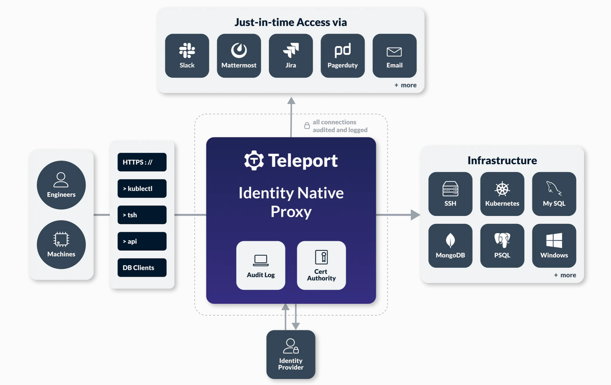

Teleport provides connectivity, authentication, access controls and audit for infrastructure.

Here is why you might use Teleport:

* Set up SSO for all of your cloud infrastructure [1].
* Protect access to cloud and on-prem services using mTLS endpoints and short-lived certificates.
* Establish tunnels to access services behind NATs and firewalls.
* Provide an audit log with session recording and replay for various protocols.
* Unify Role-Based Access Control (RBAC) and enforce the principle of least privilege with  [access requests](https://goteleport.com/features/access-requests/).

[1] The open source version supports only GitHub SSO.

Teleport works with SSH, Kubernetes, databases, RDP, and web services.

* Architecture: https://goteleport.com/docs/reference/architecture/
* Getting Started: https://goteleport.com/docs/get-started/

<div align="center">
   <a href="https://goteleport.com/download">
   
   </a>
   <div align="center" style="padding: 25px">
      <a href="https://goteleport.com/download">
      
      </a>
      <a href="https://golang.org/">
      
      </a>
      <a href="https://github.com/gravitational/teleport/blob/master/CODE_OF_CONDUCT.md">
      
      </a>
      <a href="https://www.gnu.org/licenses/agpl-3.0.en.html">
      
      </a>
   </div>
</div>
</br>

## Table of Contents

1. [Introduction](#introduction)
1. [Installing and Running](#installing-and-running)
1. [Docker](#docker)
1. [Building Teleport](#building-teleport)
1. [Why Did We Build Teleport?](#why-did-we-build-teleport)
1. [More Information](#more-information)
1. [Support and Contributing](#support-and-contributing)
1. [Is Teleport Secure and Production Ready?](#is-teleport-secure-and-production-ready)
1. [Who Built Teleport?](#who-built-teleport)
1. [License](#license)

## Introduction

Teleport includes an identity-aware access proxy, a CA that issues short-lived certificates, a unified access control system and a tunneling system to access resources behind the firewall.

We have implemented Teleport as a single Go binary that integrates with multiple protocols and cloud services:

* [SSH nodes](https://goteleport.com/docs/enroll-resources/server-access/introduction/).
* [Kubernetes clusters](https://goteleport.com/docs/enroll-resources/kubernetes-access/introduction/)
* [PostgreSQL, MongoDB, CockroachDB and MySQL databases](https://goteleport.com/docs/enroll-resources/database-access/).
* [Internal Web apps](https://goteleport.com/docs/enroll-resources/application-access/introduction/).
* [Windows Hosts](https://goteleport.com/docs/enroll-resources/desktop-access/introduction/).
* [Networked servers](https://goteleport.com/docs/enroll-resources/server-access/introduction/).

You can set up Teleport as a [Linux daemon](https://goteleport.com/docs/admin-guides/deploy-a-cluster/linux-demo) or a [Kubernetes deployment](https://goteleport.com/docs/admin-guides/deploy-a-cluster/helm-deployments/).

Teleport focuses on best practices for infrastructure security:

- No need to manage shared secrets such as SSH keys or Kubernetes tokens: it uses certificate-based auth with certificate expiration for all protocols.
- Two-factor authentication (2FA) for everything.
- Collaboratively troubleshoot issues through session sharing.
- Single sign-on (SSO) for everything via GitHub Auth, OpenID Connect, or SAML with endpoints like Okta or Microsoft Entra ID.
- Infrastructure introspection: Use Teleport via the CLI or Web UI to view the status of every SSH node, database instance, Kubernetes cluster, or internal web app.

Teleport uses [Go crypto](https://godoc.org/golang.org/x/crypto). It is _fully compatible with OpenSSH_, `sshd` servers, and `ssh` clients, Kubernetes clusters and more.

|Project Links| Description
|---|----
| [Teleport Website](https://goteleport.com/) | The official website of the project. |
| [Documentation](https://goteleport.com/docs/) | Admin guide, user manual and more. |
| [Blog](https://goteleport.com/blog/) | Our blog where we publish Teleport news. |
| [Forum](https://github.com/gravitational/teleport/discussions) | Ask us a setup question, post your tutorial, feedback, or idea on our forum. |
| [Slack](https://goteleport.com/slack) | Need help with your setup? Ping us in our Slack channel. |
| [Cloud-hosted](https://goteleport.com/pricing) | We offer Enterprise with a Cloud-hosted option. For teams that require easy and secure access to their computing environments. |


## Installing and Running

To set up a single-instance Teleport cluster, follow our [getting started
guide](https://goteleport.com/docs/admin-guides/deploy-a-cluster/linux-demo/). You can then register your
servers, Kubernetes clusters, and other infrastructure with your Teleport
cluster.

You can also get started with Teleport Enterprise Cloud, a managed Teleport
deployment that makes it easier to enable secure access to your infrastructure.

[Sign up for a free trial](https://goteleport.com/signup) of Teleport Enterprise
Cloud.

Follow our guide to [registering your first
server](https://goteleport.com/docs/get-started/)
with Teleport Enterprise Cloud.

## Docker

### Deploy Teleport

If you wish to deploy Teleport inside a Docker container see the
[installation guide](https://goteleport.com/docs/installation/#running-teleport-on-docker).

### For Local Testing and Development

To run a full test suite locally, see [the test dependencies list](BUILD_macos.md#local-tests-dependencies)

## Building Teleport

The `teleport` repository contains the Teleport daemon binary (written in Go)
and a web UI written in TypeScript.

If your intention is to build and deploy for use in a production infrastructure
a released tag should be used.  The default branch, `master`, is the current
development branch for an upcoming major version.  Get the latest release tags
listed at https://goteleport.com/download/ and then use that tag in the `git clone`.
For example `git clone https://github.com/gravitational/teleport.git -b v16.0.0` gets release v16.0.0.

### Dockerized Build

It is often easiest to build with Docker, which ensures that all required
tooling is available for the build. To execute a dockerized build, ensure
that docker is installed and running, and execute:

```
make -C build.assets build-binaries
```

### Local Build

#### Dependencies

Ensure you have installed correct versions of necessary dependencies:
* `Go` version from
  [go.mod](https://github.com/gravitational/teleport/blob/master/go.mod#L3)
* If you wish to build the Rust-powered features like Desktop Access, see the
  `Rust` and `Cargo` versions in
  [build.assets/Makefile](https://github.com/gravitational/teleport/blob/master/build.assets/Makefile#L21)
  (search for `RUST_VERSION`)
* For `tsh` version > `10.x` with FIDO2 support, you will need `libfido2` and
  `pkg-config` installed locally
* To build the web UI:
  * [`pnpm`](https://pnpm.io/installation#using-corepack). If you have Node.js installed, run `corepack enable pnpm` to make `pnpm` available.
  * If you prefer not to install/use pnpm, but have docker available, you can run `make docker-ui` instead.
  * The `Rust` and `Cargo` version in [build.assets/Makefile](https://github.com/gravitational/teleport/blob/master/build.assets/versions.mk#L11) (search for `RUST_VERSION`) are required.
  * The [`wasm-pack`](https://github.com/rustwasm/wasm-pack) version in [build.assets/Makefile](https://github.com/gravitational/teleport/blob/master/build.assets/versions.mk#L12) (search for `WASM_PACK_VERSION`) is required.
  * [`binaryen`](https://github.com/WebAssembly/binaryen) (which contains `wasm-opt`) is required to be installed manually
    on linux aarch64 (64-bit ARM). You can check if it's already installed on your system by running `which wasm-opt`. If not you can install it like `apt-get install binaryen` (for Debian-based Linux). `wasm-pack` will install this automatically on other platforms.

For an example of Dev Environment setup on a Mac, see [these instructions](BUILD_macos.md).

#### Perform a build

>**Important**
>
>* The Go compiler is somewhat sensitive to the amount of memory: you will need
   **at least** 1GB of virtual memory to compile Teleport. A 512MB instance
   without swap will **not** work.
>* This will build the latest version of Teleport, **regardless** of whether it
   is stable. If you want to build the latest stable release, run `git checkout`
   and `git submodule update --recursive` to the corresponding tag (for example,
>* run `git checkout v8.0.0`) **before** performing a build.

Get the source

```shell
git clone https://github.com/gravitational/teleport.git
cd teleport
```

To perform a build

```shell
make full
```

`tsh` dynamically links against libfido2 by default, to support development
environments, as long as the library itself can be found:

```shell
$ brew install libfido2 pkg-config  # Replace with your package manager of choice

$ make build/tsh
> libfido2 found, setting FIDO2=dynamic
> (...)
```

Release binaries are linked statically against libfido2. You may switch the
linking mode using the FIDO2 variable:

```shell
make build/tsh FIDO2=dynamic # dynamic linking
make build/tsh FIDO2=static  # static linking, for an easy setup use `make enter`
                             # or `build.assets/macos/build-fido2-macos.sh`.
make build/tsh FIDO2=off     # doesn't link libfido2 in any way
```

`tsh` builds with Touch ID support require access to an Apple Developer account.
If you are a Teleport maintainer, ask the team for access.

#### Build output and run locally

If the build succeeds, the installer will place the binaries in the `build` directory.

Before starting, create default data directories:

```shell
sudo mkdir -p -m0700 /var/lib/teleport
sudo chown $USER /var/lib/teleport
```

#### Running Teleport in a hot reload mode

To speed up your development process, you can run Teleport using
[`CompileDaemon`](https://github.com/githubnemo/CompileDaemon). This will build
and run the Teleport binary, and then rebuild and restart it whenever any Go
source files change.

1. Install CompileDaemon:

    ```shell
    go install github.com/githubnemo/CompileDaemon@latest
    ```

    Note that we use `go install` instead of the suggested `go get`, because we
    don't want CompileDaemon to become a dependency of the project.

1. Build and run the Teleport binary:

    ```shell
    make teleport-hot-reload
    ```

    By default, this runs a `teleport start` command. If you want to customize
    the command, for example by providing a custom config file location, you can
    use the `TELEPORT_ARGS` parameter:

    ```shell
    make teleport-hot-reload TELEPORT_ARGS='start --config=/path/to/config.yaml'
    ```

Note that you still need to run [`make grpc`](api/proto/README.md) if you modify
any Protocol Buffers files to regenerate the generated Go sources; regenerating
these sources should in turn cause the CompileDaemon to rebuild and restart
Teleport.

### Web UI

The Teleport Web UI resides in the [web](web) directory.

#### Rebuilding Web UI for development

To rebuild the Teleport UI package, run the following command:

```bash
make docker-ui
```

Then you can replace Teleport Web UI files with the files from the newly-generated `/dist` folder.

To enable speedy iterations on the Web UI, you can run a [local web-dev server](web#web-ui).

You can also tell Teleport to load the Web UI assets from the source directory.
To enable this behavior, set the environment variable `DEBUG=1` and rebuild with the default target:

```bash
# Run Teleport as a single-node cluster in development mode:
DEBUG=1 ./build/teleport start -d
```

Keep the server running in this mode, and make your UI changes in `/dist` directory.
For instructions about how to update the Web UI, read [the `web` README](web#readme).

### Managing dependencies

All dependencies are managed using [Go modules](https://blog.golang.org/using-go-modules). Here are the instructions for some common tasks:

#### Add a new dependency

Latest version:

```bash
go get github.com/new/dependency
```

and update the source to use this dependency.


To get a specific version, use `go get github.com/new/dependency@version` instead.

#### Set dependency to a specific version

```bash
go get github.com/new/dependency@version
```

#### Update dependency to the latest version

```bash
go get -u github.com/new/dependency
```

#### Update all dependencies

```bash
go get -u all
```

#### Debugging dependencies

Why is a specific package imported?

`go mod why $pkgname`

Why is a specific module imported?

`go mod why -m $modname`

Why is a specific version of a module imported?

`go mod graph | grep $modname`

### Devbox Build (experimental)

**Note**: Devbox support is still experimental. It's very possible things may not work as intended.

Teleport can be built using [devbox](https://www.jetpack.io/devbox). To use devbox, follow
the instructions to install devbox [here](https://www.jetpack.io/devbox/docs/quickstart/) and
then run:

`devbox shell`

This will install Teleport's various build dependencies and drop you into a shell with these
dependencies. From here, you can build Teleport normally.

#### flake.nix

A nix flake is located in `build.assets/flake` that allows for installation of Teleport's less
common build tooling. If this flake is updated, run:

`devbox install`

in order to make sure the changes in the flake are reflected in the local devbox shell.

## Why did We Build Teleport?

The Teleport creators used to work together at Rackspace. We noticed that most cloud computing users struggle with setting up and configuring infrastructure security because popular tools, while flexible, are complex to understand and expensive to maintain. Additionally, most organizations use multiple infrastructure form factors such as several cloud providers, multiple cloud accounts, servers in colocation, and even smart devices. Some of those devices run on untrusted networks, behind third-party firewalls. This only magnifies complexity and increases operational overhead.

We had a choice, either start a security consulting business or build a solution that's dead-easy to use and understand. A real-time representation of all of your servers in the same room as you, as if they were magically _teleported_. Thus, Teleport was born!

## More Information

* [Teleport Getting Started](https://goteleport.com/docs/get-started/)
* [Teleport
  Architecture](https://goteleport.com/docs/reference/architecture/)
* [Reference](https://goteleport.com/docs/reference/)
* [FAQ](https://goteleport.com/docs/faq)

## Support and Contributing

We offer a few different options for support. First of all, we try to provide clear and comprehensive documentation. The docs are also in GitHub, so feel free to create a PR or file an issue if you have ideas for improvements. If you still have questions after reviewing our docs, you can also:

* Join [Teleport Discussions](https://github.com/gravitational/teleport/discussions) to ask questions. Our engineers are available there to help you.
* If you want to contribute to Teleport or file a bug report/issue, you can create an issue here in GitHub.
* If you are interested in Teleport Enterprise or more responsive support during a POC, we can also create a dedicated Slack channel for you during your POC. You can [reach out to us through our website](https://goteleport.com/pricing/) to arrange for a POC.

## Is Teleport Secure and Production-Ready?

Yes -- Teleport is production-ready and designed to protect and facilitate
access to the most precious and mission-critical applications.

Teleport has completed several security audits from nationally and
internationally recognized technology security companies.

We publicize some of our audit results, security philosophy and related
information on our [trust page](https://trust.goteleport.com/).

You can see the list of companies that use Teleport in production on the Teleport
[product page](https://goteleport.com/case-study/).

## Who Built Teleport?

Teleport was created by [Gravitational, Inc.](https://goteleport.com). We have
built Teleport by borrowing from our previous experiences at Rackspace. [Learn more
about Teleport and our history](https://goteleport.com/about/).

## License

Teleport is distributed in multiple forms with different licensing implications.

The Teleport API module (all code in this repository under `/api`) is available
under the [Apache 2.0 license](./api/LICENSE).

The remainder of the source code in this repository is available under the
[GNU Affero General Public License](./LICENSE). Users compiling Teleport
from source must comply with the terms of this license.

Teleport Community Edition builds distributed on http://goteleport.com/download
are available under a [modified Apache 2.0 license](./build.assets/LICENSE-community).
