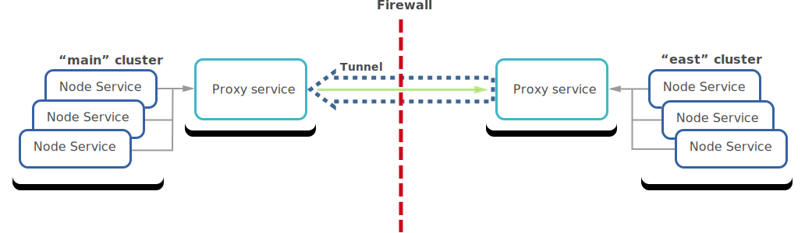

# Admin Manual

This manual covers installation and configuration of Teleport and the ongoing
management of a Teleport cluster. It assumes that the reader has good understanding
of Linux administration.

## Installing

To install Teleport using the official binaries from [Github releases](https://github.com/gravitational/teleport/releases)
simply download the tarball and run:

```
$ tar -xzf teleport-binary-release.tar.gz
$ sudo make install
```

### Installing from Source

Gravitational Teleport is written in Go language. It requires Golang v1.8.3 or
newer.

```bash
# get the source & build:
$ mkdir -p $GOPATH/src/github.com/gravitational
$ cd $GOPATH/src/github.com/gravitational
$ git clone https://github.com/gravitational/teleport.git
$ cd teleport
$ make full

# create the default data directory before starting:
$ sudo mkdir -p /var/lib/teleport
```

## Definitions

Before diving into configuring and running Teleport, it helps to take a look at the [Teleport Architecture](/architecture)
and go over the key concepts this document will be referring to:

|Concept   | Description
|----------|------------
|Node      | Synonym to "server" or "computer", something one can "SSH to". A node must be running `teleport` daemon running with "node" role/service turned on.
|Certificate Authority (CA) | A pair of public/private keys Teleport uses to manage access. A CA can sign a public key of a user or node establishing their cluster membership.
|Teleport Cluster | A Teleport Auth Service contains two CAs. One is used to sign user keys and the other signs node keys. A collection of nodes connected to the same CA is called a "cluster".
|Cluster Name | Every Teleport cluster must have a name. If a name is not supplied via `teleport.yaml` configuration file, a GUID will be generated. **IMPORTANT:** renaming a cluster invalidates its keys and all certificates it had created.
|Trusted Cluster | Teleport Auth Service can allow 3rd party users or nodes to connect if their public keys are signed by a trusted CA. A "trusted cluster" is a pair of public keys of the trusted CA. It can be configured via `teleport.yaml` file.

## Teleport Daemon

The Teleport daemon is called `teleport` and it supports the following commands:

|Command     | Description
|------------|-------------------------------------------------------
|start       | Starts the Teleport daemon.
|configure   | Dumps a sample configuration file in YAML format into standard output.
|version     | Shows the Teleport version.
|status      | Shows the status of a Teleport connection. This command is only available from inside of an active SSH session.
|help        | Shows help.

When experimenting you can quickly start `teleport` with verbose logging by typing
`teleport start -d`.

!!! danger "WARNING":
    Teleport stores data in `/var/lib/teleport`. Make sure that regular/non-admin users do not
    have access to this folder on the Auth server.

### Systemd Unit File

In production, we recommend starting teleport daemon via an
init system like `systemd`.  Here's the example of a systemd unit file:

```
[Unit]
Description=Teleport SSH Service
After=network.target

[Service]
Type=simple
Restart=on-failure
ExecStart=/usr/local/bin/teleport start --config=/etc/teleport.yaml

[Install]
WantedBy=multi-user.target
```

### Ports

Teleport services listen on several ports. This table shows the default port numbers.

|Port      | Service    | Description
|----------|------------|-------------------------------------------
|3022      | Node       | SSH port. This is Teleport's equivalent of port `#22` for SSH.
|3023      | Proxy      | SSH port clients connect to. A proxy will forward this connection to port `#3022` on the destination node.
|3024      | Proxy      | SSH port used to create "reverse SSH tunnels" from behind-firewall environments into a trusted proxy server.
|3025      | Auth       | SSH port used by the Auth Service to serve its API to other nodes in a cluster.
|3080      | Proxy      | HTTPS connection to authenticate `tsh` users and web users into the cluster. The same connection is used to serve a Web UI.

## Configuration

You should use a configuration file to configure the `teleport` daemon.
But for simpler experimentation you can use command line flags to
`teleport start` command. To see the list of flags:

```
$ teleport start --help
usage: teleport start [<flags>]
Flags:
  -d, --debug            Enable verbose logging to stderr
      --insecure-no-tls  Disable TLS for the web socket
  -r, --roles            Comma-separated list of roles to start with [proxy,node,auth]
      --pid-file         Full path to the PID file. By default no PID file will be created
      --advertise-ip     IP to advertise to clients if running behind NAT
  -l, --listen-ip        IP address to bind to [0.0.0.0]
      --auth-server      Address of the auth server [127.0.0.1:3025]
      --token            One-time token to register with an auth server [none]
      --nodename         Name of this node, defaults to hostname
  -c, --config           Path to a configuration file [/etc/teleport.yaml]
      --labels           List of labels for this node
      --permit-user-env  Enables reading of ~/.tsh/environment when creating a session
```

### Configuration Flags

Let's cover some of these flags in more detail:

* `--insecure-no-tls` flag tells Teleport proxy to not generate default self-signed TLS
  certificates. This is useful when running Teleport on kubernetes (behind reverse
  proxy) or behind things like AWS ELB, where SSL termination is provided externally.
  The possible values are `true` or  `false`. The default value is `false`.

* `--roles` flag tells Teleport which services to start. It is a comma-separated
  list of roles. The possible values are `auth`, `node` and `proxy`. The default
  value is `auth,node,proxy`. These roles are explained in the
  [Teleport Architecture](architecture.md) document.

* `--advertise-ip` flag can be used when Teleport nodes are running behind NAT and
  their externally routable IP cannot be automatically determined.
  For example, assume that a host "foo" can be reached via `10.0.0.10` but there is
  no `A` DNS record for "foo", so you cannot connect to it via `tsh ssh foo`. If
  you start teleport on "foo" with `--advertise-ip=10.0.0.10`, it will automatically
  tell Teleport proxy to use that IP when someone tries to connect
  to "foo". This is also useful when connecting to Teleport nodes using their labels.

* `--nodename` flag lets you assign an alternative name the node which can be used
  by clients to login. By default it's equal to the value returned by `hostname`
  command.

* `--listen-ip` should be used to tell `teleport` daemon to bind to a specific network
  interface. By default it listens on all.

* `--labels` flag allows to assign a set of labels to a node. See the explanation
  of labeling mechanism in the [Labeling Nodes](#labeling-nodes) section below.

* `--pid-file` flag creates a PID file if a path is given.

* `--permit-user-env` flag reads in environment variables from `~/.tsh/environment`
  when creating a session.

### Configuration File

Teleport uses the YAML file format for configuration. A sample configuration file is shown
below. By default, it is stored in `/etc/teleport.yaml`

!!! note "IMPORTANT":
    When editing YAML configuration, please pay attention to how your editor
    handles white space. YAML requires consistent handling of tab characters.

```bash
# By default, this file should be stored in /etc/teleport.yaml

# This section of the configuration file applies to all teleport
# services.
teleport:
    # nodename allows to assign an alternative name this node can be reached by.
    # by default it's equal to hostname
    nodename: graviton

    # Data directory where Teleport keeps its data, like keys/users for
    # authentication (if using the default BoltDB back-end)
    data_dir: /var/lib/teleport

    # one-time invitation token used to join a cluster. it is not used on
    # subsequent starts
    auth_token: xxxx-token-xxxx

    # when running in multi-homed or NATed environments Teleport nodes need
    # to know which IP it will be reachable at by other nodes
    advertise_ip: 10.1.0.5

    # list of auth servers in a cluster. you will have more than one auth server
    # if you configure teleport auth to run in HA configuration
    auth_servers:
        - 10.1.0.5:3025
        - 10.1.0.6:3025

    # Teleport throttles all connections to avoid abuse. These settings allow
    # you to adjust the default limits
    connection_limits:
        max_connections: 1000
        max_users: 250

    # Logging configuration. Possible output values are 'stdout', 'stderr' and
    # 'syslog'. Possible severity values are INFO, WARN and ERROR (default).
    log:
        output: stderr
        severity: ERROR

    # Type of storage used for keys. You need to configure this to use etcd
    # backend if you want to run Teleport in HA configuration.
    storage:
        type: bolt

    # Cipher algorithms that the server supports. This section only needs to be
    # set if you want to override the defaults.
    ciphers:
      - aes128-ctr
      - aes192-ctr
      - aes256-ctr
      - aes128-gcm@openssh.com
      - arcfour256
      - arcfour128

    # Key exchange algorithms that the server supports. This section only needs
    # to be set if you want to override the defaults.
    kex_algos:
      - curve25519-sha256@libssh.org
      - ecdh-sha2-nistp256
      - ecdh-sha2-nistp384
      - ecdh-sha2-nistp521
      - diffie-hellman-group14-sha1
      - diffie-hellman-group1-sha1

    # Message authentication code (MAC) algorithms that the server supports.
    # This section only needs to be set if you want to override the defaults.
    mac_algos:
      - hmac-sha2-256-etm@openssh.com
      - hmac-sha2-256
      - hmac-sha1
      - hmac-sha1-96

# This section configures the 'auth service':
auth_service:
    # Turns 'auth' role on. Default is 'yes'
    enabled: yes

    # A cluster name is used as part of a signature in certificates
    # generated by this CA. 
    #
    # We strongly recommend to explicitly set it to something meaningful as it 
    # becomes important when configuring trust between multiple clusters. 
    #
    # By default an automatically generated name is used (not recommended)
    #
    # IMPORTANT: if you change cluster_name, it will invalidate all generated
    # certificates and keys (may need to wipe out /var/lib/teleport directory)
    cluster_name: "main"

    authentication:
        # default authentication type. possible values are 'local', 'oidc' and 'saml'
        # only local authentication (Teleport's own user DB) is supported in the open
        # source version
        type: local
        # second_factor can be off, otp, or u2f
        second_factor: otp
        # this section is used if second_factor is set to 'u2f'
        u2f:
            # app_id must point to the URL of the Teleport Web UI (proxy) accessible
            # by the end users
            app_id: https://localhost:3080
            # facets must list all proxy servers if there are more than one deployed
            facets:
            - https://localhost:3080

    # IP and the port to bind to. Other Teleport nodes will be connecting to
    # this port (AKA "Auth API" or "Cluster API") to validate client
    # certificates
    listen_addr: 0.0.0.0:3025

    # Pre-defined tokens for adding new nodes to a cluster. Each token specifies
    # the role a new node will be allowed to assume. The more secure way to
    # add nodes is to use `ttl node add --ttl` command to generate auto-expiring
    # tokens.
    #
    # We recommend to use tools like `pwgen` to generate sufficiently random
    # tokens of 32+ byte length.
    tokens:
        - "proxy,node:xxxxx"
        - "auth:yyyy"

    # Optional setting for configuring session recording. Possible values are:
    #    "on"    : sessions will be recorded on the node level  (the default)
    #    "proxy" : recording on the proxy level, see "recording proxy mode" in "Audit Log" section
    #    "off"   : session recording is turned off
    session_recording: "on"

    # License file to start auth server with. Note that this setting is ignored
    # in open-source Teleport and is required only for Teleport Pro, Business
    # and Enterprise subscription plans.
    #
    # The path can be either absolute or relative to the configured `data_dir`
    # and should point to the license file obtained from Teleport Download Portal.
    #
    # If not set, by default Teleport will look for the `license.pem` file in
    # the configured `data_dir`.
    license_file: /var/lib/teleport/license.pem

# This section configures the 'node service':
ssh_service:
    # Turns 'ssh' role on. Default is 'yes'
    enabled: yes

    # IP and the port for SSH service to bind to.
    listen_addr: 0.0.0.0:3022
    # See explanation of labels in "Labeling Nodes" section below
    labels:
        role: master
        type: postgres

    # List of the commands to periodically execute. Their output will be used as node labels.
    # See "Labeling Nodes" section below for more information.
    commands:
    - name: arch             # this command will add a label like 'arch=x86_64' to a node
      command: [uname, -p]
      period: 1h0m0s

    # enables reading ~/.tsh/environment before creating a session. by default
    # set to false, can be set true here or as a command line flag.
    permit_user_env: false

# This section configures the 'proxy servie'
proxy_service:
    # Turns 'proxy' role on. Default is 'yes'
    enabled: yes

    # SSH forwarding/proxy address. Command line (CLI) clients always begin their
    # SSH sessions by connecting to this port
    listen_addr: 0.0.0.0:3023

    # Reverse tunnel listening address. An auth server (CA) can establish an
    # outbound (from behind the firewall) connection to this address.
    # This will allow users of the outside CA to connect to behind-the-firewall
    # nodes.
    tunnel_listen_addr: 0.0.0.0:3024

    # The HTTPS listen address to serve the Web UI and also to authenticate the
    # command line (CLI) users via password+HOTP
    web_listen_addr: 0.0.0.0:3080

    # TLS certificate for the HTTPS connection. Configuring these properly is
    # critical for Teleport security.
    https_key_file: /var/lib/teleport/webproxy_key.pem
    https_cert_file: /var/lib/teleport/webproxy_cert.pem
```

## Authentication

Teleport uses the concept of "authentication connectors" to authenticate users when
they execute `tsh login` command. There are three types of authentication connectors:

**Local**

Local authentication is used to authenticate against a local Teleport user database. This database
is managed by `tctl users` command. Teleport also supports second factor authentication
(2FA) for the local connector. There are two types of 2FA:

  * [TOTP](https://en.wikipedia.org/wiki/Time-based_One-time_Password_Algorithm)
    is the default. You can use [Google Authenticator](https://en.wikipedia.org/wiki/Google_Authenticator) or
    [Authy](https://www.authy.com/) or any other TOTP client.
  * [U2F](https://en.wikipedia.org/wiki/Universal_2nd_Factor) is the second.

Here is an example of this setting in the `teleport.yaml`:

```yaml
auth_service:
  authentication:
    type: local
    second_factor: u2f
```

**Github OAuth 2.0**

This connector implements Github OAuth 2.0 authentication flow. Please refer
to Github documentation on [Creating an OAuth App](https://developer.github.com/apps/building-oauth-apps/creating-an-oauth-app/)
to learn how to create and register an OAuth app.

Here is an example of this setting in the `teleport.yaml`:

```yaml
auth_service:
  authentication:
    type: github
```

See [Github OAuth 2.0](#github-oauth-20) for details on how to configure it.

**SAML**

This connector type implements SAML authentication. It can be configured
against any external identity manager like Okta or Auth0. This feature is
only available for Teleport Enterprise.

Here is an example of this setting in the `teleport.yaml`:

```yaml
auth_service:
  authentication:
    type: saml
```

**OIDC**

Teleport implements OpenID Connect (OIDC) authentication, which
is similar to SAML in principle. This feature is only available for Teleport Enterprise.

Here is an example of this setting in the `teleport.yaml`:

```yaml
auth_service:
  authentication:
    type: oidc
```


**FIDO U2F**

Teleport supports [FIDO U2F](https://www.yubico.com/about/background/fido/)
hardware keys as a second authentication factor. To start using U2F:

* Purchase a U2F hardware key. Teleport developers like [these.](https://www.yubico.com/products/yubikey-hardware)
* Enable U2F in Teleport configuration `teleport.yaml`.
* For CLI-based logins you have to install [u2f-host](https://developers.yubico.com/libu2f-host/) utility.
* For web-based logins you have to use Google Chrome, as it is the only browser supporting U2F at this moment.

By default U2F is disabled. To enable U2F, configure the Teleport configuration file
to contain `u2f` section as shown above.

For single-proxy setups the `app_id` setting can be equal to the domain name of the
proxy, but this will prevent you from adding more proxies without changing the
`app_id`. For multi-proxy setups, the `app_id` should be an HTTPS URL pointing to
a JSON file that mirrors `facets` in the auth config.

!!! warning "Warning":
    The `app_id` must never change in the lifetime of the cluster. If the App ID
    changes, all existing U2F key registrations will become invalid and all users
    who use U2F as the second factor will need to re-register.
	When adding a new proxy server, make sure to add it to the list of "facets"
	in the configuration file, but also to the JSON file referenced by `app_id`

**Logging in with U2F**

For logging in via the CLI, you must first install [u2f-host](https://developers.yubico.com/libu2f-host/).
Installing:

```bash
# OSX:
$ brew install libu2f-host

# Ubuntu 16.04 LTS:
$ apt-get install u2f-host
```

Then invoke `tsh ssh` as usual to authenticate:

```
tsh --proxy <proxy-addr> ssh <hostname>
```

!!! tip "Version Warning":
    External user identities are only supported in [Teleport Enterprise](/enterprise/). Please reach
    out to `sales@gravitational.com` for more information.

## Adding and Deleting Users

This section covers internal user identities, i.e. user accounts created and
stored in Teleport's internal storage.

A user identity in Teleport exists in the scope of a cluster. The member nodes
of a cluster have multiple OS users on them. A Teleport administrator assigns
allowed logins to every Teleport account, allowing it to login as one of the
specified OS users.

Let's look at this table:

|Teleport User | Allowed OS Logins | Description
|------------------|---------------|-----------------------------
|joe    | joe,root | Teleport user 'joe' can login into member nodes as OS user 'joe' or 'root'
|bob    | bob      | Teleport user 'bob' can login into member nodes only as OS user 'bob'
|ross   |          | If no OS login is specified, it defaults to the same name as the Teleport user.

To add a new user to Teleport you have to use `tctl` tool on the same node where
the auth server is running, i.e. `teleport` was started with `--roles=auth`.

```bash
$ tctl users add joe joe,root
```

Teleport generates an auto-expiring token (with a TTL of 1 hour) and prints the token
URL which must be used before the TTL expires.

```
Signup token has been created. Share this URL with the user:
https://<proxy>:3080/web/newuser/xxxxxxxxxxxx

NOTE: make sure the <proxy> host is accessible.
```

The user will complete registration by visiting this URL, picking a password and
configuring the 2nd factor authentication. If the credentials are correct, the auth
server generates and signs a new certificate and the client stores this key and will use
it for subsequent logins. The key will automatically expire after 23 hours by default after which
the user will need to log back in with her credentials. This TTL can be configured to a maximum
of 30 hours and a minimum of 1 minute. Once authenticated, the account will become visible via `tctl`:

```bash
$ tctl users ls

User           Allowed Logins
----           --------------
admin          admin,root
ross           ross
joe            joe,root
```

Joe would need to use the `tsh` client tool to log in to member node "luna" via
bastion "work" _as root_:

```bash
$ tsh --proxy=work --user=joe root@luna
```

To delete this user:

```bash
$ tctl users rm joe
```

## Editing Users

Users entries can be manipulated using the generic [resource commands](#resources)
via `tctl`. For example to see the full list of user records, an administrator
can execute:

```bash
$ tctl get users
```

To edit the user "joe":

```bash
# dump the user definition into a file:
$ tctl get user/joe > joe.yaml
# ... edit the contents of joe.yaml

# update the user record:
$ tctl create -f joe.yaml
```

Some fields in the user record are reserved for the internal use. Some of them
will be finalized and documented in the future versions. But fields like
`is_locked` or `traits/logins` can be used starting in version 2.3

## Adding Nodes to the Cluster

Gravitational Teleport is a "clustered" SSH manager, meaning it only allows SSH
access to nodes that had been previously granted cluster membership.

A cluster membership means that every node in a cluster has its own host
certificate signed by the cluster's auth server.

!!! tip "Note":
	If interoperability with
	OpenSSH is required, make sure the node name and DNS name match because OpenSSH
	clients validate the DNS name against the node name presented on the certificate
	when connecting to a Teleport node.

A new Teleport node needs an "invite token" to join a cluster. An invite token
also defines which role a new node can assume within a cluster: `auth`, `proxy` or
`node`.

There are two ways to create invitation tokens:

* Static Tokens
* Dynamic, Short-lived Tokens

### Static Tokens

You can pick your own tokens and add them to the auth server's config file:

```bash
# Config section in `/etc/teleport/teleport.yaml` file for the auth server
auth_service:
    enabled: true
    #
    # statically assigned token: obviously we recommend a much harder to guess
    # value than `xxxxx`, consider generating tokens using a tool like pwgen
    #
    tokens:
    - "proxy,node:xxxxxx"
```

Now you can start a new Teleport node by setting its invitation token via `--token`
flag to `xxxxxx`. This node will join the cluster as a regular node but also
as a proxy server:

```bash
$ teleport start --roles=node,proxy --token=xxxxx --auth-server=10.0.10.5
```

### Short-lived Tokens

A more secure way to add nodes to a cluster is to generate tokens as they are
needed. Such token can be used multiple times until its time to live (TTL)
expires.

Use `tctl` tool to invite a new node into the cluster with `node` and `auth`
roles:

```bash
$ tctl nodes add --ttl=5m --roles=node,proxy
The invite token: 24be3e582c3805621658225f8c841d2002
Run this on the new node to join the cluster:
> teleport start --roles=node,proxy --token=24be3e582c3805621658225f8c841d2002 --auth-server=192.168.1.8:3025

Please note:
  - This invitation token will expire in 5 minutes
  - 192.168.1.8:3025 must be reachable from the new node, see --advertise-ip server flag
  - For tokens of type "trustedcluster", tctl needs to be used to create a TrustedCluster resource. See the Admin Guide for more details.
```

As new nodes come online, they start sending ping requests every few seconds
to the CA of the cluster. This allows everyone to explore cluster membership
and size:

```bash
$ tctl nodes ls

Node Name     Node ID                                  Address            Labels
---------     -------                                  -------            ------
turing        d52527f9-b260-41d0-bb5a-e23b0cfe0f8f     10.1.0.5:3022      distro:ubuntu
dijkstra      c9s93fd9-3333-91d3-9999-c9s93fd98f43     10.1.0.6:3022      distro:debian
```

## Revoking Invitations

As you have seen above, Teleport uses tokens to invite users to a cluster (sign-up tokens) or
to add new nodes to it (provisioning tokens).

Both types of tokens can be revoked before they can be used. To see a list of outstanding tokens,
run this command:

```bash
$ tctl tokens ls

Token                                Role       Expiry Time (UTC)
-----                                ----       -----------------
eoKoh0caiw6weoGupahgh6Wuo7jaTee2     Proxy      never
696c0471453e75882ff70a761c1a8bfa     Node       17 May 16 03:51 UTC
6fc5545ab78c2ea978caabef9dbd08a5     Signup     17 May 16 04:24 UTC
```

In this example, the first token with "never" expiry date because it is a static token configured via
a config file.

The 2nd token with "Node" role was generated to invite a new node to this cluster. And the
3rd token was generated to invite a new user.

The latter two tokens can be deleted (revoked) via `tctl tokens del` command:

```bash
$ tctl tokens del 696c0471453e75882ff70a761c1a8bfa
Token 696c0471453e75882ff70a761c1a8bfa has been deleted
```

## Labeling Nodes

In addition to specifying a custom nodename, Teleport also allows for the application of arbitrary
key:value pairs to each node. They are called labels. There are two kinds of labels:

1. `static labels` never change while the `teleport` process is running. You may want
   to label nodes with their physical location, the Linux distribution, etc.

2. `label commands` or "dynamic labels". Label commands allow you to execute an external
   command on a node at a configurable frequency. The output of that command becomes
   the value of such label. Examples include reporting a kernel version, load averages,
   time after reboot, etc.

Labels can be configured in a configuration file or via `--labels` flag as shown below:

```bash
$ teleport start --labels uptime=[1m:"uptime -p"],kernel=[1h:"uname -r"]
```

Obviously the kernel version is not going to change often, so this example runs
`uname` once an hour. When this node starts and reports its labels into the cluster,
users will see:

```bash
$ tctl nodes ls

Node Name     Node ID          Address         Labels
---------     -------          -------         ------
turing        d52527f9-b260    10.1.0.5:3022   kernel=3.19.0-56,uptime=up 1 hour, 15 minutes
```

## Audit Log

Teleport logs every SSH event into its audit log. The log is stored on the auth server(s)
in the `data_dir` location, under `log` subdirectory.

There are two components of the audit log:

1. **SSH Events:** Teleport logs events like successful user logins along with
   the metadata like remote IP address, time and the sesion ID.
2. **Recorded Sessions:** Every SSH shell session is recorded and can be replayed
   later. The recording by default is done by the nodes themselves, but can be configured
   to be done by the proxy.

Refer to the "Audit Log" chapter in the [Teleport Architecture](architecture#audit-log) to 
learn more about how the audit Log and session recording are designed.

### SSH Events

The event log is stored in `data_dir` under `log` directory, usually it is `/var/lib/teleport/log`.
Each day is represented as a file:

```bash
$ ls -l /var/lib/teleport/log/
total 104
-rw-r----- 1 root root  31638 Jan 22 20:00 2017-01-23.00:00:00.log
-rw-r----- 1 root root  91256 Jan 31 21:00 2017-02-01.00:00:00.log
-rw-r----- 1 root root  15815 Feb 32 22:54 2017-02-03.00:00:00.log
```

The log files use JSON format. They are human-readable but can also be programmatically parsed.
Each line represents an event and has the following format:

```js
{
   // Event type. See below for the list of all possible event types
   "event"      : "session.start",
   // Teleport user name
   "user"       : "ekontsevoy",
   // OS login
   "login"      : "root",
   // Server namespace. This field is reserved for future use.
   "namespace"  : "default",
   // Unique server ID.
   "server_id"  : "f84f7386-5e22-45ff-8f7d-b8079742e63f",
   // Session ID. Can be used to replay the sesssion.
   "sid"        : "8d3895b6-e9dd-11e6-94de-40167e68e931",
   // Address of the SSH node
   "addr.local" : "10.5.l.15:3022",
   // Address of the connecting client (user)
   "addr.remote": "73.223.221.14:42146",
   // Terminal size
   "size"       : "80:25",
   // Timestamp
   "time"       : "2017-02-03T06:54:05Z"
}
```

The possible event types are:

Event Type      | Description
----------------|----------------
auth            | Authentication attempt. Adds the following fields: `{"success": "false", "error": "access denied"}`
session.start   | Started an interactive shell session.
session.end     | An interactive shell session has ended.
session.join    | A new user has joined the existing interactive shell session.
session.leave   | A user has left the session.
exec            | Remote command has been executed via SSH, like `tsh ssh root@node ls /`. The following fields will be logged: `{"command": "ls /", "exitCode": 0, "exitError": ""}`
scp             | Remote file copy has been executed. The following fields will be logged: `{"path": "/path/to/file.txt", "len": 32344, "action": "read" }`
resize          | Terminal has been resized.
user.login      | A user logged into web UI or via tsh. The following fields will be logged: `{"user": "alice@example.com", "method": "local"}`.

!!! tip "Note":
    The commercial Teleport edition called "Teleport Enterprise" supports native
    audit log exporting into external systems like Splunk, AlertLogic and others.
    Take a look at [Teleport Enterprise](enterprise.md) section to learn more.

### Recorded Sessions

In addition to logging `session.start` and `session.end` events, Teleport also records the entire
stream of bytes going to/from standard input and standard output of an SSH session.

The recorded sessions are stored as raw bytes in the `sessions` directory under `log`.
Each session consists of two files, both are named after the session ID:

1. `.bytes` file represents the raw session bytes and is somewhat
    human-readable, although you are better off using `tsh play` or
    the Web UI to replay it.
2. `.log` file contains the copies of the event log entries that are related
   to this session.

```bash
$ ls /var/lib/teleport/log/sessions/default
-rw-r----- 1 root root 506192 Feb 4 00:46 4c146ec8-eab6-11e6-b1b3-40167e68e931.session.bytes
-rw-r----- 1 root root  44943 Feb 4 00:46 4c146ec8-eab6-11e6-b1b3-40167e68e931.session.log
```

To replay this session via CLI:

```bash
$ tsh --proxy=proxy play 4c146ec8-eab6-11e6-b1b3-40167e68e931
```

### Recording Proxy Mode

See [Audit Log Architecture](architecture/#audit-log) to understand how the session
recording works. The important detail is that by default the recording is not
available if a cluster runs `sshd`, the OpenSSH server, on the nodes.

To enable session recording for `sshd` nodes, the cluster must be switched to
"recording proxy" mode, in this mode the recording will be done on the proxy level:

```bash
# snippet from /etc/teleport.yaml
auth_service:
   session_recording: "proxy"  # can also be "off" and "on" (default)
```

Next, `sshd` must be told to allow users to log in with certificates generated by the
Teleport User CA. Start by exporting the Teleport CA public key:

```bash
$ tctl auth export --type=user
```

To allow access to a single user, copy the above output to `~/.ssh/authorized_keys`, but
to apply this for all users, remove "cert-authority" from the start of `tctl` output and
copy it to `/etc/ssh/teleport_user_ca.pub`. 

Add the following line to `/etc/ssh/sshd_config`: 

```bash
TrustedUserCAKeys /etc/ssh/teleport_user_ca.pub
```

Now `sshd` will trust users who present a Teleport-issued certificate. Next step 
is to configure host authentication.

When in recording mode, Teleport will check that the host certificate of the
node a user connects to is signed by a Teleport CA. By default this is a strict
check, if the node presents just a key, or a certificate signed by a different
CA, Teleport will reject this connection with the error message saying 
_"ssh: handshake failed: remote host presented a public key, expected a host certificate"_

You can disable strict host checks as shown below. Note: this opens the possibility for 
Man-in-the-Middle (MITM) attacks and is not recommended.

```bash
# snippet from /etc/teleport.yaml
auth_service:
  proxy_checks_host_keys: no
```

The best solution is to ask Teleport to issue valid host certificates for all OpenSSH 
nodes. To generate a host certificate run this on your auth server:

```bash
$ tctl auth sign \
      --host=node.example.com \
      --format=openssh
```

Then add the following lines to `/etc/ssh/sshd_config` and restart sshd.

```bash
HostKey /etc/ssh/teleport_host_key
HostCertificate /etc/ssh/teleport_host_key-cert.pub
```

Now you can use `tsh ssh user@host.example.com` to login into any `sshd` node in the cluster
and the session will be recorded. But if you want to use OpenSSH `ssh` client for logging
into `sshd` servers behind a proxy in "recording mode", you have to tell the `ssh` client
to use the jump host and enable the agent forwarding (otherwise a recording proxy will not 
be able to terminate the SSH connection to record it):

```bash
# Note that agent forwarding is enabled twice: one from a client to a proxy
# (mandatory if using a recording proxy), and then optionally from a proxy 
# to the end server if you want your agent running on the end server or not
ssh -o "ForwardAgent yes" \
    -o "ProxyCommand ssh -o 'ForwardAgent yes' -p 3023 %r@p.example.com -s proxy:%h:%p" \
    user@host.example.com``
```

!!! tip "Tip":
    To avoid typing all this and enjoy the usual `ssh user@host.example.com` the users can update their
    `~/.ssh/config` file. See "Using Teleport with OpenSSH" chapter for more examples.

**IMPORTANT**

It's important to remember that SSH agent forwarding must be enabled on the client. 
Verify that a Teleport certificate is loaded into the agent after logging in:

```bash
# Login as Joe
$ tsh login --proxy=proxy.example.com joe
# see if the certificate is present (look for "teleport:joe") at the end of the cert
$ ssh-add -L
```

!!! warning "GNOME Keyring SSH Agent":
    It is well-known that Gnome Keyring SSH agent, used by many popular Linux
    desktops like Ubuntu, does not support SSH certificates. We recommend using
    the `ssh-agent` command from `openssh-client` package.

## Resources

A Teleport administrator has two tools to configure a Teleport cluster: the
[configuration file](#configuration) is used for static configuration like the
cluster name, and the `tctl` admin tool is used for manipulating dynamic records
like Teleport users.

`tctl` has convenient subcommands for this, like `tctl users` or `tctl nodes`.
However, for dealing with more advanced topics, like connecting clusters together, or
when troubleshooting trust, `tctl` offers the more powerful, although lower-level
CLI interface called `resources`.

The basic idea is borrowed from REST programming pattern: a cluster is composed
of different objects (AKA resources) and there are just four common operations
that can be performed on them: `get`, `create`, `remove`.

A resource is defined as a [YAML](https://en.wikipedia.org/wiki/YAML) file. Every resource in Teleport has three required fields:

* `Kind` - The type of resource
* `Name` - A required field in the `metadata` to uniquely identify the resource
* `Version` - The version of the resource format

Everything else is resource-specific and any component of a Teleport cluster can be
manipulated with just 3 CLI commands:

Command         | Description | Examples
----------------|-------------|----------
`tctl get`      | Get one or multipe resources           | `tctl get users` or `tctl get user/joe`
`tctl rm`       | Delete a resource by type/name         | `tctl rm user/joe`
`tctl create`   | Create a new resource from a YAML file. Use `-f` to overide / update | `tctl create -f joe.yaml`

!!! warning "YAML Format":
    By default Teleport uses [YAML format](https://en.wikipedia.org/wiki/YAML)
    to describe resources. YAML is a wonderful and very human-readable
    alternative to JSON or XML, but it's sensitive to white space. Pay
    attention to spaces vs tabs!

Here's an example how the YAML resource definition for a user Joe might look like.
It can be retreived by executing `tctl get user/joe`

```bash
kind: user
version: v2
metadata:
  name: joe
spec:
  roles:
  - admin
  status:
    # users can be temporarily locked in a Teleport system, but this
    # functionality is reserved for the internal use for now.
    is_locked: false
    lock_expires: 0001-01-01T00:00:00Z
    locked_time: 0001-01-01T00:00:00Z
  traits:
    # these are "allowed logins" which are usually specified as the last argument to `tctl users add`
    logins:
    - joe
    - root
  # any resource in Teleport can automatically expire.
  expires: 0001-01-01T00:00:00Z
  # for internal use only
  created_by:
    time: 0001-01-01T00:00:00Z
    user:
      name: builtin-Admin
```

!!! tip "Note":
    Many of the fields you will see when printing resources are used only
    internally and are not meant to be changed.  Others are reserved for future
    use.

Here's the list of resources currently exposed via `tctl`:

Resource Kind      | Description
-------------------|--------------
user               | A user record in the internal Teleport user DB.
node               | A registered SSH node. The same record is displayed via `tctl nodes ls`
trusted_cluster    | A trusted cluster. See [here](#trusted-clusters) for more details on connecting clusters together.
role               | A role assumed by users. The open source Teleport only includes one role: "admin", but Enterprise teleport users can define their own roles.
github             | A Github auth connector. See [here](#github-auth-connector) for details on configuring it.

## Trusted Clusters

Teleport allows to partition your infrastructure into multiple clusters. Some clusters can be
located behind firewalls without any open ports. They can also have their own restrictions on
which users have access.

A Teleport Cluster has a name and is managed by a
`teleport` daemon with "auth service" enabled.

Let's assume we need to access servers behind a firewall and we only want Teleport
user "john" to have access to them. We already have our primary Teleport cluster and our
users set up. Say this primary cluster is called `main`, and the behind-the-firewall cluster
is called `east` as shown on this diagram:



This setup works as follows:

1. "East" creates an outbound reverse SSH tunnel to "main" and keeps it open.
2. "East" and "main" must trust each other, they are "trusted clusters" because
   "main" must authenticate "east" (cluster-to-cluster authentication) when the
   tunnel is established, and "east" must trust users connecting from "main"
   (user authentication).
3. Users of "main" must use `tsh --cluster=east` flag if they want to connect to any nodes in "east".
4. Users of "main" can see other trusted clusters connected to "main" by running `tsh clusters`

### Example Configuration

Creating trust between two clusters is easy. Here are the steps:

1. The main cluster needs to define a "cluster join token" in its config file.
   This token is used for establishing the _initial_ trust between "main" and
   new clusters.
2. The administrator of the eastern cluster must create a "trusted cluster" [resource](#resources).

Below is the snippet from the auth server configuration for the "main" cluster:

```bash
# fragment of /etc/teleport.yaml:
auth_service:
  enabled: true
  tokens:
  - trusted_cluster:secret-token-to-add-new-clusters
```

The snippet above states that another Teleport cluster can establish a reverse
tunnel to "main" if it knows the secret, the cluster join token is declared in the
`tokens` section.

!!! tip "Tip":
    The permission to establish a reverse tunnel is the only action "east" is
    permitted to. Trusted clusters work only one way: users from "east" cannot
    connect to the nodes in "main".

Now, with the main cluster prepared to allow remote clusters to connect to it,
lets configure "east". The administrator of "east" must create the following
resource file:

```bash
# cluster.yaml
kind: trusted_cluster
version: v2
metadata:
  # the trusted cluster name MUST match the 'cluster_name' setting of the
  # cluster
  name: main
spec:
  # this field allows to create tunnels that are disabled, but can be enabled later.
  enabled: true
  # the token expected by the "main" cluster:
  token: secret-token-to-add-new-clusters
  # the address in 'host:port' form of the reverse tunnel listening port on the
  # "master" proxy server:
  tunnel_addr: proxy.main:3024
  # the address in 'host:port' form of the web listening port on the
  # "master" proxy server:
  web_proxy_addr: proxy.main:3080
```

... and create it:

```bash
$ tctl create cluster.yaml
```

At this point the users of the main cluster should be able to see "east" in the
list of available clusters.

!!! warning "HTTPS configuration":
    If the `web_proxy_addr` endpoint of the main cluster uses a self-signed or
    invalid HTTPS certificate, you will get an error: _"the trusted cluster
    uses misconfigured HTTP/TLS certificate"_. For ease of testing the
    teleport daemon of "east" can be started with `--insecure` CLI flag to
    accept self-signed certificates. Make sure to configure HTTPS properly and
    remove the insecure flag for production use.

### Using Trusted Clusters

It's worth repeating: the users of "east" cannot see or connect to the main
cluster. The relationship works the other way around: any user from the main
cluster can now use nodes in "east":

```bash
# login into the main cluster:
$ tsh --proxy=proxy.main login joe

# see the list of available clusters
$ tsh clusters

Cluster Name   Status
------------   ------
main           online
east           online

# see the list of machines (nodes) behind the eastern cluster:
$ tsh --cluster=east ls

Node Name Node ID            Address        Labels
--------- ------------------ -------------- -----------
db1.east  cf7cc5cd-935e-46f1 10.0.5.2:3022  role=db-master
db2.east  3879d133-fe81-3212 10.0.5.3:3022  role=db-slave

# SSH into any node in "east":
$ tsh --cluster=east ssh root@db1.east
```

## Github OAuth 2.0

Teleport supports authentication and authorization via external identity
providers such as Github. First, the Teleport auth service must be configured
to use Github for authentication:

```bash
# snippet from /etc/teleport.yaaml
auth_service:
  authentication:
      type: github
```

Next step is to define a Github connector:

```bash
# Create a file called github.yaml:
kind: github
version: v3
metadata:
  # connector name that will be used with `tsh login`
  name: github
spec:
  # client ID of Github OAuth app
  client_id: <client-id>
  # client secret of Github OAuth app
  client_secret: <client-secret>
  # connector display name that will be shown on web UI login screen
  display: Github
  # callback URL that will be called after successful authentication
  redirect_url: https://<proxy-address>/v1/webapi/github/callback
  # mapping of org/team memberships onto allowed logins and roles
  teams_to_logins:
    - organization: octocats # Github organization name
      team: admins # Github team name within that organization
      # allowed logins for users in this org/team
      logins:
        - root
```

!!! note
    For open-source Teleport the `logins` field contains a list of allowed
    OS logins. For paid Teleport plans such as Enterprise, Pro or Business
    that support role-based access control, the same field is treated as a
    list of _roles_ that users from matching org/team assume after going
    through the authorization flow.

To obtain client ID and client secret, please follow Github documentation
on how to [create and register an OAuth app](https://developer.github.com/apps/building-oauth-apps/creating-an-oauth-app/).
Be sure to set the "Authorization callback URL" to the same value as `redirect_url`
in the resource spec. 

Finally, create the connector using `tctl` [resource](#resources) management command:

```bash
$ tctl create github.yaml
```

!!! tip
    When going through the Github authentication flow for the first time,
    the application must be granted the access to all organizations that
    are present in the "teams to logins" mapping, otherwise Teleport will
    not be able to determine team memberships for these orgs.

## HTTP CONNECT Proxies

Some networks funnel all connections through a proxy server where they can be
audited and access control rules applied. For these scenarios Teleport supports
HTTP CONNECT tunneling.

To use HTTP CONNECT tunneling, simply set either the `HTTPS_PROXY` or
`HTTP_PROXY` environment variables and when Teleport builds and establishes the
reverse tunnel to the main cluster, it will funnel all traffic though the proxy.
Specifically, if using the default configuration, Teleport will tunnel ports
`3024` (SSH, reverse tunnel) and `3080` (HTTPS, establishing trust) through the
proxy.

The value of `HTTPS_PROXY` or `HTTP_PROXY` should be in the format
`scheme://host:port` where scheme is either `https` or `http`. If the
value is `host:port`, Teleport will prepend `http`.

!!! tip "Note":
    `localhost` and `127.0.0.1` are invalid values for the proxy host. If for
    some reason your proxy runs locally, you'll need to provide some other DNS
    name or a private IP address for it.

## Using Teleport with OpenSSH

Teleport is a standards-compliant SSH proxy and it can work in environments with
existing SSH implementations, such as OpenSSH. This section will cover:

* Configuring OpenSSH client `ssh` to login into nodes inside a Teleport cluster.
* Configuring OpenSSH server `sshd` to join a Teleport cluster.

### Using OpenSSH Client

It is possible to use the OpenSSH client `ssh` to connect to nodes within a Teleport
cluster. Teleport supports SSH subsystems and includes a `proxy` subsystem that
can be used like `netcat` is with `ProxyCommand` to connect through a jump host.

First, you need to export the public keys of cluster members. This has to be done
on a node which runs Teleport auth server:

```bash
$ tctl auth export --type=host > cluster_node_keys
```

On your client machine, you need to import these keys. It will allow your OpenSSH client
to verify that host's certificates are signed by the trusted CA key:

```bash
$ cat cluster_node_keys >> ~/.ssh/known_hosts
```

Make sure you are running OpenSSH's `ssh-agent`, and have logged in to the Teleport proxy:

```bash
$ eval `ssh-agent`
$ tsh --proxy=work.example.com login
```

`ssh-agent` will print environment variables into the console. Either `eval` the output
as in the example above, or copy and paste the output into the shell you will be using to
connect to a Teleport node. The output exports the `SSH_AUTH_SOCK` and `SSH_AGENT_PID`
environment variables that allow OpenSSH clients to find the SSH agent.

Lastly, configure the OpenSSH client to use the Teleport proxy when connecting
to nodes with matching names. Edit `~/.ssh/config` for your user or
`/etc/ssh/ssh_config` for global changes:

```
# work.example.com is the jump host (proxy). credentials will be obtained from the
# openssh agent.
Host work.example.com
    HostName 192.168.1.2
    Port 3023

# connect to nodes in the work.example.com cluster through the jump
# host (proxy) using the same. credentials will be obtained from the
# openssh agent.
Host *.work.example.com
    HostName %h
    Port 3022
    ProxyCommand ssh -p 3023 %r@work.example.com -s proxy:%h:%p

# when connecting to a node within a trusted cluster with name "remote-cluster",
# add the name of the cluster to the invocation of the proxy subsystem.
Host *.remote-cluster.example.com
   HostName %h
   Port 3022
   ProxyCommand ssh -p 3023 %r@work.example.com -s proxy:%h:%p@remote-cluster
```

When everything is configured properly, you can use ssh to connect to any node
behind `work.example.com`:

```bash
$ ssh root@database.work.example.com
```

!!! tip "NOTE":
    Teleport uses OpenSSH certificates instead of keys which means you can not connect
    to a Teleport node by IP address. You have to connect by DNS name. This is because
    OpenSSH ensures the DNS name of the node you are connecting is listed under
    the `Principals` section of the OpenSSH certificate to verify you are connecting
    to the correct node.

### Integrating with OpenSSH Servers

Existing `sshd` servers can be added to a Teleport cluster. For that to work, you
have to configure `sshd` to trust the Teleport CA.

Export the Teleport CA certificate into a file:

```bash
$ tctl auth export --type=user > teleport-user-ca.pub
```

To allow access per-user, append the contents of `teleport-user-ca.pub` to
  `~/.ssh/authorized_keys`.

To allow access for all users:

  * Edit `teleport-user-ca.pub` and remove `cert-authority` from the start of line.
  * Copy `teleport-user-ca.pub` to `/etc/ssh/teleport-user-ca.pub`
  * Update `sshd` configuration (usually `/etc/ssh/sshd_config`) to point to this
  file: `TrustedUserCAKeys /etc/ssh/teleport-user-ca.pub`

## Integrating with Ansible

Ansible uses the OpenSSH client by default. This makes it compatible with Teleport without any extra work, except configuring OpenSSH client to work with Teleport Proxy:

* configure your OpenSSH to connect to Teleport proxy and use `ssh-agent` socket
* enable scp mode in the Ansible config file (default is `/etc/ansible/ansible.cfg`):

```bash
scp_if_ssh = True
```

## High Availability

Usually there are two ways to achieve high availability. You can "outsource"
this function to the infrastructure, for example by using a highly available
network-based disk volumes (similar to AWS EBS) and by migrating a failed VM to
a new host. In this scenario there's nothing Teleport-specific to be done.

But if high availability cannot be provided by the infrastructue (perhaps
you're running Teleport on a bare metal cluster), you can configure Teleport
to run in a highly available fashion.

#### Run multiple instances of Teleport Auth Server

  For this to work you must switch to a highly available secrets back-end first.
  Also, you must tell each node in a cluster that there are
  more than one auth server available. The are two ways to do this:

  * Use a load balancer to create a single auth API access point (AP) and
    specify this AP in `auth_servers` section of Teleport configuration for
    all nodes in a cluster.
  * If a load balancer is not an option, you must specify each instance of an
    auth server in `auth_servers` section of Teleport configuration.

**IMPORTANT:** with multiple instances of the auth servers running, special
attention needs to be paid to keep their configuration identical. Settings
like `cluster_name`, `tokens`, `storage`, etc must be the same.

#### Run multiple instances of Teleport Proxy

The Teleport Proxy is stateless which makes running multiple instances trivial.
If using the [default configuration](#ports), configure your load balancer to
forward ports `3023` and `3080` to the servers that run the Teleport proxy. If
you have configured your proxy to use non-default ports, you will need to
configure your load balancer to forward the ports you specified for
`listen_addr` and `web_listen_addr` in `teleport.yaml`.

If your load balancer supports health checks, configure it to hit the
`/webapi/ping` endpoint on the proxy. This endpoint will reply `200 OK` if the
proxy is running without problems.

!!! tip "NOTE":
    As the new auth servers get added to the cluster and the old servers get
    decommissioned, nodes and proxies will refresh the list of available auth
    servers and store it in their local cache `/var/lib/teleport/authservers.json`.
    The values from the cache file will take precedence over the configuration
    file.

We'll cover how to use `etcd` and `DynamoDB` storage back-ends to make Teleport highly available below.

### Using etcd

Teleport can use [etcd](https://coreos.com/etcd/) as a storage backend to
achieve highly available deployments.  Obviously, you must take steps to
protect access to `etcd` in this configuration because that is where Teleport
secrets like keys and user records will be stored.

To configure Teleport for using etcd as a storage back-end:

* Install etcd and configure peer and client TLS authentication using
   [etcd security guide](https://coreos.com/etcd/docs/latest/security.html).

* Configure all Teleport Auth servers to use etcd in the "storage" section of
  the config file as shown below.
* Deploy several auth servers connected to etcd back-end.
* Deploy several proxy nodes that have `auth_servers` pointed to list of auth servers to connect to.

```yaml
teleport:
  storage:
     type: etcd
     # list of etcd peers to connect to:
     peers: ["https://172.17.0.1:4001", "https://172.17.0.2:4001"]

     # required path to TLS client certificate and key files to connect to etcd
     tls_cert_file: /var/lib/teleport/etcd-cert.pem
     tls_key_file: /var/lib/teleport/etcd-key.pem

     # optional file with trusted CA authority
     # file to authenticate etcd nodes
     tls_ca_file: /var/lib/teleport/etcd-ca.pem

     # etcd key (location) where teleport will be storing its state under:
     prefix: teleport

     # NOT RECOMMENDED: enables insecure etcd mode in which self-signed
     # certificate will be accepted
     insecure: false
```

### Using DynamoDB

If you are running Teleport on AWS, you can use [DynamoDB](https://aws.amazon.com/dynamodb/)
as a storage back-end to achieve high availability.

To configure Teleport to use DynamoDB as a storage back-end:

* Make sure you have AWS access key and a secret key which give you access to
  DynamoDB account. If you're using (as recommended) an IAM role for this, the policy
  with necessary permissions is listed below.
* Configure all Teleport Auth servers to use DynamoDB back-end in the "storage" section
  of `teleport.yaml` as shown below.
* Deploy several auth servers connected to DynamoDB storage back-end.
* Deploy several proxy nodes that have `auth_servers` pointed to list of Auth servers to connect to.

```yaml
teleport:
  storage:
    type: dynamodb
    region: eu-west-1
    table_name: teleport.state
    access_key: BKZA3H2LOKJ1QJ3YF21A
    secret_key: Oc20333k293SKwzraT3ah3Rv1G3/97POQb3eGziSZ
```

Replace `region` and `table_name` with your own settings. Teleport will create the table automatically.
Also, here's the example of the IAM policy to grant access to DynamoDB:

```json
{
    "Version": "2012-10-17",
    "Statement": [
        {
            "Sid": "AllAPIActionsOnTeleportAuth",
            "Effect": "Allow",
            "Action": "dynamodb:*",
            "Resource": "arn:aws:dynamodb:eu-west-1:123456789012:table/prod.teleport.auth"
        }
    ]
}
```

## License File

Paid Teleport subscription plans such as Pro, Business and Enterprise require
a valid license. The license file can be downloaded from the [Teleport Download
Portal](https://dashboard.gravitational.com) dashboard which you signed up for
when purchasing your subscription plan.

The Teleport license file contains a X.509 certificate and the corresponding
private key in PEM format. Place the downloaded file on Auth servers and set
the `license_file` configuration parameter of your `teleport.yaml` to point to
the file location:

```bash
auth_service:
    license_file: /var/lib/teleport/license.pem
```

The `license_file` path can be either absolute or relative to the configured
`data_dir`. If license file path is not set, Teleport will look for the
`license.pem` file in the configured `data_dir`.

!!! tip "NOTE":
    Only Auth servers require the license. Proxies and Nodes that do not also
    have Auth role enabled don't need the license.

## Troubleshooting

To diagnose problems you can configure `teleport` to run with verbose logging enabled
by passing it `-d` flag.

!!! tip "NOTE":
    It is not recommended to run Teleport in production with verbose logging
    as it generates substantial amount of data.

Sometimes you may want to reset `teleport` to a clean state. This can be accomplished
by erasing everything under `"data_dir"` directory. Assuming the default location,
`rm -rf /var/lib/teleport/*` will do.

## Getting Help

Please open an [issue on Github](https://github.com/gravitational/teleport/issues).
Alternatively, you can reach through the contact form on our [website](https://gravitational.com/).

For commercial support, custom features or to try our commercial edition, [Teleport Enterprise](/enterprise/),
please reach out to us: `sales@gravitational.com`.
