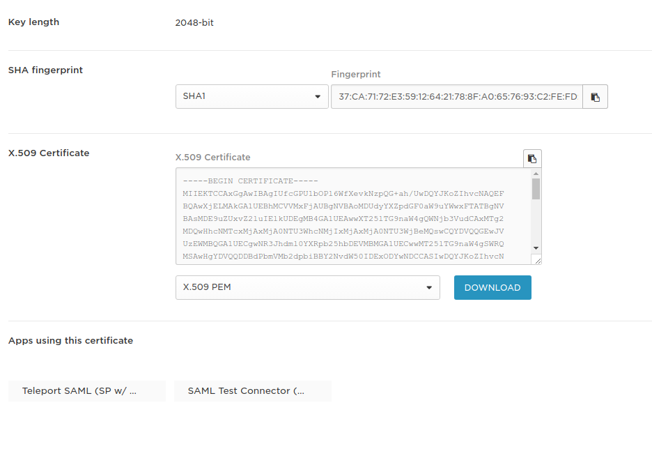

# SSH Authentication with One Login

This guide will cover how to configure [One Login](https://www.onelogin.com/) to issue
SSH credentials to specific groups of users. When used in combination with role
based access control (RBAC) it allows SSH administrators to define policies
like:

* Only members of "DBA" group can SSH into machines running PostgreSQL.
* Developers must never SSH into production servers.
* ... and many others.

!!! warning "Version Warning":
    This guide requires a commercial edition of Teleport. The open source
    edition of Teleport only supports [Github](admin-guide/#github-oauth-20) as
    an SSO provider.

## Enable SAML Authentication

Configure Teleport auth server to use SAML authentication instead of the local
user database. Update `/etc/teleport.yaml` as shown below and restart the
teleport daemon.

```yaml
auth_service:
    authentication:
        type: saml
```

## Configure Application

Using One Login control panel, create a SAML 2.0 Web App in SAML configuration
section:


!!! tip "Important":
    Make sure to pick `SAML Test Connector (SP)` and not `SAML Test Connector (IdP)`,
    because teleport only supports `SP` - service provider initiated SAML flows.

Set `Audience`, `Recipient` and `ACS (Consumer) URL Validator` to the same value:

`https://teleport.example.com/v1/webapi/saml/acs` where `teleport.example.com` is the
public name of the teleport web proxy service:


Teleport needs to assign groups to users. Configure the application with some parameters
exposed as SAML attribute statements:


!!! warning "Important":
    Make sure to check `Include in SAML assertion` checkbox.

Add users to the application:


## Create a SAML Connector

Now, create a SAML connector [resource](admin-guide#resources).
Write down this template as `onelogin-connector.yaml`:

```bash
kind: saml
version: v2
metadata:
  name: OneLogin
  namespace: default
spec:
  acs: https://teleport.example.com/v1/webapi/saml/acs
  attributes_to_roles:
    - {name: "groups", value: "admin", roles: ["admin"]}
    - {name: "groups", value: "dev", roles: ["dev"]}
  display: OneLogin
  issuer: https://app.onelogin.com/saml/metadata/123456
  sso: https://mycompany.onelogin.com/trust/saml2/http-redirect/sso/123456
  cert: |
    -----BEGIN CERTIFICATE-----
    ... do not forget to indent the value
    -----END CERTIFICATE-----
```

To fill in the fields, open `SSO` tab:


* `acs` - is the name of the teleport web proxy, e.g. `https://teleport.example.com/v1/webapi/saml/acs`
* `issuer` - use value from `Issuer URL field`, e.g. `https://app.onelogin.com/saml/metadata/123456`
* `sso` - use the value from the value from field `SAML 2.0 Endpoint (HTTP)` but replace `http-post` with `http-redirect`, e.g. `https://mycompany.onelogin.com/trust/saml2/http-redirect/sso/123456`

!!! tip "Important":
    Make sure to replace `http-post` with `http-redirect`!

* `cert` - download certificate, by clicking "view details link" and add to `cert` section



Create the connector using `tctl` tool:

```bash
$ tctl create onelogin-connector.yaml
```

## Create Teleport Roles

We are going to create 2 roles, privileged role admin who is able to login as
root and is capable of administrating the cluster and non-privileged dev.

```bash
kind: "role"
version: "v3"
metadata:
  name: "admin"
spec:
  options:
    max_session_ttl: "24h"
  allow:
    logins: [root]
    node_labels:
      "*": "*"
    rules:
      - resources: ["*"]
        verbs: ["*"]
```

Devs are only allowed to login to nodes labelled with `access: relaxed`
teleport label. Developers can log in as either `ubuntu` to a username that
arrives in their assertions. Developers also do not have any rules needed to
obtain admin access.

```bash
kind: "role"
version: "v3"
metadata:
  name: "dev"
spec:
  options:
    max_session_ttl: "24h"
  allow:
    logins: [ "{{external.username}}", ubuntu ]
    node_labels:
      access: relaxed
```
    
**Notice:** Replace `ubuntu` with linux login available on your servers!

```bash
$ tctl create admin.yaml
$ tctl create dev.yaml
```

## Testing

The Web UI will now contain a new button: "Login with OneLogin". The CLI is 
the same as before:

```bash
$ tsh --proxy=proxy.example.com login
```

This command will print the SSO login URL (and will try to open it
automatically in a browser).

!!! tip "Tip":
    Teleport can use multiple SAML connectors. In this case a connector name
    can be passed via `tsh login --auth=connector_name`

!!! note "IMPORTANT":
    Teleport only supports sending party initiated flows for SAML 2.0. This
    means you can not initiate login from your identity provider, you have to
    initiate login from either the Teleport Web UI or CLI.

## Troubleshooting

If you get "access denied errors" the number one place to check is the audit
log on the Teleport auth server. It is located in `/var/lib/teleport/log` by
default and it will contain the detailed reason why a user's login was denied.

Some errors (like filesystem permissions or misconfigured network) can be
diagnosed using Teleport's `stderr` log, which is usually available via:

```bash
$ sudo journalctl -fu teleport
```

If you wish to increase the verbocity of Teleport's syslog, you can pass
`--debug` flag to `teleport start` command.

