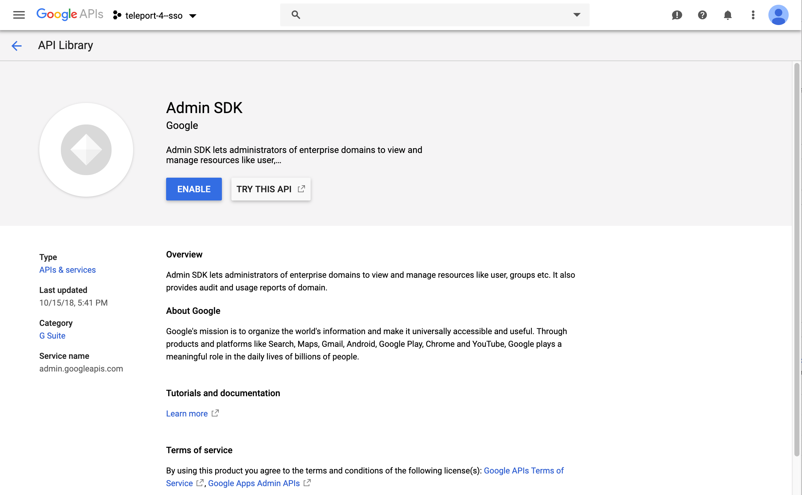

# SSH Authentication with G Suite

This guide will cover how to configure [G Suite](https://gsuite.google.com) to issue
SSH credentials to specific groups of users. When used in combination with role
based access control (RBAC) it allows SSH administrators to define policies
like:

* Only members of "DBA" Google group can SSH into machines running PostgreSQL.
* Developers must never SSH into production servers.
* ... and many others.

!!! warning "Version Warning":
    This guide requires a commercial edition of Teleport. The open source
    edition of Teleport only supports [Github](admin-guide/#github-oauth-20) as
    an SSO provider.


## Configure G Suite

1. Obtain OAuth 2.0 credentials  [https://developers.google.com/identity/protocols/OpenIDConnect](https://developers.google.com/identity/protocols/OpenIDConnect)

2. Create a new Project.


3. Select OAuth client ID.


4. Make Application Type Public & Setup Domain Verification


5. Copy OAuth Client ID and Client Secret for YAML Below.

Note: The redirect_url: `https://teleport.example.com:3080/v1/webapi/oidc/callback`


6. To allow for fine grained role based access control (RBAC) you'll first need to
open an admin API so Teleport can assign groups to roles. Allow Admin SDK via [google.com/apis/api/admin.googleapis.com/overview](https://console.developers.google.com/apis/api/admin.googleapis.com/overview)



## Create a OIDC Connector

Now, create a OIDC connector [resource](admin-guide#resources).
Write down this template as `gsuite-connector.yaml`:

```yaml
kind: oidc
version: v2
metadata:
  name: GSuite
spec:
  redirect_url: https://localhost:3080/v1/webapi/oidc/callback
  client_id: exampleclientid11234.apps.googleusercontent.com
  client_secret: examplesecret
  issuer_url: https://accounts.google.com
  scope: ['https://www.googleapis.com/auth/admin.directory.group.readonly', 'openid', 'email']
  claims_to_roles:
    - {claim: "groups", value: "admin@example.com", roles: ["admin"]}
```

!!! important
    The groups will be fetched only if admins include special auth scope https://www.googleapis.com/auth/admin.directory.group.readonly in the scopes of the connector as shown in the example above.


Create the connector using `tctl` tool:

```bsh
$ tctl create gsuite-connector.yaml
```

## Create Teleport Roles

We are going to create 2 roles:
-  Privileged role admin who is able to login as root and is capable of administrating
the cluster
- Non-privileged dev

```yaml
kind: role
version: v3
metadata:
  name: admin
spec:
  options:
    max_session_ttl: 24h
  allow:
    logins: [root]
    node_labels:
      "*": "*"
    rules:
      - resources: ["*"]
        verbs: ["*"]
```

Devs are only allowed to login to nodes labelled with `access: relaxed`
Teleport label. Developers can log in as either `ubuntu` or a username that
arrives in their assertions. Developers also do not have any rules needed to
obtain admin access to Teleport.

```yaml
kind: role
version: v3
metadata:
  name: dev
spec:
  options:
    max_session_ttl: 24h
  allow:
    logins: [ "{{external.username}}", ubuntu ]
    node_labels:
      access: relaxed
```

**Notice:** Replace `ubuntu` with linux login available on your servers!

```bsh
$ tctl create admin.yaml
$ tctl create dev.yaml
```

## Testing


The Web UI will now contain a new button: "Login with GSuite". The CLI is
the same as before:

```bsh
$ tsh --proxy=proxy.example.com login
```

This command will print the SSO login URL (and will try to open it
automatically in a browser).

!!! tip "Tip":
    Teleport can use multiple OIDC connectors. In this case a connector name
    can be passed via `tsh login --auth=connector_name`


## Troubleshooting

If you get "access denied" errors the number one place to check is the audit
log on the Teleport auth server. It is located in `/var/lib/teleport/log` by
default and it will contain the detailed reason why a user's login was denied.

Example of a user being denied due as the role `clusteradmin` wasn't setup.
```json
{"code":"T1001W","error":"role clusteradmin is not found","event":"user.login","method":"oidc","success":false,"time":"2019-06-15T19:38:07Z","uid":"cd9e45d0-b68c-43c3-87cf-73c4e0ec37e9"}
```


Some errors (like filesystem permissions or misconfigured network) can be
diagnosed using Teleport's `stderr` log, which is usually available via:

```bsh
$ sudo journalctl -fu teleport
```

If you wish to increase the verbosity of Teleport's syslog, you can pass
`--debug` flag to `teleport start` command.

