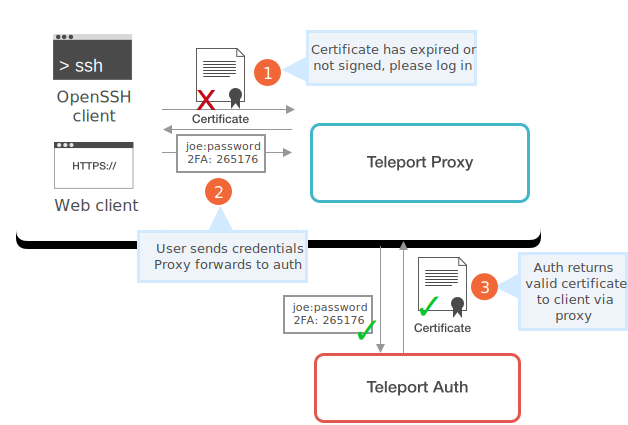
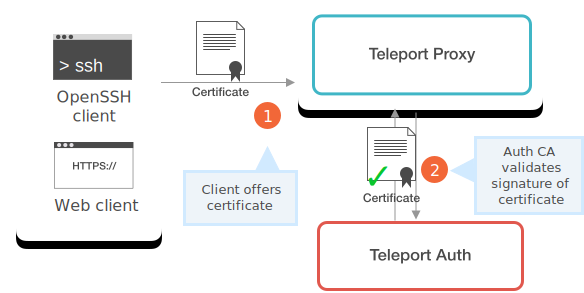

# Teleport Authentication Service

This document outlines the Teleport Authentication Service and Certificate
Management. It explains how Users and Nodes are identified and granted access to
Nodes and Services.

**Table of Contents**

[TOC]

## Authentication vs. Authorization

Teleport Auth handles both authentication and authorization. These topics are
related but different, and they are often discussed jointly as "Auth".

**Authentication** is proving an identity. "I say I am Bob, and I really am Bob.
See look I have Bob's purple hat." The job of an Authentication system is to
define the criteria by which users must prove their identity. Is having a purple
hat enough to show that a person is Bob? Maybe, maybe not. To identify users and
nodes to Teleport Auth, we require them to present a cryptographically-signed
certificate issued by the Teleport Auth Certificate Authority.

**Authorization** is proving access to something: "Bob has a purple hat, but
also a debit card and the correct PIN code. Bob can access a bank account with
the number 814000001344. Can Bob get $20 out of the ATM?" The ATM's
Authentication system would validate Bob's PIN Code, while the Authorization
system would use a stored mapping from Bob to account #814000001344 to decide
whether Bob could withdraw cash. Authorization defines and determines
permissions that users have within a system, such as access to cash within a
banking system, or data in a filesystem. Before users are granted access to
nodes, the Auth Service checks their identity against a stored mapping in a
database.

## SSH Certificates

One can think of an SSH certificate as a "permit" issued and time-stamped by a
trusted authority. In this case the authority is the Auth Server's Certificate
Authority. A certificate contains four important pieces of data:

1. List of principals (identities) this certificate belongs to.
2. Signature of the certificate authority who issued it.
3. The expiration date, also known as "time-to-live" or simply TTL.
4. Additional data, such as the node role, stored as a certificate extension.

## Authentication in Teleport

Teleport uses SSH certificates to authenticate nodes and users within a cluster.

There are two CAs operating inside the Auth Server because nodes and users each
need their own certificates. <!--TODO: Why?-->

* The **Node CA** issues certificates which identify a node (i.e. host, server,
  computer). These certificates are used to add new nodes to a cluster and
  identify connections coming from the node.
* The **User CA** issues certificates which identify a User. These certificates
  are used to authenticate users when they try to connect to a cluster node.

### Issuing Node Certificates

Node Certificates identify a node within a cluster and establish the permissions
of the node to access other Teleport services. The presence of a signed
certificate on a node makes it a cluster member.

1. To join a cluster for the first time, a node must present a "join token" to
   the auth server. The token can be static (configured via config file) or a
   dynamic, single-use token generated by [`tctl nodes
   add`](../cli-docs.md#tctl-nodes-add).

    !!! tip "Token TTL"
        When using dynamic tokens, their default time to live (TTL) is 15
        minutes, but it can be reduced (not increased) via
        [`tctl nodes add --ttl`](../cli-docs.md#tctl-nodes-add) flag.

2. When a new node joins the cluster, the auth server generates a new
   public/private keypair for the node and signs its certificate. This node
   certificate contains the node's role(s) (`proxy`, `auth` or `node`) as a
   certificate extension (opaque signed string).

### Using Node Certificates

All nodes in a cluster can connect to the [Auth Server's API](#auth-api)
<!--Docs about this--> implemented as an HTTP REST service running over the SSH
tunnel. This API connection is authenticated with the node certificate and the
encoded role is checked to enforce access control. For example, a client
connection using a certificate with only the `node` role won't be able to add
and delete users. This client connection would only be authorized to get auth
servers registered in the cluster.

### Issuing User Certificates

The Auth Server uses its User CA to issue user certificates. User certificates
are stored on a user's machine in the `~/.tsh/<proxy_host>` directory or also
by the system's SSH agent if it is running.

1. To get permission to join a cluster for the first time a user must provide
   their username, password, and 2nd-factor token. Users can log in with [`tsh
   login`](../cli-docs.md#tsh-login) or via the Web UI. The Auth Server checks
   the username and password against its identity storage and checks the 2nd factor token.

2. If the correct credentials were offered, the Auth Server will generate a
   signed certificate and return it to the client. For users, certificates are
   stored in `~/.tsh` by default. If the client uses the [Web
   UI](./proxy/#web-ui-to-ssh) the signed certificate is associated with a
   secure websocket session.

In addition to a user's identity, user certificates also contain user roles and
SSH options, like "permit-agent-forwarding" <!--TODO: link to config/set options here-->.
This additional data is stored as a certificate extension and is protected by
the CA signature.

### Using User Certificates

When a client requests access to a node cluster, the Auth Server first checks
that a certificate exists and hasn't expired. If it has expired, the client must
re-authenticate with their username, password, and 2nd factor. If the
certificate is still valid, the Auth Server validates the certificate's
signature. The client is then granted access to the cluster. From here, the
[Proxy Server](teleport_proxy.md#connecting-to-a-node) establishes a connection between
client and node.

## Certificate Rotation

By default, all user certificates have an expiration date, also known as time to
live (TTL). This TTL can be configured by a Teleport administrator. However, the node
certificates issued by an Auth Server are valid indefinitely by default.

Teleport supports certificate rotation, i.e. the process of invalidating all
previously-issued certificates for nodes _and_ users regardless of their TTL.
Certificate rotation is triggered by [`tctl auth
rotate`](../cli-docs.md#tctl-auth). When this command is invoked by a Teleport
administrator on one of a cluster's Auth Servers, the following happens:

1. A new certificate authority (CA) key is generated.
2. The old CA will be considered valid _alongside_ the new CA for some period of
   time. This period of time is called a _grace period_. <!--TODO: Link to
   config/defaults.-->
3. During the grace period, all previously issued certificates will be
   considered valid, assuming their TTL isn't expired.
4. After the grace period is over, the certificates issued by the old CA are no
   longer accepted.

This process is repeated twice, once for the node CA and once for the user CA.

Take a look at the [Certificate Guide](../admin-guide.md#certificate-rotation) to
learn how to do certificate rotation in practice.

## Auth API

 <!--TODO: Can we say more about this, abstract of routes provided-->

Clients can also connect to the auth API through the Teleport proxy to use a
limited subset of the API to discover the member nodes of the cluster.

## Auth State

The Auth service maintains state using a database of users, credentials,
certificates, and audit logs. The default storage location is
`/var/lib/teleport` or an [admin-configured storage
destination](../admin-guide.md#high-availability).

There are three types of data stored by the auth server:

* **Cluster State** The auth server stores its own keys in a cluster state
  storage. All of cluster dynamic configuration is stored there as well,
  including:
    * Node membership information and online/offline status for each node.
    * List of active sessions.
    * List of locally stored users
    * RBAC configuration (roles and permissions).
    * Other dynamic configuration.
* **Audit Log** When users log into a Teleport cluster, execute remote commands
  and logout, that activity is recorded in the audit log. See Audit Log for more
  details. More on this in the [Audit Log section below](#audit-log).
* **Recorded Sessions** When Teleport users launch remote shells via `tsh ssh`
  command, their interactive sessions are recorded and stored by the auth
  server. Each recorded session is a file which is saved in /var/lib/teleport by
  default, but can also be saved in external storage, like an AWS S3 bucket.

## Audit Log

The Teleport auth server keeps the audit log of SSH-related events that take
place on any node within a Teleport cluster. Each node in a cluster emits audit
events and submits them to the auth server. The events recorded include:

* successful user logins
* node IP addresses
* session time
* session IDs

!!! warning "Compatibility Warning"

    Because all SSH events like `exec` or `session_start` are reported by the
    Teleport node service, they will not be logged if you are using OpenSSH
    `sshd` daemon on your nodes.

Only an SSH server can report what's happening to the Teleport auth server.
The audit log is a JSON file which is by default stored on the auth server's
filesystem under `/var/lib/teleport/log`. The format of the file is documented
in the [Admin Manual](../admin-guide.md#audit-log).

Teleport users are encouraged to export the events into external, long term
storage.

!!! info "Deployment Considerations"

    If multiple Teleport auth servers are used
    to service the same cluster (HA mode) a network file system must be used for
    `/var/lib/teleport/log` to allow them to combine all audit events into the
    same audit log. [Learn how to deploy Teleport in HA Mode.](../admin-guide.md#high-availability))

## Recording Proxy Mode

In this mode, the proxy terminates (decrypts) the SSH connection using the
certificate supplied by the client via SSH agent forwarding and then establishes
its own SSH connection to the final destination server, effectively becoming an
authorized "man in the middle". This allows the proxy server to forward SSH
session data to the auth server to be recorded, as shown below:

The recording proxy mode, although _less secure_, was added to allow Teleport
users to enable session recording for OpenSSH's servers running `sshd`, which is
helpful when gradually transitioning large server fleets to Teleport.

We consider the "recording proxy mode" to be less secure for two reasons:

1. It grants additional privileges to the Teleport proxy. In the default mode,
   the proxy stores no secrets and cannot "see" the decrypted data. This makes a
   proxy less critical to the security of the overall cluster. But if an
   attacker gains physical access to a proxy node running in the "recording"
   mode, they will be able to see the decrypted traffic and client keys stored
   in proxy's process memory.
2. Recording proxy mode requires the SSH agent forwarding. Agent forwarding is
   required because without it, a proxy will not be able to establish the 2nd
   connection to the destination node.

However, there are advantages of proxy-based session recording too. When
sessions are recorded at the nodes, a root user can add iptables rules to
prevent sessions logs from reaching the Auth Server. With sessions recorded at
the proxy, users with root privileges on nodes have no way of disabling the
audit.

See the [admin guide](../admin-guide.md#recorded-sessions) to learn how to turn on the
recording proxy mode.

## Storage Back-Ends

Different types of cluster data can be configured with different storage
back-ends as shown in the table below:

Data Type        | Supported Back-ends       | Notes
-----------------|---------------------------|---------
Cluster state    | `dir`, `etcd`, `dynamodb` | Multi-server (HA) configuration is only supported using `etcd` and `dynamodb` back-ends.
Audit Log Events | `dir`, `dynamodb`         | If `dynamodb` is used for the audit log events, `s3` back-end **must** be used for the recorded sessions.
Recorded Sessions| `dir`, `s3`               | `s3` is mandatory if `dynamodb` is used for the audit log.

!!! tip "Note"

    The reason Teleport designers split the audit log events and the recorded
    sessions into different back-ends is because of the nature of the data. A
    recorded session is a compressed binary stream (blob) while the event is a
    well-defined JSON structure. `dir` works well enough for both in small
    deployments, but large clusters require specialized data stores: S3 is
    perfect for uploading session blobs, while DynamoDB or `etcd` are better
    suited to store the cluster state.

The combination of DynamoDB + S3 is especially popular among AWS users because
it allows them to run Teleport clusters completely devoid of local state.

!!! tip "NOTE"

    For high availability in production, a Teleport cluster can be
    serviced by multiple auth servers running in sync. Check [HA
    configuration](../admin-guide.md#high-availability) in the Admin Guide.

## More Concepts

* [Architecture Overview](teleport_architecture_overview.md)
* [Teleport Users](teleport_users.md)
* [Teleport Nodes](teleport_nodes.md)
* [Teleport Proxy](teleport_proxy.md)
