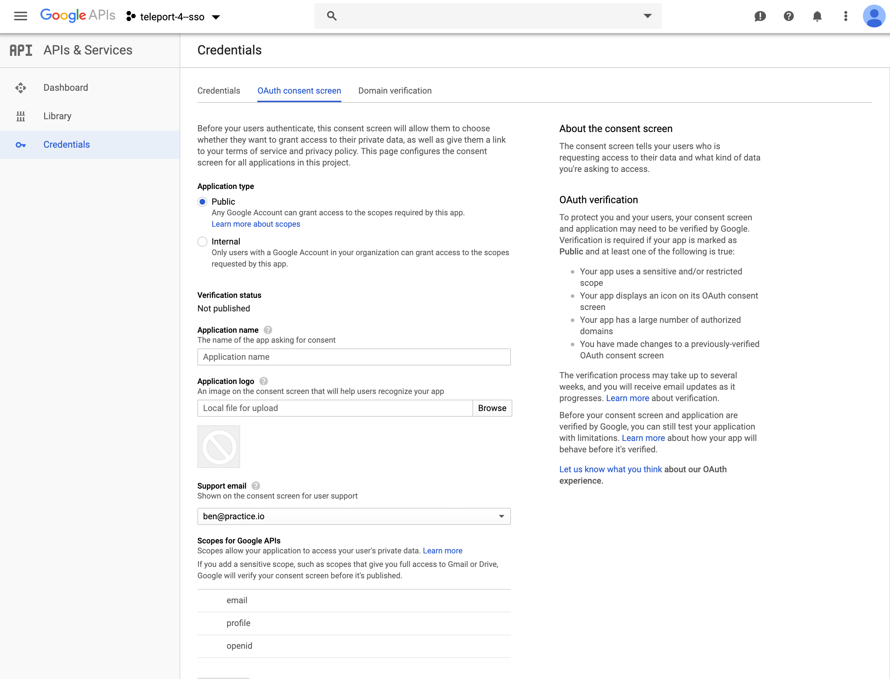
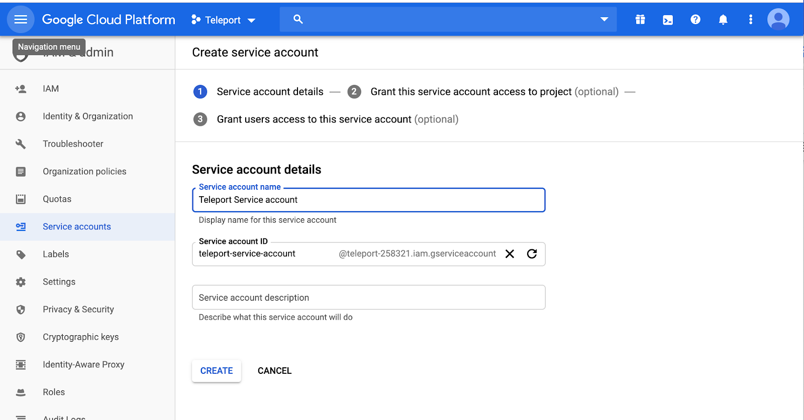
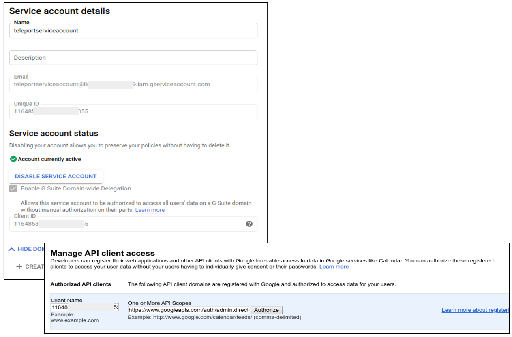

# SSH Authentication with G Suite

This guide will cover how to configure [G Suite](https://gsuite.google.com) to issue
SSH credentials to specific groups of users. When used in combination with role
based access control (RBAC) it allows SSH administrators to define policies
like:

* Only members of "DBA" Google group can SSH into machines running PostgreSQL.
* Developers must never SSH into production servers.
* ... and many others.

!!! warning "Version Warning"

    This guide requires an enterprise version of Teleport 4.1.4 or greater. The open source
    edition of Teleport only supports [Github](../../admin-guide.md#github-oauth-20) as
    an SSO provider.

<iframe width="712" height="400" src="https://www.youtube.com/embed/DG97l8WJ6oU?rel=0&modestbranding=1&widget_referrer=gravitational.com/teleport/docs" frameborder="0" allow="accelerometer; autoplay; encrypted-media; modestbranding; gyroscope; picture-in-picture" allowfullscreen></iframe>

## Prerequisites:

Before you get started you’ll need:

- An Enterprise version of Teleport v4.1.4 or greater, downloaded from [https://dashboard.gravitational.com/](https://dashboard.gravitational.com/web/).
- Be a G Suite Super Admin. As Google Best Practices, we would recommend setting up a seperate super admin with 2FA vs using your user.
    - e.g. A dedicated account ben-ops@practice.io vs my daily ben@practice.io
- Ability to create GCP Project.
    - This might require signing up to GCP, but for this project it won’t require using any paid services. It’s just a side effect of G Suite and GCP being closely related.
- Have a [verified Domain](https://support.google.com/a/answer/60216?hl=en ).
- Setup G Suite Groups


## Configure G Suite

1. Obtain OAuth 2.0 credentials  [https://developers.google.com/identity/protocols/OpenIDConnect](https://developers.google.com/identity/protocols/OpenIDConnect)

2. Create a new Project.


3. Select OAuth client ID.


4. Make Application Type Public & Setup Domain Verification


5. Copy OAuth Client ID and Client Secret for YAML Below.
   Note: The redirect_url: `https://teleport.example.com:3080/v1/webapi/oidc/callback`


## Create a Service Account


Leave Service account users roles, and admin roles as blank.

Leave Service account permissions as blank.

### Enable Account Delegation:


### Download Service Account JSON


This JSON file will need to be uploaded to the Authentication server, and will be later referenced by
the OIDC Connector, under `google_service_account_uri`.

!!! note

    Teleport requires the service account JSON to be uploaded to all Teleport authentication servers when setting
    up in a HA config.

## API Scopes:
Before setting the Manage API client access capture the client ID of the service account.
Within GSuite to access the Manage API client access go to Security -> Settings.  Navigate to Advanced Settings and open Manage API client access.  Put the client ID in the Client Name field and the below permissions in the API scopes as a single comma separated line.  Press Authorize.

!!! note:  Do not use the email of the service account.  The configuration display will look the same but the service account will not have the domain-wide delegation required.  A indicator of that is if you see `Client is unauthorized to retrieve access tokens using this method, or client not authorized for any of the scopes requested.` in your log.

`https://www.googleapis.com/auth/admin.directory.group.member.readonly, https://www.googleapis.com/auth/admin.directory.group.readonly, https://www.googleapis.com/auth/admin.directory.user.readonly`


Google will display the client id and resolve the permission definitions.


## Create a OIDC Connector

Now, create a OIDC connector [resource](../../admin-guide.md#resources).
Write down this template as `gsuite-connector.yaml`:

```yaml
{!examples/resources/gsuite-connector.yaml!}
```

Create the connector using `tctl` tool:

```bsh
$ tctl create gsuite-connector.yaml
```

## Create Teleport Roles

We are going to create 2 roles:

-  Privileged role admin who is able to login as root and is capable of administrating
the cluster
- Non-privileged dev

```yaml
kind: role
version: v3
metadata:
  name: admin
spec:
  options:
    max_session_ttl: 24h
  allow:
    logins: [root]
    node_labels:
      "*": "*"
    rules:
      - resources: ["*"]
        verbs: ["*"]
```

Devs are only allowed to login to nodes labelled with `access: relaxed`
Teleport label. Developers can log in as either `ubuntu` or a username that
arrives in their assertions. Developers also do not have any rules needed to
obtain admin access to Teleport.

```yaml
kind: role
version: v3
metadata:
  name: dev
spec:
  options:
    max_session_ttl: 24h
  allow:
    logins: [ "{{external.username}}", ubuntu ]
    node_labels:
      access: relaxed
```

**Notice:** Replace `ubuntu` with linux login available on your servers!

```bsh
$ tctl create admin.yaml
$ tctl create dev.yaml
```

## Testing


The Web UI will now contain a new button: "Login with GSuite". The CLI is
the same as before:

```bsh
$ tsh --proxy=proxy.example.com login
```

This command will print the SSO login URL (and will try to open it
automatically in a browser).

!!! tip "Tip"

    Teleport can use multiple OIDC connectors. In this case a connector name
    can be passed via `tsh login --auth=connector_name`


## Troubleshooting

If you get "access denied" errors the number one place to check is the audit
log on the Teleport auth server. It is located in `/var/lib/teleport/log` by
default and it will contain the detailed reason why a user's login was denied.

Example of a user being denied due as the role `clusteradmin` wasn't setup.
```json
{"code":"T1001W","error":"role clusteradmin is not found","event":"user.login","method":"oidc","success":false,"time":"2019-06-15T19:38:07Z","uid":"cd9e45d0-b68c-43c3-87cf-73c4e0ec37e9"}
```


Some errors (like filesystem permissions or misconfigured network) can be
diagnosed using Teleport's `stderr` log, which is usually available via:

```bsh
$ sudo journalctl -fu teleport
```

If you wish to increase the verbosity of Teleport's syslog, you can pass the
[`--debug`](../../cli-docs.md#teleport-start) flag to `teleport start` command.
