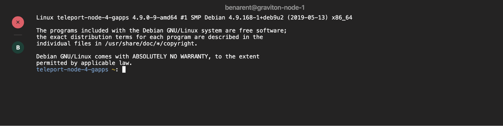

# Using Teleport with Pluggable Authentication Modules (PAM)

Teleport's node service can be configured to integrate with [PAM](https://en.wikipedia.org/wiki/Linux_PAM). This allows Teleport to create user sessions using PAM session profiles.

Teleport only supports the `account` and `session` stack. The `auth` PAM module is
not currently supported with Teleport.


## Introduction to Pluggable Authentication Modules

Pluggable Authentication Modules (PAM) date back to 1995 when Sun Microsystems
implemented a generic authentication framework for Solaris. Since then most GNU/Linux
distributions have adopted PAM.

```bash
$ man pam
```

The Pluggable Authentication Modules (PAM) library abstracts a number of common
authentication-related operations and provides a framework for dynamically loaded
modules that implement these operations in various ways.

**Terminology**

In PAM parlance, the application that uses PAM to authenticate a user is the server,
and is identified for configuration purposes by a service name, which is often (but
not necessarily) the program name.

The user requesting authentication is called the applicant, while the user (usually, root)
charged with verifying his identity and granting them the requested credentials is
called the arbitrator.

The sequence of operations the server goes through to authenticate a user and perform
whatever task their requested is a PAM transaction; the context within which the server
performs the requested task is called a session.

The functionality embodied by PAM is divided into six primitives grouped into four
facilities: authentication, account management, session management and password
management.

Teleport currently supports account management and session management.

## Setting up PAM on a Linux Machine running Teleport

To enable PAM on a given Linux machine, update `/etc/teleport.yaml` with:

```yaml
teleport:
   ssh_service:
      pam:
         # "no" by default
         enabled: true
         # use /etc/pam.d/sshd configuration (the default)
         service_name: "sshd"
```

Please note that most Linux distributions come with a number of PAM services in
`/etc/pam.d` and Teleport will try to use `sshd` by default, which will be
removed if you uninstall the `openssh-server` package. We recommend creating your
own PAM service file like `/etc/pam.d/teleport` and specifying it as
`service_name` above.


## Setting Message of the Day (motd) with Teleport

The file `/etc/motd` is normally displayed by login(1) after a user has logged in
but before the shell is run. It is generally used for important system-wide announcements.

This feature can help you inform users that activity on the node is being audited
and recorded.

### Example node with PAM turned off

```yaml
teleport:
  nodename: graviton-node-1
  auth_token: hello
  auth_servers:
  - 10.2.1.230:5070
  data_dir: /var/lib/teleport
proxy_service:
  enabled: false
auth_service:
  enabled: false
ssh_service:
  enabled: true
  # configures PAM integration. see below for more details.
  pam:
     enabled: false
```


### Example node with PAM enabled
```yaml
teleport:
  nodename: graviton-node-1
  auth_token: hello
  auth_servers:
  - 10.2.1.230:5070
  data_dir: /var/lib/teleport
proxy_service:
  enabled: false
auth_service:
  enabled: false
ssh_service:
  enabled: true
  # configures PAM integration. see below for more details.
  pam:
     enabled: true
```



When PAM is enabled it will use the default `sshd` config file. This can differ per
distro, below is an example default sshd config from a Debian 9 machine.

```bash
$ cat /etc/pam.d/sshd
# PAM configuration for the Secure Shell service

# Standard Un*x authentication.
@include common-auth

# Disallow non-root logins when /etc/nologin exists.
account    required     pam_nologin.so

# Uncomment and edit /etc/security/access.conf if you need to set complex
# access limits that are hard to express in sshd_config.
# account  required     pam_access.so

# Standard Un*x authorization.
@include common-account

# SELinux needs to be the first session rule.  This ensures that any
# lingering context has been cleared.  Without this it is possible that a
# module could execute code in the wrong domain.
session [success=ok ignore=ignore module_unknown=ignore default=bad]        pam_selinux.so close

# Set the loginuid process attribute.
session    required     pam_loginuid.so

# Create a new session keyring.
session    optional     pam_keyinit.so force revoke

# Standard Un*x session setup and teardown.
@include common-session

# Print the message of the day upon successful login.
# This includes a dynamically generated part from /run/motd.dynamic
# and a static (admin-editable) part from /etc/motd.
session    optional     pam_motd.so  motd=/run/motd.dynamic
session    optional     pam_motd.so noupdate

# Print the status of the user's mailbox upon successful login.
session    optional     pam_mail.so standard noenv # [1]

# Set up user limits from /etc/security/limits.conf.
session    required     pam_limits.so

# Read environment variables from /etc/environment and
# /etc/security/pam_env.conf.
session    required     pam_env.so # [1]
# In Debian 4.0 (etch), locale-related environment variables were moved to
# /etc/default/locale, so read that as well.
session    required     pam_env.so user_readenv=1 envfile=/etc/default/locale

# SELinux needs to intervene at login time to ensure that the process starts
# in the proper default security context.  Only sessions which are intended
# to run in the user's context should be run after this.
session [success=ok ignore=ignore module_unknown=ignore default=bad]        pam_selinux.so open

# Standard Un*x password updating.
@include common-password
```

The default `sshd` will call two `pam_motd` files, one dynamic. That prints the machine
info, and a static MOTD that can be set by an admin.

```
session    optional     pam_motd.so  motd=/run/motd.dynamic
session    optional     pam_motd.so noupdate
```

Below, we show the default admin MOTD.

```bash
$ cat /etc/motd

The programs included with the Debian GNU/Linux system are free software;
the exact distribution terms for each program are described in the
individual files in /usr/share/doc/*/copyright.

Debian GNU/Linux comes with ABSOLUTELY NO WARRANTY, to the extent
permitted by applicable law.
```

I've updated this to provide a message to users of Teleport, so they know they are
being audited.

```bash
$ cat /etc/motd
WARNING: All activity on this node is being recorded by Teleport
```


## Creating local users with Teleport

Teleport 4.2.3 introduced the ability to create local (UNIX) users on login. This is
very helpful if you're a large organization and want to provision local users and home
directories on the fly.

Teleport added the ability to read in PAM environment variables from PAM handle and pass
environment variables to PAM modules: `TELEPORT_USERNAME`, `TELEPORT_LOGIN`, and `TELEPORT_ROLES`.

Here are some details on the contents of these environment variables which will be set by Teleport:

`TELEPORT_USERNAME`: The Teleport username of the user who is logging into the node. This is usually an email address (such as `user@example.com`) if using SAML/OIDC identities with Teleport Enterprise, or a more standard `exampleuser` if using local Teleport users.

`TELEPORT_LOGIN`: The name of the Linux/UNIX principal which the Teleport user is logging into the Teleport node as - for example `root`, `developer`, `ubuntu`, `ec2-user` or similar.

`TELEPORT_ROLES`: A space-separated list of Teleport roles which the Teleport user has - for example: `developer tester admin`.

This PAM module creates the user and home directory before attempting to launch
a shell for said user.

### Examples
**Using pam_exec.so**

Using `pam_exec.so` is the easiest way to use the PAM stack to create a user if
the user does not already exist. `pam_exec.so` usually ships with the operating
system.

You can either add `pam_exec.so` to the existing PAM stack for your application or
write a new one for Teleport. In this example, we'll write a new one to simplify how
to use `pam_exec.so` with Teleport.

Start by creating a file `/etc/pam.d/teleport` with the following contents:

```bash
account   required   pam_exec.so /etc/pam-exec.d/teleport_acct
session   required   pam_motd.so
```

!!! Note

      Pay attention to the inclusion of `pam_motd.so` under the `session` facility. While `pam_motd.so` is
      not required for user creation, Teleport requires at least one module to be set under both
      the `account` and `session` facilities for it to work.

Next, create the script that will be run by `pam_exec.so` like below. This
script will check if the user passed in `TELEPORT_LOGIN` exists and if it does
not, it will create it. Any error from `useradd` will be written to
`/tmp/pam.error`. Note the additional environment variables
`TELEPORT_USERNAME`, `TELEPORT_ROLES`, and `TELEPORT_LOGIN`.  These can be used
to write richer scripts that may change the system in other ways based on
identity information.

```bash
mkdir -p /etc/pam-exec.d
cat > /etc/pam-exec.d/teleport_acct <<EOF
#!/bin/sh
COMMENT="User ${TELEPORT_USERNAME} with roles ${TELEPORT_ROLES} created by Teleport."
id -u "${TELEPORT_LOGIN}" &>/dev/null  || /sbin/useradd -m -c "${COMMENT}" "${TELEPORT_LOGIN}" 2> /tmp/pam.error
exit 0
EOF
chmod +x /etc/pam-exec.d/teleport_acct
```

Next, update `/etc/teleport.yaml` to call the above PAM stack by both enabling PAM and
setting the service_name.

```yaml
ssh_service:
   pam:
     enabled: true
     service_name: "teleport"
```

Now attempting to login as an existing user should result in the creation of the
user and a successful login.
