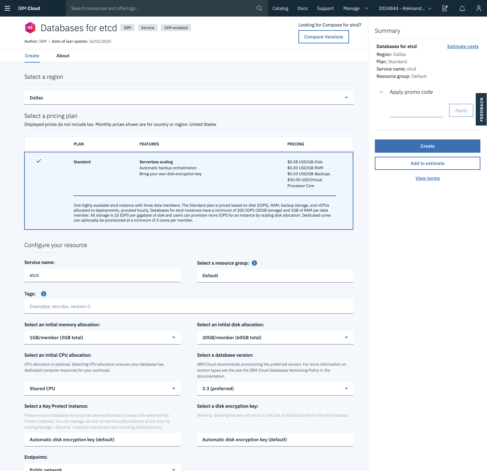

# Running Teleport on IBM Cloud

We've created this guide to give customers a high level overview of how to use Teleport
on the [IBM Cloud](https://www.ibm.com/cloud). This guide provides a high level 
introduction leading to a deep dive into how to setup and run Teleport in production.

We have split this guide into:

- [Teleport on IBM FAQ](#teleport-on-ibm-cloud-faq)
- [IBM Teleport Introduction](#ibm-teleport-introduction)

## Teleport on IBM Cloud FAQ

#### Why would you want to use Teleport with IBM Cloud?
TODO

#### Which Services can I use Teleport with?

You can use Teleport for all the services that you would SSH into. This guide is 
focused on IBM Cloud.  In the future we'll plan to update on how to use 
Teleport with IBM Cloud Kubernetes Service. 

## IBM Teleport Introduction

This guide will cover how to setup, configure and run Teleport on IBM Cloud.

IBM Services required to run Teleport in HA:

 - [IBM Cloud: Virtual Servers with Instance Groups](#)
 - [Storage: Database for etcd](#)
 - [Storage: IBM Cloud File Storage](#)
 - [Network Services: Load Balancing](#)
 - [Network Services: Cloud DNS](#)
 
Other things needed:

 - [SSL Certificate](https://www.ibm.com/cloud/ssl-certificates)


We recommend setting up Teleport in high availability mode (HA). In HA mode etcD 
stores the state of the system and [IBM Cloud Storage](https://www.ibm.com/cloud/storage) 
stores the audit logs.


### IBM Cloud: Virtual Servers with Instance Groups

We recommend Gen 2 Cloud IBM [Virtual Servers](https://www.ibm.com/cloud/virtual-servers) and [Auto Scaling](https://www.ibm.com/cloud/auto-scaling)

  - For Staging and POCs we recommend using `bx2-2x8` machines with 2 vCPUs, 4 GB RAM,	4 Gbps. 
  
  - For Production we would recommend `cx2-4x8` with	4 vCPUs, 	8 GB RAM	8 Gbps

### Storage: Database for etcd

IBM offers [managed etcd](https://www.ibm.com/cloud/databases-for-etcd) instances. 
Teleport uses etcd as a scalable  database to maintain high availability and provide
graceful restarts.  The service has to be turned on from within the [IBM Cloud Dashboard](https://cloud.ibm.com/catalog/services/databases-for-etcd).

We recommend picking an etcd instance in the same region as your planned Teleport 
cluster. 

- Deployment region: Same as rest of Teleport Cluster
- Initial Memory allocation: 2GB/member (6GB total)
- Initial disk allocation: 20GB/member (60GB total)
- CPU allocation: Shared 
- etcd version: 3.3 

 

#### Saving Service Credentials

```yaml
teleport:
  storage:
     type: etcd

     # list of etcd peers to connect to:
     peers: ["https://a9e977c0-224a-40bb-af51-21893b8fde79.b2b5a92ee2df47d58bad0fa448c15585.databases.appdomain.cloud:30359"]

     # required path to TLS client certificate and key files to connect to etcd
     # tls_cert_file will contain ETCDCTL_CACERT
     tls_cert_file: /var/lib/teleport/etcd-cert.pem
     # tls_key_file wil contain ???
     tls_key_file: /var/lib/teleport/etcd-key.pem

     # optional password based authentication
     # See https://etcd.io/docs/v3.4.0/op-guide/authentication/ for setting
     # up a new user. IBM Defaults to `root`
     username: root
     password_file: /mnt/secrets/etcd-pass

     # optional file with trusted CA authority
     # file to authenticate etcd nodes
     # Note needed if using Hosted IBM Server
     #
     # tls_ca_file: /var/lib/teleport/etcd-ca.pem

     # etcd key (location) where teleport will be storing its state under:
     prefix: teleport

     # NOT RECOMMENDED: enables insecure etcd mode in which self-signed
     # certificate will be accepted
     insecure: false
``` 


### Storage: IBM Cloud File Storage
We recommend using [IBM Cloud File Storage](https://www.ibm.com/cloud/file-storage) to store Teleport recorded sessions. 

1. Create New File Storage Resource. [IBM Catalog - File Storage Quick Link](https://cloud.ibm.com/catalog/infrastructure/file-storage)

    1a. We recommend using `Standard`

2. Create a new bucket. 
3. HMAC Credentials ... https://cloud.ibm.com/docs/services/cloud-object-storage/hmac?topic=cloud-object-storage-uhc-hmac-credentials-main 


audit_sessions_uri: 's3://readonly/records?endpoint=s3.us-east.cloud-object-storage.appdomain.cloud&region=ibm'

When setting up `audit_session_uri` use `s3://` session prefix.

The credentials are used from `~/.aws/credentials` and should be created with HMAC option:

 

```json 
{
  "apikey": "LU9VCDf4dDzj1wjt0Q-BHaa2VEM7I53_3lPff50d_uv3",
  "cos_hmac_keys": {
    "access_key_id": "e668d66374e141668ef0089f43bc879e",
    "secret_access_key": "d8762b57f61d5dd524ccd49c7d44861ceab098d217d05836"
  },
  "endpoints": "https://control.cloud-object-storage.cloud.ibm.com/v2/endpoints",
  "iam_apikey_description": "Auto-generated for key e668d663-74e1-4166-8ef0-089f43bc879e",
  "iam_apikey_name": "Service credentials-1",
  "iam_role_crn": "crn:v1:bluemix:public:iam::::serviceRole:Writer",
  "iam_serviceid_crn": "crn:v1:bluemix:public:iam-identity::a/0328d127d04047548c9d4bedcd24b85e::serviceid:ServiceId-c7ee0ee9-ea74-467f-a49e-ef60f6b27a71",
  "resource_instance_id": "crn:v1:bluemix:public:cloud-object-storage:global:a/0328d127d04047548c9d4bedcd24b85e:32049c3c-207e-4731-8b8a-53bf3b4844e7::"
}
```

`~/.aws/credentials` 

```yaml
# Example keys from example service account to be saved into ~/.aws/credentials
cos_hmac_keys:                                          
     access_key_id:       e668d66374e141668ef0089f43bc879e         
     secret_access_key:   d8762b57f61d5dd524ccd49c7d44861ceab098d217d05836       
```

```yaml
storage:
    ...
    # Note
    # 
    # endpoint=s3.us-east.cloud-object-storage.appdomain.cloud | This URL will 
    # differ depending on which region the bucket is created. Use the  public 
    # endpoints.
    # 
    # region=ibm | Should always be set as IBM. 
    audit_sessions_uri: 's3://readonly/records?endpoint=s3.us-east.cloud-object-storage.appdomain.cloud&region=ibm'
    ...
```

Add 


### Network: IBM Cloud Load Balancer 


Marketing Page: https://www.ibm.com/cloud/load-balancer

Cloud Dashboard Link: https://cloud.ibm.com/catalog/infrastructure/load-balancer-group 

### Network: IBM Cloud DNS Services

Cloud Dashboard Link:  https://cloud.ibm.com/catalog/services/dns-services