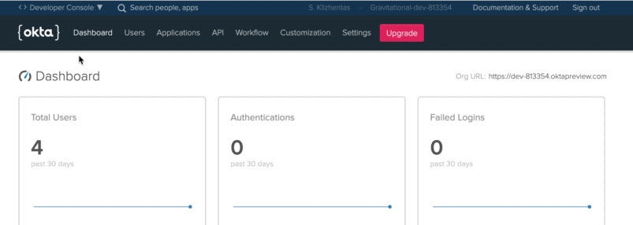
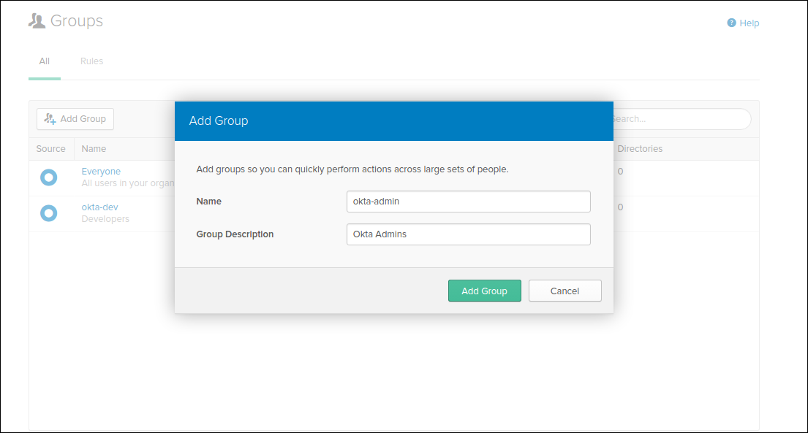

# SSH Authentication with Okta

This guide will cover how to configure [Okta](https://www.okta.com/) to issue
SSH credentials to specific groups of users. When used in combination with role
based access control (RBAC), it allows SSH administrators to define policies
like:

* Only members of "DBA" group can SSH into machines running PostgreSQL.
* Developers must never SSH into production servers.

!!! warning "Version Warning"

    This guide requires a commercial edition of Teleport. The open source
    edition of Teleport only supports [Github](../../admin-guide.md#github-oauth-20) as
    an SSO provider.

## Enable SAML Authentication

First, configure Teleport auth server to use SAML authentication instead of the local
user database. Update `/etc/teleport.yaml` as shown below and restart the
teleport daemon.

```yaml
auth_service:
    authentication:
        type: saml
```

## Configure Okta
First, create a SAML 2.0 Web App in Okta configuration section

#### 1. Switch to Classic UI


#### 2. Create a new SAML 2.0 App


### Configure the App

We are going to map the Okta groups we've created above to the SAML Attribute
statements (special signed metadata exposed via a SAML XML response).

GENERAL

- Single sign on URL `https://teleport-proxy.example.com:3080/v1/webapi/saml/acs`
- Audience URI (SP Entity ID)`https://teleport-proxy.example.com:3080/v1/webapi/saml/acs`
- Name ID format `EmailAddress`
- Application username `Okta username`

GROUP ATTRIBUTE STATEMENTS

- Name: `groups` | Name format: `Unspecified`
-  Filter: `Matches regex` |  `.*`


#### Note: RegEx requires `.*`


!!! tip "tip"

    Notice that we have set "NameID" to the email format and mapped the groups with
    a wildcard regex in the Group Attribute statements. We have also set the "Audience"
    and SSO URL to the same value.

### Create & Assign Groups

**Create Groups**

We are going to create two groups: "okta-dev" and "okta-admin":


...and the admin:



Assign groups and people to your SAML app:


Make sure to download the metadata in the form of an XML document. It will be used it to
configure a Teleport connector:


## Create a SAML Connector

Now, create a SAML connector [resource](../../admin-guide.md#resources):

```yaml
{!examples/resources/saml-connector.yaml!}
```

Create the connector using `tctl` tool:

```bsh
$ tctl create okta-connector.yaml
```

## Create Teleport Roles

We are going to create 2 roles, privileged role admin who is able to login as
root and is capable of administrating the cluster and non-privileged dev.

```yaml
kind: role
version: v3
metadata:
  name: admin
spec:
  options:
    max_session_ttl: 24h
  allow:
    logins: [root]
    node_labels:
      "*": "*"
    rules:
      - resources: ["*"]
        verbs: ["*"]
```

The developer role:

```yaml
kind: role
version: v3
metadata:
  name: dev
spec:
  options:
    max_session_ttl: 24h
  allow:
    logins: [ "{{external.username}}", ubuntu ]
    node_labels:
      access: relaxed
```

* Devs are only allowed to login to nodes labelled with `access: relaxed` label.
* Developers can log in as `ubuntu` user
* Notice `{{external.username}}` login. It configures Teleport to look at
  _"username"_ Okta claim and use that field as an allowed login for each user.
* Developers also do not have any "allow rules" i.e. they will not be able to
  see/replay past sessions or re-configure the Teleport cluster.

Now, create both roles on the auth server:

```bsh
$ tctl create admin.yaml
$ tctl create dev.yaml
```

## Testing

The Web UI will now contain a new button: "Login with Okta". The CLI is
the same as before:

```bsh
$ tsh --proxy=proxy.example.com login
```

This command will print the SSO login URL (and will try to open it
automatically in a browser).

!!! tip "Tip"

    Teleport can use multiple SAML connectors. In this case a connector name
    can be passed via `tsh login --auth=connector_name`

!!! note "IMPORTANT"

    Teleport only supports sending party initiated flows for SAML 2.0. This
    means you can not initiate login from your identity provider, you have to
    initiate login from either the Teleport Web UI or CLI.

## Troubleshooting

If you get "access denied errors" the number one place to check is the audit
log on the Teleport auth server. It is located in `/var/lib/teleport/log` by
default and it will contain the detailed reason why a user's login was denied.

Some errors (like filesystem permissions or misconfigured network) can be
diagnosed using Teleport's `stderr` log, which is usually available via:

```bsh
$ sudo journalctl -fu teleport
```

If you wish to increase the verbosity of Teleport's syslog, you can pass
`--debug` flag to `teleport start` command.