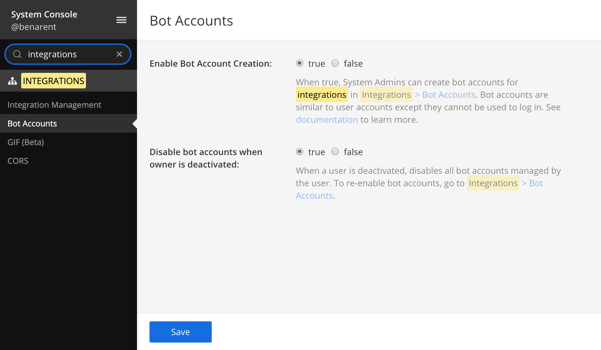
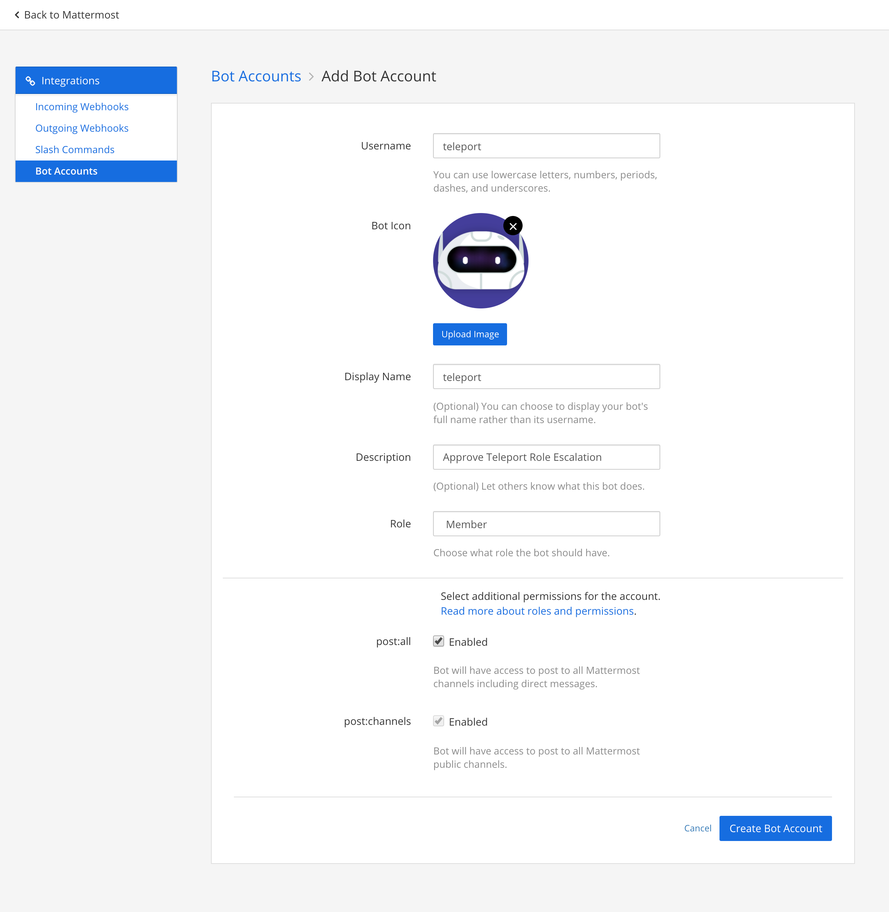
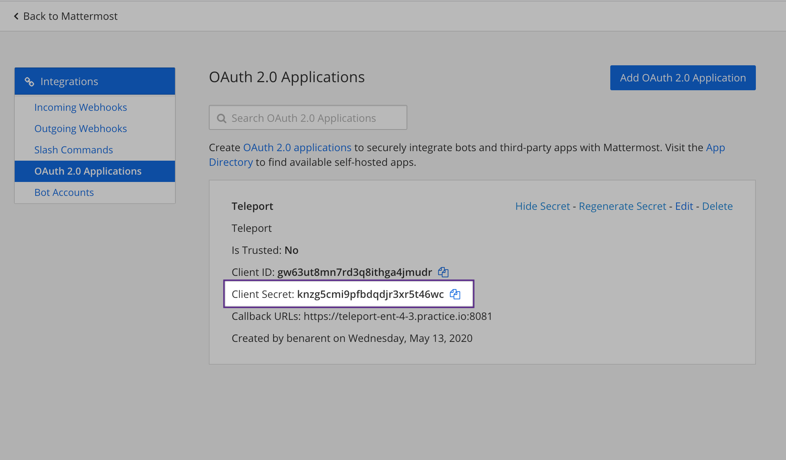

# Teleport Mattermost Plugin Setup
This guide will talk through how to setup Teleport with Mattermost. Teleport to Mattermost integration allows teams to approve or deny Teleport access requests using [Mattermost](https://mattermost.com/) an open source messaging platform.

!!! warning
    The Approval Workflow only works with Teleport Enterprise as it requires several roles.

#### Example Mattermost Request

<video style="width:100%" controls>
  <source src="/img/enterprise/plugins/mattermost/mattermost.mp4" type="video/mp4">
  <source src="/img/enterprise/plugins/mattermost/mattermost.webm" type="video/webm">
Your browser does not support the video tag.
</video>


## Setup
### Prerequisites
This guide assumes that you have:

* Teleport Enterprise 4.2.8 or newer
* Admin privileges with access to `tctl`
* Mattermost account with admin privileges. This plugin has been tested with Mattermost 5.x

#### Setting up Mattermost to work with the bot



In Mattermost, go to System Console → Integrations → Enable Bot Account Creation → Set to True.
This will allow us to create a new bot account that the Teleport bot will use.

Go back to your team, then Integrations → Bot Accounts → Add Bot Account.

The new bot account will need Post All permission.

<a href="/img/enterprise/plugins/teleport_bot@2x.png" download>Download Teleport Bot Icon</a>




##### Create an OAuth 2.0 Application
In Mattermost, go to System Console → Integrations → OAuth 2.0 Applications.
- Set Callback URLs to the location of your Teleport Proxy



The confirmation screen after you've created the bot will give you the access token.
We'll use this in the config later.

#### Create User and Role for access.
Log into Teleport Authentication Server, this is where you normally run `tctl`. Create a
new user and role that only has API access to the `access_request` API. The below script
will create a yaml resource file for a new user and role.

```yaml
# This command will create two Teleport Yaml resources, a new Teleport user and a
# Role for that users that can only approve / list requests.
$ cat > rscs.yaml <<EOF
kind: user
metadata:
  name: access-plugin-mattermost
spec:
  roles: ['access-plugin-mattermost']
version: v2
---
kind: role
metadata:
  name: access-plugin
spec:
  allow:
    rules:
      - resources: ['access_request']
        verbs: ['list','read','update']
    # teleport currently refuses to issue certs for a user with 0 logins,
    # this restriction may be lifted in future versions.
    logins: ['access-plugin-mattermost']
version: v3
EOF

# Run this to create the user and role in Teleport.
$ tctl create -f rscs.yaml
```

#### Export access-plugin Certificate
Teleport Plugin use the `access-plugin-mattermost` role and user to perform the approval. We export the identity files, using [`tctl auth sign`](https://gravitational.com/teleport/docs/cli-docs/#tctl-auth-sign).

```bash
$ tctl auth sign --format=tls --user=access-plugin-mattermost --out=auth --ttl=8760h
# ...
```

The above sequence should result in three PEM encoded files being generated: auth.crt, auth.key, and auth.cas (certificate, private key, and CA certs respectively).  We'll reference these later when [configuring Teleport-Plugins](#configuring-mattermost-bot).

!!! note "Certificate Lifetime"
     By default, [`tctl auth sign`](https://gravitational.com/teleport/docs/cli-docs/#tctl-auth-sign) produces certificates with a relatively short lifetime. For production deployments, the `--ttl` flag can be used to ensure a more practical certificate lifetime. `--ttl=8760h` exports a 1 year token

## Downloading and installing the plugin
We recommend installing the Teleport Plugins alongside the Teleport Proxy. This is an ideal
location as plugins have a low memory footprint, and will require both public internet access
and Teleport Auth access.  We currently only provide linux-amd64 binaries, you can also
compile these plugins from [source](https://github.com/gravitational/teleport-plugins/tree/master/access/mattermost).

```bash
$ wget https://get.gravitational.com/teleport-mattermost-v{{ teleport.plugin.version }}-linux-amd64-bin.tar.gz
$ tar -xzf teleport-mattermost-v{{ teleport.plugin.version }}-linux-amd64-bin.tar.gz
$ cd teleport-mattermost
$ ./install
$ which teleport-mattermost
/usr/local/bin/teleport-mattermost
```

Run `./install` in from 'teleport-mattermost' or place the executable in the appropriate `/usr/bin` or `/usr/local/bin` on the server installation.

### Configuring Mattermost bot
Mattermost Bot uses a config file in TOML format. Generate a boilerplate config by
running the following command:

```bash
$ teleport-mattermost configure > teleport-mattermost.toml
$ sudo mv teleport-mattermost.toml /etc
```

Then, edit the config as needed.

```yaml
{!examples/resources/plugins/teleport-mattermost.toml!}
```

### Testing the Plugin

With the config above, you should be able to run the bot invoking
`teleport-mattermost start -d`. The will provide some debug information to make sure
the bot can connect to Mattermost.

```bash
$ teleport-mattermost start -d
DEBU   DEBUG logging enabled logrus/exported.go:117
INFO   Starting Teleport Access Mattermost Bot {{ teleport.plugin.version }}-dev.1: mattermost/main.go:140
DEBU   Checking Teleport server version mattermost/main.go:234
DEBU   Starting a request watcher... mattermost/main.go:296
DEBU   Starting Mattermost API health check... mattermost/main.go:186
DEBU   Starting secure HTTPS server on :8081 utils/http.go:146
DEBU   Watcher connected mattermost/main.go:260
DEBU   Mattermost API health check finished ok mattermost/main.go:19
```

### Setup with SystemD
In production, we recommend starting teleport plugin daemon via an init system like systemd . Here's the recommended Teleport Plugin service unit file for systemd:

```bash
{!examples/systemd/plugins/teleport-mattermost.service!}
```
Save this as `teleport-mattermost.service`.

## Audit Log
The plugin will let anyone with access to the Mattermost channel requests so it's
important to review Teleport's audit log.

## Feedback
If you have any issues with this plugin please create an [issue here](https://github.com/gravitational/teleport-plugins/issues/new).