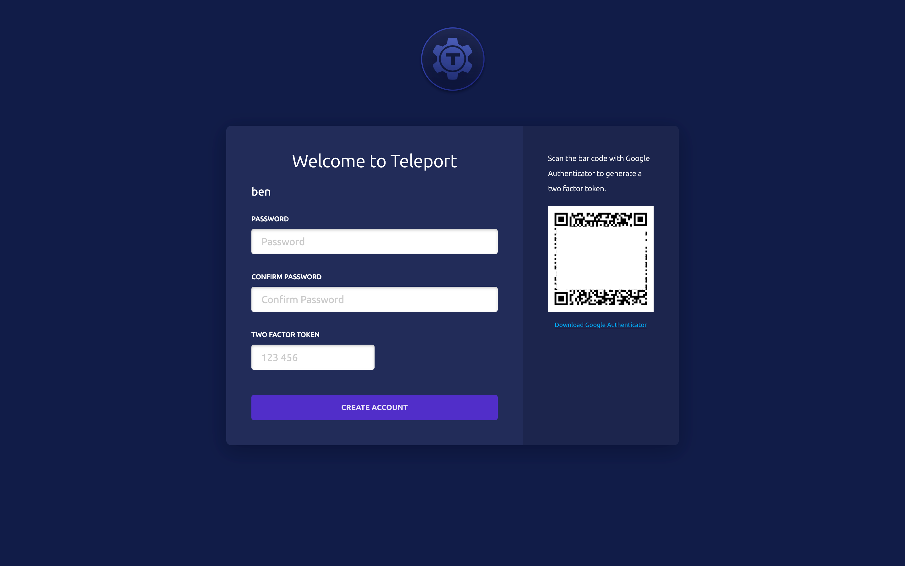
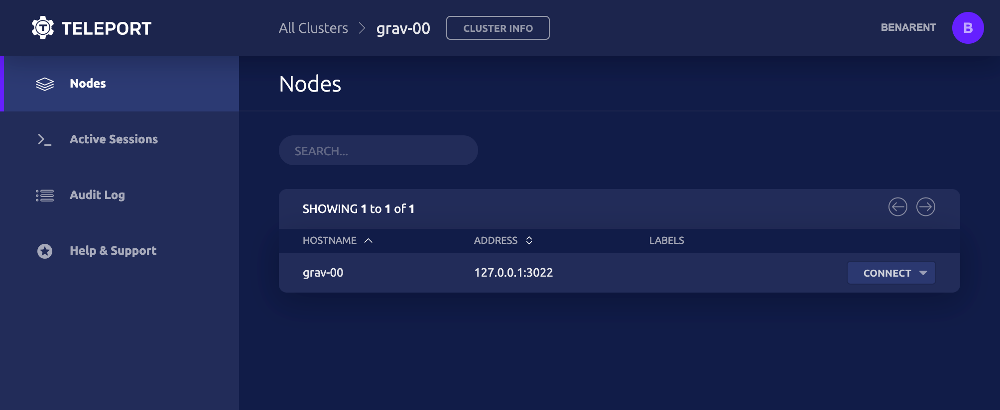

# Quickstart

Welcome to the Teleport Quickstart!

This tutorial will guide you through the steps needed to install and run
Teleport on a single node, which could be your local machine but we recommend a
VM.

### Prerequisites

* In this tutorial you will start a web UI which must be accessible via a web
  browser. If you run this tutorial on a remote machine without a GUI, first
  make sure that this machine's IP can be reached over your network and that
  it accepts incoming traffic on port `3080` .

* We recommend that you read the [Architecture Guide](architecture/teleport_architecture_overview.md)
  before working through this tutorial. If you'd like to dive right in though this is
  the best place to start!

This guide is only meant to demonstrate how to run Teleport in a sandbox or demo
environment, and showcase a few basic tasks you can do with Teleport.

**You should not follow this guide if you want to set up Teleport in production.
Instead follow the [Admin Guide](admin-guide.md)**

## Step 1: Install Teleport

This guide installs teleport v{{ teleport.version }} on the CLI. Previous versions are documented
in [Release History](https://gravitational.com/teleport/releases/). You can
download pre-built binaries from our
[Downloads](https://gravitational.com/teleport/download/) page or you can [build
it from source](installation.md#installing-from-source).

You can also download `.deb` , `.rpm` , and `.pkg` files from
[Downloads](https://gravitational.com/teleport/download/).

``` bash
$ export version=v{{ teleport.version }}
$ export os=linux # 'darwin' 'linux' or 'windows'
$ export arch=amd64 # '386' 'arm' on linux or 'amd64' for all distros
# Automated way to retrieve the checksum, just append .sha256
$ curl https://get.gravitational.com/teleport-$version-$os-$arch-bin.tar.gz.sha256
[Checksum output]
$ curl -O https://get.gravitational.com/teleport-$version-$os-$arch-bin.tar.gz
$ shasum -a 256 teleport-$version-$os-$arch-bin.tar.gz
# ensure the checksum matches the sha256 checksum on the download page!
$ tar -xzf teleport-$version-$os-$arch-bin.tar.gz
$ cd teleport
$ ./install
# this copies teleport binaries to /usr/local/bin
$ which teleport
/usr/local/bin/teleport
```

## Step 2: Start Teleport

First, create a directory for Teleport to keep its data (by default it's
`/var/lib/teleport`):

``` bash
$ mkdir -p /var/lib/teleport
```

Now we are ready to start Teleport. Start the `teleport` daemon:

``` bash
$ teleport start # if you are not `root` you may need `sudo`
```

!!! tip "Background Process"
    Avoid suspending your current shell session by
    running the process in the background like so:
    `teleport start > teleport.log 2>&1 &`.
    Access the process logs with `less teleport.log`.

!!! tip "Debugging/Verbose Output"
    If you encounter errors with any `teleport`, `tsh` or `tctl`
    command you can enable verbose logging with the `-d, --debug`
    flag.

By default, Teleport services bind to 0.0.0.0. If you ran Teleport without any
configuration or flags you should see this output in your console or logfile:

```
[AUTH]  Auth service is starting on 0.0.0.0:3025
[PROXY] Reverse tunnel service is starting on 0.0.0.0:3024
[PROXY] Web proxy service is starting on 0.0.0.0:3080
[PROXY] SSH proxy service is starting on 0.0.0.0:3023
[SSH]   Service is starting on 0.0.0.0:3022
```

Congratulations - you are now running Teleport!

## Step 3: Create a User Signup Token

We've got Teleport running but there are no users recognized by Teleport Auth
yet. Let's create one for your OS user. In this example the OS user is
`teleport` and the hostname of the node is `grav-00` .

!!! info "OS User Mappings"

    The OS user `teleport` must exist! On Linux, if it
    does not already exist, create it with `adduser teleport`. If you do not have
    the permission to create new users on the VM, run `tctl users add teleport
    <your-username> ` to explicitly map ` teleport` to an existing OS user. If you
    do not map to a real OS user you will get authentication errors later on in
    this tutorial!

```bash
# A new Teleport user will be assigned a
# mapping to an OS user of the same name
# This is the same as running `tctl users add teleport teleport`
[teleport@grav-00 ~]$ tctl users add teleport
User teleport has been created but requires a password.
Share this URL with the user to complete user setup, link is valid for 1h0m0s:
https://grav-00:3080/web/invite/3a8e9fb6a5093a47b547c0f32e3a98d4

NOTE: Make sure grav-00:3080 points at a Teleport proxy which users can access.
```

If you want to map to a different OS user, `electric` for instance, you can
specify like so: `tctl users add teleport electric`. You can also assign
multiple mappings like this `tctl users add teleport electric,joe,root`.

You now have a signup token for the Teleport User `teleport` and will need to
open this URL in a web browser to complete the registration process.

## Step 4: Register a User

* If the machine where you ran these commands has a web browser installed, you
should be able to open the URL and connect to Teleport Proxy right away.

* If you are working on a remote machine, you may need to access the Teleport
Proxy via the host machine and port `3080` in a web browser. One simple way to
do this is to temporarily append `[HOST_IP] grav-00` to `/etc/hosts`.

!!! warning "Warning"

    We haven't provisioned any SSL certs for Teleport yet.
    Your browser will throw a warning: **Your connection is not private**. Click
    **Advanced**, and **Proceed to [HOST_IP] (unsafe)** to preview the Teleport UI.

<!-- Link to networking/production guide -->



Teleport enforces two-factor authentication by default <!-- Link to
Configuration -->. If you do not already have [Google
Authenticator](https://en.wikipedia.org/wiki/Google_Authenticator),
[Authy](https://www.authy.com/) or another 2FA client installed, you will need
to install it on your smart phone. Then you can scan the QR code on the
Teleport login web page, pick a password and enter the two-factor token.

After completing registration you will be logged in automatically



## Step 5: Log in through the CLI

Let's login using the `tsh` command line tool. Just as in the previous step, you
will need to be able to resolve the **hostname** of the cluster to a network
accessible IP.

!!! warning "Warning"

    For the purposes of this quickstart we are using the
    `--insecure` flag which allows us to skip configuring the HTTP/TLS
    certificate for Teleport proxy.

    **Caution**: the `--insecure` flag does **not** skip TLS validation for the Auth Server. The self-signed Auth Server certificate expects to be accessed via one of a set of hostnames (ex. `grav-00` ). If you attempt to access via `localhost` you will probably get this error: `principal "localhost" not in the set of valid principals for given certificate` .

    To resolve this error find your hostname with the `hostname` command and use that instead of `localhost` .

    Never use `--insecure` in production unless you terminate SSL at a load balancer. You must configure a HTTP/TLS certificate for the Proxy. [Learn more in our SSL/TLS for Teleport Proxy - Production Guide](production.md#ssltls-for-teleport-proxy)


``` bash
# here grav-00 is a resolvable hostname on the same network
# --proxy can be an IP, hostname, or URL
[teleport@grav-00 ~]$ tsh --proxy=grav-00 --insecure login
WARNING: You are using insecure connection to SSH proxy https://grav-00:3080
Enter password for Teleport user teleport:
Enter your OTP token:
XXXXXX
WARNING: You are using insecure connection to SSH proxy https://grav-00:3080
> Profile URL:  https://grav-00:3080
  Logged in as: teleport
  Cluster:      grav-00
  Roles:        admin*
  Logins:       teleport
  Valid until:  2019-10-05 02:01:36 +0000 UTC [valid for 12h0m0s]
  Extensions:   permit-agent-forwarding, permit-port-forwarding, permit-pty

* RBAC is only available in Teleport Enterprise

  https://gravitational.com/teleport/docs/enterprise
```

## Step 6: Start A Recorded Session

At this point you have authenticated with Teleport Auth and can now start a
recorded SSH session. You logged in as the `teleport` user in the last step so
the `--user` is defaulted to `teleport`.

``` bash
$ tsh ssh --proxy=grav-00 grav-00
$ echo 'howdy'
howdy
# run whatever you want here, this is a regular SSH session.
```

_Note: The `tsh` client always requires the `--proxy` flag_

Your command prompt may not look different, but you are now in a new SSH session
which has been authenticated by Teleport!

Try a few things to get familiar with recorded sessions:


1. Navigate to `https://[HOST]:3080/web/sessions` in your web browser to see the
list of current and past sessions on the cluster. The session you just created
should be listed.

2. After you end a session (type `$ exit` in session), replay it in your browser.
3. Join the session in your web browser.

<!-- TODO e -->

Here we've started two recorded sessions on the node `grav-00` : one via the web
browser and one in the command line. Notice that there are distinct SSH sessions
even though we logged in with the `root` user. In the next step you'll learn how
to join a shared session.

## Step 7: Join a Session on the CLI

One of the most important features of Teleport is the ability to share a session
between users. If you joined your active session in your browser in the previous
step you will see the complete session history of the recorded session in the
web terminal.

Joining a session via a browser is often the easiest way to see what another
user is up to, but if you have access to the proxy server from your local
machine (or any machine) you can also join a session on the CLI.

``` bash
# This is the recorded session you started in Step 6
$ tsh ssh --proxy=grav-00 grav-00
$ echo 'howdy'
howdy
# you might have run more stuff here...
$ teleport status
Cluster Name: grav-00
Host UUID   : a3f67090-99cc-45cf-8f70-478d176b970e
Session ID  : cd908432-950a-4493-a561-9c272b0e0ea6
Session URL : https://grav-00:3080/web/cluster/grav-00/node/a3f67090-99cc-45cf-8f70-478d176b970e/teleport/cd908432-950a-4493-a561-9c272b0e0ea6
```

Copy the Session ID and open a new SSH session.

``` bash
%~$ tsh join -d --proxy grav-00 --insecure
cd908432-950a-4493-a561-9c272b0e0ea6
# you will be asked to re-authenticate your user
$ echo 'howdy'
howdy
# you might have run more stuff here...
$ teleport status
Cluster Name: grav-00
Host UUID   : a3f67090-99cc-45cf-8f70-478d176b970e
Session ID  : cd908432-950a-4493-a561-9c272b0e0ea6
Session URL : https://grav-00:3080/web/cluster/grav-00/node/a3f67090-99cc-45cf-8f70-478d176b970e/teleport/cd908432-950a-4493-a561-9c272b0e0ea6
$ echo "Awesome!"
# check out your shared ssh session between two CLI windows
```

## Next Steps

Congratulations! You've completed the Teleport Quickstart.

In this guide you've learned how to install Teleport on a single-node and seen a
few of the most practical features in action. When you're ready to learn how to set
up Teleport for your team, we recommend that you read our [Admin Guide](admin-guide.md)
to get all the important details. This guide will lay out everything you need to
safely run Teleport in production, including SSL certificates, security considerations,
and YAML configuration.

### Guides

If you like to learn by doing, check out our collection of step-by-step guides for
common Teleport tasks.

* [Install Teleport](installation.md)
* [Share Sessions](user-manual.md#sharing-sessions)
* [Manage Users](admin-guide.md#adding-and-deleting-users)
* [Label Nodes](admin-guide.md#labeling-nodes)
* [Teleport with OpenSSH](admin-guide.md#using-teleport-with-openssh)
