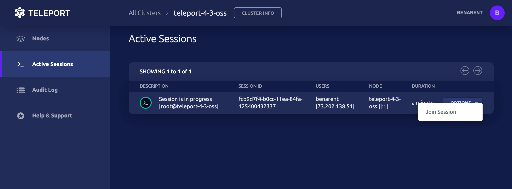

# Teleport Quick Start

This tutorial will guide you through the steps needed to install and run
Teleport on Linux machine(s).

### Prerequisites

* In this tutorial you will start a UI which must be accessible via a
  browser. If you run this tutorial on a remote machine without a GUI, first
  make sure that this machine's IP can be reached over your network and that
  it accepts incoming traffic on port `3080` .

* We recommend that you read the [Architecture Guide](architecture/overview.md)
  before working through this tutorial. If you'd like to dive right in though this is
  the best place to start!

This guide is only meant to demonstrate how to run Teleport in a sandbox or demo
environment, and showcase a few basic tasks you can do with Teleport.

## Step 1: Install Teleport on a Linux Host

There are several ways to install Teleport.
Take a look at the [Teleport Installation](installation.md) page to pick the method convenient for you.


=== "yum repo / Amazon Linux 2"

    ```bash
    yum-config-manager --add-repo https://rpm.releases.teleport.dev/teleport.repo
    yum install teleport

    # Optional: Using Dandified YUM_
    # dnf config-manager --add-repo https://rpm.releases.teleport.dev/teleport.repo
    # dnf install teleport
    ```

=== "ARMv7 (32-bit)"

    ```bash
    curl -O https://get.gravitational.com/teleport-v{{ teleport.version }}-linux-arm-bin.tar.gz
    tar -xzf teleport-v{{ teleport.version }}-linux-arm-bin.tar.gz
    cd teleport
    ./install
    ```

=== "ARM64/ARMv8 (64-bit)"

    ```bash
    curl -O https://get.gravitational.com/teleport-v{{ teleport.version }}-linux-arm64-bin.tar.gz
    tar -xzf teleport-v{{ teleport.version }}-linux-arm64-bin.tar.gz
    cd teleport
    ./install
    ```

=== "Tarball"

    ```bash
    curl -O https://get.gravitational.com/teleport-v{{ teleport.version }}-linux-amd64-bin.tar.gz
    tar -xzf teleport-v{{ teleport.version }}-linux-amd64-bin.tar.gz
    cd teleport
    ./install
    ```

## Step 1b: Configure Teleport

When setting up Teleport, we recommend running it with Teleports YAML configuration file.

```bash
# Concatenate teleport.yaml using a basic demo config.
$ cat > teleport.yaml <<EOF
teleport:
    data_dir: /var/lib/teleport
auth_service:
    enabled: "yes"
    cluster_name: "teleport-quickstart"
    listen_addr: 0.0.0.0:3025
    tokens:
    - proxy,node,app:f7adb7ccdf04037bcd2b52ec6010fd6f0caec94ba190b765
ssh_service:
    enabled: "yes"
    labels:
        env: staging
proxy_service:
    enabled: "yes"
    listen_addr: 0.0.0.0:3023
    web_listen_addr: 0.0.0.0:3080
    tunnel_listen_addr: 0.0.0.0:3024
    https_keypairs:
        - key_file:
        - cert_file:
app_service:
    enabled: "yes"
EOF

# Move teleport.yaml to /etc/teleport.yaml
$  mv teleport.yaml /etc
```


## Step 1c: Setup Domain Name & TLS using Let's Encrypt

Teleport requires a secure public endpoint for the Teleport UI and for end users to connect to.

A domain name, DNS, and TLS are required for Teleport. We'll use Let's Encrypt to obtain a free TLS certificate.

DNS Setup:<br>
For this setup, we'll simply use a `A` or `CNAME` record pointing to the IP/FQDN of the machine with Teleport installed.

TLS Setup:<br>
It's important to provide a secure connection for Teleport. Setting up TLS will secure connections to Teleport.

If you already have TLS certs you can use those certificates, or if using a new domain
we recommend using Certbot; which is free and simple to setup. Follow [certbot instructions](https://certbot.eff.org/) for how to obtain a certificate for your distro.

**Update `teleport.yaml`<br>**
The below command will add the public address of Teleport and will use the TLS
certificate from LetsEncrypt.

Replace `teleport.example.com` with the location of your proxy.

```bash
# Replace `teleport.example.com` with your domain name.
export TELEPORT_PUBLIC_DNS_NAME="teleport.example.com"
cat >> /etc/teleport.yaml <<EOL
  public_addr: $TELEPORT_PUBLIC_DNS_NAME:3080
  https_keypairs:
    - key_file: /etc/letsencrypt/live/$TELEPORT_PUBLIC_DNS_NAME/privkey.pem
    - cert_file: /etc/letsencrypt/live/$TELEPORT_PUBLIC_DNS_NAME/fullchain.pem
EOL
```

Visit: `https://teleport.example.com:3080/`

!!! done
    Teleport is now up and running


## Step 2: Create User & Setup 2FA

Create a new user `graviton`, with the Principles `root, ubuntu`

```
tctl users add gaviton root,ubuntu
```

Teleport will always enforces Two-Factor Authentication and support OTP and Hardware Tokens (U2F).The quickstart has been setup with OTP. For setup you'll need an OTP app.

A selection of Two-Factor Authentication apps are.

 - [Authy](https://authy.com/download/)
 - [Google Authenticator](https://www.google.com/landing/2step/)
 - [Microsoft Authenticator](https://www.microsoft.com/en-us/account/authenticator)

!!! info "OS User Mappings"

    The OS user `teleport` must exist! On Linux, if it
    does not already exist, create it with `adduser teleport`. If you do not have
    the permission to create new users on the VM, run `tctl users add teleport
    <your-username> ` to explicitly map ` teleport` to an existing OS user. If you
    do not map to a real OS user you will get authentication errors later on in
    this tutorial!

## Step 4: Register a User

* If the machine where you ran these commands has a web browser installed, you
should be able to open the URL and connect to Teleport Proxy right away.

* If you are working on a remote machine, you may need to access the Teleport
Proxy via the host machine and port `3080` in a web browser. One simple way to
do this is to temporarily append `[HOST_IP] grav-00` to `/etc/hosts`.

!!! warning "Warning"

    We haven't provisioned any SSL certs for Teleport yet.
    Your browser will throw a warning: **Your connection is not private**. Click
    **Advanced**, and **Proceed to [HOST_IP] (unsafe)** to preview the Teleport UI.

<!-- Link to networking/production guide -->


Teleport enforces two-factor authentication by default <!-- Link to
Configuration -->. If you do not already have [Google
Authenticator](https://en.wikipedia.org/wiki/Google_Authenticator),
[Authy](https://www.authy.com/) or another 2FA client installed, you will need
to install it on your smart phone. Then you can scan the QR code on the
Teleport login web page, pick a password and enter the two-factor token.

After completing registration you will be logged in automatically


## Step 5: Log in through the CLI

Let's login using the `tsh` command line tool. Just as in the previous step, you
will need to be able to resolve the **hostname** of the cluster to a network
accessible IP.

!!! warning "Warning"

    For the purposes of this quickstart we are using the
    `--insecure` flag which allows us to skip configuring the HTTP/TLS
    certificate for Teleport proxy.

    **Caution**: the `--insecure` flag does **not** skip TLS validation for the Auth Server. The self-signed Auth Server certificate expects to be accessed via one of a set of hostnames (ex. `grav-00` ). If you attempt to access via `localhost` you will probably get this error: `principal "localhost" not in the set of valid principals for given certificate` .

    To resolve this error find your hostname with the `hostname` command and use that instead of `localhost` .

    Never use `--insecure` in production unless you terminate SSL at a load balancer. You must configure a HTTP/TLS certificate for the Proxy. [Learn more in our SSL/TLS for Teleport Proxy - Production Guide](production.md#ssltls-for-teleport-proxy)


``` bash
# here grav-00 is a resolvable hostname on the same network
# --proxy can be an IP, hostname, or URL
[teleport@grav-00 ~]$ tsh --proxy=grav-00 --insecure login
WARNING: You are using insecure connection to SSH proxy https://grav-00:3080
Enter password for Teleport user teleport:
Enter your OTP token:
XXXXXX
WARNING: You are using insecure connection to SSH proxy https://grav-00:3080
> Profile URL:  https://grav-00:3080
  Logged in as: teleport
  Cluster:      grav-00
  Roles:        admin*
  Logins:       teleport
  Valid until:  2019-10-05 02:01:36 +0000 UTC [valid for 12h0m0s]
  Extensions:   permit-agent-forwarding, permit-port-forwarding, permit-pty

* RBAC is only available in Teleport Enterprise

  https://gravitational.com/teleport/docs/enterprise
```

## Step 6: Start A Recorded Session

At this point you have authenticated with Teleport Auth and can now start a
recorded SSH session. You logged in as the `teleport` user in the last step so
the `--user` is defaulted to `teleport`.

``` bash
$ tsh ssh --proxy=grav-00 grav-00
$ echo 'howdy'
howdy
# run whatever you want here, this is a regular SSH session.
```

_Note: The `tsh` client always requires the `--proxy` flag_

Your command prompt may not look different, but you are now in a new SSH session
which has been authenticated by Teleport!

Try a few things to get familiar with recorded sessions:



1. Navigate to `https://[HOST]:3080/web/sessions` in your web browser to see the
list of current and past sessions on the cluster. The session you just created
should be listed.

2. After you end a session (type `$ exit` in session), replay it in your browser.
3. Join the session in your web browser.

<!-- TODO e -->

Here we've started two recorded sessions on the node `grav-00` : one via the web
browser and one in the command line. Notice that there are distinct SSH sessions
even though we logged in with the `root` user. In the next step you'll learn how
to join a shared session.

## Step 7: Join a Session on the CLI

One of the most important features of Teleport is the ability to share a session
between users. If you joined your active session in your browser in the previous
step you will see the complete session history of the recorded session in the
web terminal.

Joining a session via a browser is often the easiest way to see what another
user is up to, but if you have access to the proxy server from your local
machine (or any machine) you can also join a session on the CLI.

``` bash
# This is the recorded session you started in Step 6
$ tsh ssh --proxy=grav-00 grav-00
$ echo 'howdy'
howdy
# you might have run more stuff here...
$ teleport status
Cluster Name: grav-00
Host UUID   : a3f67090-99cc-45cf-8f70-478d176b970e
Session ID  : cd908432-950a-4493-a561-9c272b0e0ea6
Session URL : https://grav-00:3080/web/cluster/grav-00/node/a3f67090-99cc-45cf-8f70-478d176b970e/teleport/cd908432-950a-4493-a561-9c272b0e0ea6
```

Copy the Session ID and open a new SSH session.

``` bash
%~$ tsh join -d --proxy grav-00 --insecure
cd908432-950a-4493-a561-9c272b0e0ea6
# you will be asked to re-authenticate your user
$ echo 'howdy'
howdy
# you might have run more stuff here...
$ teleport status
Cluster Name: grav-00
Host UUID   : a3f67090-99cc-45cf-8f70-478d176b970e
Session ID  : cd908432-950a-4493-a561-9c272b0e0ea6
Session URL : https://grav-00:3080/web/cluster/grav-00/node/a3f67090-99cc-45cf-8f70-478d176b970e/teleport/cd908432-950a-4493-a561-9c272b0e0ea6
$ echo "Awesome!"
# check out your shared ssh session between two CLI windows
```

### Add a Node to the Cluster

When you ran Teleport earlier with `teleport configure` it generated a secure
static token for joining nodes to a cluster, this is `auth_token` and the auth
server will be the IP of that box. You can find this via `ifconfig -a`

```bash
$ cat /etc/teleport.yaml
# example output
# teleport:
#   nodename: testnode
#   data_dir: /var/lib/teleport
#   auth_token: 2370c3f1554c8469be14aa40599ee05778d47918e4ea6ce8
#   auth_servers:
#     - 127.0.0.1:3025
```
Armed with these details, we'll bootstrap a new host using

=== "DEB"

    ```bash
    $ curl https://get.gravitational.com/teleport_5.0.0-beta.4_amd64.deb.sha256
    # <checksum> <filename>
    $ curl -O https://get.gravitational.com/teleport_5.0.0-beta.4_amd64.deb
    $ sha256sum teleport_5.0.0-beta.4_amd64.deb
    # Verify that the checksums match
    $ dpkg -i teleport_5.0.0-beta.4_amd64.deb
    $ which teleport
    /usr/local/bin/teleport
    ```

=== "cloud-config"

    ```ini
    #cloud-config

    package_upgrade: true

    write_files:
    - path: /etc/teleport.yaml
        content: |
            teleport:
                auth_token: "f2e75-REPLACE-WITH-YOUR-TOKEN"
                auth_servers:
                    - "46.101-REPLACE-WITH-YOUR_IP:3025"
            auth_service:
                enabled: "false"
            ssh_service:
                enabled: "true"
                labels:
                    host: test-machine
            proxy_service:
                enabled: "false"

    runcmd:
    - 'mkdir -p /run/teleport'
    - 'cd /run/teleport && curl -O https://get.gravitational.com/teleport_5.0.0-beta.4_amd64.deb'
    - 'dpkg -i /run/teleport/teleport_5.0.0-beta.4_amd64.deb'
    - 'systemctl enable teleport.service'
    - 'systemctl start teleport.service'
    ```

## Next Steps

Congratulations! You've completed the Teleport Quickstart.

In this guide you've learned how to install Teleport on a single-node and seen a
few of the most practical features in action. When you're ready to learn how to set
up Teleport for your team, we recommend that you read our [Admin Guide](admin-guide.md)
to get all the important details. This guide will lay out everything you need to
safely run Teleport in production, including SSL certificates, security considerations,
and YAML configuration.

### Guides

If you like to learn by doing, check out our collection of step-by-step guides for
common Teleport tasks.

* [Install Teleport](installation.md)
* [Share Sessions](user-manual.md#sharing-sessions)
* [Manage Users](admin-guide.md#adding-and-deleting-users)
* [Label Nodes](admin-guide.md#labeling-nodes)
* [Teleport with OpenSSH](admin-guide.md#using-teleport-with-openssh)
