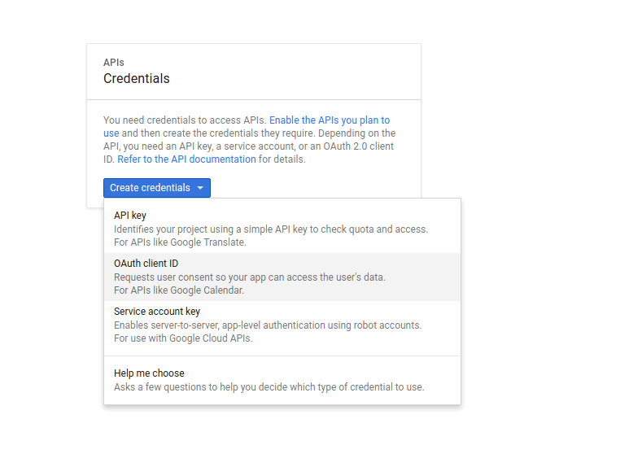
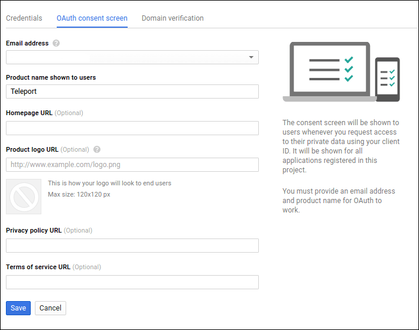
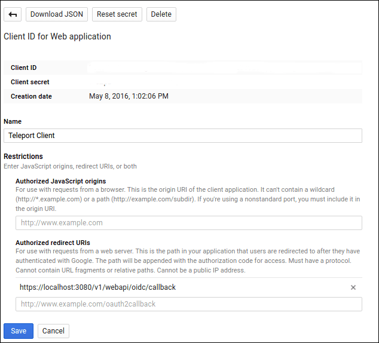
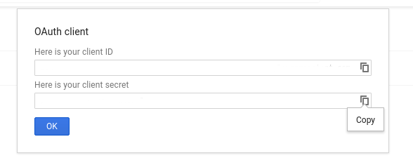

# Admin Manual

This manual covers installation and configuration of Teleport and the ongoing 
management of a Teleport cluster. It assumes that the reader has good understanding 
of Linux administration.
    
## Installation

### Installing from Source

Gravitational Teleport is written in Go language. It requires Golang v1.7 or newer. 
If you have Go already installed, type:

```bash
$ go get github.com/gravitational/teleport
$ cd $GOPATH/src/github.com/gravitational/teleport
$ make
```

### Installing from Binaries

You can download binaries from [Github releases](https://github.com/gravitational/teleport/releases). 

## Nomenclature

Before diving into configuring and running Teleport, it helps to take a look at the [Teleport Architecture](/architecture) 
and go over the key concepts this document will be referring to:

|Concept   | Description
|----------|------------
|Node      | Synonym to "server" or "computer", something one can "SSH to". A node must be running `teleport` daemon running with "node" role/service turned on.
|Certificate Authority (CA) | A pair of public/private keys Teleport uses to manage access. A CA can sign a public key of a user or node establishing their cluster membership.
|Teleport Cluster | A Teleport Auth Service contains two CAs. One is used to sign user keys and the other signs node keys. A collection of nodes connected to the same CA is called a "cluster". 
|Cluster Name | Every Teleport cluster must have a name. If a name is not supplied via `teleport.yaml` configuration file, a GUID will be generated. **IMPORTANT:** renaming a cluster invalidates its keys and all certificates it had created.
|Trusted Cluster | Teleport Auth Service can allow 3rd party users or nodes to connect if their public keys are signed by a trusted CA. A "trusted cluster" is a pair of public keys of the trusted CA. It can be configured via `teleport.yaml` file.

## Running Teleport Servers

The Teleport daemon supports the following commands:

|Command     | Description
|------------|-------------------------------------------------------
|start       | Starts the Teleport daemon.
|configure   | Dumps a sample configuration file in YAML format into standard output.
|version     | Shows the Teleport version.
|status      | Shows the status of a Teleport connection. This command is only available from inside of an active SSH session.
|help        | Shows help.

When experimenting you can quickly start `teleport` with verbose logging by typing 
`teleport start -d`. 

!!! danger "WARNING": 
    Teleport stores data in `/var/lib/teleport`. Make sure that regular users do not 
    have access to this folder on the Auth server.

#### Systemd Unit File

In production, we recommend starting teleport daemon via an 
init system like `systemd`.  Here's the example of a systemd unit file:

```
[Unit]
Description=Teleport SSH Service
After=network.target 

[Service]
Type=simple
Restart=always
ExecStart=/usr/local/bin/teleport start --config=/etc/teleport.yaml

[Install]
WantedBy=multi-user.target
```

#### Ports

Teleport services listen on several ports. This table shows the default port numbers.

|Port      | Service    | Description
|----------|------------|-------------------------------------------
|3022      | Node       | SSH port. This is Teleport's equivalent of port `#22` for SSH.
|3023      | Proxy      | SSH port clients connect to. A proxy will forward this connection to port `#3022` on the destination node.
|3024      | Proxy      | SSH port used to create "reverse SSH tunnels" from behind-firewall environments into a trusted proxy server.
|3025      | Auth       | SSH port used by the Auth Service to serve its API to other nodes in a cluster.
|3080      | Proxy      | HTTPS connection to authenticate `tsh` users and web users into the cluster. The same connection is used to serve a Web UI.


## Configuration

You should use a configuration file to configure the `teleport` daemon. 
But for simpler experimentation you can use command line flags to 
`teleport start` command. To see the list of flags:

```
> teleport start --help
```

Output:

```
usage: teleport start [<flags>]
Flags:
  -d, --debug         Enable verbose logging to stderr
  -r, --roles         Comma-separated list of roles to start with [proxy,node,auth]
      --advertise-ip  IP to advertise to clients if running behind NAT
  -l, --listen-ip     IP address to bind to [0.0.0.0]
      --auth-server   Address of the auth server [127.0.0.1:3025]
      --token         One-time token to register with an auth server [none]
      --nodename      Name of this node, defaults to hostname
  -c, --config        Path to a configuration file [/etc/teleport.yaml]
      --labels        List of labels for this node
```

### Configuration Flags

Let's cover some of these flags in more detail:

* `--roles` flag tells Teleport which services to start. It is a comma-separated
  list of roles. The possible values are `auth`, `node` and `proxy`. The default 
  value is `auth,node,proxy`. These roles are explained in the 
  [Teleport Architecture](architecture.md) document.

* `--advertise-ip` flag can be used when Teleport nodes are running behind NAT and
  their externally routable IP cannot be automatically determined. 
  For example, assume that a host "foo" can be reached via `10.0.0.10` but there is
  no `A` DNS record for "foo", so you cannot connect to it via `tsh ssh foo`. If
  you start teleport on "foo" with `--advertise-ip=10.0.0.10`, it will automatically 
  tell Teleport proxy to use that IP when someone tries to connect
  to "foo". This is also useful when connecting to Teleport nodes using their labels.

* `--nodename` flag lets you assign an alternative name the node which can be used
  by clients to login. By default it's equal to the value returned by `hostname` 
  command.

* `--listen-ip` should be used to tell `teleport` daemon to bind to a specific network
  interface. By default it listens on all.

* `--labels` flag allows to assign a set of labels to a node. See the explanation
  of labeling mechanism in "Labeling Nodes" section below.
  
### Configuration File

Teleport uses YAML file format for configuration. A sample configuration file is shown
below. By default it is stored in `/etc/teleport.yaml`

!!! note "IMPORTANT": 
    When editing YAML configuration, please pay attention to how your editor 
    handles white space. YAML requires consistent handling of tab characters.

```bash
# By default, this file should be stored in /etc/teleport.yaml

# This section of the configuration file applies to all teleport
# services.
teleport:
    # nodename allows to assign an alternative name this node can be reached by.
    # by default it's equal to hostname
    nodename: graviton

    # Data directory where Teleport keeps its data, like keys/users for 
    # authentication (if using the default BoltDB back-end)
    data_dir: /var/lib/teleport

    # one-time invitation token used to join a cluster. it is not used on 
    # subsequent starts
    auth_token: xxxx-token-xxxx

    # when running in multi-homed or NATed environments Teleport nodes need 
    # to know which IP it will be reachable at by other nodes
    advertise_ip: 10.1.0.5

    # list of auth servers in a cluster. you will have more than one auth server
    # if you configure teleport auth to run in HA configuration
    auth_servers: 
        - 10.1.0.5:3025
        - 10.1.0.6:3025

    # Teleport throttles all connections to avoid abuse. These settings allow
    # you to adjust the default limits
    connection_limits:
        max_connections: 1000
        max_users: 250

    # Logging configuration. Possible output values are 'stdout', 'stderr' and 
    # 'syslog'. Possible severity values are INFO, WARN and ERROR (default).
    log:
        output: stderr
        severity: ERROR

    # Type of storage used for keys. You need to configure this to use etcd
    # backend if you want to run Teleport in HA configuration.
    storage:
        type: bolt

# This section configures the 'auth service':
auth_service:
    # Turns 'auth' role on. Default is 'yes'
    enabled: yes

    # IP and the port to bind to. Other Teleport nodes will be connecting to
    # this port (AKA "Auth API" or "Cluster API") to validate client 
    # certificates 
    listen_addr: 0.0.0.0:3025

    # Pre-defined tokens for adding new nodes to a cluster. Each token specifies
    # the role a new node will be allowed to assume. The more secure way to 
    # add nodes is to use `ttl node add --ttl` command to generate auto-expiring 
    # tokens. 
    #
    # We recommend to use tools like `pwgen` to generate sufficiently random
    # tokens of 32+ byte length.
    tokens:
        - "proxy,node:xxxxx"
        - "auth:yyyy"

    # Optional "cluster name" is needed when configuring trust between multiple
    # auth servers. A cluster name is used as part of a signature in certificates
    # generated by this CA.
    # 
    # By default an automatically generated GUID is used.
    #
    # IMPORTANT: if you change cluster_name, it will invalidate all generated 
    # certificates and keys (may need to wipe out /var/lib/teleport directory)
    cluster_name: "main"

    # List (array) of other clusters this CA trusts.
    trusted_clusters:
      - key_file: /path/to/main-cluster.ca
        # Comma-separated list of OS logins allowed to users of this 
        # trusted cluster
        allow_logins: john,root
        # Establishes a reverse SSH tunnel from this cluster to the trusted
        # cluster, allowing the trusted cluster users to access nodes of this 
        # cluster
        tunnel_addr: 80.10.0.12:3024

# This section configures the 'node service':
ssh_service:
    # Turns 'ssh' role on. Default is 'yes'
    enabled: yes

    # IP and the port for SSH service to bind to. 
    listen_addr: 0.0.0.0:3022
    # See explanation of labels in "Labeling Nodes" section below
    labels:
        role: master
        type: postgres
    # List (YAML array) of commands to periodically execute and use
    # their output as labels. 
    # See explanation of how this works in "Labeling Nodes" section below
    commands:
    - name: hostname
      command: [/usr/bin/hostname]
      period: 1m0s
    - name: arch
      command: [/usr/bin/uname, -p]
      period: 1h0m0s

# This section configures the 'proxy servie'
proxy_service:
    # Turns 'proxy' role on. Default is 'yes'
    enabled: yes

    # SSH forwarding/proxy address. Command line (CLI) clients always begin their
    # SSH sessions by connecting to this port
    listen_addr: 0.0.0.0:3023

    # Reverse tunnel listening address. An auth server (CA) can establish an 
    # outbound (from behind the firewall) connection to this address. 
    # This will allow users of the outside CA to connect to behind-the-firewall 
    # nodes.
    tunnel_listen_addr: 0.0.0.0:3024

    # The HTTPS listen address to serve the Web UI and also to authenticate the 
    # command line (CLI) users via password+HOTP
    web_listen_addr: 0.0.0.0:3080

    # TLS certificate for the HTTPS connection. Configuring these properly is 
    # critical for Teleport security.
    https_key_file: /etc/teleport/teleport.key
    https_cert_file: /etc/teleport/teleport.crt
```

## Adding and Deleting Users

A user identity in Teleport exists in the scope of a cluster. The member nodes
of a cluster have multiple OS users on them. A Teleport administrator assigns
allowed logins to every Teleport account, allowing it to login as one of the 
specified OS users.

Let's look at this table:

|Teleport Username | Allowed Logins | Description
|------------------|---------------|-----------------------------
|joe    | joe,root | Teleport user 'joe' can login into member nodes as OS user 'joe' or 'root'
|bob    | bob      | Teleport user 'bob' can login into member nodes only as OS user 'bob'
|ross   |          | If no login is specified, it defaults to the same name as the Teleport user.

To add a new user to Teleport you have to use `tctl` tool on the same node where
the auth server is running, i.e. `teleport` was started with `--roles=auth`. 

```bash
> tctl users add joe joe,root
```

Teleport generates an auto-expiring token (with a TTL of 1 hour) and prints the token 
URL which must be shared with a user beforeo the TTL expires. 

```
Signup token has been created. Share this URL with the user:
https://<proxy>:3080/web/newuser/xxxxxxxxxxxx

NOTE: make sure the <proxy> host is accessible.
```

The user will complete registration by visiting this URL, picking a password and 
configuring the 2nd factor authentication. If the credentials are correct, the auth 
server generates and signs a new certificate and the client stores this key and will use 
it for subsequent logins. The key will automatically expire after 23 hours by default after which 
the user will need to log back in with her credentials. This TTL can be configured to a maximum
of 30 hours and a minimum of 1 minute. Once authenticated, the account will become visible via `tctl`:

```bash
> tctl users ls

User           Allowed to Login as
----           -------------------
admin          admin,root
ross           ross
joe            joe,root 
```

Joe would need to use the `tsh` client tool to login into member node "luna" via 
bastion "work" _as root_:

```bash
> tsh --proxy=work --user=joe root@luna
```

To delete this user:

```bash
> tctl users del joe
```

## Controlling access

At the moment `teleport` does not have a command for modifying an existing user record.
The only way to update allowed logins or reset the user password is to remove the account
and re-create it. 

The user will have to re-initialize Google Authenticator on their phone.

## Adding Nodes to the Cluster

Gravitational Teleport is a "clustered" SSH manager, meaning it only allows SSH
access to nodes that had been previously granted cluster membership. 

A cluster membership means that every node in a cluster has its own host
certificate signed by the cluster's auth server. 

A new Teleport node needs an "invite token" to join a cluster. An invitation token 
also defines which role a new node can assume within a cluster: `auth`, `proxy` or 
`node`. 

There are two ways to create invitation tokens:

* Static Tokens
* Short-lived Tokens

### Static Tokens

You can pick your own tokens and add them to the auth server's config file: 

```bash
# Config section in `/etc/teleport/teleport.yaml` file for the auth server
auth_service:
    enabled: true
    #
    # statically assigned token: obviously we recommend a much harder to guess
    # value than `xxxxx`, consider generating tokens using a tool like pwgen
    #
    tokens:
    - "proxy,node:xxxxxx"
```

Now you can start a new Teleport node by setting its invitation token via `--token`
flag to "xxxxxx". This node will join the cluster as a regular node but also
as a proxy server:

```bash
teleport start --roles=node,auth --token=xxxxx --auth-server=10.0.10.5
```

### Short-lived Tokens

A more secure way to add nodes to a cluster is to generate tokens as they are 
needed. Such token can be used multiple times until its time to live (TTL) 
expires.

Use `tctl` tool to invite a new node into the cluster with `node` and `auth` 
roles:

```bash
tctl nodes --ttl=5m --roles=node,proxy add
```

As new nodes come online, they start sending ping requests every few seconds
to the CA of the cluster. This allows everyone to explore cluster membership
and size:

```bash
> tctl nodes ls

Node Name     Node ID                                  Address            Labels
---------     -------                                  -------            ------
turing        d52527f9-b260-41d0-bb5a-e23b0cfe0f8f     10.1.0.5:3022      distro:ubuntu
dijkstra      c9s93fd9-3333-91d3-9999-c9s93fd98f43     10.1.0.6:3022      distro:debian
```

## Revoking Invitations

As you have seen above, Teleport uses tokens to invite users to a cluster (sign-up tokens) or 
to add new nodes to it (provisioning tokens).

Both types of tokens can be revoked before they can be used. To see a list of outstanding tokens,
run this command:

```bash
> tctl tokens ls

Token                                Role       Expiry Time (UTC)
-----                                ----       -----------------
eoKoh0caiw6weoGupahgh6Wuo7jaTee2     Proxy      never
696c0471453e75882ff70a761c1a8bfa     Node       17 May 16 03:51 UTC
6fc5545ab78c2ea978caabef9dbd08a5     Signup     17 May 16 04:24 UTC
```

In this example, the first token with "never" expiry date is a static token configured via
a config file. It cannot be revoked. 

The 2nd token with "Node" role was generated to invite a new node to this cluster. And the
3rd token was generated to invite a new user.

The latter two tokens can be deleted (revoked) via `tctl tokens del` command:

```bash
> tctl tokens del 696c0471453e75882ff70a761c1a8bfa
Token 696c0471453e75882ff70a761c1a8bfa has been deleted
```

## Labeling Nodes

In addition to specifying a custom nodename, Teleport also allows to apply arbitrary
key:value pairs to each node. They are called labels. There are two kinds of labels:

1. `static labels` never change while the `teleport` process is running. You may want
   to label nodes with their physical location, the Linux distribution, etc.

2. `label commands` or "dynamic labels". Label commands allow you to execute an external
   command on a node at a configurable frequency. The output of that command becomes
   the value of such label. Examples include reporting a kernel version, load averages,
   time after reboot, etc.

Labels can be configured in a configuration file or via `--labels` flag as shown below:

```bash
> teleport start --labels uptime=[1m:"uptime -p"],kernel=[1h:"uname -r"]
```

Obviously the kernel version is not going to change often, so this example runs
`uname` once an hour. When this node starts and reports its labels into the cluster,
users will see:

```bash
> tctl nodes ls

Node Name     Node ID          Address         Labels
---------     -------          -------         ------
turing        d52527f9-b260    10.1.0.5:3022   kernel=3.19.0-56,uptime=up 1 hour, 15 minutes
```

## Trusted Clusters

Teleport allows to partition your infrastructure into multiple clusters. Some clusters can be 
located behind firewalls without any open ports. They can also have their own restrictions on
which users have the access.

As [explained above](#nomenclature), a Teleport Cluster has a name and is managed by a 
`teleport` daemon with "auth service" enabled.

#### How does it work?

Let's assume we need to place some servers behind a firewall and we only want Teleport 
user "john" to have access to them. We already have our primary Teleport cluster and our 
users set up. Say this primary cluster is called `main`, and behind-the-firewall cluster
is called `cluster-b` as shown on this diagram:


This setup works as follows:

0. `cluster-b` and `main` trust each other: they are "trusted clusters".
1. `cluster-b` creates an outbound reverse SSH tunnel to `main` and keeps it open.
2. Users of `main` should use `--cluster=cluster-b` flag of `tsh` tool if they want to connect to any nodes of `cluster-b`.
3. The `main` cluster uses the tunnel to connect back to any node of `cluster-b`.

#### Example Configuration

To add behind-the-firewall machines and restrict access only to "john", we will have to do the following:

1. Add `cluster-b` to the list of trusted clusters of `main`.
2. Add `main` cluster to the list of trusted clusters of `cluster-b`.
3. Tell `cluster-b` to open a reverse tunnel to `main`. 
4. Tell `cluster-b` to only allow user "john" from the `main` cluster.

Let's look into the details of each step. First, let's configure two independent (at first) clusters: 

```
auth_service:
  enabled: yes
  cluster_name: main
```

And our behind-the-firewall cluster:

```
auth_service:
  enabled: yes
  cluster_name: cluster-b
```

Start both servers. At this point they do not know about each other.
Now, export their public CA keys:

On "main":

```
> tctl auth export > main-cluster.ca
```

On "cluster-b":

```
> tctl auth export > b-cluster.ca
```

Update the YAML configuration of both clusters to connect them. On `main`:

```yaml
auth_service:
  enabled: yes
  cluster_name: main
  trusted_clusters:
      - key_file: /path/to/b-cluster.ca
```

... and on `cluster-b`, notice the `tunnel_addr` - that should point to the address of `main` proxy node:

```yaml
auth_service:
  enabled: yes
  cluster_name: cluster-b
  trusted_clusters:
      - key_file: /path/to/main-cluster.ca
        # This line contains comma-separated list of OS logins allowed
        # to users from this trusted cluster
        allow_logins: john
        # This line establishes a reverse SSH tunnel from 
        # cluster-b to main:
        tunnel_addr: 62.28.10.1
```

Now, if you restart `teleport` auth service on both clusters, they should trust each
other. To verify, run this on "cluster-b":

```
> tctl auth ls
CA keys for the local cluster cluster-b:

CA Type     Fingerprint
-------     -----------
user        xxxxxxxxxxxxxxx
host        zzzzzzzzzzzzzzz

CA Keys for Trusted Clusters:

Cluster Name     CA Type     Fingerprint                     Allowed Logins
------------     -------     -----------                     --------------
main             user        zzzzzzzzzzzzzzzzzzzzzzzzzzz     john
main             host        xxxxxxxxxxxxxxxxxxxxxxxxxxx     N/A
```

Notice that each cluster is shown as two CAs: one is used to establish trust between nodes,
and another one is for trusting users. 

Now, John, having direct access to a proxy server of cluster "main" (let's call it main.proxy) can 
use `tsh` command to see which clusters are online:

```
> tsh --proxy=main.proxy clusters
```

John can also list all nodes in the cluster-b:

```
> tsh --proxy=main.proxy --cluster=cluster-b ls
```

Similarly, by passing `--cluster=cluster-b` to `tsh` John can login into cluster-b nodes.

## Using Teleport with OpenSSH

Teleport is a fully standards-compliant SSH proxy and it can work in environments with 
existing SSH implementations, such as OpenSSH. This section will cover:

* Configuring OpenSSH client `ssh` to login into nodes inside a Teleport cluster.
* Configuring OpenSSH server `sshd` to join a Teleport cluster.

### Using OpenSSH Client

It is possible to use OpenSSH client `ssh` to connect to Teleport clusters. A Teleport
proxy works by using the standard SSH proxy subsystem. This section will explain how
to configure OpenSSH client to use it.

First, you need to export the public keys of cluster members. This has to be done 
on a node which runs Teleport auth server and probably must be done by a Teleport 
administrator:

```bash
> tctl auth --type=host export > cluster_node_keys
```

On your client machine, you need to import these keys. It will allow your OpenSSH client
to verify that host's certificates are signed by the trusted CA key:

```bash
> cat cluster_node_keys >> ~/.ssh/known_hosts
```

Configure OpenSSH client to use the Teleport proxy when connecting to nodes with matching
names. Edit `/etc/ssh/ssh_config`:

```
# Tell OpenSSH client to use work.example.com as a jumphost (proxy) when logging
# to any remote node whose name matches the pattern *.work.example.com
# Beware of recursion here (when proxy name matches your pattern)
Host *.work.example.com
  ProxyCommand ssh -p 3023 %r@work.example.com -s proxy:%h:%p
```

Launch `tsh` in the SSH agent mode:

```bash
> tsh --proxy=work.example.com agent
```

`tsh agent` will print environment variables into the console. Configure your system
to evaluate these variables: they tell `ssh` to use `tsh` to authenticate you against
`work.example.com` cluster.

When everything is configured properly, you can use ssh to connect to any node 
behind `work.example.com`:

```bash
> ssh root@database.work.example.com
```

### Integrating with OpenSSH Servers

Existing `sshd` servers can be added to a Teleport cluster. For that to work, you
have to configure `sshd` to trust Teleport CA.

Export the Teleport CA certificate into a file:

```bash
> tctl auth --type=user export > cluster-ca.pub
```

Copy this file to every node running `sshd`, for example into `/etc/ssh/teleport-ca.pub`
Then update the `sshd` configuration, usually `/etc/ssh/sshd_config`:

```
TrustedUserCAKeys /etc/ssh/user-ca.pub
```

### Integrating with Ansible

Ansible is using OpenSSH client by default, this makes it compatible with Teleport without any extra work except
configuring OpenSSH client to work with Teleport Proxy:

* configure your OpenSSH to connect to Teleport proxy and user `tsh agent` socket
* enable scp mode in the Ansible config file (default is `/etc/ansible/ansible.cfg`):
 
```bash
scp_if_ssh = True
```

## OpenID / OAuth2

Teleport supports [OpenID Connect](http://openid.net/connect/) (also known as `OIDC`) to 
provide external authentication using OpenID providers like Google Apps.

### Using OpenID Connect / OAuth2 with Google Apps

First, you must configure OpenID Connect credentials via Google's Developers Center. Please refer 
to [this guide](https://developers.google.com/identity/protocols/OpenIDConnect) to configure an 
OIDC integration with applications like Teleport. 

* Create Teleport Project that will identify your installation:



* Set up consent screen:



* Create "Web application" client ID:



* Get OAuth 2.0 client credentials:



* Add OIDC connector to teleport config:

```
auth_service:
  enabled: true
  cluster_name: magadan
  oidc_connectors:    
    - id: google
      redirect_url: https://localhost:3080/v1/webapi/oidc/callback
      client_id: id-from-google.apps.googleusercontent.com
      client_secret: secret-key-from-google
      issuer_url: https://accounts.google.com
```

Now you should be able to create Teleport users whose identity is managed by Google.
Assuming your company domain is `example.com` and it's hosted on Google Apps, let's
create a new Teleport user "sasha" with an email address `sasha@example.com` and allow
him to login as `root` to Teleport nodes:

```
tctl users add sasha root,sasha --identity google:sasha@example.com
```

### Logging in via OpenID Connect

#### Web UI

Now, if everything is set up correctly, you will see "Login with Google" button on the login screen:


#### CLI

You have to tell `tsh` to authenticate via Google by providing an `--auth` flag: 

```
tsh --proxy <proxy-addr> ssh --auth=google <server-addr>
```

You should get a browser open a login window for you, where you will have to enter
your Google credentials. Teleport will keep you logged in for the next 23 hours.

!!! tip "Other Providers?": 
    We have already received the requests to add support for other OpenID/OAuth2 providers 
    like Github. Teleport is an open source project and adding providers is not hard, your 
    contributions are welcome, just search the code for OIDC! :-)

## FIDO U2F

Teleport supports [FIDO U2F](https://www.yubico.com/about/background/fido/) 
hardware keys as a second authentication factor.

To start using U2F:

* Purchase a U2F hardware key: looks like a tiny USB drive.
* Enable U2F in Teleport configuration.
* Use `--u2f` CLI flag when connecting via `tsh ssh`.
* For CLI-based logins you have to install [u2f-host](https://developers.yubico.com/libu2f-host/) utility. 
* For web-based logins you have to use Google Chrome, as the only browser supporting U2F at this moment.

Lets look into each of these steps in detail.

### Getting U2F Keys

Visit [this page](https://www.yubico.com/about/background/fido/) to order
a physical U2F keys for Teleport users in your organization.

### Enabling U2F

By default U2F is disabled. To enable U2F, add the following to the auth 
service configuration in `teleport.yaml`:

```bash
auth_service:
  u2f:
    # Must be set to 'yes' to enable and 'no' to disable:
    enabled: yes

    # Only matters when multiple proxy servers are used:
    app_id: https://mycorp.com/appid.js

    # U2F facets must be set to Teleport proxy servers:
    facets:
    - https://proxy1.mycorp.com:3080
    - https://proxy2.mycorp.com:3080
```

If your Teleport is deployed with the same `teleport` process running as a proxy
and as an auth server, you can omit `app_id` and `facets` settings.

`app_id` should be the U2F App ID of your cluster. 
`app_id` defaults to the auth server's hostname if not set.

If your Teleport deployment includes multiple Teleport proxy servers, you 
must list them all in the `facets` section. If the TCP port of a facet/proxy
is not specified, the default Teleport proxy port (3080) will be used.

For single-proxy setups, the App ID can be equal to the domain name of the
proxy, but this will prevent you from adding more proxies without changing the
App ID.  For multi-proxy setups, the App ID should be an HTTPS URL pointing to
a JSON file that mirrors `facets` in the auth config.

The JSON file should be hosted on a domain you control and it should be accessible anonymously.
See the [official U2F specification](https://fidoalliance.org/specs/fido-u2f-v1.0-ps-20141009/fido-appid-and-facets-ps-20141009.html#processing-rules-for-appid-and-facetid-assertions)
for the exact format of the JSON file.

!!! warning "Warning": 
    The App ID must never change in the lifetime of the cluster. If the App ID
    changes, all existing U2F key registrations will become invalid and all users
    who use U2F as the second factor will need to re-register.

    When adding a new proxy server, make sure to add it to the list of "facets" 
    in the configuration file, but also to the JSON file referenced by `app_id`

### Logging in with U2F

For logging in via the CLI, you must first install [u2f-host](https://developers.yubico.com/libu2f-host/) tool: 

```bash
# OSX:
$ brew install libu2f-host

# Ubuntu 16.04 LTS:
$ apt-get install u2f-host
```

Then invoke `tsh ssh` to authenticate using U2F with the `--u2f` switch:

```
tsh --proxy <proxy-addr> ssh --u2f <hostname>
```

## High Availability and Clustering
 
Teleport can use [etcd](https://coreos.com/etcd/) as a storage backend to
achieve highly available deployments.  Obviously, you must take steps to
protect access to `etcd` in this configuration, because that is where Teleport
secrets like keys and user records will be stored.

To configure Teleport for using etcd backend:

* Install etcd and configure peer and client TLS authentication using
   [etcd security guide](https://coreos.com/etcd/docs/latest/security.html).

* Configure Teleport `auth` server to use etcd in the "storage" section of
  the config file:

```yaml
teleport:
    storage:
        type: etcd
        # still need data dir for local storage purposes
        data_dir: /var/lib/teleport
        # list of etcd peers to connect to
        peers:
        - https://172.17.0.1:4001
        # required path to TLS client certificate file to connect to etcd
        tls_cert_file: /var/lib/teleport/etcd-cert.pem
        # required path to TLS private key file to connect to etc
        tls_key_file: /var/lib/teleport/etcd-key.pem
        # optional file with trusted CA authority
        # file to authenticate etcd nodes
        tls_ca_file: /var/lib/teleport/etcd-ca.pem
        # etcd key (location) where teleport will be storing its state under:
        prefix: teleport
```

* Deploy several Auth servers connected to etcd backend.
* Deploy several Proxy nodes that have `auth_servers` pointed to list of Auth servers to connect.

!!! tip "NOTE": 
    As new Auth servers will be added to the cluster and old servers will be decommissioned, node's and proxies will refresh the list of available auth servers refresh the cluster info and store the updated list locally in `/var/lib/teleport/authservers.json`. The values from this file, if present, will take precedence over configuration file's values. You can simply remove the file so that the configuration file's values can take effect again.


### DynamoDB back-end

Teleport also supports community-supplied DynamoDB support for storing secrets.
You need to compile Teleport with DynamoDB build tags. 
See [DynamoDB plugin](https://github.com/gravitational/teleport/blob/master/lib/backend/dynamo/README.md) 
documentation for more details.

## Troubleshooting

To diagnose problems you can configure `teleport` to run with verbose logging enabled.

!!! tip "NOTE": 
    It is not recommended to run Teleport in production with verbose logging
    as it generates substantial amount of data.

Sometimes you may want to reset `teleport` to a clean state. This can be accomplished
by erasing everything under `"data_dir"` directory. Assuming the default location, 
`rm -rf /var/lib/teleport/*` will do.

## Getting Help

Please open an [issue on Github](https://github.com/gravitational/teleport/issues).
Alternatively, you can reach through the contact form on our [website](https://gravitational.com/).

For commercial support, custom features or to try our multi-cluster edition of Teleport,
please reach out to us: `sales@gravitational.com`. 
