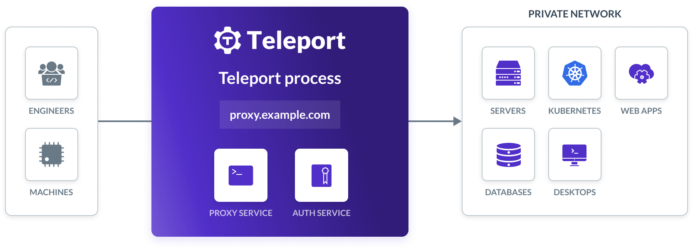

# Teleport to Mintlify Migration Guide


The current directory contains instructions and automation on how to migrate the current Teleport documentation setup into a [Mintlify](https://mintlify.com)-supported configuration.

This guide will cover three parts:

[Page syntax migration](#page-syntax-migration)

[Configuration migration](#configuration-migration)

[Migration script](#migration-script)

## Page syntax migration

The majority of the syntax is identical as both Teleport's current docs and Mintlify's syntax follow common Markdown standards, there's a small handful of differences that need to be changed, particularly with component names that are required for the migration.

### Images

Either remove the Figure components or use the default image tag ([learn more](https://mintlify.com/docs/content/image-embeds)).

**Current**

```mdx
<Figure width="700">
  
</Figure>
```

**Mintlify**

```mdx


or


```

### Links

Remove leading periods to the destination path.

**Current**

```mdx
You can also get started right away with a production-ready Teleport cluster by signing up for a [free trial of Teleport Team](./choose-an-edition/teleport-team.mdx).
```

**Mintlify**

```mdx
You can also get started right away with a production-ready Teleport cluster by signing up for a [free trial of Teleport Team](/choose-an-edition/teleport-team.mdx).
```

### Tabs

Rename `TabItem` to `Tab` and the property `label` to `title`. ([learn more](https://mintlify.com/docs/content/components/tabs))

**Current**

```mdx
<Tabs>
  <TabItem label="Public internet deployment with Let's Encrypt">
    Let's Encrypt verifies that you control the domain name of your Teleport cluster by communicating with the HTTPS server listening on port 443 of your Teleport Proxy Service.
  </TabItem>
  <TabItem label="Private network deployment">
    On your Teleport host, place a valid private key and a certificate chain in `/var/lib/teleport/privkey.pem`
    and `/var/lib/teleport/fullchain.pem` respectively.
    ```
  </TabItem>
</Tabs>
```

**Mintlify**

```mdx
<Tabs>
  <Tab title="Public internet deployment with Let's Encrypt">
    Let's Encrypt verifies that you control the domain name of your Teleport cluster by communicating with the HTTPS server listening on port 443 of your Teleport Proxy Service.
  </Tab>
  <Tab title="Private network deployment">
    On your Teleport host, place a valid private key and a certificate chain in `/var/lib/teleport/privkey.pem` and `/var/lib/teleport/fullchain.pem` respectively.
  </Tab>
</Tabs>
```

### Snippets

Mintlify uses the standard import syntax.

**Current**

```mdx
(!docs/pages/includes/tls-certificate-setup.mdx!)
```

**Mintlify**

```mdx
import TLSCertificateSetup from '/snippets/includes/tls-certificate-setup.mdx'

...

<TLSCertificateSetup />
```

### Variables

Variables are currently set in config.json and referenced within the page. Mintlify uses exports, similar to snippets.

**Current**

In config.json

```json
"clusterDefaults": {
  "clusterName": "teleport.example.com",
  "username": "myuser",
  "nodeIP": "ip-172-31-35-170"
},
```

In a page

```mdx
(=clusterDefaults.clusterName=)
```

**Mintlify**

In a snippet file

```mdx
export const clusterDefaults = {
  "clusterName": "teleport.example.com",
  "username": "myuser",
  "nodeIP": "ip-172-31-35-170"
}
```

In a page

```mdx
import { clusterDefaults } from '/snippets/variables.mdx'

...

{clusterDefaults.clusterName}
```

### Admonition

Mintlify refers to `Admonitions` as `Callouts`, where different callouts share different component names. ([learn more](https://mintlify.com/docs/content/components/callouts))

**Current**

```mdx
<Admonition
  type="tip"
>
  The users that you specify in the `logins` flag (e.g., `root`, `ubuntu` and `ec2-user` in our examples) must exist on your Linux host. Otherwise, you will get authentication errors later in this tutorial.
</Admonition>
```

**Mintlify**

```mdx
<Tip>
  The users that you specify in the `logins` flag (e.g., `root`, `ubuntu` and `ec2-user` in our examples) must exist on your Linux host. Otherwise, you will get authentication errors later in this tutorial.
</Tip>
```

The conversions for all admonitions are

| Admonition type  | Callout component name |
| ---------------- | ---------------------- |
| `type="tip"`     | `<Tip>`                |
| `type="note"`    | `<Note>`               |
| `type="warning"` | `<Warning>`            |

### Details

Details are referred to as Accordions ([learn more](https://mintlify.com/docs/content/components/accordion)).

**Current**

```mdx
<Details title="Logging in via the CLI">
  In addition to Teleport's Web UI, you can access resources in your infrastructure via the `tsh` client tool.
</Details>
```

**Mintlify**

```mdx
<Accordion title="Logging in via the CLI">
  In addition to Teleport's Web UI, you can access resources in your infrastructure via the `tsh` client tool.
</Accordion>
```

Mintlify also supports a variety of other components that are not implemented with the current documentation. You can learn more about them [here](https://mintlify.com/docs/content/page).

## Configuration migration

Mintlify uses a global `mint.json` to define. You can learn more about the configurations and customizations in [our documentation](https://mintlify.com/docs/settings/global).

**Note**: The migration script (read more below) can pick up and convert `navigation` and `redirects` from `config.json` into `mint.json`, as it only has a few small differences in naming conventions. Other theme and branding configurations are also pre-generated from the custom showcase at [teleport.mintlify.app](https://teleport.mintlify.app).

## Migration script

The migration script is a Node function that converts MDX pages from the current documentation syntax into the Mintlify syntax.

### How to use

Run the following command at the root of this directory:

```js
node migrate.js
```

You'll see that all pages within `/pages` have been migrated into the Mintlify syntax inside the `output` and a new `mint.json` has been created in the `/config` directory.

### Important

The migration script is built to cover the major syntax and configuration across all files, covering about 90% of the migration. The remaining parts of the migration are more nuanced and left to the discretion of the docs team.

There are a few notable things to mention while using the migration script

- Snippets and variables have empty migration functions in `utility.js`. We're leaving it up to the Teleport team to decide whether or not you wish to migrate using a script or not. We think it would be best to name the snippets and variables properly (which isn't currently encompassed beyond just the filename).
- There are likely components and configuration differences that we didn't catch. If they come up and the team needs assistance with identifying the Mintlify equivalent, please reach out to us.

## Need help?

Please contact the Mintlify support team at support@mintlify.com or the shared Slack connect channel for any questions.