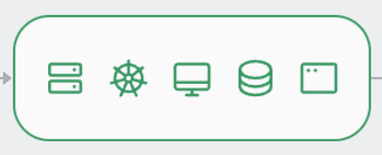
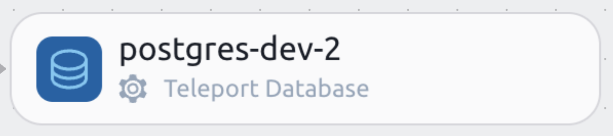
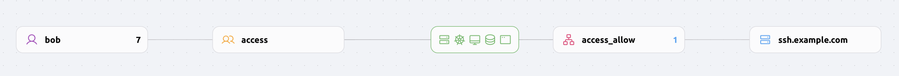
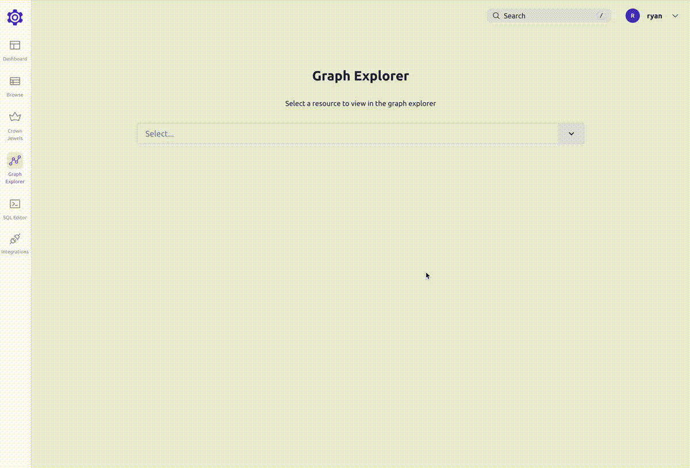

<Admonition type="tip" title="Preview">
  Teleport Access Graph is currently in Preview.
</Admonition>

Teleport Access Graph visualizes and helps you understand access to your
infrastructure. It provides a visual representation of the relationships between
users, roles, and resources in your organization. It can help you answer
questions like:

- What resources can a specific user access?
- What users can access a specific resource?
- What are the relationships between users, roles, and resources?

Teleport Access Graph is a feature of the [Teleport
Policy](https://goteleport.com/platform/policy/) product that is only available
to Teleport Enterprise customers.

After logging into the Teleport UI, go to the Management tab. If enabled, Access Graph options can be found
under the Permission Management section.

## Graph nodes

Teleport Access Graph divides your infrastructure into eight main components:

1. Users

Users are the people who access your infrastructure. They can be employees,
contractors, or bots.

2. User Groups

User Groups are collections of users. They can be used to organize users
based on their role or team.

3. Temporary user groups

Temporary User Groups are created when a user is granted temporary access to a
resource. They are automatically deleted when the user's access expires.

4. Actions

Actions are the things that users can or cannot do. Actions are related to
resources. For example, a user can SSH into a node.

5. Deny Actions

Deny Actions are the things that users cannot do. Deny Actions are related to
resources. For example, a user cannot SSH into a node.

6. Temporary Actions

Temporary Actions are created when a user is granted temporary access to a
resource. They are automatically deleted when the user's access expires.

7. Resource Groups

Resource Groups are collections of resources. They can be used to organize
resources based on their role or team.

8. Resources

Resources are the things that users can or cannot access. They can be
servers, databases, or Kubernetes clusters.

## Searching

To search for a graph node, either click the search button in the sidebar on the left,
or press the `s` key.

You can then search through all node types. If you select a result using your keyboard
arrow keys, you can press either `Tab` to add the node to the graph, or `Enter` to replace
the graph with just the individual node.

## Changing what is visible

By default, Teleport Access Graph shows all types of nodes and paths. You can see what
node types are visible by looking at the sidebar on the left.

### Showing/removing individual graph nodes

To show or remove an individual graph node, open up the node type in the sidebar and
click on the node you want to show or remove.

Clicking on the node name will toggle the visibility of that node.

Clicking on the checkbox will select only that node.

### Adding/removing graph node types

To add a graph node type that isn't in the view, select it from the list of available
node types.

To remove the graph node type, expand the node type in the sidebar and click on the
remove button.

### Expanding/collapsing graph nodes

If a graph node has connections to other nodes, it can be expanded to show those
connections. To expand a node, hover over the edge of the node. If there are
connections in that direction, the edge will turn blue. Clicking on the edge
will expand the node.

You can keep expanding graph nodes until you reach the end of the path.

To collapse a graph node, click on the edge that was used to expand it.

## Graph paths

Teleport Access Graph shows the relationships between users, roles, and
resources. It does this by showing paths between nodes. Paths are the
relationships between nodes. Paths always connect nodes in the following order:

1. Users
1. User Groups
1. Actions
1. Resource Groups
1. Resources

Paths can be divided into two categories:

1. Allow paths

Allow paths connect users to resources. They show what a user can access
and what actions they can perform.

2. Deny paths

Deny paths connect users to resources. They show what a user cannot access
and what actions they cannot perform. Deny paths take precedence over allow
paths.

## How to use it

Teleport Access Graph can help you to answer questions like:

- Who can access a specific resource?

- What resources can a specific user access?

## How Teleport resources are represented

Teleport Access Graph imports all Teleport resources and keeps them up to date, so every time you make a change
to your Teleport resources, the Access Graph will reflect those changes.

### Users

Users are created from Teleport Users.
Local users are imported as soon as they are created.
External users (created from authentication connectors for GitHub, SAML, etc.) are imported when they log in for the first time.

### User Groups

User Groups are created from Teleport Roles and access requests. Roles create User Groups where the members
are the users that have that role. Access requests create a temporary User Group where the members are the users that
got the access through the accepted access request.

### Actions

Actions are created from Teleport roles. Actions can be divided into three
categories:

1. Allow Actions

Allow Actions are created from Teleport roles. Allow Actions are the things
that users can do. For example, a user can SSH into a node.

2. Deny Actions

Deny Actions are created from Teleport roles. Deny Actions are the things
that users cannot do. For example, a user cannot SSH into a node. Deny
Actions take precedence over Allow Actions.

3. Temporary Actions

Temporary Actions are created when a user is granted temporary access to a
resource. They are automatically deleted when the user's access expires.

#### Resource Groups

Resource Groups are created from Teleport roles.

#### Resources

Resources are created from Teleport resources like nodes, databases, and
Kubernetes clusters.
