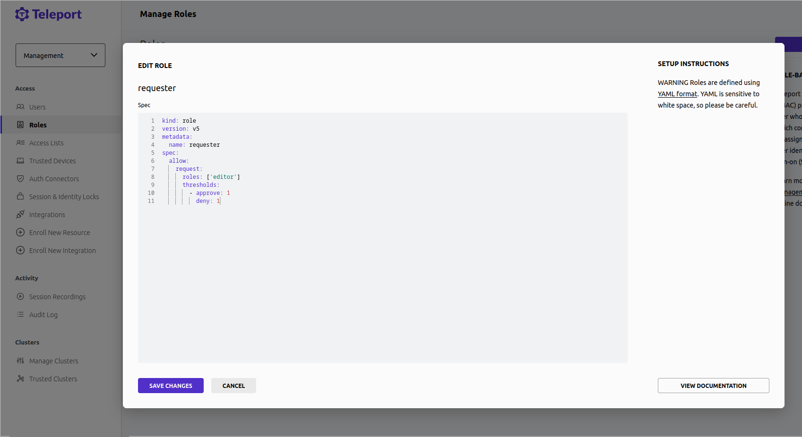
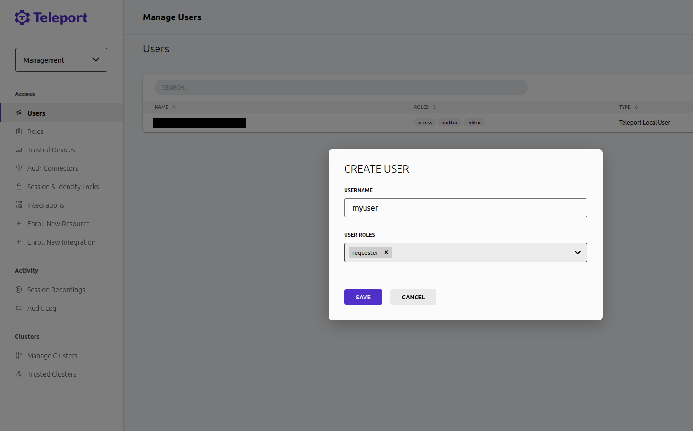

With Teleport's ServiceNow integration, engineers can access the infrastructure
they need to resolve incidents quickly, without longstanding admin permissions
that can become a vector for attacks.

Teleport's ServiceNow integration allows you to treat Teleport Role Access
Requests as ServiceNow incidents, notify the appropriate on-call team, and
approve or deny the requests via Teleport.

This guide will explain how to set up Teleport's Access Request plugin for
ServiceNow.

## Prerequisites

(!docs/pages/includes/commercial-prereqs-tabs.mdx!)

- An ServiceNow account with access to read and write to and from the 'incident' table.
- The ServiceNow integration is currently only available in Teleport Cloud.
- (!docs/pages/includes/tctl.mdx!)

## Step 1/5. Create services

We will configure the ServiceNow plugin to create an incident when
certain users create an Access Request.

## Step 2/5. Define RBAC resources

The Teleport ServiceNow plugin works by receiving Access Request events from the
Teleport Auth Service and, based on these events, interacting with the ServiceNow
API.

### Create a requester role

To create a user first navigate to Management -> Access -> Roles

Then select 'Create New Role' and create the requester role.



```
kind: role
version: v5
metadata:
  name: requester
spec:
  allow:
    request:
      roles: ['editor']
      thresholds:
        - approve: 1
          deny: 1
```

### Create a user who will request access

Create a user called `myuser` who has the `requester` role. Later in this
guide, you will create an Access Request as this user to test the ServiceNow
plugin:

To create a user first navigate to Management -> Access -> Users


Then select 'Create New User' and create a user with the requester role.



## Step 3/5. Set up an ServiceNow roles for the ServiceNow user

TODO: Add instructions for which roles are needed

## Step 4/5. Configure the ServiceNow plugin

At this point, you have a ServiceNow user that the ServiceNow plugin will use
to connect to the ServiceNow API. To configure the plugin to use this user navigate
to Management -> Integrations -> Enroll New Integration.


## Step 5/5. Test the ServiceNow plugin

### Create an Access Request

As the Teleport user `myuser`, create an Access Request for the `editor` role:

(!docs/pages/includes/plugins/create-request.mdx!)

In ServiceNow, you will see a new incident containing information about the
Access Request.

### Resolve the request

(!docs/pages/includes/plugins/resolve-request.mdx!)

<Admonition title="Auditing Access Requests">

When the ServiceNow plugin sends a notification, anyone who receives the
notification can follow the enclosed link to an Access Request URL. While users
must be authorized via their Teleport roles to review Access Request, you
should still check the Teleport audit log to ensure that the right users are
reviewing the right requests.

When auditing Access Request reviews, check for events with the type `Access
Request Reviewed` in the Teleport Web UI.

</Admonition>
