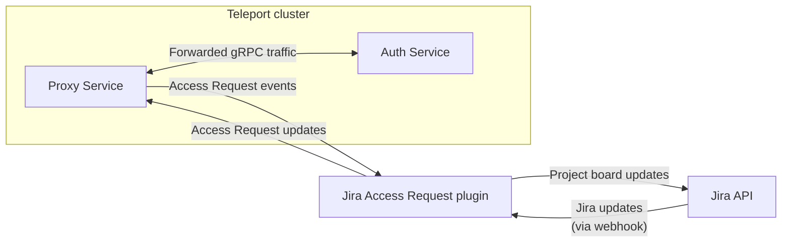

This guide explains how to set up the Teleport Access Request plugin for Jira.
Teleport's Jira integration allows you to manage Teleport Access Requests as
Jira issues.

The Teleport Jira plugin synchronizes a Jira project board with the Access
Requests processed by your Teleport cluster. When you change the status of an
Access Request within Teleport, the plugin updates the board. And when you
update the status of an Access Request on the board, the plugin notifies a Jira
webhook run by the plugin, which modifies the Access Request in Teleport.



## Prerequisites

(!docs/pages/includes/commercial-prereqs-tabs.mdx!)

- A Jira account with permissions to create applications and webhooks.

- A registered domain name for the Jira webhook. Jira notifies the webhook of
  changes in your project board.

- An environment where you will run the Jira plugin. This is either:

  - A Linux virtual machine with ports `80` and `8081` open, plus a means of
    accessing the host (e.g., OpenSSH with an SSH port exposed to your
    workstation). 
  - A Kubernetes cluster deployed via a cloud provider. This guide shows you how
    to allow traffic to the Jira plugin via a `LoadBalancer` service, so your
    environment must support services of this type.

- (!docs/pages/includes/tctl.mdx!)

## Step 1/8. Define RBAC resources

### Enable Role Access Requests

Before you set up the Jira plugin, you need to enable Role Access Requests in
your Teleport cluster.

(!docs/pages/includes/plugins/editor-request-rbac.mdx!)

### Create a user and role for the plugin

(!docs/pages/includes/plugins/rbac-update.mdx!)

## Step 2/8. Install the Teleport Jira plugin

Install the Teleport Jira plugin following the instructions below, which depend
on whether you are deploying the plugin on a host (e.g., an EC2 instance) or a
Kubernetes cluster.

The Teleport Jira plugin must run on a host or Kubernetes cluster that can
access both Jira and your Teleport Proxy Service (or Teleport Enterprise Cloud
tenant).

(!docs/pages/includes/plugins/install-access-request.mdx name="jira"!)

## Step 3/8. Set up HTTPS for the plugin

The Jira Access Request plugin serves a webhook that Jira notifies when there
are any changes in your project board (e.g., a user moves a task from one column
to another).

Jira requires webhooks to use HTTPS, which prevents third parties from
intercepting data about your Jira project and Teleport cluster. In this section,
we will show you how to set up your environment to retrieve TLS credentials for
the Jira webhook using Let's Encrypt.

<Notice type="warning">

The instructions in this section are intended only to illustrate how the Jira
plugin uses TLS credentials. Your organization probably has its own system for
managing TLS credentials, and that is the system you should use in production.

</Notice>

<Tabs>
<TabItem label="Executable">

### Create a DNS record for the webhook

Jira requires to access your webhook over the public internet, so you will need
to assign a domain name to your webhook. Create a DNS `A` record that associates
your domain name with the IP address of your Jira webhook.

### Install Caddy

Use Caddy to run a webserver to communicate with Let's Encrypt and manage TLS
credentials. Caddy is an open source webserver with automatic HTTPS provisioning
functionality. We use it to provide a TLS key and certificate to the Jira
plugin.

Install Caddy on the host where you will run the plugin. For example, run the
following commands on Debian or Ubuntu hosts:

```code
$ sudo apt install -y debian-keyring debian-archive-keyring apt-transport-https
$ curl -1sLf 'https://dl.cloudsmith.io/public/caddy/stable/gpg.key' | sudo gpg --dearmor -o /usr/share/keyrings/caddy-stable-archive-keyring.gpg
$ curl -1sLf 'https://dl.cloudsmith.io/public/caddy/stable/debian.deb.txt' | sudo tee /etc/apt/sources.list.d/caddy-stable.list
$ sudo apt update
$ sudo apt install caddy
```

For other systems, follow the instructions for your system in Caddy's [installation
guide](https://caddyserver.com/docs/install).

### Configure Caddy

On the host where you will run the plugin, create a directory called
`/var/teleport-jira/tls`, which is where we will configure Caddy to store TLS
credentials, and assign ownership of the `tls` directory to Caddy:

```code
$ sudo mkdir -p /var/teleport-jira/tls
$ sudo chown caddy /var/teleport-jira/tls
```

Replace `/etc/caddy/Caddyfile` with the following content, which configures
Caddy to fetch TLS credentials for your Jira webhook's domain name. Replace
`example.com` with the domain name you created earlier:

```text
{
  storage file_system /var/teleport-jira/tls
}

https://example.com
```

<Notice type="warning">

The address you include in your `Caddyfile` must use the `https://` scheme for
Caddy to fetch TLS credentials.

</Notice>

### Restart Caddy

If you installed Caddy using a package manager earlier, it will already be
running. Restart Caddy with the following command:

```code
$ sudo systemctl restart caddy
```

<Details title="Did Caddy fail to start?">

If your system does not use `systemd` to manage services, run the following
command to start Caddy as a daemon:

```code
$ sudo caddy run --config /etc/caddy/Caddyfile
```

</Details>

Caddy fetches credentials from Let's Encrypt automatically and places them in
`/var/teleport-jira/tls`. After a minute or so, your Caddy logs should be
similar to the following:

```code
$ sudo journalctl -u caddy | grep "success"
Aug 26 17:04:27 ip-000-000-000-000 caddy[17719]:
{"level":"info","ts":1661533467.3145745,"logger":"tls.issuance.acme.acme_client","msg":"successfully
downloaded available certificate
chains","count":2,"first_url":"https://acme-v02.api.letsencrypt.org/acme/cert/000000000000000000000000000000000000"}
Aug 26 17:04:27 ip-000-000-000-000 caddy[17719]:
{"level":"info","ts":1661533467.3151438,"logger":"tls.obtain","msg":"certificate
obtained successfully","identifier":"example.com"}
```

If you don't see these logs, try viewing all logs for the `caddy` service:

```code
$ sudo journalctl -u caddy
```

If Let's Encrypt cannot reach the Teleport Jira plugin on port `80`, you will
see error messages in the logs.

Find your credentials, replacing <Var name="example.com" /> with the domain name
you are using for the Jira webhook:

```code
$ sudo find /var/teleport-jira/tls/certificates/acme-v02.api.letsencrypt.org-directory/<Var name="example.com" /> -name "*.crt" -or -name "*.key"
/var/teleport-jira/tls/certificates/acme-v02.api.letsencrypt.org-directory/example.com/example.com.crt
/var/teleport-jira/tls/certificates/acme-v02.api.letsencrypt.org-directory/example.com/example.com.key
```
</TabItem>
<TabItem label="Helm Chart">

### Install cert-manager

In this section, we will show you how to use cert-manager to communicate with
Let's Encrypt and generate a Kubernetes secret containing TLS credentials that
the plugin can use to configure HTTPS.

If you do not have cert-manager already configured in the Kubernetes cluster
where you are installing Teleport, add the Jetstack Helm chart repository, which
hosts the cert-manager chart, and install the chart:

```code
$ helm repo add jetstack https://charts.jetstack.io
$ helm repo update
$ helm install cert-manager jetstack/cert-manager \
--create-namespace \
--namespace teleport \
--set installCRDs=true
```

### Install the NGINX ingress controller

Install the NGINX ingress controller. Later in this guide, you will create an
ingress that cert-manager will use to expose a web server to Let's Encrypt. The
Jira plugin will use this ingress to direct traffic to the Jira webhook:

```code
$ helm upgrade --install ingress-nginx ingress-nginx \
--repo https://kubernetes.github.io/ingress-nginx \
--set controller.extraArgs.enable-ssl-passthrough=true \
--namespace teleport
```

This command adds the `enable-ssl-passthrough` flag to the command that starts
the NGINX ingress controller. This flag enables TLS passthrough, configuring the
ingress controller to forward HTTPS traffic to the Teleport Jira plugin.
Otherwise, we would need to configure a separate TLS connection between the
NGINX ingress controller and the Teleport Jira plugin.

### Create an ingress

Apply an Ingress resource to direct HTTP(S) traffic from outside your Kubernetes
cluster to the Jira webhook. Create a file called `ingress.yaml` with the
following content:

```yaml
apiVersion: networking.k8s.io/v1
kind: Ingress
metadata:
  name: teleport-plugin-jira-ingress
  namespace: teleport
  annotations:
    nginx.ingress.kubernetes.io/backend-protocol: "HTTPS"
    nginx.ingress.kubernetes.io/ssl-passthrough: "true"
    nginx.ingress.kubernetes.io/ssl-redirect: "true"
spec:
  ingressClassName: nginx
  rules:
  - host: teleport-jira.example.com       # Change this 
    http:
      paths:
      - path: /
        pathType: Prefix
        backend:
          service:
            name: teleport-plugin-jira
            port:
              number: 443
```

This Ingress resource directs traffic to the NGINX ingress controller to the
root path of the Jira webhook's URL on port `443`. The annotations instruct the
NGINX ingress controller to configure TLS passthrough for the Jira webhook. Note
that we have not deployed the webhook yet, so the Kubernetes Service named
`teleport-plugin-jira` does not yet exist.

Replace `teleport-jira.example.com` with the address of your Jira webhook.

Apply the Ingress resource:

```code
$ kubectl apply -f ingress.yaml
```

### Create an issuer

Create an Issuer resource that configures `cert-manager` to fetch TLS
credentials from Let's Encrypt. 

Add the following content to a file called `issuer.yaml`:

```yaml
apiVersion: cert-manager.io/v1
kind: Issuer
metadata:
  name: teleport-plugin-jira-tls
  namespace: teleport
spec:
  acme:
    email: email@address.com                                # Change this
    server: https://acme-v02.api.letsencrypt.org/directory
    privateKeySecretRef:
      name: teleport-plugin-jira-acme
    solvers:
    - http01:
        ingress:
          name: teleport-plugin-jira-ingress
```

This Issuer modifies the Ingress you created earlier so cert-manager can use it
to prove control over your domain name and retrieve TLS credentials for the Jira
webhook.

Replace `email@address.com` with an email address you will use to receive Let's
Encrypt notifications.

After you have created the Issuer and updated the values, add it to your
cluster using `kubectl`:

```code
$ kubectl apply -f issuer.yaml
```

When we spin up the Teleport Jira plugin later in the guide, we will request a
certificate for the webhook.

</TabItem>
</Tabs>

## Step 4/8. Export the access plugin identity

<Tabs>
<TabItem label="Executable">

(!docs/pages/includes/plugins/identity-export.mdx user="access-plugin"!)

</TabItem>
<TabItem label="Helm Chart">

(!docs/pages/includes/plugins/identity-export.mdx user="access-plugin"!)

Use the following command to create the Kubernetes secret referenced in the
values file from the identity file you generated earlier. We will store all
resources related to the Teleport Jira plugin in the `teleport` namespace:

```code
$ kubectl -n teleport create secret generic teleport-plugin-jira-identity --from-file=auth_id=auth.pem
```

</TabItem>
</Tabs>

## Step 5/8. Set up a Jira project

In this section, you will create a Jira a project that the Teleport plugin can
modify when a Teleport user creates or updates an Access Request. The plugin
then uses the Jira webhook to monitor the state of the board and respond to any
changes in the tickets it creates.

### Create a project for managing Access Requests

In Jira, find the top navigation bar and click **Projects** -> **Create
project**. Select **Kanban** for the template, then **Use template**. Click
**Select a company-managed project**.

You'll see a screen where you can enter a name for your project. In this guide,
we assume that your project is called "Teleport Access Requests", which
receives the key `TAR` by default. 

Make sure "Connect repositories, documents, and more" is unset, then click
**Create project**.

In the three-dots menu on the upper right of your new board, click **Board
settings**, then click **Columns**. Edit the statuses in your board so it
contains the following four:

1. Pending
1. Approved
1. Denied
1. Expired

Create a column with the same name as each status. The result should be the
following:


<Notice type="warning">

If your project board does not contain these (and only these) columns, each with
a status of the same name, the Jira Access Request plugin will behave in
unexpected ways. Remove all other columns and statuses.

</Notice>

Click **Back to board** to review your changes.

### Set up a request ID field

The Teleport Jira plugin expects tasks in the Teleport Access Requests project
to include a field called `teleportAccessRequestId`, which it uses to track
individual Access Requests. This prevents users from tampering with or forging
Access Requests.

To set up the `teleportAccessRequestId` field, click **Project settings** on the
left navigation bar, then click **Issues** -> **Fields**. 

In the **Actions** menu, click **Edit fields**. Click the **Custom fields** tab
in the left sidebar, then **Create custom field**. Add a **Short Text** field
named `teleportAccessRequestId`. Click the checkbox next to **Default Screen**
to associate that field with this screen. Click **Update**.

Next, add the custom field to your Teleport Access Requests project. Click
**Projects** > **Teleport Access Requests (TAR)**, then **Project settings**.
Click **Issues** -> **Types** on the left sidebar, then click **Task** >
**Fields**. Find the dropdown menu called **Select Field**, then select the
`teleportAccessRequestId` field you added earlier.

### Retrieve your Jira API token

Obtain an API token that the Teleport Access Request plugin uses to make
changes to your Jira project. Click the gear menu at the upper right of the
screen, then click **Atlassian account settings**. Click **Security** >
**Create and manage API tokens** > **Create API token**. 

Choose any label and click **Copy**. Paste the API token into a convenient
location (e.g., a password manager or local text document) so you can use it
later in this guide when you configure the Jira plugin.

### Set up a Jira webhook

Now that you have generated an API key that the Teleport Jira plugin uses to
manage your project, enable Jira to notify the Teleport Jira plugin when your
project is updated by creating a webhook.

Return to Jira. Click the gear menu on the upper right of the screen. Click
**System** > **WebHooks** > **Create a WebHook**. 

<Tabs>
<TabItem label="Executable">

Enter "Teleport Access Request Plugin" in the "Name" field. In the "URL" field,
enter the domain name you created for the plugin earlier, plus port `8081`.

</TabItem>
<TabItem label="Helm Chart">

Enter "Teleport Access Request Plugin" in the "Name" field. In the "URL" field,
enter the domain name you created for the plugin earlier, plus port `443`.

</TabItem>
</Tabs>

The webhook needs to be notified only when an issue is created, updated, or
deleted. You can leave all the other boxes empty.

Click **Create**.

## Step 6/8. Configure the Jira Access Request plugin

Earlier, you retrieved credentials that the Jira plugin uses to connect to
Teleport and the Jira API. You will now configure the plugin to use these
credentials and run the Jira webhook at the address you configured earlier.

<Tabs>
<TabItem label="Executable">

The Teleport Jira plugin uses a config file in TOML format. On the host where
you will run the Jira plugin, generate a boilerplate config by running the
following command:

```code
$ teleport-jira configure > teleport-jira.toml
$ sudo mv teleport-jira.toml /etc
```

Edit the configuration file for your environment. We will show you how to set
each value below.

### `teleport`

**addr:** Include the hostname and HTTPS port of your Teleport Proxy Service
or Teleport Enterprise Cloud tenant (e.g., `teleport.example.com:443` or
`mytenant.teleport.sh:443`).

**identity:** Fill this in with the path to the identity file you exported
earlier.

**client_key**, **client_crt**, **root_cas:** Comment these out, since we
are not using them in this configuration.

### `jira`

**url:** The URL of your Jira tenant, e.g., `https://[your-jira].atlassian.net`.

**username:** The username you were logged in as when you created your API
token.

**api_token:** The Jira API token you retrieved earlier. 

**project:** The project key for your project, which in our case is `TAR`.

You can leave `issue_type` as `Task` or remove the field, as `Task` is the
default.

### `http`

The `[http]` setting block describes how the plugin's webhook works. 

**listen_addr** indicates the address that the plugin listens on, and defaults
to `:8081`. If you opened port `8081` on your plugin host as we recommended
earlier in the guide, you can leave this option unset.

**public_addr** is the public address of your webhook. This is the domain name you
added to the DNS A record you created earlier.

**https_key_file** and **https_cert_file** correspond to the private key and
certificate you generated earlier via Caddy. Use the following values, assigning
<Var name="example.com" /> to the domain name you created for the plugin
earlier:

- **https_key_file:** 

  ```code
  $ /var/teleport-jira/tls/certificates/acme-v02.api.letsencrypt.org-directory/<Var name="example.com" />/<Var name="example.com" />.key
  ```

- **https_cert_file:** 

  ```code
  $ /var/teleport-jira/tls/certificates/acme-v02.api.letsencrypt.org-directory/<Var name="example.com" />/<Var name="example.com" />.crt
  ```

</TabItem>
<TabItem label="Helm Chart">

Create a file called `values.yaml` on your workstation. We will show you how to
set each value below.

### `teleport` 

**address:** Include the hostname and HTTPS port of your Teleport Proxy Service
or Teleport Enterprise Cloud tenant (e.g., `teleport.example.com:443` or
`mytenant.teleport.sh:443`).

**identityFromSecret:** Fill in the `identityFromSecret` field with the name of
the Kubernetes secret you created earlier, `teleport-plugin-jira-identity`.

### `jira`

**url:** The URL of your Jira tenant, e.g., `https://[your-jira].atlassian.net`.

**username:** The username you were logged in as when you created your API
token. 

**apiToken:** The API token you retrieved earlier.  

**project:** The project key for your project, which in our case is `TAR`.

You can leave `issueType` as `Task` or remove the field, as `Task` is the
default.

### `http`

The `http` setting block describes how the plugin's webhook works. 

**publicAddress:** The public address of your webhook. This is the domain name
you created for your webhook. (We will create a DNS record for this domain name
later.)

**tlsFromSecret:** The name of a Kubernetes secret containing TLS credentials
for the webhook. Use `teleport-plugin-jira-tls`. We will create a `Certificate`
resource later that populates this secret with TLS credentials.

### `serviceType`

Assign this to `ClusterIP`. While the default is `LoadBalancer`, we are using
the Ingress we created earlier to route external traffic to the Jira webhook.
The Ingress forwards traffic to the cluster IP of the plugin pod.

</TabItem>
</Tabs>

The final configuration should resemble the following:

<Tabs>
<TabItem label="Executable">

```toml
(!examples/resources/plugins/teleport-jira-cloud.toml!)
```

</TabItem>
<TabItem label="Helm Chart" >

```yaml
(!examples/resources/plugins/teleport-jira-helm-cloud.yaml!)
```

</TabItem>
</Tabs>

## Step 7/8. Run the Jira plugin

After finishing your configuration, you can now run the plugin and test your
Jira-based Access Request flow:

<Tabs>
<TabItem label="Executable">

Run the following on your Linux host:

```code
$ sudo teleport-jira start
INFO   Starting Teleport Jira Plugin 12.1.1: jira/app.go:112
INFO   Plugin is ready jira/app.go:142
```
</TabItem>
<TabItem label="Helm Chart">

### Install the plugin Helm chart

Install the Helm chart for the Teleport Jira plugin:

```code
$ helm install teleport-plugin-jira teleport/teleport-plugin-jira \
  --namespace teleport \
  --values values.yaml \
  --version (=teleport.plugin.version=)
```

### Create a DNS record for the webhook

Create a DNS record that associates the webhook's domain name with the address
of the load balancer created by your Kubernetes ingress.

See whether the load balancer has a domain name or IP address:

```code
$ kubectl -n teleport get services/ingress-nginx-controller
NAME                       TYPE           CLUSTER-IP      EXTERNAL-IP                          PORT(S)                      AGE
ingress-nginx-controller   LoadBalancer   10.100.135.75   abc123.us-west-2.elb.amazonaws.com   80:30625/TCP,443:31672/TCP   134m
```

If the `EXTERNAL-IP` field has a domain name for the value, create a `CNAME`
record in which the domain name for your webhook points to the domain name of
the load balancer.

If the `EXTERNAL-IP` field's value is an IP address, create a DNS `A` record
instead.

### Request a certificate

To request a certificate for the Teleport Jira plugin, create a cert-manager
`Certificate` resource. Add the following to a file called `certificate.yaml`:

```yaml
apiVersion: cert-manager.io/v1
kind: Certificate
metadata:
  name: teleport-plugin-jira-tls
  namespace: teleport 
spec:
  secretName: teleport-plugin-jira-tls
  dnsNames:
  - "example.com"
  issuerRef:
    name: teleport-plugin-jira-tls
    kind: Issuer
    group: cert-manager.io
```

Replace `example.com` in the `dnsNames` section with the domain name you plan to
use for the Jira webhook.

Create the certificate:

```code
$ kubectl apply -f certificate.yaml
```

</TabItem>
</Tabs>

### Check the status of the webhook

Confirm that the Jira webhook has started serving by sending a GET request to
the `/status` endpoint. If the webhook is running, it will return a `200` status
code with no document body:

<Tabs>
<TabItem label="Executable">

```code
$ curl -v https://<Var name="example.com" />:8081/status 2>&1 | grep "^< HTTP/2"
< HTTP/2 200
```

</TabItem>
<TabItem label="Helm Chart">

```code
$ curl -v https://<Var name="example.com" />:443/status 2>&1 | grep "^< HTTP/2"
< HTTP/2 200
```

</TabItem>
</Tabs>

### Create an Access Request

Sign in to your cluster as the `myuser` user you created earlier and create an
Access Request:

(!docs/pages/includes/plugins/create-request.mdx!)

When you create the request, you will see a new task in the "Pending" column of
the Teleport Access Requests board:


### Resolve the request

Move the card corresponding to your new Access Request to the "Denied" column,
then click the card and navigate to Teleport. You will see that the Access
Request has been denied.

<Admonition title="Auditing Access Requests">

Anyone with access to the Jira project board can modify the status of Access
Requests reflected on the board. You can check the Teleport audit log to ensure
that the right users are reviewing the right requests.

When auditing Access Request reviews, check for events with the type `Access
Request Reviewed` in the Teleport Web UI.

</Admonition>

## Step 8/8. Set up systemd

<Notice type="tip">

This step is only applicable if you are running the Teleport Jira plugin on a
Linux machine.

</Notice>

In production, we recommend starting the Teleport plugin daemon via an init
system like systemd. Here's the recommended Teleport plugin service unit file
for systemd:

```txt
(!examples/systemd/plugins/teleport-jira.service!)
```

Save this as `teleport-jira.service` or another [unit file load
path](https://www.freedesktop.org/software/systemd/man/systemd.unit.html#Unit%20File%20Load%20Path)
supported by systemd.

```code
$ sudo systemctl enable teleport-jira
$ sudo systemctl start teleport-jira
```
