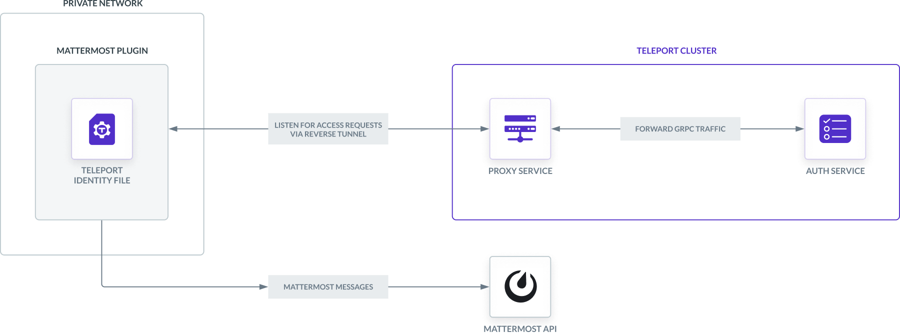
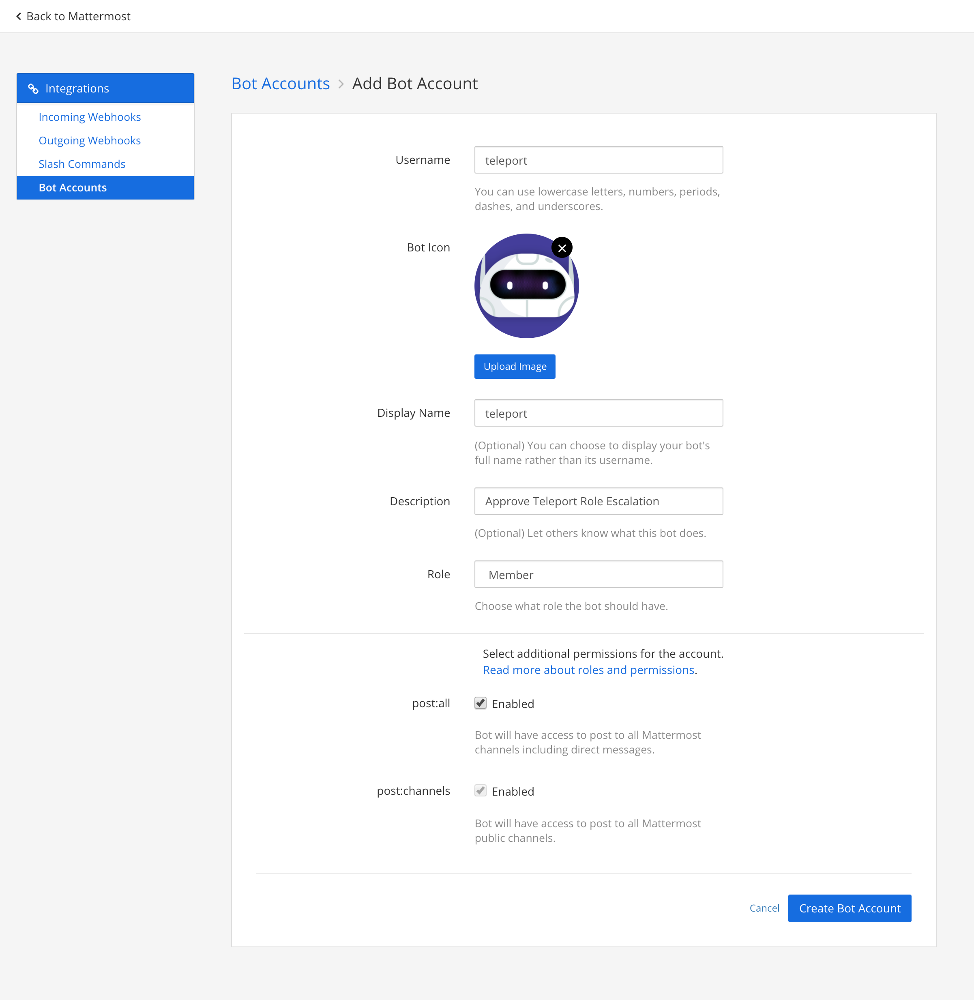
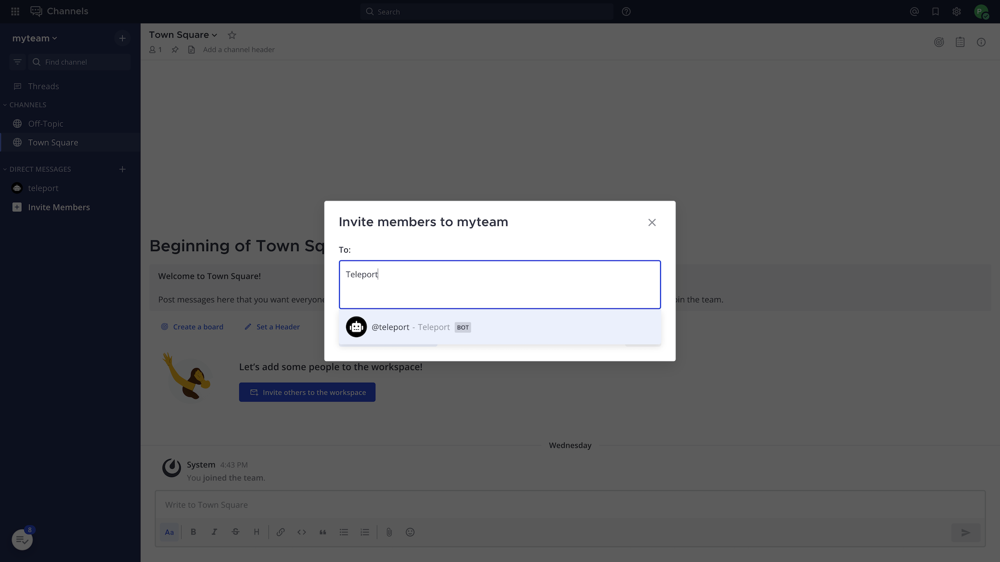

This guide explains how to integrate Teleport access requests with Mattermost, an open 
source messaging platform. The Teleport Mattermost plugin notifies individuals of
access requests. Users can then approve and deny access requests by following the
message link, making it easier to implement security best practices without
compromising productivity.



<Details title="This integration is hosted on Teleport Cloud" open={false}>

(!docs/pages/includes/plugins/enroll.mdx name="the Mattermost integration"!)

</Details>

## Prerequisites

(!docs/pages/includes/commercial-prereqs-tabs.mdx!)

(!docs/pages/includes/machine-id/plugin-prerequisites.mdx!)

- A Mattermost account with admin privileges. This plugin has been tested with
  Mattermost v7.0.1.
- Either a Linux host or Kubernetes cluster where you will run the Teleport Mattermost plugin.
- (!docs/pages/includes/tctl.mdx!)

## Step 1/8. Define RBAC resources

Before you set up the Teleport Mattermost plugin, you need to enable Role Access
Requests in the Teleport Proxy Service or Teleport Auth Service.

(!/docs/pages/includes/plugins/editor-request-rbac.mdx!)

## Step 2/8. Install the Teleport Mattermost plugin

<Tabs>
<TabItem scope={["enterprise", "oss"]} label="Self-Hosted">

We recommend installing Teleport plugins on the same host as the Teleport Proxy
Service. This is an ideal location as plugins have a low memory footprint, and
require both public internet access and Teleport Auth Service access.

</TabItem>

<TabItem scope="cloud" label="Teleport Enterprise Cloud">

Install the Teleport Mattermost plugin on a host that can access both your
Teleport Proxy Service and your Mattermost deployment.

</TabItem>

</Tabs>

(!docs/pages/includes/plugins/install-access-request.mdx name="mattermost"!)

## Step 3/8. Create a user and role for the plugin

(!docs/pages/includes/plugins/rbac.mdx!)

(!/docs/pages/includes/plugins/rbac-impersonate.mdx!)

## Step 4/8. Export the access plugin identity

Give the plugin access to a Teleport identity file. We recommend using Machine
ID for this in order to produce short-lived identity files that are less
dangerous if exfiltrated, though in demo deployments, you can generate
longer-lived identity files with `tctl`:

<Tabs>
<TabItem label="Machine ID">
(!docs/pages/includes/plugins/tbot-identity.mdx secret="teleport-plugin-mattermost-identity"!)
</TabItem>
<TabItem label="Long-lived identity files">
(!docs/pages/includes/plugins/identity-export.mdx user="access-plugin" secret="teleport-plugin-mattermost-identity"!)
</TabItem>
</Tabs>

## Step 5/8. Register a Mattermost bot

Now that you have generated the credentials your plugin needs to connect to your
Teleport cluster, register your plugin with Mattermost so it can send Access
Request messages to your workspace.

In Mattermost, click the menu button in the upper left of the UI, then click
System Console → Integrations → Bot Accounts.

Set "Enable Bot Account Creation" to "true".


This will allow you to create a new bot account for the Mattermost plugin.

Go back to your team. In the menu on the upper left of the UI, click
Integrations → Bot Accounts → Add Bot Account.

Set the "Username", "Display Name", and "Description" fields according to how
you would like the Mattermost plugin bot to appear in your workspace. Set "Role"
to "Member".

You can <a href="../../../img/enterprise/plugins/teleport_bot@2x.png"
download>download</a> our avatar to set as your Bot Icon.

Set "post:all" to "Enabled".



Click "Create Bot Account". We will use the resulting OAuth 2.0 token when we
configure the Mattermost plugin.

## Step 6/8. Configure the Mattermost plugin

At this point, you have generated credentials that the Mattermost plugin will use
to connect to Teleport and Mattermost. You will now configure the Mattermost
plugin to use these credentials and post messages in the right channels for your
workspace.

<Tabs>
<TabItem label="Executable or Docker">
The Mattermost plugin uses a configuration file in TOML format. On the host where you
will run the Mattermost plugin, generate a boilerplate configuration by running the
following commands:

```code
$ teleport-mattermost configure > teleport-mattermost.toml
$ sudo mv teleport-mattermost.toml /etc
```
</TabItem>
<TabItem label="Helm Chart">
The Mattermost Helm Chart uses a YAML values file to configure the plugin. On
the host where you have Helm installed, create a file called
`teleport-mattermost-helm.yaml` based on the following example:

```yaml
(!examples/resources/plugins/teleport-mattermost-helm-cloud.yaml!)
```
</TabItem>
</Tabs>

Edit the configuration as explained below:

### `[teleport]`

(!docs/pages/includes/plugins/config-toml-teleport.mdx!)

(!docs/pages/includes/plugins/refresh-plugin-identity.mdx!)

### `[mattermost]`

**`url`**: Include the scheme (`https://`) and fully qualified domain name of
your Mattermost deployment.

**`token`**: Find your Mattermost bot's OAuth 2.0 token. To do so, visit
Mattermost. In the menu on the upper left of the UI, go to Integrations → Bot
Accounts. Find the listing for the Teleport plugin and click "Create New Token".
After you save the token, you will see a message with text in the format,
"Access Token: TOKEN". Copy the token and paste it here.

**`recipients`**: This field configures the channels that the Mattermost plugin
will notify when it receives an Access Request message. The value is an array of
strings, where each element is either:

- The email address of a Mattermost user to notify via a direct message when the
  plugin receives an Access Request event
- A channel name in the format `team/channel`, where `/` separates the name
  of the team and the name of the channel

For example, this configuration will notify `first.last@example.com` and
the `Town Square` channel in the `myteam` team of any Access Request events:

<Tabs>
<TabItem label="Executable or Docker">

```toml
recipients = [
  "myteam/Town Square",
  "first.last@example.com"
]
```

</TabItem>
<TabItem label="Helm Chart">

```yaml
recipients:
  - "myteam/Town Square"
  - first.last@example.com
```

</TabItem>
</Tabs>

You will need to invite your Teleport plugin to any channel you add to the
`recipients` list (aside from direct message channels). Visit Mattermost,
navigate to each channel you want to invite the plugin to, and enter `/invite
@teleport` (or the name of the bot you configured) into the message box.



<Details title="Suggested reviewers">

Users can also suggest reviewers when they create an Access Request, e.g.,:

```code
$ tsh request create --roles=dbadmin --reviewers=alice@example.com,ivan@example.com
```

If an Access Request includes suggested reviewers, the Mattermost plugin will
add these to the list of channels to notify. If a suggested reviewer is an email
address, the plugin will look up the direct message channel for that address
and post a message in that channel.

If `recipients` is empty, and the user requesting elevated privileges has not
suggested any reviewers, the plugin will skip forwarding the Access Request to
Mattermost.

</Details>

The final configuration should look similar to this:

<Tabs>
<TabItem label="Executable or Docker" >
```yaml
# example mattermost configuration TOML file
[teleport]
auth_server = "myinstance.teleport.sh:443"                   # Teleport Cloud proxy HTTPS address
identity = "/var/lib/teleport/plugins/mattermost/identity"   # Identity file path
refresh_identity = true                                      # Refresh identity file on a periodic basis

[mattermost]
url = "https://mattermost.example.com" # Mattermost Server URL
token = "api-token"                    # Mattermost Bot OAuth token
recipients = [
  "myteam/general",
  "first.last@example.com"
]

[log]
output = "stderr" # Logger output. Could be "stdout", "stderr" or "/var/lib/teleport/mattermost.log"
severity = "INFO" # Logger severity. Could be "INFO", "ERROR", "DEBUG" or "WARN".

```
</TabItem>
<TabItem label="Helm Chart">
```yaml
(!examples/resources/plugins/teleport-mattermost-helm-cloud.yaml!)
```
</TabItem>
</Tabs>

## Step 7/8. Test your Mattermost bot

<Tabs>
<TabItem label="Executable">
After modifying your configuration, run the bot with the following command:

```code
$ teleport-mattermost start -d
```

The `-d` flag provides debug information to make sure the bot can connect to
Mattermost, e.g.:

```text
DEBU   Checking Teleport server version mattermost/main.go:234
DEBU   Starting a request watcher... mattermost/main.go:296
DEBU   Starting Mattermost API health check... mattermost/main.go:186
DEBU   Starting secure HTTPS server on :8081 utils/http.go:146
DEBU   Watcher connected mattermost/main.go:260
DEBU   Mattermost API health check finished ok mattermost/main.go:19
```
</TabItem>
<TabItem label="Docker">

Run the plugin:

```bash
$ docker run -v <path-to-config>:/etc/teleport-mattermost.toml public.ecr.aws/gravitational/teleport-plugin-mattermost:(=teleport.version=) start
```
</TabItem>
<TabItem label="Helm Chart">
After modifying your configuration, run the bot with the following command:

```code
$ helm upgrade --install teleport-plugin-mattermost teleport/teleport-plugin-mattermost --values teleport-mattermost-helm.yaml
```

To inspect the plugin's logs, use the following command:

```code
$ kubectl logs deploy/teleport-plugin-mattermost
```

Debug logs can be enabled by setting `log.severity` to `DEBUG` in
`teleport-mattermost-helm.yaml` and executing the `helm upgrade ...` command
above again. Then you can restart the plugin with the following command:

```code
$ kubectl rollout restart deployment teleport-plugin-mattermost
```

</TabItem>
</Tabs>

### Create an Access Request

(!docs/pages/includes/plugins/create-request.mdx!)

The users and channels you configured earlier to review the request should
receive a message from "Teleport" in Mattermost allowing them to visit a link in
the Teleport Web UI and either approve or deny the request.

### Resolve the request

(!docs/pages/includes/plugins/resolve-request.mdx!)

<Admonition title="Auditing Access Requests">

When the Mattermost plugin posts an Access Request notification to a channel,
anyone with access to the channel can view the notification and follow the link.
While users must be authorized via their Teleport roles to review Access
Requests, you should still check the Teleport audit log to ensure that the right
users are reviewing the right requests.

When auditing Access Request reviews, check for events with the type `Access
Request Reviewed` in the Teleport Web UI.

</Admonition>

## Step 8/8. Set up systemd

This section is only relevant if you are running the Teleport Mattermost plugin
on a Linux host.

In production, we recommend starting the Teleport plugin daemon via an init
system like systemd. Here's the recommended Teleport plugin service unit file
for systemd:

```ini
(!examples/systemd/plugins/teleport-mattermost.service!)
```

Save this as `teleport-mattermost.service` in either `/usr/lib/systemd/system/` or
another [unit file load
path](https://www.freedesktop.org/software/systemd/man/systemd.unit.html#Unit%20File%20Load%20Path)
supported by systemd.

Enable and start the plugin:

```code
$ sudo systemctl enable teleport-mattermost
$ sudo systemctl start teleport-mattermost
```

