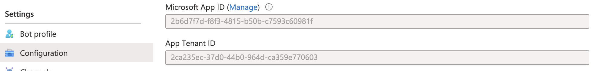
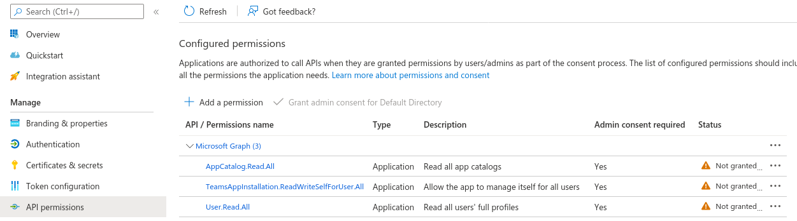
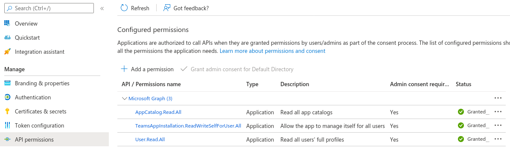
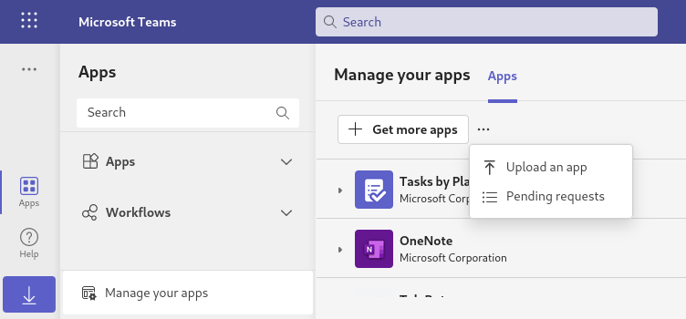
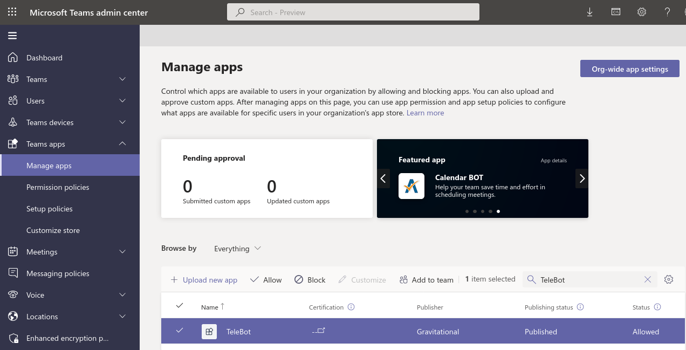
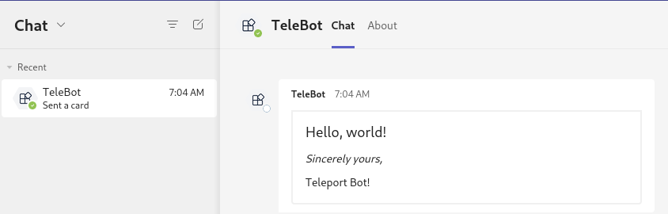

This guide will explain how to set up MsTeams to receive Access Request messages
from Teleport. Teleport's MsTeams integration notifies individuals and channels of
Access Requests. Users can then approve and deny Access Requests by following the
message link, making it easier to implement security best practices without
compromising productivity.

Here is an example of sending an Access Request via Teleport's MsTeams plugin:

## Prerequisites

(!/docs/pages/includes/commercial-prereqs-tabs.mdx!)

- A MsTeams License (Microsoft 365 Business)
- Azure console access in the organization/directory paying the Office 365 Licenses (MsTeams licences)
- An Azure Resource Group in the same directory, that will host the access-request plugin resources.
  You should have enough permissions to create and edit Bot services in this Resource Group.
- Someone with Global Admin rights on the Azure Active Directory that will approve
  the bot application permissions
- Someone with the `Teams administrator` role that will approve the MsTeams
  application installation request

(!/docs/pages/includes/tctl.mdx!)

## Step 1/9. Define RBAC resources

Before you set up the MsTeams plugin, you will need to enable Role Access Requests
in your Teleport cluster. 

(!/docs/pages/includes/plugins/editor-request-rbac.mdx!)

## Step 2/9. Install the Teleport MsTeams plugin

We currently only provide `linux-amd64` binaries. You can also compile these
plugins from source. You can run the plugin from a remote host or your local
development machine.

<Notice scope={["enterprise"]} type="tip">
We recommend installing Teleport plugins on the same host as the Teleport
Proxy Service. This is an ideal location as plugins have a low memory footprint
and will require access to both the public internet and the Teleport Auth Service.
</Notice>

<Tabs>
<TabItem label="Download">
  ```code
  $ curl -L -O https://get.gravitational.com/teleport-access-ms-teams-v(=teleport.version=)-linux-amd64-bin.tar.gz
  $ tar -xzf teleport-access-ms-teams-v(=teleport.version=)-linux-amd64-bin.tar.gz
  $ ./teleport-access-ms-teams/install
  ```
</TabItem>
<TabItem label="From Source">
  To install from source you need `git` and `go` >= (=teleport.golang=)
  installed.

  ```code
  # Check out the teleport-plugins repository
  $ git clone https://github.com/gravitational/teleport-plugins.git
  $ cd teleport-plugins/access/ms-teams
  $ make
  ```
  
  Place the `teleport-ms-teams` binary into an appropriate location
  within the system's `PATH`, e.g., `/usr/local/bin`:

  ```code 
  $ mv ./build/teleport-ms-teams /usr/local/bin
  ```

</TabItem> 
</Tabs>

  Make sure the binary is installed:

  ```code
  $ teleport-ms-teams version
  teleport-ms-teams v(=teleport.plugin.version=) git:teleport-ms-teams-v(=teleport.plugin.version=)-fffffffff go(=teleport.golang=)
  ```

## Step 3/9. Create a user and role for the plugin

(!docs/pages/includes/plugins/rbac.mdx!)

## Step 4/9. Export the access plugin identity

(!docs/pages/includes/plugins/identity-export.mdx!)

The rest of this guide assumes that you have placed any files generated by this
command into `/var/lib/teleport/plugins/ms-teams` for later reference when
configuring the plugin:

```code
# create a data directory to hold certificate files for the plugin.
$ sudo mkdir -p /var/lib/teleport/plugins/ms-teams
$ sudo mv auth.* /var/lib/teleport/plugins/ms-teams
```

## Step 5/9. Register an Azure Bot

The Access Request plugin for MsTeams receives Access Request events from the
Teleport Auth Service, formats them into MsTeams messages, and sends them to the
MsTeams API to post them in your workspace. For this to work, you must register a
new Azure Bot.

### Register a new Azure bot

Visit [https://portal.azure.com/#create/Microsoft.AzureBot](https://portal.azure.com/#create/Microsoft.AzureBot)
to create a new bot. Choose the bot handle (this is for semantic use only, it will
not be displayed to the user or used in configuration), the Azure subscription,
the resource group and the bot pricing tier.

In the "Microsoft App ID" section choose "Single Tenant" and "Create new
Microsoft App ID".


### Connect the bot to MsTeams

Once the bot is created, open the resource and go the the "Channels" tab. Click
"Microsoft Teams" and add the MsTeams channel.

The result should be as follows```:


### Recover the bot app ID and the directory tenant ID

On the bot's "Configuration" tab, recover the values of "Microsoft App ID" and "App Tenant ID".
Those two UUIDs will be used in the plugin configuration.

### Create a client secret

The client secret will be used by the Teleport plugin to authenticate as the bot's app when
searching users and posting messages.

On the bot's "Configuration" tab, find "Microsoft App ID", click "Manage" link next to it.



Then, go to the "Certificates & Secrets" section, choose to create a "New client secret".
Use the "Copy" icon to recover the newly created secret and keep it with the
previously recovered App ID and Tenant ID.

### Specify the permissions used by the app

Still in the app management view ("Configuration", then "Manage" the Microsoft App ID),
go to the "API permissions" tab.

Add the following Microsoft Graph Application permissions:

- `AppCatalog.Read.All` (used to list Teams app and check the app is installed)
- `User.Read.All` (used to get notification recipients)
- `TeamsAppInstallation.ReadWriteSelfForUser.All` (used to initiate communication with
   a user that never interacted with the Teams app before)



At this point the app declares the required permissions but those have not been granted.

If you are admin, click "Grant admin consent for \<directory name\>". If you are not admin,
contact an admin user to grant the permissions.

Once permissions have been approved, refresh the page and check the approval status.
The result should be as follows:



## Step 6/9. Configure the Teleport MsTeams plugin

At this point, the Teleport MsTeams plugin has the credentials it needs to
communicate with your Teleport cluster and MsTeams. In this step, you will
configure the MsTeams plugin to use these credentials. You will also configure the
plugin to notify the right MsTeams channels when it receives an Access Request
update.

### Generate a config file and assets

The Teleport MsTeams plugin uses a config file in TOML format.
The `configure` subcommand generates a directory containing the TOML
configuration file and a `app.zip` file that will be used later to
add the MsTeams application into the organization catalog.

The command will create the directory `/var/lib/teleport/plugins/ms-teams/assets`
(might require root/sudo):

```code
$ teleport-ms-teams configure /var/lib/teleport/plugins/ms-teams/assets --appID <Microsoft App ID value> --tenantID <App Tenant ID value> --appSecret <password value saved on step #4>
```

This should result in a config file like the one below:

```toml
(!examples/resources/plugins/teleport-ms-teams.toml!)
```

Recover the `/var/lib/teleport/plugins/ms-teams/assets/app.zip` file,
you will have to upload it to MsTeams later.

Note: `configure` is not idempotent, it generates a new MsTeams
application uuid each time. It is not possible to use an `app.zip` and
a TOML configuration generated by two different executions.

### Edit the config file

Copy the file `/var/lib/teleport/plugins/ms-teams/assets/teleport-ms-teams.toml`
to `/etc/teleport-ms-teams.toml`. You can then edit the copy located in `/etc/`.

**`[teleport]`**

The MsTeams plugin uses this section to connect to the Teleport Auth Service.

<ScopedBlock scope={["oss", "enterprise"]}>

The address and credentials you configure depend on whether your plugin can
access the Auth Service directly:

<Tabs>
  <TabItem label="Connect to the Auth Service"> 
    
Set `addr` to the address and port of your Auth Service. This address must be
reachable from the Teleport Slack Plugin.

Set `client_key`, `client_crt`, and `root_cas` to the identity files
generated earlier:

```toml
[teleport]
addr = "localhost:3025"
client_key = "/var/lib/teleport/plugins/ms-teams/auth.key" # Teleport GRPC client secret key
client_crt = "/var/lib/teleport/plugins/ms-teams/auth.crt" # Teleport GRPC client certificate
root_cas = "/var/lib/teleport/plugins/ms-teams/auth.cas"   # Teleport cluster CA certs
```
</TabItem>
  <TabItem label="Connect to the Proxy Service">

Set `addr` to  your Proxy Service address with port `443`.

Set `identity` to the identity file generated earlier:

```toml
[teleport]
addr = "mytenant.teleport.sh:443"
identity = "/var/lib/teleport/plugins/ms-teams/auth.pem"
```
  </TabItem>
</Tabs>

</ScopedBlock>
<ScopedBlock scope="cloud">

Set `addr` to  your Teleport Cloud tenant address with port `443`.

Set `identity` to the identity file generated earlier:

```toml
[teleport]
addr = "mytenant.teleport.sh:443"
identity = "/var/lib/teleport/plugins/ms-teams/auth.pem"
```

</ScopedBlock>
 
**`[role_to_recipients]`**

The `role_to_recipients` map configure the channels that the MsTeams plugin will
notify when a user requests access to a specific role. When the Slack plugin
receives an Access Request from the Auth Service, it will look up the role being
requested and identify the MsTeams channels to notify.

Here is an example of a `role_to_recipients` map:

```toml
[role_to_recipients]
"*" = "admin-teams-channel"
"dev" = ["dev-teams-channel", "admin-teams-channel"]
"dba" = "alex@gmail.com"
```

In the `role_to_recipients` map, each key is the name of a Teleport role. Each
value configures the Teams channel (or channels) to notify. The value can be a
single string or an array of strings. Each string must be either the name of a
Teams channel (including a user's direct message channel) or the email address
of a Slack user. If the recipient is an email address, the Slack plugin will
use that email address to look up a direct message channel.

The `role_to_recipients` map must also include an entry for `"*"`, which the
plugin looks up if no other entry matches a given role name. In the example
above, requests for roles aside from `dev` and `dba` will notify the
`admin-teams-channel` channel.

<Details title="Suggested reviewers">

Users can suggest reviewers when they create an Access Request, e.g.,:

```code
$ tsh request create --roles=dbadmin --reviewers=alice@example.com,ivan@example.com
```

If an Access Request includes suggested reviewers, the MsTeams plugin will add
these to the list of channels to notify. If a suggested reviewer is an email
address, the plugin will look up the the direct message channel for that
address and post a message in that channel.

</Details>

Configure the MsTeams plugin to notify you when a user requests the `editor` role
by adding the following to your `role_to_recipients` config (replace
`TELEPORT_USERNAME` with the user you assigned the `editor-reviewer` role
earlier):

TODO: test this channel thing and document how to get channel ID

```toml
[role_to_recipients]
"*" = "access-requests"
"editor" = "TELEPORT_USERNAME"
```

Either create an `access-requests` channel in your Slack workspace or rename the
value of the `"*"` key to an existing channel.

## Step 7/9. Add and configure the Teams app

### Upload the Teams App

Open MsTeams and go to "Apps", "Manage your apps", then in the additional
choices menu choose "Upload an App".



If you're a Teams admin, choose "Upload an app to your org's app catalog",
it will allow you to skip the approval step.
If you're not a teams admin, choose "Submit an app to your org".

Upload the previously recovered `app.zip`.

### Approve the Teams App

If you are not a Teams admin and chose "Submit an app to your org",
you will have to ask a Teams admin to approve it.

They can do so by connecting to the
[Teams admin dashboard](https://admin.teams.microsoft.com/policies/manage-apps),
searching "TeleBot", selecting it and choosing "Allow".



### Add the Teams app to a Team

Once the app is approved it should appear in the "Apps built for your org" section.
Add the newly uploaded app to a team. Open the app, click "Add to a team",
choose the "General" channel of your team and click "Set up a bot".


Note: Once an app is added to a team, it can post on all channels.

## Step 8/9. Test the MsTeams app

Once Teleport is running, you've created the MsTeams app, and the plugin is
configured, you can now run the plugin and test the workflow.

### Test MsTeams connectivity

Start the plugin in validation mode:

```code
$ teleport-ms-teams validate <email of your teams account>
```

If everything works fine, the log output should look like this:

```code
teleport-ms-teams v10.0.2 go1.18.1

 - Checking application xxxxxxxx-xxxx-xxxx-xxxx-xxxxxxxxxxxx status...
 - Application found in the team app store (internal ID: xxxxxxxx-xxxx-xxxx-xxxx-xxxxxxxxxxxx)
 - User xxxxxx@xxxxxxxxx.xxx found: xxxxxxxx-xxxx-xxxx-xxxx-xxxxxxxxxxxx
 - Application installation ID for user: XXXXXXXXXXXXXXXXXXXXXXXXXXXXXXXXXXXXXXXXXXXXXXXXXXXXXXXXXXXXXXXXXXXXXXXXXXXXXXXXXXXXXXXXXXXXXXXXXXXX
 - Chat ID for user: 19:xxxxxxxx-xxxx-xxxx-xxxx-xxxxxxxxxxxx_xxxxxxxx-xxxx-xxxx-xxxx-xxxxxxxxxxxx@unq.gbl.spaces
 - Chat web URL: https://teams.microsoft.com/l/chat/19%3Axxxxxxxx-xxxx-xxxx-xxxx-xxxxxxxxxxxx_xxxxxxxx-xxxx-xxxx-xxxx-xxxxxxxxxxxx%40unq.gbl.spaces/0?tenantId=xxxxxxxx-xxxx-xxxx-xxxx-xxxxxxxxxxxx
 - Hailing the user...
 - Message sent, ID: XXXXXXXXXXXXX

Check your MS Teams!
```

The plugin should exit and you should have received two messages through MsTeams.



### Create an Access Request

Create an Access Request and check if the plugin works as expected with the
following steps.

(!docs/pages/includes/plugins/create-request.mdx!)

The user you configured earlier to review the request should receive a direct
message from "TeleBot" in MsTeams allowing them to visit a link in the Teleport
Web UI and either approve or deny the request.

### Resolve the request

(!docs/pages/includes/plugins/resolve-request.mdx!)

Once the request is resolved, the MsTeams bot will update the access request message
to reflect its new status.

<Admonition title="Auditing Access Requests">

When the MsTeams plugin posts an Access Request notification to a channel, anyone
with access to the channel can view the notification and follow the link. While
users must be authorized via their Teleport roles to review Access Requests, you
should still check the Teleport audit log to ensure that the right users are
reviewing the right requests.

When auditing Access Request reviews, check for events with the type `Access
Request Reviewed` in the Teleport Web UI <ScopedBlock scope={["oss",
"enterprise"]}>and `access_request.review` if reviewing the audit log on the
Auth Service host</ScopedBlock>.

</Admonition>

## Step 9/9. Set up systemd

In production, we recommend starting the Teleport plugin daemon via an init
system like systemd.  Here's the recommended Teleport plugin service unit file
for systemd:

```ini
(!examples/systemd/plugins/teleport-ms-teams.service!)
```

Save this as `teleport-ms-teams.service` in either `/usr/lib/systemd/system/` or
another [unit file load
path](https://www.freedesktop.org/software/systemd/man/systemd.unit.html#Unit%20File%20Load%20Path)
supported by systemd.

Enable and start the plugin:

```code
$ sudo systemctl enable teleport-ms-teams
$ sudo systemctl start teleport-ms-teams
```

## Next steps

- Read our guides to configuring [Resource Access
    Requests](../access-requests/resource-requests.mdx) and [Role Access
    Requests](../access-requests/role-requests.mdx) so you can get the most out
    of your Access Request plugins.
## Feedback

If you have any issues with this plugin, please create a GitHub issue in our [`gravitational/teleport-plugins`](https://github.com/gravitational/teleport-plugins/issues/new) repo.
