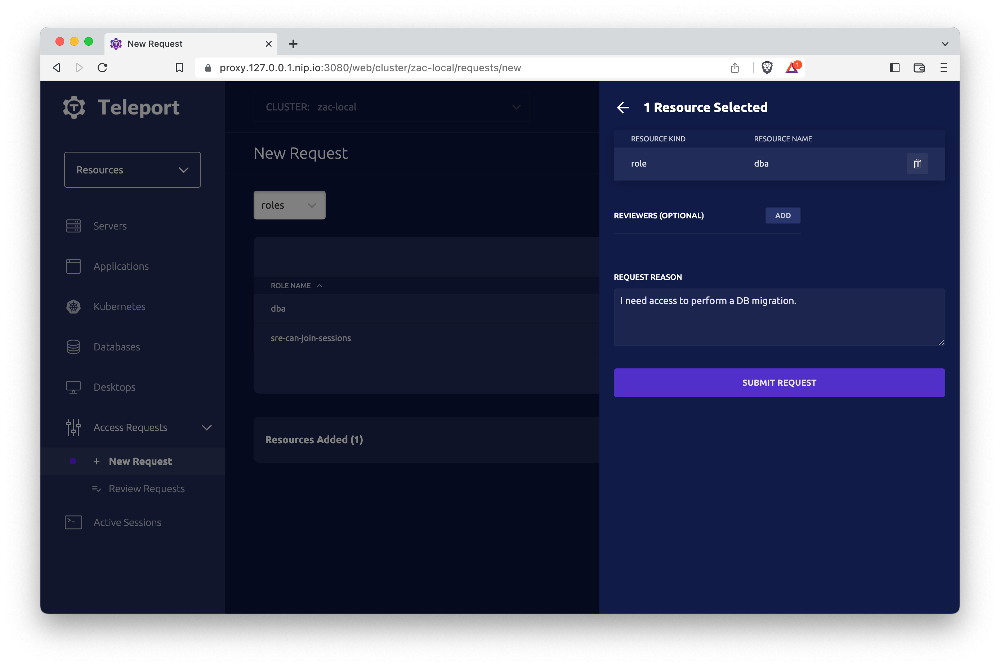
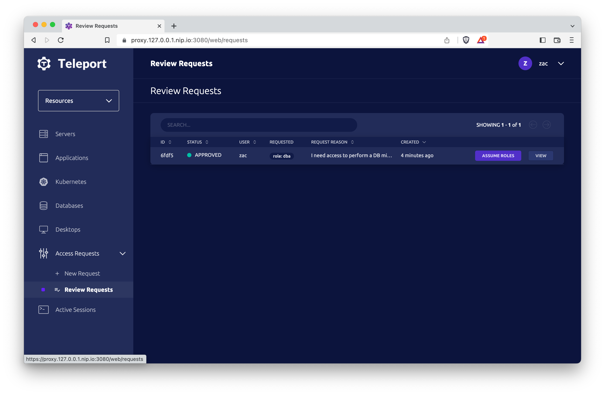
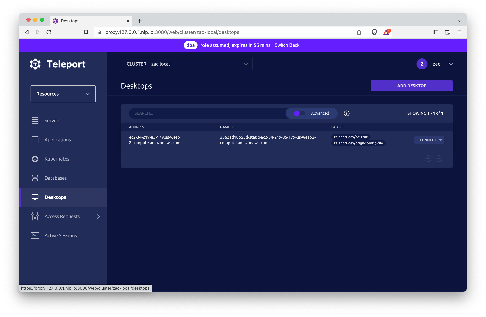

Teleport's Just-in-time Access Requests allow users to request access to
additional roles in order to elevate their privileges. Requests can be escalated
via ChatOps or anywhere else via our flexible Authorization Workflow API.

## Prerequisites

(!docs/pages/includes/edition-prereqs-tabs.mdx!)

- (!docs/pages/includes/tctl.mdx!)

## RBAC Setup

In this example, we will define three roles:

1. `contractor`: users with this role can request elevated access to the `dba` role
2. `dba`: this role grants access to databases
3. `approver`: users with this role can approve requests for access to the `dba` role

**Contractor Role**

Users with this role can request access to the `dba` role.

```yaml
kind: role
version: v5
metadata:
  name: contractor
spec:
  allow:
    request:
      roles: ['dba']
```

**DBA Role**

This role grants access to databases.

```yaml
kind: role
version: v5
metadata:
  name: dba
spec:
  allow:
    db_labels:
      '*': '*'
  options:
    # Only allows the contractor to use this role for 1 hour from time of request.
    max_session_ttl: 1h
```

**Approver Role**

This role allows users to approve requests for the `dba` role.

```yaml
kind: role
version: v5
metadata:
  name: approver
spec:
  allow:
    # `review_requests` permits the listed roles to be approved
    review_requests:
      roles:
      - 'dba'
```

<Admonition type="warning" title="Requires Teleport Enterprise">
Roles containing a `review_requests` rule can only be used in Teleport
Enterprise. In OSS Teleport, Access Requests must be approved by an admin
running `tctl` on the Auth Server.
</Admonition>

## Requesting Access

While Teleport Enterprise supports the same CLI-based workflows for requesting
access to roles, most users will prefer to request access via the web UI.

To request access to one or more roles, navigate to the access requests page.
You can find this page by selecting **Resources** on the side bar, expanding the
*Access Requests* menu, and selecting **New Request**.

From here, the dropdown will allow you to request access to roles or to specific
resources. Select roles in this dropdown and you will be presented with a list
of roles you are permitted to request access to.

Click **ADD TO REQUEST** to include a role in the pending request.

Note: Access Requests must either contain roles or a set of specific resources.
You can not mix the two. For more information on how to request access to
specific resources, see the
[Resource Access Requests Guide](./resource-requests.mdx).


When all desired roles have been added, click **PROCEED TO REQUEST**, where you
can review and submit the request.



## Reviewing Access Requests via the Web UI

Reviewers can see a list of open requests by navigating to
**Management** > **Access Requests** > **Review Requests** in the web UI.

<Admonition type="warning">
Granting access to a role with the ability to edit other roles could allow a
user to **permanently** upgrade their privileges. When reviewing requests, it's
important to carefully consider the role(s) being requested and what permissions
will be applied to the user if the request is approved.
</Admonition>

## Reviewing Access Requests via `tsh`

Teleport Enterprise users with appropriate permissions can also approve requests
with the `tsh` command line:

```code
$ tsh request review --approve <request-id>
```

## Using an approved access request

Once a request has been approved, the requestor can elevate their access for
both command-line workflows and web UI workflows.

For command-line use, the requestor should log in using the approved request ID:

```code
# log in with an approved access request
$ tsh login --request-id=bc8ca931-fec9-4b15-9a6f-20c13c5641a9
```

In the web UI, the requestor can open their request on the **Review Requests**
page and click **ASSUME ROLES** to gain access to additional roles. Note:
role-based access requests are additive. The user will have access to their
standard role set in addition to the roles granted by the request.



A banner will appear at the top of the page while the approved access request is
active. When elevated access is no longer necessary, click **Switch Back** to revert
to the original set of roles.



## Next Steps

### Integrating with an external tool

With Teleport's Access Request plugins, users can manage Access Requests from
within your organization's existing messaging and project management solutions.

(!docs/pages/includes/access-request-integrations.mdx!)

### Advanced RBAC

Teleport roles support a number of advanced features for further configuring
access requests. They are highlighted in the example role below.

```yaml
kind: role
version: v5
metadata:
  name: employee
spec:
  allow:
    request:
      # The `roles` list can be a mixture of literal roles and
      # wildcard matchers and/or regular expressions.
      roles:
        - 'common'   # the literal role named "common"
        - 'dev-*'    # a glob - any role beginning with 'dev-'
        - '^dev-.*$' # a regular expression (identical to the glob example above)

        # provides access to dev-alpha-prod, but not dev-beta-prod
        - 'dev-{{regexp.not_match("beta")}}-prod'

      # The `claims_to_roles` mapping works the same as it does in
      # the OIDC connector, with the added benefit that the roles being mapped to
      # can also be matchers. the below mapping says that users with
      # in the SSO provider's `admins` groups can request any role in the system.
      claims_to_roles:
        - claim: groups
          value: admins
          roles: ['*']

      # Teleport can attach annotations to pending Access Requests. these
      # annotations may be literals, or be variable interpolation expressions,
      # effectively creating a means for propagating selected claims from an
      # external identity provider to the plugin system.
      annotations:
        foo: ['bar']
        groups: ['{{external.groups}}']
  options:
    # The `request_access` field can be set to 'always' or 'reason' to tell
    # tsh or the web UI to always create an Access Request on login. If it is
    # set to 'reason', the user will be required to indicate *why* they are
    # generating the Access Request.
    request_access: reason

    # The `request_prompt` field can be used to customize the text that the
    # user sees when they are be prompted to enter a reason for the request.
    request_prompt: Please provide your ticket ID
```

### Using TTLs with Access Requests

Users can also create Access Requests with the `tsh request create` command.
`tsh request create` supports flags to control TTLs for the request and
elevated access. See the [CLI
Reference](../../reference/cli.mdx#tsh-request-create) for more
details.
