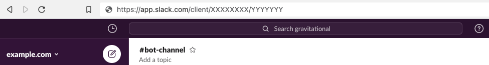
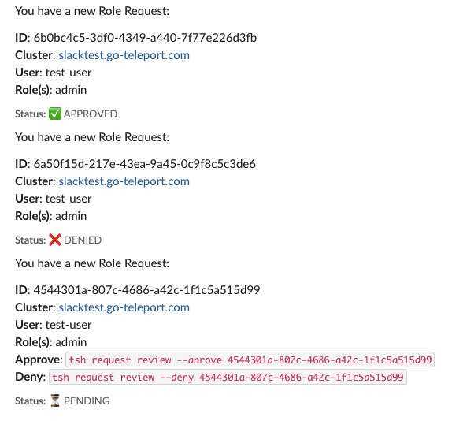

This guide examines how to configure Teleport for use with Slack.

Slack integration allows you to review, grant, and deny access to SSH servers within Slack messages as well as through the command line and Web UI.

<Admonition type="Note" title="Supported editions">
  Access Requests are now supported in both the Teleport Open Source and Enterprise Editions.
</Admonition>

#### Example Slack request

<video controls>
  <source src="../../../img/enterprise/plugins/slack/slack.mp4" type="video/mp4" />
  <source src="../../../img/enterprise/plugins/slack/slack.webm" type="video/webm" />
  Your browser does not support the video tag.
</video>

## Prerequisites

This guide assumes that you have:

- Teleport (=teleport.version=).
- Admin privileges with access to [`tctl`](https://gravitational.com/teleport/docs/cli-docs/#tctl).
- Slack Admin Privileges to create an app and install it to your workspace.

<Admonition type="Tip" title="tip">
  Read [Getting Started](../../getting-started.mdx) to install Teleport and configure it with a user and role.
</Admonition>

## Step 1/4. Create a user and role for access

1. Log into your Teleport Authentication Node. The Auth Node is where you'll most likely perform administrative tasks and run the powerful `tctl` ("tea-kettle") admin tool. 

2. Create a new user and role with only API access to the `access_request` API. 
  
   The following YAML file specifies a non-interactive bot `access-plugin` user and role.

   ```yaml
   kind: user
   metadata:
     name: access-plugin
   spec:
     roles: ['access-plugin']
   version: v2
   ---
   kind: role
   version: v3
   metadata:
     name: access-plugin
   spec:
     allow:
       rules:
         - resources: ['access_request']
           verbs: ['list', 'read']
         - resources: ['access_plugin_data']
           verbs: ['update']
       logins: ['access-plugin-not-used']
   ```
    
   Name the YAML file something like `access.yaml`.
  
   Ensure that the role and name is `access-plugin`; the plugin requires this to function properly.

   (!docs/pages/includes/permission-warning.mdx!)

3. Create the bot for Teleport using the created role:
  
   ```bash
   tctl create -f access.yaml
   ```

<Admonition type="tip">
  If you're using other plugins, you'll likely want to create users and roles for each plugin. It's generally good practice to separate users and roles by concern.
</Admonition>

## Step 2/4. Export access-plugin certificate

Teleport Plugin uses the `access-plugin` role and user to perform the approval. 

We export the identity files, using [`tctl auth sign`](https://gravitational.com/teleport/docs/cli-docs/#tctl-auth-sign).

```bash
tctl auth --auth-server=auth.example.com:3025 sign --format=tls --user=access-plugin --out=auth --ttl=1h
# ...
```

The above sequence should result in three generated certificate files: `auth.crt`, `auth.key`, and `auth.cas` (the certificate, private key, and CA certs respectively).  We'll reference these files later when [configuring the plugins](#configuring-teleport-slack).

<Admonition type="note" title="Certificate Lifetime">
  By default, [`tctl auth sign`](https://gravitational.com/teleport/docs/cli-docs/#tctl-auth-sign) produces certificates with a relatively short lifetime. For production deployments, the `--ttl` flag can be used to ensure a more practical certificate lifetime. `--ttl=2190` exports a 3-month token.
</Admonition>

### Create Slack app

We'll create a new Slack app and set up auth tokens and callback URLs so that Slack knows how to notify the Teleport plugin when the "Approve / Deny" buttons are clicked.

You'll need to:

1. Create a new app, pick a name, and select a workspace it belongs to.
2. Add OAuth scopes. This is required by Slack for the app to be installed — we'll only need a single scope to post messages to your Slack account.
3. Obtain an OAuth token.

#### Creating a new Slack app

1. Visit [https://api.slack.com/apps](https://api.slack.com/apps) to create a new Slack App.

2. Use the following configuration settings:

   **App Name:** Teleport<br/>
   **Development Slack Workspace:** Pick the workspace you'd like the requests to show up in. <br/>
   **App Icon:** <a href="../../../img/enterprise/plugins/teleport_bot@2x.png" download>Download Teleport Bot Icon</a>


#### Selecting OAuth scopes

Within the app screen, go to “OAuth and Permissions” under "Features" in the sidebar menu. 

Then scroll to "Scopes", and add the following scopes so the plugin can post messages to your Slack channels:

- `chat:write`
- `incoming-webhook` 
- `users:read` 
- `users:read.email` 


#### Obtain an OAuth token

Slack will generate an OAuth token for you automatically. Find it at the top under the "OAuth Tokens for Your Workspace" section:


#### Add the app to your Slack Workspace

Add the app to your Slack Workspace:


After doing so, make sure to invite your bot to the channel. Do this by using the `@` command.


## Step 3/4. Installing the Teleport Slack Plugin

Since Teleport plugins typically augment your Teleport cluster with third-party extensions and integrations with minimal additional overhead, you'll want to consider your overall architecture. We recommend installing the Teleport Slack plugin alongside Teleport Proxy.

We currently only provide `linux-amd64` binaries. You can optionally compile these plugins from [source](https://github.com/gravitational/teleport-plugins/tree/master/access/slack).

<Tabs>
  <TabItem label="Download">
    ```bash
    curl -LO https://get.gravitational.com/teleport-access-slack-v(=teleport.version=)-linux-amd64-bin.tar.gz
    tar -xzf teleport-access-slack-v(=teleport.version=)-linux-amd64-bin.tar.gz
    cd teleport-access-slack
    ./install
    ```

    ```bash
    # Output
    Teleport Slack binaries have been copied to /usr/local/bin
    You can run teleport-slack configure > /etc/teleport-slack.toml to bootstrap your config file
    ```
  </TabItem>
  <TabItem label="From Source">
    To install from source you need `git` and `go >= (=teleport.golang=)` installed.

    ```bash
    # Checkout teleport-plugins
    git clone https://github.com/gravitational/teleport-plugins.git
    cd teleport-plugins/access/slack
    make
    ```
  </TabItem>
</Tabs>

<Admonition type="tip">
  View the [Slack Plugin README](https://github.com/gravitational/teleport-plugins/tree/master/access/slack).
</Admonition>

### Configuring Teleport Slack

Teleport Slack uses a config file in `TOML` format.

Generate a boilerplate config by running the following command:

```bash
teleport-slack configure > teleport-slack.toml
```

#### Copy certificates

Navigate back to the certificates you generated with `tctl auth sign` before. The plugin installer creates a folder for them at: `/var/lib/teleport/plugins/slack/`. 

Copy or move the certificates there and point the config file to them:

```bash
# Navigate up directories
cd ../
# Move certificate files created by 'tctl auth sign'
mv -f auth.cas /var/lib/teleport/plugins/slack/
mv -f auth.crt /var/lib/teleport/plugins/slack/
mv -f auth.key /var/lib/teleport/plugins/slack/
```

#### Editing the config file

Run the following command to modify the configuration file before we deploy it:

```bash
nano teleport-access-slack/teleport-slack.toml
```

Teleport YAML configuration files are divided into sections:

```conf
(!examples/resources/plugins/teleport-slack.toml!)
```

1. Find the "Teleport" section and add the certificates you generated with `tctl auth sign` before.
2. Find the "Slack" section and add the OAuth token, signing token, and the desired channel name.
3. Add the desired recipients. 

  For users, add the email address associated with their Slack profile. 
  
  For channels, add the Slack Channel ID (which can be found in the URL path; `YYYYYYY` below).

  

4. Copy `teleport-slack.toml` to the location used by the Slack Plugin:

   ```bash
   mv teleport-access-slack/teleport-slack.toml /etc/teleport-slack.toml
   ```

## Step 4/4. Test run

Assuming that Teleport is running, and you've created the Slack app, the plugin config, and provided all the certificates — you can now run the plugin and test the workflow!

```bash
sudo teleport-slack start
```

If everything works fine, the log output should look like this:

```bash
# INFO   Starting Teleport Access Slack Plugin (=teleport.plugin.version=): slack/app.go:72
```

### Create a test user

Many of Teleport's default user roles lack the ability to make role requests.

Create a test role called `dev` with that ability:

```yaml
kind: 'role'
version: 'v3'
metadata:
  name: 'dev'
spec:
  allow:
    request:
      roles: ['slackdev']
---
kind: role
version: v3
metadata:
  name: 'slackdev'
spec:
  allow:
    logins: ['access']
```

<Admonition title="Tip" type="tip">
  It's generally a good idea to create roles that are specific to a task or scenario. Above, we create a role specific for testing Slack integration.
</Admonition>

Assign it to a new `test-user`:

```bash
tctl users add test-user --roles=dev
```

The new user can login using `tsh`:
```bash
tsh login --proxy=auth.example.com:443 --user=test-user
```

### Test access requests

Create a test permissions request with `tsh`:

```bash
# Make a request for a permitted role
tsh login --request-roles=slackdev
```

Each request will be assigned a UUID:

```
# Output
INFO   Successfully posted to Slack request_id:37dFhe-7780-4cff-a1ce-345c0318776f request_op:put slack_channel:AIFODUF21 slack_timestamp:1622651379.000200 slack/app.go:221
````

The request will appear in Teleport as will a message about the request on Slack:



### Approve or deny requests

Users with the ability to approve or deny requests can use `tsh`:

```bash
# Approve the request
tsh request review --approve b8fa34de-3822-48aa-86f1-1865f9c7c4b9

# Deny the request
tsh request review --deny b8fa34de-3822-48aa-86f1-1865f9c7c4b9
```

Admins can approve or deny requests using `tctl`:

```bash
# Display all active requests
tctl request ls

# Approve the request
tctl request approve b8fa34de-3822-48aa-86f1-1865f9c7c4b9

# Deny the request
tctl request deny b8fa34de-3822-48aa-86f1-1865f9c7c4b9
```

Slack messages will automatically update to reflect approvals and denials. 

## Production setup

We recommend running the Teleport plugin daemon in production using a tool like `systemd`.

The recommended Teleport Plugin service unit file for `systemd`:

```bash
(!examples/systemd/plugins/teleport-slack.service!)
```

Save this as `teleport-slack.service`.

## Resources

- It's best practice to periodically review Teleport's [audit log](../../admin-guide.mdx#audit-log).
- Review the Plugin [source code](https://github.com/gravitational/teleport-plugins).
