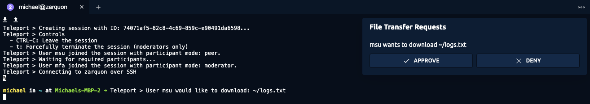

Moderated sessions allow you to define requirements for other users to be present 
in an active server or Kubernetes session started by another user. Depending on the 
requirements you specify, users who are allowed to join other users' sessions can be 
granted permission to do the following:

- Observe another user's session in real time.
- Participate interactively in another user's session.
- Terminate another user's session at will.

The most common use cases for moderated sessions involve the following scenarios:

- You have strict security or compliance requirements and need to have people watching
  over user-initiated sessions on a set of servers.
- You want to share a terminal with someone else to be able to instruct or collaborate.
- You need the ability to pause or terminate active sessions.

Note that you can share terminal sessions using any Teleport edition. However, you must 
have Teleport Enterprise or Teleport Enterprise Cloud if you want to require active 
sessions to be observed or moderated.

## Require and allow policies

Moderated sessions use roles to provide fine grained control over who can join a session 
and who is required to be present to start one.

There are two types of policies you can use to control moderated sessions:

- **Require** policies define a set of conditions that must be a met for a session to
  start or run. A user assigned a role with a require policy must meet the minimum 
  requirements of the policy to start the session that the policy applies to.
- **Allow** policies define what sessions users can join and under what conditions 
  they can join a session.

## Configure a require policy

In Teleport Enterprise editions, you can use `require_session_join` in a role to specify 
the conditions that must be a met for a session to start or run. For example, the following 
policy specifies that users assigned the `prod-access` role must have a minimum of one user 
with the `auditor` role and the `moderator` mode present to start SSH or Kubernetes sessions:

```yaml
kind: role
metadata:
  name: prod-access
version: v7
spec:
  allow:
    require_session_join:
      - name: Auditor oversight
        filter: 'contains(user.spec.roles, "auditor")'
        kinds: ['k8s', 'ssh']
        modes: ['moderator']
        count: 1
    logins:
    - ubuntu
    - debian
    node_labels:
      env: prod
    kubernetes_labels:
      env: prod
    kubernetes_groups:
    - prod-access
    kubernetes_users:
    - USER
    kubernetes_resources:
    - kind: '*'
      name: '*'
      namespace: '*'
      verbs: ['*']
```

Because this sample policy requires that at least one user with the `auditor` role to be present
as a moderator to start SSH or Kubernetes sessions, a user assigned this `prod-access` role 
won't be able to start any sessions until the policy requirements are fulfilled. 

The `require_session_join` rules apply to all of the user's sessions, including
those that are accessible via other roles. If you do not want to require moderation
for user sessions, we recommend using Access Requests to temporarily assume a role
for resources that should require moderation.

### Required fields

The following are required fields for `require_session_join`:

|Option|Type|Description|
|---|---|---|
|`name`|String|The name of the require policy|
|`filter`|Filter|An expression that, if it evaluates to true for a given user, enables the user to be present in a moderated session.|
|`kinds`|List|The kind of session—SSH, Kubernetes, or both—that the policy applies to. The valid options are `ssh` and `k8s`.|
|`modes`|List|The participant mode—`observer`, `moderator`, or `peer`—that the user joining the moderated session must match to satisfy the policy.|
|`count`|Integer|The minimum number of users that must match the filter expression to satisfy the policy.|

#### Filter expressions

Filter expressions allow for more detailed control over the scope of a policy.
For example, you can use a filter expression to specify which users are required 
to be present in a session. The filter has a `user` object as its context that you 
can refine to match the `roles` and `name` fields you specify.

In the following example, the filter expression evaluates to true if the user's name is
`adam` or if the user has the role `cs-observe`:

```
equals(user.name, "adam") || contains(user.spec.roles, "cs-observe")
```

Filter expressions support the following functions and operators:

- `contains(set, item)`: Returns true if the item is in the set, otherwise
  false. The set can be a string or an array.
- `equals(a, b)`: Returns true if the two values are equal, otherwise returns
  false.
- `![expr]`: Negates a Boolean expression.
- `[expr] && [expr]`: Performs a logical AND on two Boolean expressions.
- `[expr] || [expr]`: Performs a logical OR on two Boolean expressions.

#### Matching user count

You can use the `count` field in a require policy to specify the minimum number 
of users matching the filter expression who must be present in a session to satisfy 
the policy.

### Optional fields

The following field is optional for `require_session_join`:

|Option|Type|Description|
|---|---|---|
|`on_leave`|String|The action to take when the policy is no longer satisfied.|

You can use the `on_leave` field in require policies to define what happens 
when a moderator leaves a session and causes the policy to no longer be satisfied.
There are two possible values for this field:

- `terminate` to terminate the session immediately and disconnect all participants.
- `pause` to pause the session and stop any input/output streaming until the policy is satisfied again.

By default, Teleport treats an empty string in this field the same as `terminate`.

If all require policies attached to the session owner are set to `pause`, the session 
discards all input from session participants and buffers the most recent output but 
the session remains open so it can resume.

### Combining require policies and roles

In evaluating policies and roles, all of the require policies within a role are evaluated using an 
OR operator and the policies from each role are evaluated using an AND operator. In practice, this 
means that for every role with at least one require policy, one of its policies must be met before 
a user assigned the role can start a session.

### Requiring moderated sessions in a leaf cluster

If you create a role with the `require_session_join` policy in a root cluster, only sessions started
on resources in the root cluster are required to be moderated for the users assigned that role.
If users assigned the role connect to resources in a leaf node, their sessions won't require moderation, 
unless the mapped leaf role also requires moderation. To require moderated sessions in the leaf cluster,
you must include the `require_session_join` policy in the mapped role defined on the leaf cluster.

For more information about configuring trust relationships and role mapping between root and leaf 
clusters, see [Configure Trusted Clusters](../../management/admin/trustedclusters.mdx).

## Configure an allow policy

You can use `join_sessions` in a role to specify the sessions users can join and under what conditions 
they can join a session. For example, the following policy is attached to the `auditor` role and allows 
a user assigned to the auditor role to join SSH and Kubernetes sessions started by a user with the 
role `prod-access` and to join the session as a moderator or an observer:

```yaml
kind: role
metadata:
  name: auditor
version: v7
spec:
  allow:
    join_sessions:
      - name: Join prod sessions
        roles : ['prod-access']
        kinds: ['k8s', 'ssh']
        modes: ['moderator', 'observer']
```

Users who are assigned a role with a `join_sessions` allow policy are
implicitly allowed to list the sessions that the policy gives them permission 
to join. If there's a `deny` rule that prevents listing sessions, the 
`join_sessions` policy overrides the `deny` rule for the sessions the 
policy allows the user to join. Outside of this exception for joining 
sessions, `deny` statements take precedent.

### Required fields

The following are required fields for `join_sessions`:

|Option|Type|Description|
|---|---|---|
|`name`|String|The name of the allow policy.|
|`roles`|List|A list of Teleport role names that the allow policy applies to. Active sessions created by users with these roles can be joined under this policy.|
|`kinds`|List|The kind of sessions—SSH, Kubernetes, or both—that the allow policy applies to. The valid options are `ssh` and `k8s`.|
|`modes`|List|The participant mode—`observer`, `moderator`, or `peer`—that the user joining the session can use to join the session. The default mode is `observer`.|

### Joining a session from the command line

In the following example, Jeff is assigned the `prod-access` role and attempts to connect to
a server in the production environment using `tsh ssh`:

```code
$ tsh ssh ubuntu@prod.teleport.example.com
Teleport > Creating session with ID: 46e2af03-62d6-4e07-a886-43fe741ca044...
Teleport > Controls
  - CTRL-C: Leave the session
  - t: Forcefully terminate the session (moderators only)
Teleport > User jeff joined the session.
Teleport > Waiting for required participants...
```

Jeff's session is paused, waiting for the required observers.
When Alice, who is assigned the `auditor` role, joins the waiting session 
as a moderator, the session can begin.
For example:

```code
$ tsh join --mode=moderator 46e2af03-62d6-4e07-a886-43fe741ca044
Teleport > Creating session with ID: 46e2af03-62d6-4e07-a886-43fe741ca044...
Teleport > Controls
  - CTRL-C: Leave the session
  - t: Forcefully terminate the session (moderators only)
Teleport > User jeff joined the session.
Teleport > Waiting for required participants...
Teleport > User alice joined the session.
Teleport > Connecting to prod.teleport.example.com over SSH

ubuntu@prod.teleport.example.com %
```

Because this session is an SSH session, Alice could also join from the 
Teleport Web UI. For example:


### Participant modes

A participant joining a session will always have one of three modes:

- `observer`: Allows read-only access to the session. You can view output but 
  cannot control the session in any way nor send any input.
- `moderator`: Allows you to watch the session. You can view output and forcefully 
  terminate or pause the session at any time, but can't send input.
- `peer`: Allows you to collaborate in the session. You can view output and send input.

If you join a session with `tsh join` or `tsh kube join`, you can specify a
participant mode with the `--mode <mode>` command-line option, where `<mode>` is `peer`,
`moderator`, or `observer`. The default participant mode is `observer`.

You can leave a session with the shortcut `^c` (Control + c) while in observer or
moderator mode. In moderator mode, you can also forcefully terminate the session 
at any point in time with the shortcut `t`.

### Multifactor authentication

If `per_session_mfa` is set to `true` in role or cluster settings, Teleport requires 
multifactor authentication checks when starting new sessions. This requirement is
also enforced for session moderators. Therefore, moderators who want to join a session
must have configured a device for multifactor authentication.

Every 30 seconds, Teleport prompts session moderators to re-authenticate within the 
next 15 seconds. This behavior continues throughout the session to ensure that 
moderators are always present and watching a given session.

If no MFA input is received within 60 seconds, the user is disconnected from the
session, which might cause the session to terminate or pause because a require policy
is no longer satisfied.

## Session kinds

Require and allow policies have to specify which sessions they apply to. Valid
options are `ssh` and `k8s`.

- `ssh` policies apply to all SSH sessions on a node running the Teleport SSH server.
- `k8s` policies apply to all Kubernetes sessions on clusters connected to Teleport.

Users with the `join_sessions` permission for SSH sessions can join sessions from the 
command line or from the Teleport Web UI. Users with the `join_sessions` permission for 
Kubernetes sessions can only join session from the command line.

## Session invites

When starting an interactive SSH or Kubernetes session using `tsh ssh` or `tsh kube exec` 
respectively, you can supply the `--reason <reason>` or `--invited <users>` command-line
option to specify `<reason>` as a string or `<users>` as a comma-separated list of 
user names.

You can use this information to integrate with a third party, for example, to enable 
notifications over some external communication system.

## File transfers

File transfers within moderated sessions are only supported when using the Teleport Web UI. 
If the current active session requires moderation, file transfer requests are automatically 
sent to all current session participants.

Both the session originator and the moderator(s) must be present in the Teleport Web UI 
during the file transfer initiation to receive the file transfer request notification. 
After the file transfer has been requested, all session participants and notified
and prompted to approve or deny the file transfer request.



If a moderator denies the file transfer request, the request is immediately removed and 
all session participants are notified.

After enough approvals have been given to satisfy the policy used to start the session, 
the file transfer automatically begins.

## Related documentation

- [Moderated Sessions](https://github.com/gravitational/teleport/blob/master/rfd/0043-kubeaccess-multiparty.md)
