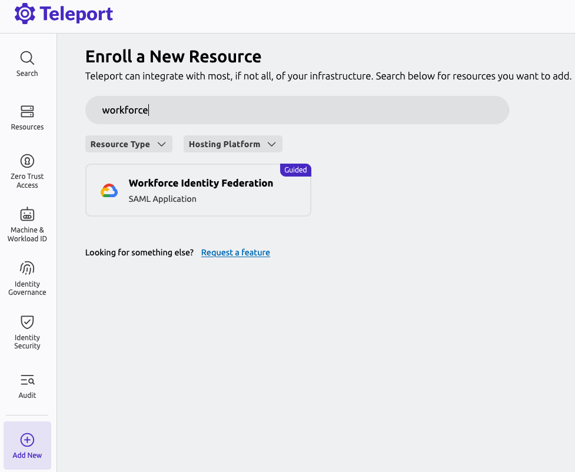
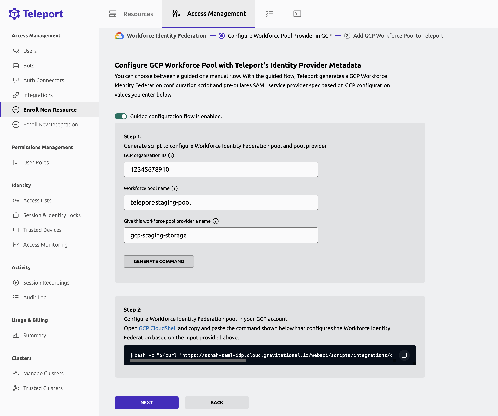

GCP Workforce Identity Federation enables provisioning access to GCP web console and APIs
for identities that are not managed within Google Workspace Admin or GCP Cloud Identity.

The general workflow of configuring the Workforce Identity Federation is to first create
a workforce pool. Then the next step is to create and configure a pool identity provider.
Once a pool identity provider is configured, user's can sign in into GCP web console as
long as their identity is signed by the identity provider in a federated authentication
process.


This guide details how to integrate GCP workforce Identity Federation service with Teleport
SAML IdP, so users can sign in into GCP web console by authenticating with Teleport.


## Prerequisites

(!docs/pages/includes/no-oss-prereqs-tabs.mdx!)

- (!docs/pages/includes/tctl.mdx!)
- If you're new to SAML, consider reviewing our [SAML Identity Provider
Reference](./saml-reference.mdx) before proceeding.
- User with permission to create service provider resource. The preset `editor` role has this permission.
- Access to GCP IAM API, with permission to create workforce identity pool, pool provider and an IAM policy.


Teleport Web UI offers both the guided and manual configuration flow for GCP Workforce Identity
Federation. Manual flow is similar to how you enroll any SAML service provider to Teleport.
In a guided flow, Teleport generates a bash script, which will set up a workforce pool and
pool provider to help you quickly get started with the integration.

## Guided configuration flow
Create a workforce pool and pool provider with the script generated by Teleport.

In the Web UI, under **Access Management**, click **Enroll New Resource** menu.
In the search box, enter “workforce”, which will show the Workforce Identity Federation
integration tile. Click the tile.


Now follow the steps listed below.

## Step 1/3. Configure workforce pool
As a first step, provide the following information to the script generator.


- **Organization ID:** Organization ID of GCP account. The ID is required to create a workforce pool.
- **Pool Name:** Name of the workforce pool to be created. Name should follow [GCP resource naming
convention](https://cloud.google.com/compute/docs/naming-resources#resource-name-format).
- **Pool Provider Name:** Name of the workforce pool provider to be created. Pool provider name
will also be used as SAML service provider name in the next step. Name should follow
[GCP resource naming convention](https://cloud.google.com/compute/docs/naming-resources#resource-name-format).

Click on **Generate Script** button. Teleport Web UI will now show you a copyable bash script.

Open GCP [Cloud Shell](https://shell.cloud.google.com/?show=terminal) and inside the Cloud Shell terminal,
paste the bash script you copied above.

The script, when executed, downloads another bash script using curl. This downloaded bash script
will be configured to download and run a teleport binary. Upon downloading the teleport binary,
the bash script executes the `teleport integration configure samlidp gcp-workforce` command which
creates a workforce pool and a workforce pool identity provider with resource names you provided above.

For the workforce pool provider, Teleport also creates two attribute mapping fields in GCP:
- `google.subject=assertion.subject`: Maps Teleport user name to GCP user name.
- `google.groups=assertion.attributes.roles`: Maps Teleport user roles to GCP groups.

Once the workforce pool and pool provider is created, head back to Teleport Web UI and follow the steps below.

<Admonition type="note" title="resource name and ID">
Teleport uses *Pool Name* and *Pool Provider Name* values to configure both the resource name and
resource ID for workforce pool and workforce pool provider, respectively.
</Admonition>


## Step 2/3 Add workforce pool To Teleport

Proceed to the next step in the UI by clicking the **Next** button.

In this step, you will find that the SAML IdP service provider name, Entity ID, ACS URL and one attribute
mapping field with attribute name "roles" is already populated for you. These values are generated by
Teleport based on GCP configuration values provided in the previous step.

Click **Finish** button. The workforce pool will be now added to Teleport as a SAML IdP service provider resource.

<Admonition type="note" title="Entity ID and ACS URL">
Entity ID and ACS URL values are generated based on *Pool Name* and *Pool Provider Name*. If you update these
values or attribute mapping in GCP, you must also updated the respective SAML service provider spec in Teleport.
</Admonition>


## Step 3/3 Create GCP IAM policy

Once a pool and pool provider is configured in the GCP, and its respective configuration is added
to Teleport as a SAML service provider resource, users can sign in into the GCP web console, as
long as their Teleport roles permit them to access SAML resources.

Though, at this stage, the authenticated user will only be able to sign in into the GCP web console
and they won't be able to access any resources yet. For that, GCP IAM policy must be created with
the desired roles for users.

Head over to the GCP Cloud Shell again to create an IAM policy.

The process of creating an IAM policy for the workforce pool is similar to how you configure GCP
IAM policy in general, with the only difference being that in the "member" field, you need to
reference the workforce principal value which identifies the external user or user group.


For example, the following `gcloud` command demonstrates creating an IAM policy for a workforce
pool user `test@example.com` with a permissions to browse GCP project resources.

```
gcloud projects add-iam-policy-binding GCP_PROJECT_ID \
 --role=”roles/browser”  \
 --member="principal://iam.googleapis.com/locations/global/workforcePools/<pool id>/subject/test@example.com"
```

Refer to the GCP docs on all the possible values that can be used to [represent workforce users
and groups in an IAM policy](https://cloud.google.com/iam/docs/configuring-workforce-identity-federation#representing-workforce-users).


## Workforce pool access management

An important thing to consider is that the GCP workforce pool and pool identity provider are
created at the GCP organization level. It is by creating an IAM policy at the project level that
you can configure a granular access control, binding each workforce pool with a specific project
and its resources.

Creating multiple workforce pools and configuring them with multiple workforce identity providers
(added as an individual SAML IdP service provider in Teleport) is a recommended way to configure
granular access control to GCP resources.

### Attribute mapping

Attribute mapping allows to map user identity and traits available in the SAML assertion data
created by Teleport to GCP identity.

GCP attribute mapping is similar to [Teleport SAML IdP attribute mapping](./saml-attribute-mapping.mdx)
with a slight difference that you use [Google CEL](https://github.com/google/cel-spec/blob/master/doc/langdef.md)
instead of predicate expression to map attributes.

In a guided flow, Teleport creates two attributes mapping:
- Google subject name: `google.subject=assertion.subject`. This maps Teleport user name to google user name.
- Google groups: `google.groups=assertion.attributes.roles`. This maps Teleport roles to Google groups.

Please refer to workforce identity federation [attribute mapping](https://cloud.google.com/iam/docs/workforce-identity-federation#attribute-mappings
) docs for more information.

### Access condition

Access conditions can be used to control which users can be admitted to the GCP workforce pool.
For example, if you only want to ensure that a Teleport user with a role name `gcp-prod` should
be admitted to GCP pool, you can create the following access condition in the workforce pool provider.


```
"gcp-prod" in assertion.attributes.roles
```

Please refer to workforce identity federation [access condition](https://cloud.google.com/iam/docs/workforce-identity-federation#attribute-conditions) docs for more information.

### Mapping access to GCP resources based on Teleport roles

To map access to GCP resources based on Teleport roles, you will need to create an IAM policy
that binds to `principalSet` referencing the Teleport role name.

For example, to create an access policy such that Teleport users with role `gcp-dev` are assigned
with GCP role `roles/browser`, the following steps must be followed.

First, the workforce pool identity provider must be configured with an attribute
mapping that maps the Teleport role to GCP groups. `google.groups=assertion.attributes.roles`

Next, an IAM policy must be created referencing GCP group.

```
gcloud projects add-iam-policy-binding <GCP_Project_ID> \
 --role=”roles/browser”  \
 --member=”principalSet://iam.googleapis.com/locations/global/workforcePools/<pool id>/group/gcp-dev”
```

Since Teleport role was mapped as a GCP group with attribute mapping, the policy will grant
access to Teleport user assigned to `gcp-dev` role.


## Manual integration

While the guided integration makes it easy to get started, advance configuration requirements
should follow a manual integration. Both the Web UI and Teleport `tctl` client can be used for
manual configuration. The following steps shows configuration with Teleport `tctl` admin client.

## Step 1/3. Create workforce pool and pool provider

First, create a workforce pool.
```
gcloud iam workforce-pools create <pool_name> \
      --display-name=<pool_name> \
      --organization=<gcp_organization_id> \
      --description="Teleport workforce pool"
```

Next, download Teleport SAML IdP metadata file.
```
curl -o teleport-samlidp-metadata.xml https://<proxy_host>/enterprise/saml-dp/metadata
```

Finally, create workforce pool provider.
```
gcloud iam workforce-pools providers create-saml <pool_provider_name> \
      --workforce-pool=<pool_name> \
      --display-name=<pool_provider_name> \
      --description="Teleport workforce identity provider" \
      --idp-metadata-path=teleport-samlidp-metadata.xml" \
      --attribute-mapping="google.subject=assertion.subject,google.groups=assertion.attributes.roles" \
      --location=global
```

Please refer to the GCP [Workforce Identity Federation docs](https://cloud.google.com/iam/docs/configuring-workforce-identity-federation) as a canonical reference.

## Step 2/3. Add workforce pool to Teleport

After you create a workforce pool and workforce pool provider, you will need to add workforce
pool provider configuration as a SAML service provider resource in Teleport.

`saml_idp_service_provider` spec:
```yaml
kind: saml_idp_service_provider
version: v1
metadata:
  name: pool_provider_name
spec:
  entity_id: https://iam.googleapis.com/locations/global/workforcePools/pool_name/providers/pool_provider_name
  acs_url: https://auth.cloud.google/signin-callback/locations/global/workforcePools/pool_name/providers/pool_provider_name
  preset: gcp-workforce
  relay_state: https://console.cloud.google/
  attribute_mapping:
  - name: roles
    name_format: urn:oasis:names:tc:SAML:2.0:attrname-format:unspecified
    value: user.spec.roles
```

Replace **pool_name** and **pool_provider_name** values with the workforce pool and pool provider names you used in step 1.

Save the spec as **pool_provider_name.yaml** file. And create the saml service provider resource.
```bash
$ tctl create pool_provider_name.yaml
```

## Step 3/3: Create IAM policy

This step is similar to Step 3 in the guided configuration flow. You wil need to create GCP IAM policy representing
workforce principal.


