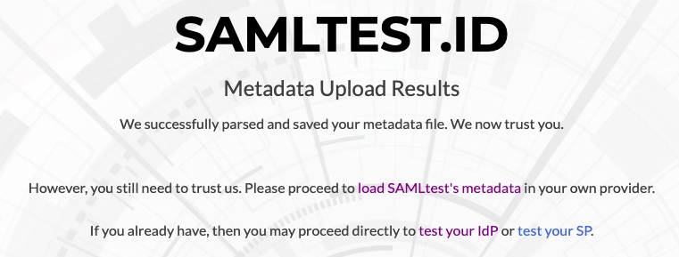
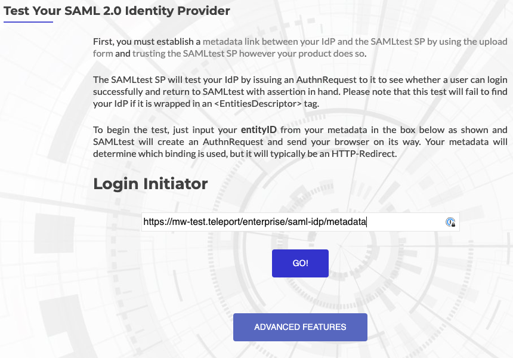
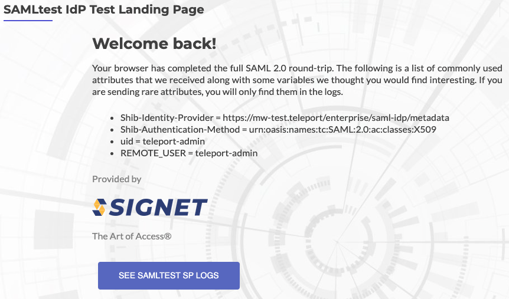

## How to use Teleport as an identity provider

This guide details an example on how to use Teleport as an identity provider to
authenticate to external services.

## Prerequisites

(!docs/pages/includes/commercial-prereqs-tabs.mdx!)

- (!docs/pages/includes/tctl.mdx!)
- If you're new to SAML, consider reviewing our [SAML Identity Provider
  Reference](./saml-reference.mdx) before proceeding.
- User with permission to create service provider resource. The preset `editor` role has this permission.
- SAML application (also known as a SAML service provider or SP) for testing. For this guide, we'll be using
[samltest.id](https://samltest.id/) as a service provider for Teleport's SAML IdP.

## Step 1/3. Add a service provider to Teleport

The minimum configuration values required to add a service provider are:
1. **Entity ID:** The SAML metadata endpoint of the service provider.
1. **ACS URL:** The endpoint where users will be redirected after SAML authentication. ACS URL
is also referred to as SAML SSO URL.

The following `saml_idp_service_provider` spec is a reference for adding samltest.id to Teleport:
```yaml
kind: saml_idp_service_provider
metadata:
  # The friendly name of the service provider. This is used to manage the
  # service provider as well as in identity provider initiated SSO.
  name: samltest-id
spec:
  # entity_id is the metadata endpoint of service provider
  # that serves entity descriptor, aka SP metadata.
  entity_id: https://samltest.id/saml/sp
  # acs_url is the endpoint where users will be redirected after
  # SAML authentication.
  acs_url: https://samltest.id/idp/profile/SAML2/POST/SSO
version: v1
```

Add the spec to Teleport using `tctl`:

```code
$ tctl create saml-sp.yaml
# SAML IdP service provider 'samltest-id' has been created.
```

The above configuration shows creating service provider without an entity descriptor.
In this scenario, Teleport first tries to fetch an entity descriptor by querying the `entity_id` endpoint.
If an entity descriptor is not found at that endpoint, Teleport will generate
a new entity descriptor with the given `entity_id` and `acs_url` values.

If you need more control over the entity descriptor, you may also add it directly
to the `saml_idp_service_provider` spec.

<Details title="(Optional) Manually add entity descriptor" closed>

First download the service provider metadata from samltest.id as `saml-sp.xml`:

```code
$ curl -o saml-sp.xml https://samltest.id/saml/sp
```

Using the template below, create a file called `saml-sp.yaml`. Assign the
metadata you just downloaded to the `entity_descriptor` field in the
`saml_idp_service_provider` object:

```yaml
kind: saml_idp_service_provider
metadata:
  # The friendly name of the service provider. This is used to manage the
  # service provider as well as in identity provider initiated SSO.
  name: samltest-id
spec:
  # The entity_descriptor is the service provider XML.
  entity_descriptor: |
    <md:EntityDescriptor xmlns:md="urn:oasis:names:tc:SAML:2.0:metadata"...
version: v1
```

Add this to Teleport using `tctl`:

```code
$ tctl create saml-sp.yaml
# SAML IdP service provider 'samltest-id' has been created.
```
</Details>

<Admonition type="important">
If an entity descriptor is provided, it's content takes preference over values provided in `entity_id` and `acs_url`.

Teleport only tries to fetch or generate entity descriptor when service provider is created for the first time.
Subsequent updates require an entity descriptor to be present in the service provider spec. As such, when updating
service provider, you should first fetch the spec that is stored in Teleport and only then edit the configuration.
```code
# get service provider spec
$ tctl get saml_idp_service_provider/<service provider name> > service-provider.yml
```
</Admonition>

## Step 2/3. Configure the service provider to recognize Teleport's SAML IdP

First, obtain your Teleport SAML IdP metadata by navigating to `https://<proxy-address>/enterprise/saml-idp/metadata`.
Save it in an easy to remember file name like `teleport-metadata.xml`.

Now navigate to https://samltest.id and click on "Upload Metadata." Next, choose to upload
`teleport-metadata.xml`.



## Step 3/3. Verify samltest.id login works

To verify everything works, navigate back to samltest.id's home page and select
"Test Your IdP." From there, enter the entity ID of Teleport's identity provider,
which is the same as the metadata URL: `https://<proxy-address>/enterprise/saml-idp/metadata`
and click "Go!"



If you are not already logged into Teleport, you will be prompted to login. Once you
are logged in, you should be re-routed to a success page on samltest.id.



This has verified service provider initiated SSO. To verify identity provider initiated
SSO, navigate to `https://<proxy-address>/enterprise/saml-idp/login/samltest-id`,
where `samltest-id` is the friendly name of the service provider object created earlier.
You should be redirected to the same successful login page seen earlier.


## Optional: Creating dedicated role to manage service provider

For production, we recommend creating a dedicated role to manage service provider.

To create a dedicated role, first, ensure you are logged into Teleport as a user that has
permissions to read and modify `saml_idp_service_provider` objects. The default `editor` role
has access to this already, but in case you are using a more customized configuration,
create a role called `sp-manager.yaml` with the following contents:

```yaml
kind: role
metadata:
  name: sp-manager
spec:
  allow:
    rules:
    - resources:
      - saml_idp_service_provider
      verbs:
      - list
      - create
      - read
      - update
      - delete
version: v7
```

Create the role with `tctl`:

```code
$ tctl create sp-manager.yaml
role 'saml-idp-service-provider-manager' has been created
```

Next, add the role to your user.

(!docs/pages/includes/add-role-to-user.mdx role="sp-manager"!)
