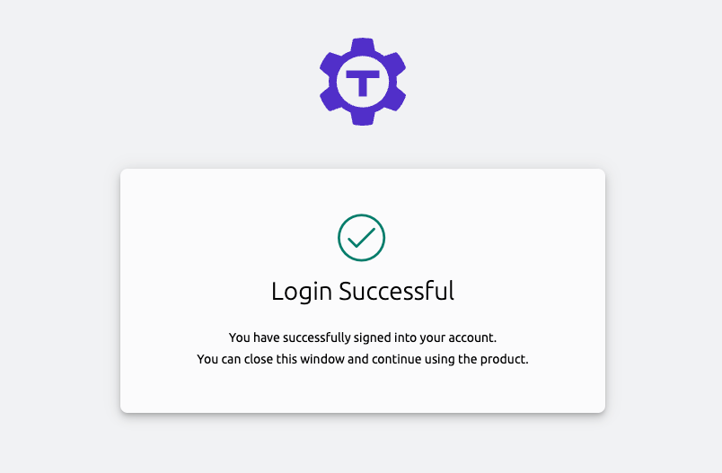

This guide explains how to set up GitHub Single Sign On (SSO) so you can
automatically map teams in your GitHub organization to users and roles in
Teleport.

## Prerequisites

- A GitHub organization with at least one team. <ScopedBlock scope="oss">This
  organization must not have external SSO set up, or Teleport will refuse to
  create the GitHub authentication connector.</ScopedBlock><ScopedBlock
  scope={["enterprise", "cloud"]}>This organization can be hosted from either
  GitHub Cloud or GitHub Enterprise Server.</ScopedBlock>
- Teleport role with access to maintaining `github` resources for using `tctl`
  from the Desktop. This is available in the default `editor` role.

(!docs/pages/includes/edition-prereqs-tabs.mdx!)

- (!docs/pages/includes/tctl.mdx!)

## Step 1/3. Create a GitHub OAuth app

Create and register a GitHub OAuth App. When you do so, ensure that your OAuth
App's "Authentication callback URL" is the following:

```
https://PROXY_ADDRESS/v1/webapi/github/
```

`PROXY_ADDRESS` must be <ScopedBlock scope={["oss", "enterprise"]}>the public
address of the Teleport Proxy Service</ScopedBlock><ScopedBlock
scope="cloud">your Teleport Cloud tenant address</ScopedBlock>.

The app must have the `read:org` scope in order to be able to read org and team
membership details.

Instructions for creating a GitHub OAuth app are available in [GitHub's
documentation](https://docs.github.com/en/developers/apps/building-oauth-apps/creating-an-oauth-app)

Create a client secret to use along with the client ID in the next step:


## Step 2/3. Create a GitHub authentication connector

Define a GitHub authentication connector using `tctl`. Update this example
command with:

- Your OAuth app's client ID and client secret created during the previous step.
- The roles you want to map from your GitHub organization to Teleport roles.
  Roles are defined in the **Repository roles** section of your organization's
  settings.

See [tctl sso configure github](../../reference/cli.mdx#tctl-sso-configure-github)
for a full reference of flags for this command:

```code
$ tctl sso configure github \
--id=<Var name="GITHUB-CLIENT-ID"/> \
--secret=<Var name="GITHUB-CLIENT-SECRET"/> \
--teams-to-roles=<Var name="ORG-NAME,GITHUB-TEAM,access,editor"/> \
> github.yaml
```

The contents of `github.yaml` should resemble the following:

<ScopedBlock scope={["oss"]}>
```yaml
kind: github
metadata:
  name: github
spec:
  api_endpoint_url: ""
  client_id: <client-id>
  client_secret: <client-secret>
  display: GitHub
  endpoint_url: ""
  redirect_url: https://<proxy-address>/v1/webapi/github/callback
  teams_to_logins: null
  teams_to_roles:
    - organization: ORG-NAME
      roles:
        - access
        - editor
      team: GITHUB-TEAM
version: v3
```
</ScopedBlock>

<ScopedBlock scope={["enterprise", "cloud"]}>
```yaml
kind: github
metadata:
  name: github
spec:
  api_endpoint_url: ""
  client_id: <client-id>
  client_secret: <client-secret>
  display: GitHub
  endpoint_url: ""
  redirect_url: https://<proxy-address>/v1/webapi/github/callback
  teams_to_logins: null
  teams_to_roles:
    - organization: ORG-NAME
      roles:
        - access
        - editor
        - reviewer
      team: GITHUB-TEAM
version: v3
```
</ScopedBlock>

<Details title="Mapping multiple roles">
You can add multiple instances of the `--teams-to-roles` flag or edit the connector
file to define multiple mappings. For example:

```code
$  tctl sso configure github \
--id=<Var name="GITHUB-CLIENT-ID"/> \
--secret=<Var name="GITHUB-CLIENT-SECRET"/> \
--teams-to-roles=<Var name="ORG-NAME,GITHUB-TEAM,access,editor"/> \
--teams-to-roles="ORG-NAME,administrators,admins \
--teams-to-roles="DIFFERENT-ORG,developers,dev \
> github.yaml
```

```yaml
spec.
  teams_to_roles:
    - organization: ORG-NAME
      roles:
        - access
        - editor
      team: GITHUB-TEAM
    - organization: ORG-NAME
      roles:
        - admins
      team: administrators
    - organization: DIFFERENT-ORG
      roles:
        - devs
      team: developers
```

</Details>

<Details title="Self-hosting GitHub Enterprise?" scope={["enterprise", "cloud"]} opened>

For self-hosted GitHub Enterprise servers, you can specify the server
instance endpoints with the `--endpoint-url`, `--api-endpoint-url` parameters:

```code
$ tctl sso configure github \
--id=<Var name="GITHUB-CLIENT-ID"/> \
--secret=<Var name="GITHUB-CLIENT-SECRET"/> \
--teams-to-roles=<Var name="ORG-NAME,GITHUB-TEAM,access,editor"/> \
--endpoint-url=https://<Var name="github-enterprise-server-address"/>
--api-endpoint-url=https://<Var name="api-github-enterprise-server-address"/>
> github.yaml
```

```yaml
...
spec:
  ...
  api_endpoint_url: https://<api-github-enterprise-server-address>
  endpoint_url: https://<github-enterprise-server-address>
  ...
```

</Details>

You can test the connector configuration before applying it to your cluster.
This is strongly encouraged to avoid interruption to active clusters:

```code
$ cat github.yaml | tctl sso test
If browser window does not open automatically, open it by clicking on the link:
 http://127.0.0.1:52690/35714f6b-...
Success! Logged in as: alice
--------------------------------------------------------------------------------
Authentication details:
   roles:
   - access
   - editor
   traits:
     github_teams:
     - admins
     kubernetes_groups: null
     kubernetes_users: null
     logins:
     - alice
   username: alice
--------------------------------------------------------------------------------
[GitHub] Received claims:
organization_to_teams:
  Octocats:
  - admins
teams:
- admins
username: alice

--------------------------------------------------------------------------------
[GitHub] Connector team to roles mapping:
- organization: Octocats
  roles:
  - access
  - editor
  team: admins

--------------------------------------------------------------------------------
For more details repeat the command with --debug flag.
```

Finally, create the connector using `tctl`:

```code
$ tctl create -f github.yaml
authentication connector "github" has been created
```

<Admonition type="tip">
  When going through the GitHub authentication flow for the first time,
  the application must be granted access to all organizations that are
  present in the "teams to logins" mapping, otherwise Teleport will not be
  able to determine team memberships for these organizations.
</Admonition>

After a user authenticates, Teleport will add the user's GitHub username to their
`internal.logins` trait for their Teleport session. The preset `access` role has this
trait variable configured to include the GitHub user as an authorized SSH login.
Here is an example role configuration snippet using the trait variable:

```yaml
  allow:
    # List of allowed SSH logins
    logins: ['{{internal.logins}}', ubuntu, debian]

    # List of node labels that users can SSH into
    node_labels:
      '*': '*'
```

## Step 3/4. Log in to Teleport using GitHub

You can now log in with Teleport using GitHub SSO. Run the following to log out
of Teleport and log in again using GitHub SSO.

<ScopedBlock scope={["oss", "enterprise"]}>

```code
$ tsh logout
# Logged out all users from all proxies.
$ tsh login --proxy=tele.example.com --auth=github
If browser window does not open automatically, open it by clicking on the link:
 http://127.0.0.1:56334/6bf976e6-a4be-4898-94eb-8a7b01af2158
```

</ScopedBlock>
<ScopedBlock scope={["cloud"]}>

```code
$ tsh logout
# Logged out all users from all proxies.
$ tsh login --proxy=mytenant.teleport.sh --auth=github
If browser window does not open automatically, open it by clicking on the link:
 http://127.0.0.1:56334/6bf976e6-a4be-4898-94eb-8a7b01af2158
```

</ScopedBlock>

You can also log to the web UI using GitHub by clicking **Other sign-in options** at the login screen.

When you sign in for the first time, you will see a prompt to authorize your
GitHub OAuth app:


Teleport will request only the `read:org` OAuth scope. Read more about OAuth scopes in GitHub's documentation:
[GitHub OAuth scopes](https://developer.github.com/apps/building-oauth-apps/understanding-scopes-for-oauth-apps/)

After logging in successfully, you will see the following:



You will receive the details of your user session within the CLI:

<ScopedBlock scope={["oss"]}>

```code
> Profile URL:        https://tele.example.com:443
  Logged in as:       jeff
  Cluster:            tele.example.com
  Roles:              access
  Logins:             jeff, ubuntu, debian
  Kubernetes:         enabled
  Kubernetes users:   dev
  Kubernetes groups:  developer
  Valid until:        2023-03-08 17:13:50 -0600 CST [valid for 7h51m0s]
  Extensions:         permit-port-forwarding, permit-pty, private-key-policy
```

</ScopedBlock>


<ScopedBlock scope={["enterprise"]}>

```code
> Profile URL:        https://tele.example.com:443
  Logged in as:       jeff
  Cluster:            tele.example.com
  Roles:              access, requester
  Logins:             jeff, ubuntu, debian
  Kubernetes:         enabled
  Kubernetes users:   dev
  Kubernetes groups:  developer
  Valid until:        2023-03-08 17:13:50 -0600 CST [valid for 7h51m0s]
  Extensions:         permit-port-forwarding, permit-pty, private-key-policy
```

</ScopedBlock>

<ScopedBlock scope={["cloud"]}>

```code
> Profile URL:        https://mytenant.teleport.sh:443
  Logged in as:       jeff
  Cluster:            mytenant.teleport.sh
  Roles:              access, requester
  Logins:             jeff, ubuntu, debian
  Kubernetes:         enabled
  Kubernetes users:   dev
  Kubernetes groups:  developer
  Valid until:        2023-03-08 17:13:50 -0600 CST [valid for 7h51m0s]
  Extensions:         permit-port-forwarding, permit-pty, private-key-policy

```

</ScopedBlock>

## Step 4/4. Configure authentication preference

In the previous step we signed in to Teleport using GitHub credentials by
specifying GitHub as our auth type. By editing the `cluster_auth_preference`
resource we can make it the default auth type.

Edit the existing `cluster_auth_preference` resource using `tctl`:

```code
$ tctl edit cap
```

A temporary file will open in your default editor with your `cluster_auth_preference` definition.

Ensure that `cap.yaml` includes the following content:

```yaml
kind: cluster_auth_preference
metadata:
  name: cluster-auth-preference
spec:
  type: github
  webauthn:
    rp_id: 'example.teleport.sh'
version: v2
```

For `rp_id`, use the public address of your <ScopedBlock scope={["oss", "enterprise"]}>Teleport Proxy Service</ScopedBlock><ScopedBlock scope="cloud">Teleport Cloud tenant</ScopedBlock>.

When you save and close the temporary file, `tctl` will update the resource:

```code
#cluster auth preference has been updated
```

<Details scope={["enterprise", "oss"]} opened title="Static configuration file">

You can also edit your Teleport configuration file to include the following:

```yaml
# Snippet from /etc/teleport.yaml
auth_service:
  authentication:
    type: github
```

</Details>

After logging out of `tsh`, you can log back in without specifying
`--auth=github`. You will automatically be redirected to the GitHub auth flow.

## Troubleshooting

(!docs/pages/includes/sso/loginerrortroubleshooting.mdx!)
