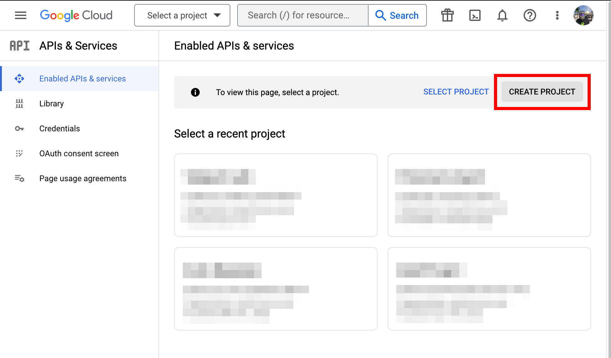

This guide will explain how to configure [Google Workspace](https://workspace.google.com/)
to be a single sign-on (SSO) provider to issue Teleport credentials to specific
groups of users. When used in combination with role based access control (RBAC)
it allows Teleport administrators to define policies like:

- Only members of "DBA" Google group can connect to PostgreSQL databases.
- Developers must never SSH into production servers.

## Prerequisites

Before you get started you’ll need:

- A Google Workspace super administrator account. We recommend setting up a
  separate super admin account with 2FA as opposed to granting your daily user
  super admin privileges.
- Ability to create a Google Cloud project, which requires signing up for Google
  Cloud. Note that this guide will not require using any paid Google Cloud services.
- Ability to set up Google Workspace groups.
- Teleport role with access to maintaining `oidc` resources.  This is available
  in the default `editor` role.

(!docs/pages/includes/commercial-prereqs-tabs.mdx!)

- (!docs/pages/includes/tctl.mdx!)

## Step 1/4. Configure Google Workspace

The setup will consist of:

- Determining whether your Google Workspace plan is correct for your Teleport
  usage
- Creating a new project on Google Cloud Platform
- Configuring OAuth consent for the new project
- Creating an OAuth client ID to allow Google Workspace users to log in to your
  Teleport cluster
- Creating a service account for Teleport to fetch the additional Google Groups
  data.

### Ensure your Google Workspace plan is correct

Teleport's Google Workspace integration works differently depending on your
Google Workspace plan. In this section, we will explain how to determine if
Teleport supports your current Google Workspace setup.

#### How Google Workspace APIs differ by service level

In Google Workspace, **transitive group membership** takes place when a user is
a member of one group by virtue of being in another group. This happens when a child
group is nested within a parent group, so that a member of a child group is also
a member of the parent group.

Google Workspace service accounts can determine whether a user has a transitive
membership to a specific group by calling methods within the Google Workspace
**Cloud Identity API**. These API methods are only usable for users belonging to
specific Google Workspace plans:

- Enterprise Standard
- Enterprise Plus
- Enterprise for Education
- Cloud Identity Premium

The Google Workspace **Directory API** allows administrators to list users and
groups in their Google Workspace domain, but does not enable them to query
transitive group memberships. The Directory API is available for all Google
Workspace plans.

#### How Teleport uses Google Workspace APIs

Teleport's OIDC connector uses Google Workspace's APIs differently depending
on the resource version.

We will show you how to configure the connector later in the
guide, but for now, you should ensure that your Google Workspace plan allows you
to use Teleport as you intend.

We currently support OIDC connector version `v3`. The OIDC connector maps a
user's roles to the Google Workspace groups they belong to.

In order to list a user's Google Workspace groups, Teleport will first attempt to
fetch credentials for calling Cloud Identity API methods, then use these
credentials to query a user's transitive group memberships.

If these credentials do not exist, Teleport will fetch credentials for the
Directory API instead, and will use this API to list the user's groups in your
entire Google Workspace account. Groups that the user belongs to that are
external to the workspace will not be listed.

#### How to check your current plan

To troubleshoot whether your Google Workspace plan supports querying transitive
group memberships, you can visit the
[Groups Inspection](https://admin.google.com/ac/groupsinspection) page in the
Google Admin Console, which relies on the Cloud Identity API. Select "List all
groups for a member" and "Include external groups" to test.

If your Google Workspace plan does not support the Cloud Identity API, you must
ensure that your RBAC does not depend on transitive group memberships.

When querying transitive group memberships, we recommend blocking access to
external groups at the workspace level (following [these
instructions](https://support.google.com/a/answer/9468710)), as membership in
any group that the service account doesn't have full visibility on (including
all groups external to the workspace) will prevent users from logging in.

### Create a new project

In the GCP console, choose the project dropdown menu, and [create a new project](https://console.cloud.google.com/projectselector2/apis/dashboard).

  

### Configure OAuth consent

On the
[OAuth consent screen](https://console.cloud.google.com/apis/credentials/consent)
page of the GCP console, select"Internal" as your User Type.


On the next page, configure the appearance of your connector by picking a
visible name, user support email, etc.

### Select scopes

On the next page, click on **ADD OR REMOVE SCOPES**.
Select the `.../auth/userinfo.email` and `openid` scopes.


Enable the
[Cloud Identity API](https://console.cloud.google.com/apis/library/cloudidentity.googleapis.com)
or the
[Admin SDK API](https://console.cloud.google.com/apis/library/admin.googleapis.com)
for transitive and direct group membership, respectively. Enabling both is fine.

<Notice type="warning">

Your Google Workspace account must enable support for the API you choose to use.

Please consult the documentation for your chosen API to ensure that you have the
correct Google Workspace plan.

</Notice>

### Create an OAuth client ID

Under **Credentials**, select **CREATE CREDENTIALS**, then **OAuth client ID**:


Select "Web application" as the Application type, pick a name, then set the
redirect URI based on the path to your Teleport proxy or cloud tenant:
<nobr><Var name="https://example.teleport.sh"/>`/v1/webapi/oidc/callback`</nobr>


Copy the Client ID and Client Secret from the next screen or click **DOWNLOAD JSON**:


### Create a service account

From the GCP **IAM & Admin** menu select **Service Accounts**. From the kebab
menu click **CREATE SERVICE ACCOUNT**:


On the [Create a
service account](https://console.cloud.google.com/iam-admin/serviceaccounts/create)
page, pick a name for your service account. Leave project access grants and user
access grants empty.


Click the newly-created account to view its details, and copy the Unique ID for later.


Create a new key for the service account, select JSON as the key type, and save
the resulting JSON file.


Later, we will make this JSON available to the Teleport Auth Server via the
OIDC Connector configuration, either by referencing a local file or pasting the
JSON into the `tctl` command creating the connector. If you plan to take the
first approach, you will need to upload the JSON to the Auth Server.

<Admonition type="note">
Teleport requires the service account JSON to be available to all Teleport Auth
Server hosts when deploying Teleport in a High Availability configuration.
For distributed / HA or cloud deployments, we suggest providing the JSON when
creating the connector resource.
</Admonition>

### Configure domain-wide delegation

Configure [domain-wide
delegation](https://admin.google.com/ac/owl/domainwidedelegation) for your
newly-created service account:

Click "Add new" and add the numeric Unique ID that you've copied earlier from
the service account:


Add **one** of the following scopes (more info [here](#how-google-workspace-apis-differ-by-service-level)):
- Direct and Indirect Groups (*Transitive Group Membership Support*)
  - `https://www.googleapis.com/auth/cloud-identity.groups.readonly`
- Direct Groups Only
  - `https://www.googleapis.com/auth/admin.directory.group.readonly`

## Step 2/4. Create an OIDC connector

Create the OIDC connector resource using `tctl`. We will explain how to choose
values for fields within the resource spec below:

<Tabs>
<TabItem scope={["oss", "enterprise", "cloud"]} label="Embedded JSON">

Use this method to define the service account JSON in the connector resource.
This method doesn't require providing the JSON file to the host(s) running the
Auth service.

```code
$ tctl sso configure oidc --preset google --id <CLIENT-ID> \
--secret <CLIENT-SECRET> \
--claims-to-roles groups,auditor@example.com,auditor \
--claims-to-roles groups,teleport-developers@example.com,access \
--google-admin=<GOOGLE-WORKSPACE-ADMIN-EMAIL> \
--google-acc '
{
  "type": "service_account",
  ...
  "universe_domain": "googleapis.com"
}'
```

The file created will resemble:

```yaml
kind: oidc
metadata:
  name: google
spec:
  claims_to_roles:
  - claim: groups
    roles:
    - auditor
    value: auditor@example.com
  - claim: groups
    roles:
    - access
    value: teleport-developers@example.com
  client_id: <CLIENT-ID>
  client_secret: <CLIENT-SECRET>
  display: Google
  google_admin_email: <GOOGLE-WORKSPACE-ADMIN-EMAIL>
  google_service_account: |2-

    {
      "type": "service_account",
      ...
      "universe_domain": "googleapis.com"
    }
  issuer_url: https://accounts.google.com
  redirect_url: https://example.teleport.sh:443/v1/webapi/oidc/callback
version: v3
```

</TabItem>
<TabItem scope={["oss", "enterprise"]} label="Uploaded JSON file">

Use this method for single self-hosted Teleport Auth instances, or when you can
easily and reliably make the JSON file available to all hosts running the Auth
service.

```code
$ tctl sso configure oidc --preset google --id <CLIENT-ID> \
--secret <CLIENT-SECRET> \
--google-acc-uri <PATH/TO/SERVICE-ACCOUNT-KEY>.json \
--claims-to-roles groups,auditor@example.com,auditor \
--claims-to-roles groups,teleport-developers@example.com,access \
--google-admin=<GOOGLE-WORKSPACE-ADMIN-EMAIL> > gworkspace-connector.yaml
```

The file created will resemble:

```yaml
kind: oidc
metadata:
  name: google
spec:
  claims_to_roles:
  - claim: groups
    roles:
    - auditor
    value: auditor@example.com
  - claim: groups
    roles:
    - access
    value: teleport-developers@example.com
  client_id: <CLIENT-ID>
  client_secret: <CLIENT-SECRET>
  display: Google
  google_admin_email: <GOOGLE-WORKSPACE-ADMIN-EMAIL>
  google_service_account_uri: /PATH/TO/SERVICE-ACCOUNT-KEY.json
  issuer_url: https://accounts.google.com
  redirect_url: https://teleport.example.com/v1/webapi/oidc/callback
version: v3
```

</TabItem>
</Tabs>

<Admonition
  type="tip"
  title="Copy/Paste Tip"
>
  Be sure to remove < > brackets around tokens in the sample configuration above.
  For example, replace `<GOOGLE-WORKSPACE-ADMIN-EMAIL>` with `admin@yourdomain.com`.
</Admonition>

The email that you set for `google_admin_email` **must** be the email address of
a user that has permission to list all groups, users, and group membership in
your Google Workspace account. This user will generally need super admin or group
admin privileges.

Do not use the email of the service account for `google_admin_email`. The
configuration display will look the same, but the service account will not have
the required domain-wide delegation.

The `client_id` field must be the unique ID number captured from the Google Cloud
Platform UI. An indicator that this is misconfigured is if you see "invalid Google
Workspace credentials for scopes [...]" in your log.

Test the connector:

```code
$ cat gworkspace-connector.yaml | tctl sso test
```

This will open your browser and attempt to sign you in to your Teleport cluster
using Google. If it fails, the CLI output will provide useful troubleshooting
information.

Create the connector using the `tctl` tool:

```code
$ tctl create -f gworkspace-connector.yaml
```

<Details title="Upgrading from Teleport < 8.1.2?">
If you have a configured connector from a version of Teleport older than 8.1.2,
you can upgrade your connector from `v2` to `v3`:

First, fetch the connector data:

```code
$ umask 077
$ tctl get --with-secrets oidc/connectorname > connector.yaml
```

Next, edit `connector.yaml` to change the version number from `v2` to `v3`, and
then update the connector:

```code
$ tctl create -f connector.yaml
$ rm connector.yaml
```

Then, to start fetching transitive groups instead of just direct groups, edit
the [domain-wide
delegation](https://admin.google.com/ac/owl/domainwidedelegation) for your
service account and swap out the OAuth scopes for
`https://www.googleapis.com/auth/cloud-identity.groups.readonly`. To undo the
change, remove that scope and add
`https://www.googleapis.com/auth/admin.directory.group.readonly` again.

While a `v3` connector is configured, you can no longer downgrade Teleport to a
version before 8.1.2. Before such a downgrade, follow the above instructions and
change the version number back to `v2`.

</Details>

## Step 3/4. Test your Google Workspace OIDC connector

The Web UI will now contain a new button: "Login with Google". To log in with
the CLI:

```code
$ tsh --proxy=proxy.example.com login --auth=google
```

This command will print the SSO login URL (and will try to open it
automatically in a browser).

## Step 4/4. Enable default OIDC authentication

(!docs/pages/includes/enterprise/oidcauthentication.mdx!)

## Troubleshooting

(!docs/pages/includes/sso/loginerrortroubleshooting.mdx!)

## Further reading

- [Google Workspace Cloud Identity API](https://cloud.google.com/identity)
- [Google Workspace Directory API](https://developers.google.com/admin-sdk/directory)
- [How nested Google Workspace groups work](https://support.google.com/a/answer/167100?hl=en)
