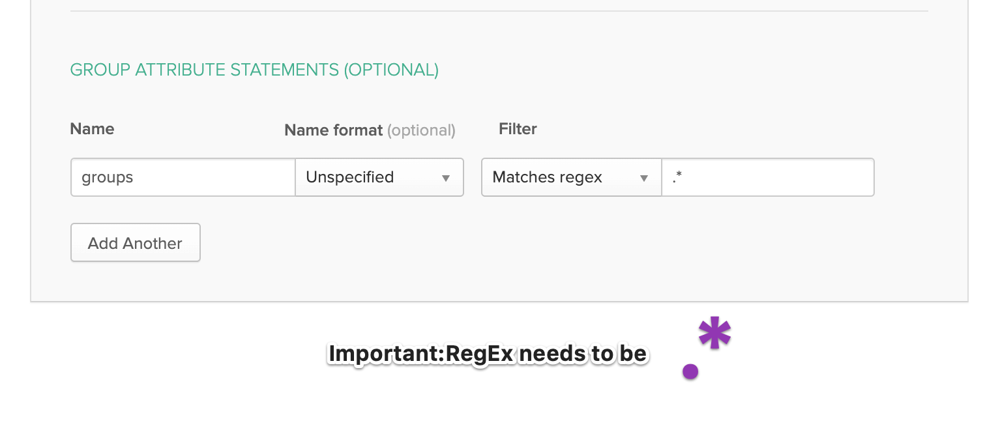
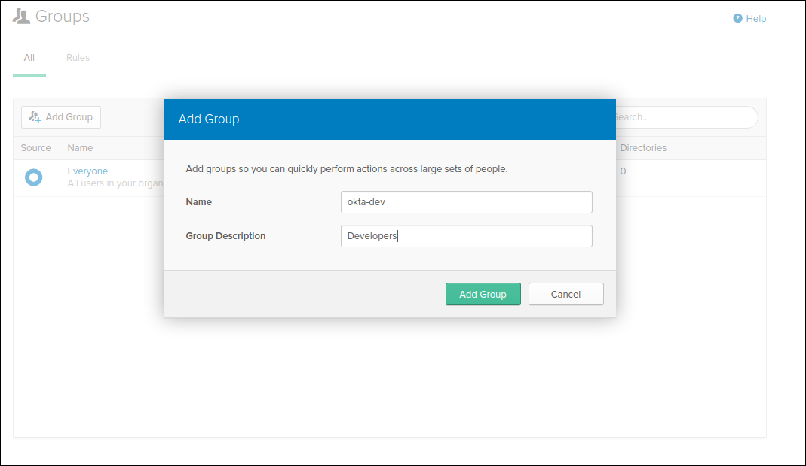
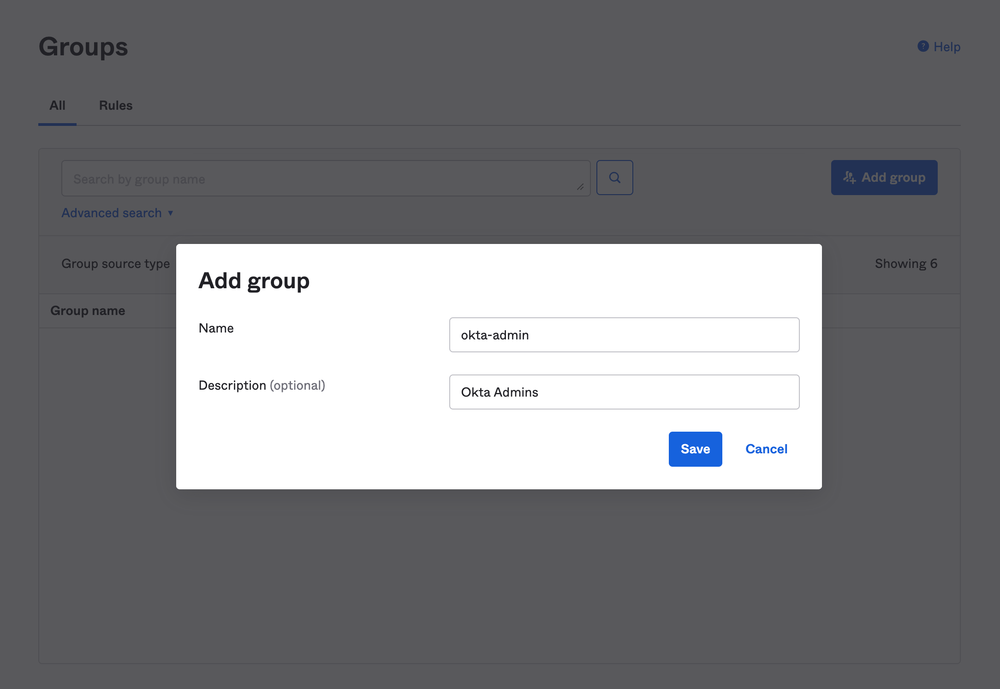
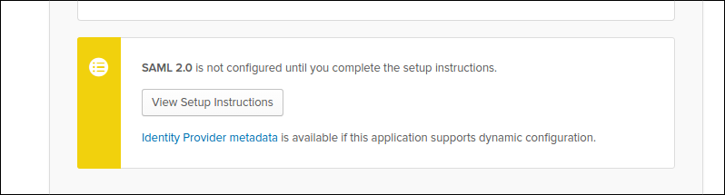

## How to use Okta as a single sign-on (SSO) provider for SSH

This guide will cover how to configure [Okta](https://www.okta.com/) to issue
SSH credentials to specific groups of users. When used in combination with role
based access control (RBAC), it allows SSH administrators to define policies
like:

- Only members of "DBA" group can SSH into machines running PostgreSQL.
- Developers must never SSH into production servers.

## Prerequisites

- Okta account with admin access. Your account must include users and at least two groups.
- Teleport role with access to maintaining `saml` resources.  This is available in the default `editor` role.

(!docs/pages/includes/commercial-prereqs-tabs.mdx!)

(!docs/pages/includes/tctl.mdx!)

(!docs/pages/includes/enterprise/samlauthentication.mdx!)

## Configure Okta

First, create a SAML 2.0 Web App in Okta configuration section

### 1. Select Create New App

Select Web Platform and SAML 2.0 Sign On Method.


## Configure the App

We are going to map the Okta groups we've created above to the SAML Attribute
statements (special signed metadata exposed via a SAML XML response).

GENERAL

- Single sign on URL `https://teleport-proxy.example.com:443/v1/webapi/saml/acs/connectorName`
- Audience URI (SP Entity ID)`https://teleport-proxy.example.com:443/v1/webapi/saml/acs/connectorName`
- Name ID format `EmailAddress`
- Application username `Okta username`

SINGLE ATTRIBUTE STATEMENTS

- Name: `username`  | Name format: `Unspecified` | Value: `user.login`

GROUP ATTRIBUTE STATEMENTS

- Name: `groups` | Name format: `Unspecified`
- Filter: `Matches regex` |  `.*`


### Note: RegEx requires `.*`



<Admonition
  type="tip"
  title="tip"
>
  Notice that we have set "NameID" to the email format and mapped the groups with
  a wildcard regex in the Group Attribute statements. We have also set the "Audience"
  and SSO URL to the same value.
</Admonition>

## Create & Assign Groups

**Create Groups**

We are going to create two groups: "okta-dev" and "okta-admin":



...and the admin:



Assign groups and people to your SAML app:


Make sure to download the metadata in the form of an XML document. It will be used it to
configure a Teleport connector:



## Create a SAML Connector

Now, create a SAML connector [resource](../../reference/resources.mdx):

```yaml
(!examples/resources/saml-connector.yaml!)
```

(!docs/pages/includes/sso/idp-initiated.mdx!)

Create the connector using `tctl` tool:

```code
$ tctl create okta-connector.yaml
```

## Create a Developer Teleport Role

We are going to create a new role that'll pull in external information from Okta. Notice
`{{external.username}}` login. It configures Teleport to look at *"username"* Okta claim
and use that field as an allowed login for each user.  This example uses email as the
username format.  The `email.local(external.trait)` function will remove the `@domain`
and just have the username prefix.

```yaml
kind: role
version: v5
metadata:
  name: dev
spec:
  options:
    max_session_ttl: 24h
  allow:
    logins: [ "{{email.local(external.username)}}", ubuntu ]
    node_labels:
      access: relaxed
```

- Devs are only allowed to login to nodes labelled with `access: relaxed` label.
- Developers can log in as `ubuntu` user
- Developers also do not have any "allow rules" i.e. they will not be able to
  see/replay past sessions or re-configure the Teleport cluster.

We'll use tctl to create this role on the auth server:

```code
$ tctl create dev.yaml
```

## Testing

The Web UI will now contain a new button: "Login with Okta". The CLI is
the same as before:

```code
$ tsh login --proxy=proxy.example.com --auth=okta
```

This command will print the SSO login URL (and will try to open it
automatically in a browser).

<Admonition
  type="tip"
  title="Tip"
>
  Teleport can use multiple SAML connectors. In this case a connector name
  can be passed via `tsh login --auth=connector_name`
</Admonition>

## Troubleshooting

(!docs/pages/includes/sso/loginerrortroubleshooting.mdx!)

