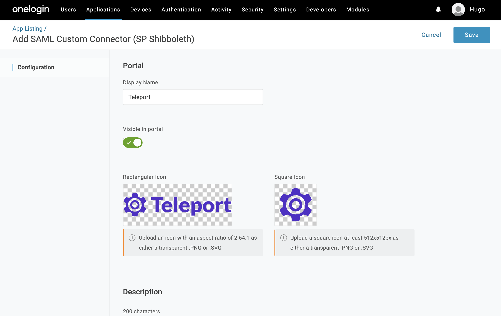

This guide will explain how to configure [OneLogin](https://www.onelogin.com/) to issue
Teleport credentials to specific groups of users. When used in combination with role
based access control (RBAC) it allows SSH administrators to define policies
like:

- Only members of "DBA" group can connect to PostgreSQL databases.
- Developers must never SSH into production servers.
- ... and many others.

## Prerequisites

- One Login account with admin access and users assigned to at least two groups.
- Teleport role with access to maintaining `saml` resources.  This is available in the default `editor` role.

(!docs/pages/includes/commercial-prereqs-tabs.mdx!)

- (!docs/pages/includes/tctl.mdx!)

(!docs/pages/includes/enterprise/samlauthentication.mdx!)

## Configure Application

Using OneLogin control panel, create a SAML 2.0 Web App in SAML configuration
section:




### Download Icons

- [Square Icon](../../../img/sso/onelogin/teleport.png)
- [Rectangular Icon](../../../img/sso/onelogin/teleportlogo@2x.png)

Set `Audience`, `Recipient` and `ACS (Consumer) URL Validator` to the same value:

`https://teleport.example.com:3080/v1/webapi/saml/acs` where `teleport.example.com` is the
public name of the teleport web proxy service:


Teleport needs to assign groups to users. Configure the application with some parameters
exposed as SAML attribute statements:


<Admonition
  type="warning"
  title="Important"
>
  Make sure to check `Include in SAML assertion` checkbox.
</Admonition>

Add users to the application:


### Download SAML XML Metadata

Once the application is set up, download `SAML Metadata`.


## Create a SAML Connector

Now, create a SAML connector [resource](../../reference/resources.mdx).
Write down this template as `onelogin-connector.yaml`:

```yaml
(!examples/resources/onelogin-connector.yaml!)
```

Update the `acs` value with your public cluster URL and paste the SAML metadata that you
previously downloaded in `entity_descriptor`.

Create the connector using `tctl` tool:

```code
$ tctl create onelogin-connector.yaml
```

## Create a new Teleport Role

We are going to create a new that'll use external username data from OneLogin
to map to a host linux login.

In the below role, Devs are only allowed to login to nodes labelled with `access: relaxed`
Teleport label. Developers can log in as either `ubuntu` to a username that
arrives in their assertions. Developers also do not have any rules needed to
obtain admin access to Teleport.

```yaml
kind: role
version: v5
metadata:
  name: dev
spec:
  options:
    max_session_ttl: "24h"
  allow:
    logins: [ "{{external.username}}", ubuntu ]
    node_labels:
      access: relaxed
```

**Notice:** Replace `ubuntu` with linux login available on your servers!

```code
$ tctl create dev.yaml
```

## Testing

The Web UI will now contain a new button: "Login with OneLogin". The CLI is
the same as before:

```code
$ tsh --proxy=proxy.example.com login
```

This command will print the SSO login URL (and will try to open it
automatically in a browser).

<Admonition
  type="tip"
  title="Tip"
>
  Teleport can use multiple SAML connectors. In this case a connector name
  can be passed via `tsh login --auth=connector_name`
</Admonition>


## Troubleshooting

(!docs/pages/includes/sso/loginerrortroubleshooting.mdx!)
