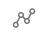
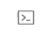

Teleport Policy streamlines and centralizes access management across your entire infrastructure.

Teleport Policy with Access Graph provides a visual representation of the relationships between
users, roles, and resources in your organization. It can help you answer questions like:

- What resources can a specific user access?
- What users can access a specific resource?
- What are the relationships between users, roles, and resources?

## Getting started with Teleport Policy

Access Graph is a feature of the [Teleport Policy](https://goteleport.com/platform/policy/) product that is only 
available to Teleport Enterprise customers.

After logging into the Teleport UI, go to the Management tab. If enabled, Access Graph options can be found
under the Permission Management section.

<Admonition type="note">
Note: For managed Teleport Enterprise customers, Access Graph is enabled by default.
If you are a self-hosted Teleport customer, you will need to set up [Access Graph](./access-graph/self-hosted.mdx) and ensure you have an updated 
`license.pem` with Teleport Policy enabled to use it.
</Admonition>

## How to use it

Teleport Access Graph can help you to answer questions like:

- Who can access a specific resource?

Determine who has access to resources and understand the pathways that grant access:

- What resources can a specific user access?

At a glance, you can view all the resources a user can access:

## Navigation

The left hand side menu contains the main navigation options:

- Graph view 
- Search 
- SQL editor 
- Integrations 

## Graph View

Graph view is the main view that shows the connections between identities and resources.
By default, an aggregated view of access paths grouped by identity is showed.

## Search

To search for a graph node, use the search bar at the top of the page or the search icon on the right hand side:

You can then search through all node types and all imported entities.

## Graph nodes

Teleport Access Graph divides your infrastructure into six main components:

1. Identities

Identities are the actors that can access your infrastructure. They can be employees,
contractors, machines or bots.

The number on the right hand side shows "standing privileges".
Standing privileges is the number of resources that an identity can access without
creating an access request.

2. User Groups

Identity Groups are collections of identities. They can be used to organize users
based on their role or team, and they can be nested.

3. Actions

Actions are the things that identities can or cannot do. Actions are related to
resources. For example, a user can SSH into a node.

4. Deny Actions

Deny Actions are the things that identities cannot do. Deny Actions are related to
resources. For example, a user cannot SSH into a node.

5. Resource Groups

Resource Groups are collections of resources. They can be used to organize
resources based on their role or team.

The number on the right hand side shows the number of resources that a resource group contains.

6. Resources

Resources are the things that users can or cannot access. They can be
servers, databases, or Kubernetes clusters.