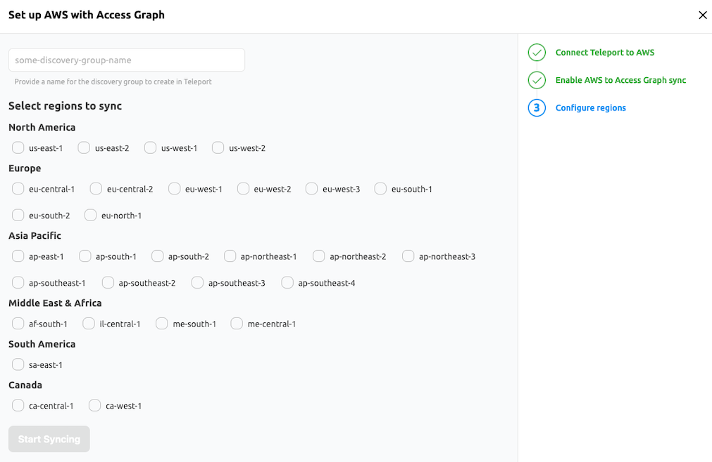

Teleport can integrate with identity providers (IdPs) like Okta and AWS OIDC 
which can then be used with Access Graph, providing a comprehensive, 
interactive view of how users, roles, and resources are interconnected, 
enabling administrators to better understand and control access policies.

## Integrations


Integrations page shows integrations that can be enabled or are already enabled in Access Graph.

<Admonition title="Note" type="tip">
Resources imported into Teleport through Teleport enabled integrations are automatically imported into
Access graph without any additional configuration.
</Admonition>

## Set up a new integration

Visit the Teleport Web UI and click **Access Management** on the menu bar at the
top of the screen. 

On the left sidebar, click **Access Graph**. Click the connection icon: 
 
Choose an application. Example:

## Step 1/3. Add integration 

For example, we can connect to AWS through OIDC:


## Step 2/3. Configure integration and allow sync

Run the provided command in AWS CloudShell:


## Step 3/3. Select your AWS regions

Choose your AWS regions:



<Admonition type="note">
To access the interface, your user must have a role that allows `list` and `read` verbs on the `access_graph` resource, e.g.:  

```yaml
kind: role
version: v7
metadata:
  name: my-role
spec:
  allow:
    rules:
    - resources:
      - access_graph
      verbs:
      - list
      - read
```

The preset `editor` role has the required permissions by default.
</Admonition>

Teleport can also import and grant access to resources from Okta organizations, such as user profiles, groups and applications. You can view connection data in Access Graph. Follow the steps here to add an [Okta 
integration](../../enroll-resources/application-access/okta/hosted-guide.mdx) in your cluster.

## Next steps
- Explore [connections and resource paths](./policy-connections.mdx) with Access Graph.
