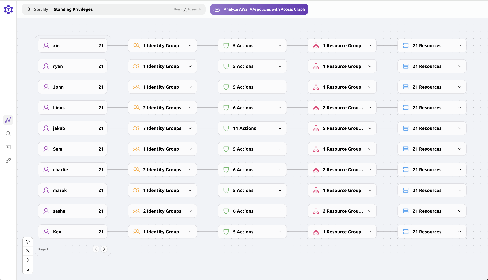

<Admonition type="tip" title="Preview">
  Teleport Access Graph is currently in Preview. Currently, it is only available
  to the Teleport Cloud Team users. Not all Teleport resources are currently
  supported.
</Admonition>

Teleport Access Graph is a new way to visualize and understand access to your
infrastructure. It provides a visual representation of the relationships between
users, roles, and resources in your organization.

## The basics

Teleport Access Graph divides your infrastructure into five main components:

1. Users

    

    Users are the people who access your infrastructure. They can be employees,
    contractors, or even bots.

2. User Groups

    

    User Groups are collections of users. They can be used to organize users
    based on their role or team.

3. Actions

    

    Actions are the things that users can or cannot do. Actions are related to
    resources. For example, a user can SSH into a node.

4. Resource Groups

    

    Resource Groups are collections of resources. They can be used to organize
    resources based on their role or team.

5. Resources

    

    Resources are the things that users can or cannot access. They can be
    servers, databases, or Kubernetes clusters.

## Where to find it

After logging into the Teleport UI, go to Management tab. If enabled, Access Graph options can be find
under the Permission Management section.

## How to use it

Teleport Access Graph can help you to answer questions like:

- Who can access a specific resource?

- What resources can a specific user access?

## How does it work?

Teleport Access Graph imports all Teleport resources and keeps them up to date, so every time you make a change
to your Teleport resources, the Access Graph will reflect those changes.
