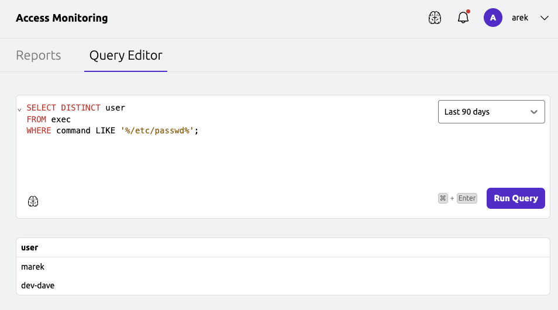
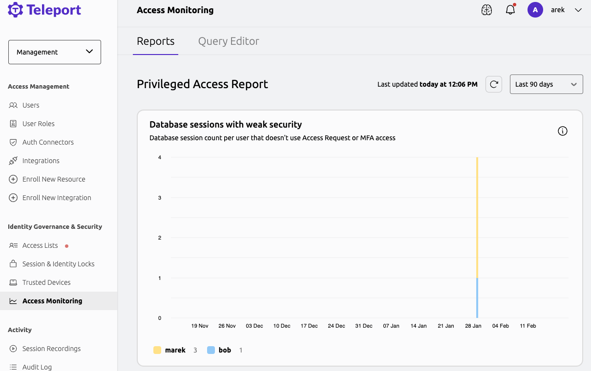

Access Monitoring allows users to understand and analyze the access patterns in a Teleport cluster.

When Access Monitoring is enabled in a cluster, Teleport runs a background service that collects
data from different input sources, builds graphical reports highlighting usage patterns
within the cluster, and allows users to create automated response actions.

The primary data source for Access Monitoring is the Teleport audit log. Out of the box,
Teleport includes a report that searches the audit log for events indicating risky usage patterns (such as SSH
or database sessions without MFA) and provides users with recommendations on suggested actions.

Users are able to write their own custom access monitoring queries by querying the audit log.

<Admonition type="note">
  Access Monitoring is not currently supported with External Audit Storage
  in Teleport Enterprise (Cloud). This functionality will be
  enabled in a future Teleport release.
</Admonition>

## Prerequisites
- Teleport v14 or later.
- For self-hosted Teleport the [Amazon Athena Backend](../../reference/backends.mdx) is required.


### Configuration

<Tabs>
<TabItem scope={["cloud","team"]} label="Teleport Enterprise (cloud-hosted)">

Teleport Zero Trust Access Monitoring is enabled by default for all Teleport Enterprise (cloud-hosted) accounts.

</TabItem>
<TabItem scope={["enterprise", "oss"]} label="Self-Hosted">

To enable Access Monitoring you need to update the Teleport Auth Service configuration:
```yaml
auth_service:
  access_monitoring:
    enabled: true
    # AWS role ARN that Teleport will assume to execute Athena SQL queries.
    # The Teleport role should be configured with a trust relationship and should be able to assume this role.
    role_arn: arn:aws:iam::123456789012:role/AccessMonitoringRole
    # S3 bucket where Access Monitoring reports will be stored.
    report_results: s3://audit-long-term/report_results
    # (Optional) Athena workgroup used by Access Monitoring
    # queries (if not set, the default primary workgroup will be used).
    workgroup: access_monitoring_workgroup
```


Access Monitoring executes Athena SQL queries using a different AWS role than the one used by the Auth Service to access the Athena Audit Events backend.
This role should have a trusted relationship with the Teleport role and the following IAM permissions.
Ensure that the IAM role used by Access Monitoring is configured with sufficient access to Athena.
Below, you can find the IAM permissions that allow the Auth Service to execute Athena queries and store the results in an S3 bucket.

| Placeholder value | Replace with                                             |
|-------------------|----------------------------------------------------------|
| `eu-central-1`    | AWS region                                               |
| `1234567890`      | AWS account ID                                           |
| `audit-long-term` | S3 bucket used for long-term storage                     |
| `audit-transient` | S3 bucket used for transient storage                     |
| `kms_id`          | KMS key ID used for server-side encryption of S3         |
| `audit_db`        | Glue database used for audit logs                        |
| `audit_table`     | Glue table used for audit logs                           |
| `audit_workgroup` | Athena workgroup used for Access Monitoring queries      |

<Details title="IAM Policy" closed>
```json
{
  "Statement": [
    {
      "Action": [
        "s3:ListBucketVersions",
        "s3:ListBucketMultipartUploads",
        "s3:ListBucket",
        "s3:GetBucketLocation"
      ],
      "Effect": "Allow",
      "Resource": [
        "arn:aws:s3:::audit-transient",
        "arn:aws:s3:::audit-long-term"
      ]
    },
    {
      "Action": [
        "s3:PutObject",
        "s3:GetObjectVersion",
        "s3:GetObject"
      ],
      "Effect": "Allow",
      "Resource": [
        "arn:aws:s3::::audit-transient/results/*",
        "arn:aws:s3:::audit-long-term/report_results/*"
      ]
    },
    {
      "Action": [
        "s3:ListMultipartUploadParts",
        "s3:GetObjectVersion",
        "s3:GetObject",
        "s3:AbortMultipartUpload"
      ],
      "Effect": "Allow",
      "Resource": [
        "arn:aws:s3:::audit-transient/results/*",
        "arn:aws:s3:::audit-long-term/report_results/*",
        "arn:aws:s3:::audit-long-term/events/*"
      ]
    },
    {
      "Action": [
        "glue:GetTable",
        "athena:StartQueryExecution",
        "athena:GetQueryResults",
        "athena:GetQueryExecution"
      ],
      "Effect": "Allow",
      "Resource": [
        "arn:aws:glue:eu-central-1:1234567890:table/audit_db/audit_table",
        "arn:aws:glue:eu-central-1:1234567890:database/audit_db",
        "arn:aws:glue:eu-central-1:1234567890:catalog",
        "arn:aws:athena:eu-central-1:1234567890:workgroup/audit_workgroup"
      ]
    },
    {
      "Action": [
        "kms:GenerateDataKey",
        "kms:Decrypt"
      ],
      "Effect": "Allow",
      "Resource": "arn:aws:kms:eu-central-1:1234567890:key/kms_id"
    }
  ],
  "Version": "2012-10-17"
}
```
</Details>

You can use our [Terraform Example](https://github.com/gravitational/teleport/tree/v(=teleport.version=)/examples/athena)
to set up Athena and Access Monitoring AWS resources and generate Athena Backend and Access Monitoring Teleport configuration:

```code
$ terraform apply
...
 access_monitoring:
   enabled: true
   report_results: s3://long-term/report_results
   role_arn: arn:aws:iam::123456789012:role/AccessMonitoringRole
   workgroup: access_monitoring_workgroup
```

</TabItem>
</Tabs>

## Access Monitoring RBAC Permissions

To access the Access Monitoring interface, a user must have a role that allows
`list`, `read` and `use` verbs on the `security_report` and `audit_query` resources.
The preset `auditor` role has these permissions by default. Alternatively, you can create a custom role with these permissions:
```yaml
kind: role
metadata:
  name: my-role
spec:
  allow:
    rules:
    - resources:
      - security_report
      - audit_query
      verbs:
      - list
      - read
      - use
```

## Query Editor

The Query Editor in Zero Trust Access Monitoring provides users with an interface to interactively query audit logs and generate reports.
Users can write custom SQL queries for these views to build custom reports akin to querying a relational database.

Within the Query Editor, users have access to a number of SQL views representing audit events captured by Teleport.
Below is a list of the available SQL views:

<Details title="Available SQL views" closed>
```
access_list_create
access_list_delete
access_list_member_create
access_list_member_delete
access_list_member_update
access_list_review
access_list_update
access_request_create
access_request_review
auth
bot_join
cert_create
db_session_query
db_session_query_failed
db_session_start
device_authenticate
device_enroll
exec
instance_join
join_token_create
kube_request
lock_created
lock_deleted
recovery_code_used
reset_password_token_create
saml_idp_auth
session_command
session_join
session_rejected
session_start
user_create
user_login
user_password_change
windows_desktop_session_end
windows_desktop_session_start
```
</Details>

To access the Query Editor, navigate to the `Access Monitoring` section in the Teleport UI and click on the `Query Editor` tab.

### SQL query examples

- Query for unique users who executed a ssh command involving `/etc/passwd` file in some way:
```sql
SELECT
  DISTINCT user
FROM
  exec
WHERE
  command LIKE '%/etc/passwd%';
```



- Select the count of unique IP addresses associated with each user cert over different event dates:
```sql
SELECT
  event_date,
  identity_user AS user,
  COUNT(DISTINCT cert_create.identity_client_ip) AS unique_ip_count
FROM
  cert_create
GROUP BY
  event_date,
  identity_user
ORDER BY
  event_date;
```


- Selects users who interacted with the Teleport cluster from more than one different IP address:
```sql
SELECT * FROM (SELECT
  event_date,
  identity_user AS user,
  COUNT(DISTINCT cert_create.identity_client_ip) AS unique_ip_count
FROM
  cert_create
GROUP BY
  event_date,
  identity_user
ORDER BY
  event_date) AS data WHERE unique_ip_count > 1;
```

- Show all the unique IP addresses that were used by the user 'admin-annie':
```sql
SELECT
  DISTINCT identity_client_ip
FROM
  cert_create
WHERE identity_user = 'admin-annie'
```

- Show Access Requests and their reviews:

```sql
SELECT
  *
FROM
  access_request_create, access_request_review
WHERE
  access_request_create.id = access_request_review.id
```

- Show details about an Access Request and its reviews:

```sql
SELECT
  request.user, request.reason, request.roles, request.resource_ids, review.reviewer, review.state
FROM
  access_request_create as request, access_request_review as review
WHERE
  request.id = review.id
```

# Access Monitoring Reports

Access Monitoring provides a number of pre-built reports.

## Privileged Access Report

The `Privileged Access Report` reports offers valuable insight into identifying weak security events across infrastructure.
The report allows to identify the following weak security events:

### Database sessions with weak security

The following query identifies database sessions with weak security
such as as sessions with missing Access Requests, MFA, impersonation, and trusted device identification.

```sql
SELECT
    event_date,
    count(*) as count,
    user
FROM
    db_session_start
WHERE
    CARDINALITY(access_requests) IS NULL
AND
    with_mfa IS NULL
AND
    impersonator IS NULL
AND
    trusted_device_device_id IS NULL
GROUP BY
    event_date,
    user
ORDER BY
    event_date
```




**Suggestion:**  Set up Access Requests, Device Trust and per-session MFA.

### SSH sessions with weak security

The following query identifies SSH sessions with weak security,
such as as sessions with missing Access Requests, MFA, impersonation, and trusted device identification.

```sql
SELECT
    event_date,
    count(*) as count,
    user
FROM
    session_start
WHERE
    CARDINALITY(access_requests) IS NULL
AND
    proto='ssh'
AND
    with_mfa IS NULL
AND
    impersonator IS NULL
AND
    trusted_device_device_id IS NULL
GROUP BY
    event_date,
    proto,
    user
ORDER BY
    event_date
```

**Suggestion:**  Set up Access Requests, Device Trust and per-session MFA.

### Kubernetes API calls with weak security

The following query identifies Kubernetes sessions with weak security,
such as sessions with missing Access Requests, MFA, impersonation, and trusted device identification.

```sql
SELECT
    event_date,
    count(*) as count,
    user
FROM
    kube_request
WHERE
    CARDINALITY(access_requests) IS NULL
AND
    with_mfa IS NULL
AND
    impersonator IS NULL
AND
    trusted_device_device_id IS NULL
GROUP BY
    event_date,
    user
ORDER BY
    event_date
```

**Suggestion:**  Set up Access Requests, Device Trust and per-session MFA.

### Privileged Postgres sessions

The following query identifies privileged PostgreSQL sessions initiated by the 'postgres' user.

```sql
SELECT
	event_date,
	COUNT(*) AS count,
	user
FROM
    db_session_start
WHERE
    db_protocol='postgres' and db_user='postgres'
GROUP BY
    event_date,
    user
ORDER BY
    event_date
```

**Suggestion:** Downgrade database connections to less privileged database user.

### Kube Execs

The following query identifies Kubernetes exec usage.

```sql
SELECT
    event_date,
    count(*) as count,
    user
FROM
    exec
WHERE
    proto='kube'
GROUP BY
    event_date,
    proto,
    user
ORDER BY
    event_date
```

**Suggestion:**  Eliminate usage of kube exec.


### Long lived certificates

The following query identifies long-lived certificates, where the certificate expiration time is greater than 1 day.

```sql
SELECT DISTINCT
    event_date,
    COUNT(*) AS count,
    identity_user AS user
FROM
    cert_create
WHERE
    from_iso8601_timestamp(identity_expires) - from_iso8601_timestamp(time) > INTERVAL '1' DAY
GROUP BY
    event_date,
    identity_user
ORDER BY
    event_date
```

**Suggestion:**  Use short lived certificates less than a working day. Check out Machine ID to get short lived certificates for your automation.

### Long-lived join tokens

The following query identifies long-lived join tokens where the token expiration time is greater than 1 day.

```sql
SELECT
    event_date,
    COUNT(*) as count,
    node_name,
    host_id
FROM
    instance_join
WHERE
    FROM_ISO8601_TIMESTAMP(token_expires) - FROM_ISO8601_TIMESTAMP(time) > INTERVAL '1' DAY
GROUP BY
    event_date,
    node_name,
    host_id
ORDER BY
    event_date
```

**Suggestion:**  Use short-lived tokens to reduce risk of compromise or [delegated](../../reference/join-methods.mdx) joining when possible.

### Root SSH sessions

The following query identifies SSH sessions initiated by the 'root' user.

```sql
SELECT
    event_date,
    COUNT(*) as count,
    user
FROM
    session_start
WHERE
    login='root'
GROUP BY
    event_date,
    user
ORDER BY
    event_date
```
**Suggestion:**  Don’t use `root` for SSH sessions, downgrade access to users with sudo privileges instead.

### System Kubernetes API calls

The following query identifies Kubernetes API calls initiated by users in the 'system:master' group.

```sql
SELECT
	event_date,
	COUNT(*) as count,
	user
FROM
    kube_request
WHERE
    CONTAINS(kubernetes_groups, 'system:masters')
GROUP BY
    event_date,
    user
ORDER BY
    event_date
```

**Suggestion:**  Don't use system:masters group for Kubernetes API calls, downgrade to `view` or `edit` instead.

### Executing Access Monitoring Audit Queries from the CLI

Run custom audit query using `tctl audit query exec` command:

```code
$ tctl audit query exec 'select event_time,identity_user from cert_create order by event_date limit 1;'
[
    {
        "data": [
            "event_time",
            "identity_user"
        ]
    },
    {
        "data": [
            "2024-03-20 12:12:03.374",
            "alice"
        ]
    }
]
```

The query result is returned as a JSON array of arrays. The first array contains the column names, and the subsequent arrays contain the query results.

By default, `tctl audit query exec` will search over the past 7 days. You can specify an alternate time frame with the `--days=N` flag.
