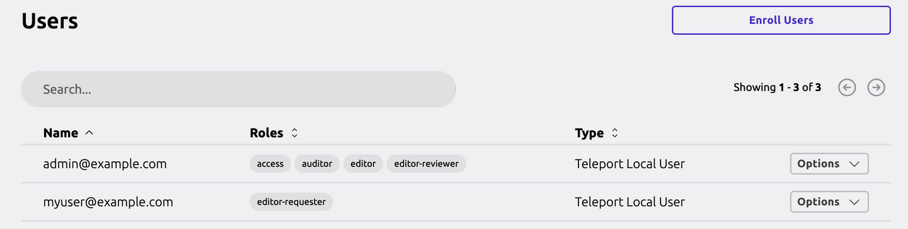
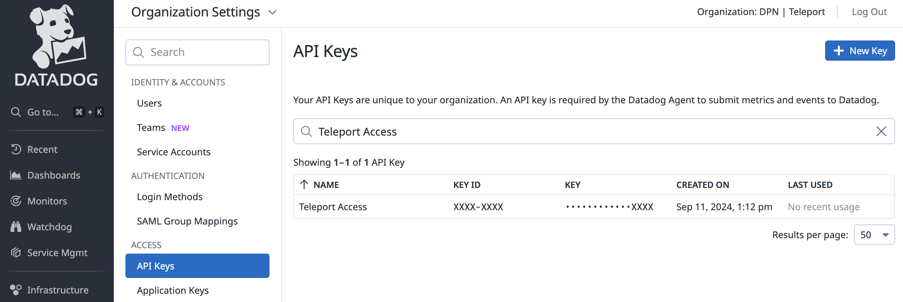
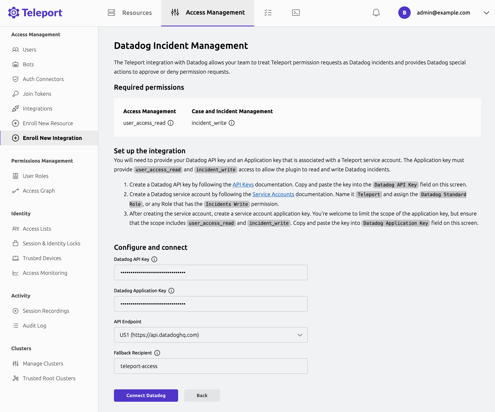

With Teleport's Datadog Incident Management integration, engineers can access the
infrastructure they need to resolve incidents without longstanding admin
permissions that can become a vector for attacks.

Teleport's Datadog Incident Management integration allows you to treat Teleport
Role Access Requests as Datadog incidents, notify the appropriate on-call team,
and approve or deny the requests via Teleport.

This guide will explain how to set up Teleport's Access Request plugin for Datadog.

## How it works

The Teleport Datadog Incident Management integration connects to the Teleport
gRPC API and listens for Role Access Requests. When the integration receives a
status change for a Role Access Request, it either creates a new incident in
Datadog or, if an incident exists, updates it. The integration also reads
annotations on each Teleport Access Request and, depending on the annotations,
may approve the Access Request automatically.

## Prerequisites

(!docs/pages/includes/commercial-prereqs-tabs.mdx!)

- A Datadog account with the role "Datadog Admin Role". The admin role is required to
  create a Service Account and generate required credentials for the plugin.

  You can see your role by visiting your user page in Datadog and navigating to
  **Personal Settings -> Profile** and checking the value of the **Roles** field.

- Either a Linux host or Kubernetes cluster where you will run the Datadog plugin.

- (!docs/pages/includes/tctl.mdx!)

- Your Teleport user will require the `editor` role or a role that provides permissions
  to create Teleport roles and grant them to users.

## Step 1/6. Create Datadog team

To demonstrate the Datadog Incident Management plugin, create a team in Datadog.
In the Datadog web UI, navigate to the **Teams** tab and click on **New Team** to
create a new Datadog team. Name it "Teleport Access".

We will configure the Datadog Incident Management plugin to route certain access
requests to the "Teleport Access" team.

## Step 2/6. Define RBAC resources

Before you set up the Datadog Incident Management plugin, you will need to enable
Role Access Requests in your Teleport cluster.

### Create a requester and reviewer role

For the purpose of this guide, we will define an `editor-requester` role, which
can request the built-in `editor` role, and an `editor-reviewer` role that can
review requests for the `editor` role.

In the Teleport WebUI navigate to **Access -> Roles**. Then select **Create New
Role** and create the desired roles.


```yaml
kind: role
version: v7
metadata:
  name: editor-reviewer
spec:
  allow:
    review_requests:
      roles: ['editor']
---
kind: role
version: v7
metadata:
  name: editor-requester
spec:
  allow:
    request:
      roles: ['editor']
      thresholds:
        - approve: 1
          deny: 1
```

### Create a requester and reviewer user

First, assign yourself the `editor-reviewer` role. This will allow your user to
review Access Requests for the `editor` role. To edit your user roles navigate to
**Management -> Access -> Users**, then for your user select **Options -> Edit**
and add the `editor-reviewer` role.

Next, create a user called `myuser@example.com` who has the `editor-requester` role.
Later in this guide, you will create an Access Request as this user to test the
Datadog plugin. To this user, navigate to **Management -> Access -> Users**. Then
select **Enroll Users** and create a user with the `editor-requester` role.

You should end up with two users that look like this:



## Step 3/6. Generate Datadog credentials

The Access Request plugin for Datadog receives Access Request events from the Teleport
Auth Service, formats them into Datadog incidents, and sends them to the Datadog
API. For this to work, you must provide a valid Datadog API and Application key
to the Teleport plugin.

### Generate a Datadog API key

First, in the Datadog web UI navigate to **Organization Settings -> Access -> API Keys**
to view your organization's API keys. To generate a new API key, click on **New Key**
and name it "Teleport Access". Copy the API key to paste in a later step.



### Create a Datadog Service Account

Next, navigate to **Organization Settings -> Identity & Accounts -> Service Accounts**
to view your organization's service accounts. To create a new service account, click
on **New Service Account** and name it "Teleport Access". You can provide whatever
email you'd like to associate with the service account, then assign the role
"Datadog Standard Role". This role provides the required permissions necessary to
manage the Teleport Access Request incidents.


Now click on the "Teleport Access" service account that was just created and click
on the **Application Keys** tab and click on **New Key** and name it "Teleport Access"
to create a new Application key. Copy the Application key to paste in a later step.


## Step 4/6. Enroll the Datadog Incident Management plugin

At this point, you're now ready to enroll the Datadog Incident Management plugin.
Navigate to **Access Management -> Enroll New Integration -> Datadog**.


Provide the API and Application keys generated above. Select the desired API endpoint.
Then provide the Datadog team handle, that you created earlier, as the fallback recipient.
This should be "teleport-access".

The fallback recipient will be the default recipient for notifications. The recipient
can be a Datadog user email, or a Datadog team handle. You can configure more custom
notification routing rules afterwards using
[Access Monitoring Rules](./notification-routing-rules.mdx).



If the recipient is a Datadog team, the team name will be added to the Datadog incident
teams attribute.

The plugin creates incidents and labels them with the recipient team. By default,
the team members won't be notified, you must configure Datadog notification rules
to page the team members. To do so, navigate to **Incidents -> Settings -> Notifications -> Rules**
and create a new rule matching alerts labeled with the recipient team.


<Details title="Suggested reviewers">

Users can suggest specific reviewers when they create an Access Request by providing
Datadog user emails, e.g.,:

```code
$ tsh request create --roles=editor --reviewers=alice@example.com,ivan@example.com
```

If an Access Request includes suggested reviewers, the Datadog Incident Management
plugin will add these to the list of users to notify.

</Details>

## Step 5/6. Test your Datadog Incident Management plugin

### Create an Access Request

As the Teleport user `myuser@example.com`, create an Access Request for the
`editor` role. Navigate to the **Access Requests** tab and click on
**New Access Request**:


In Datadog, you will see a new incident containing information about the
Access Request:


### Resolve the request

Once you receive an Access Request message, click the link to visit Teleport and
approve or deny the request:


<Admonition title="Auditing Access Requests">

When the Datadog plugin sends a notification, anyone who receives the
notification can follow the enclosed link to an Access Request URL. While users
must be authorized via their Teleport roles to review Access Request, you
should still check the Teleport audit log to ensure that the right users are
reviewing the right requests.

When auditing Access Request reviews, check for events with the type `Access
Request Reviewed` in the Teleport Web UI.

</Admonition>

## Step 6/6. Configure Automatic Approvals

### Setup a Datadog on-call schedule

To enable automatic approvals for Access Requests, you will need to set up an
on-call schedule for your Datadog team. Navigate to **On-Call -> Teams** and
select **Add Team to On-Call** to set up an on-call schedule for the "Teleport Access"
team.

### Update Teleport RBAC to support automatic approvals

Configure the Teleport `editor-requester` role and add the `teleport.dev/schedules`
annotation. The `teleport.dev/schedules` annotation is used to specify on-call
schedules, services, and teams for auto-approval. For the Datadog plugin, this
annotation expects a list of Datadog team handle names.

Add the "teleport-access" team to the annotation. Access requests made by an
on-call user of this team will be automatically approved.

```yaml
kind: role
version: v7
metadata:
  name: editor-requester
spec:
  allow:
    request:
      annotations:
        teleport.dev/schedules:
        - teleport-access
      roles: ['editor']
      thresholds:
        - approve: 1
          deny: 1
```

(!docs/pages/includes/create-role-using-web.mdx!)

### Trigger an auto-approval

To trigger an auto-approval, login to Teleport as the current on-call user in Datadog,
and create an Access Request for the `editor` role. Automatic approvals requires
that the Teleport username matches the Datadog on-call user email.

## Next steps

- Read our guide on [Routing Access Request notifications](./notification-routing-rules.mdx)
  to configure custom notification routing rules for your plugin.
