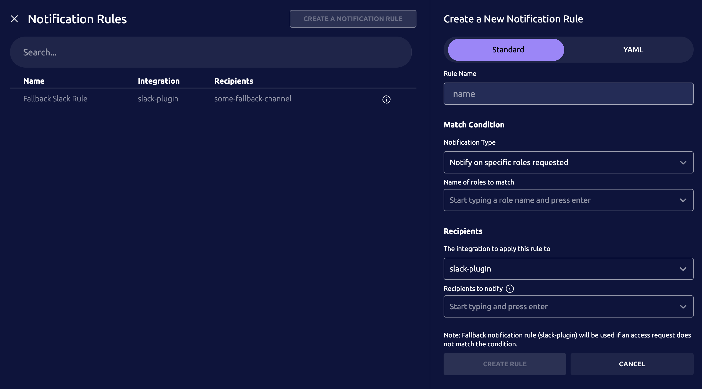

With Teleport's Access Monitoring Rules, Access Request notifications can be
routed to plugins based on based on several conditions. For example, you may
wish to send notifications to different Slack channels based on what roles or
resources are being accessed, or based on what user is making the request.

## How it works

The Access Monitoring Rule (AMR) is a dynamic Teleport resource that matches
audit events with certain characteristics and instructs Teleport plugins to take
action when it receives these events. Teleport plugins connect to the Teleport
Auth Service and listen for AMRs. If an AMR matches the plugin, the plugin loads
the the AMR and uses it to process incoming events. 

Plugins implement AMR handling logic separately from one another. Currently,
only a subset of hosted plugins support notification routing rules. We are
working on extending support to the rest of hosted plugins. Keep an eye on
Teleport [changelog](../../../changelog.mdx) to learn about new plugins.

## Prerequisites

- A managed Teleport Enterprise account.

- The `tctl` admin tool and `tsh` client tool version >= (=teleport.version=).

  You can verify the tools you have installed by running the following commands:

  ```code
  $ tctl version
  # Teleport Enterprise v(=teleport.version=) go(=teleport.golang=)
  
  $ tsh version
  # Teleport v(=teleport.version=) go(=teleport.golang=)
  ```

  You can download these tools by following the appropriate [Installation 
  instructions](../../../installation.mdx) for your environment and Teleport edition.

- At least one of the Teleport Access Plugins that support Access Monitoring Rules is enrolled.

- (!docs/pages/includes/tctl.mdx!)

## Step 1/2. Create an Access Monitoring Rule

You can define an Access Request notification rule in two ways:
- Using the Web UI dialog.
- Creating a YAML resource file containing the definition of a rule.

### Create an Access Monitoring Rule via the Web UI

To create an Access Monitoring Rule via the Web UI, first navigate to
the Access Request page and click on `View Notification Routing Rules`.


Then click `Create Notification Rule`.



If a plugin that supports Access Monitoring Rule based routing is not enrolled
the UI will prompt you to enroll one.

### Create an Access Monitoring Rule using YAML resource

Here is an example Access Monitoring Rule. This rule will notify `your_slack_channel`
via the Slack plugin if an Access Request containing the role `your_role_name` is
made.

```yaml
kind: access_monitoring_rule
version: v1
metadata:
  name: your-plugin-name
spec:
  subjects: ['access_request']
  condition: >
    plugin.spec.name == "slack" &&
    access_request.spec.roles.contains("your_role_name")
  notification:
    # Deprecated: Use condition: 'plugin.spec.name == "slack"' instead.
    name: 'slack'
    recipients: ['your_slack_channel']
```

The above routing rule can be created using `tctl create -f your-file-name.yaml`
from the command line.

Multiple recipients can be specified in an Access Monitoring Rule.
The condition field of the rule is set to a predicate expression defining the conditions
under which you wish the rule to apply.

Fields of the Access Request that are currently supported are
| Field | Description |
| --- | --- |
| access_request.spec.roles | The set of roles requested. |
| access_request.spec.suggested_reviewers | The set of reviewers specified in the request. |
| access_request.spec.system_annotations | A map of system annotations on the request. |
| access_request.spec.user | The requesting user. |
| access_request.spec.request_reason | The request reason. |
| access_request.spec.creation_time | The creation time of the request. |
| access_request.spec.expiry | The expiry time of the request. |
| plugin.spec.name | The name of the plugin that this AMR applies to. |

Predicate expressions used in the condition of Access Monitoring Rules must evaluate to
either true or false.

Some example values for the condition field and their possible uses.
- `access_request.spec.user == "some_user"` - Routing based on requesting user.
- `access_request.spec.roles.contains("some_role")` - Routing based on the requested roles.
- `access_request.spec.roles.contains_any(set("role_1", "role_2"))` - Routing based on multiple roles.

## Step 2/2. Testing your new Access Monitoring Rule

In the above example rule for the Slack plugin.
- Replace the role "your_role_name" with a role of your choice.
- Replace "your_slack_channel" with a slack channel your plugin has access to.

Afterwards create an Access Request for the role you specified in the rule.

Then check the Slack channel you have set in your Access Monitoring Rule earlier to
verify that the notification has been sent.

(!docs/pages/includes/plugins/create-request.mdx!)
