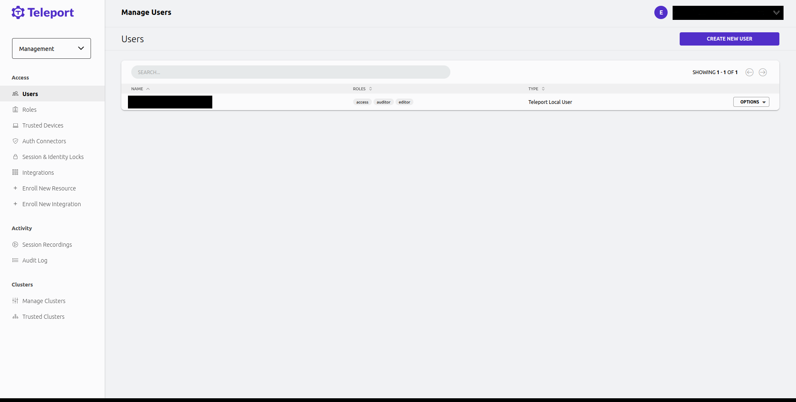
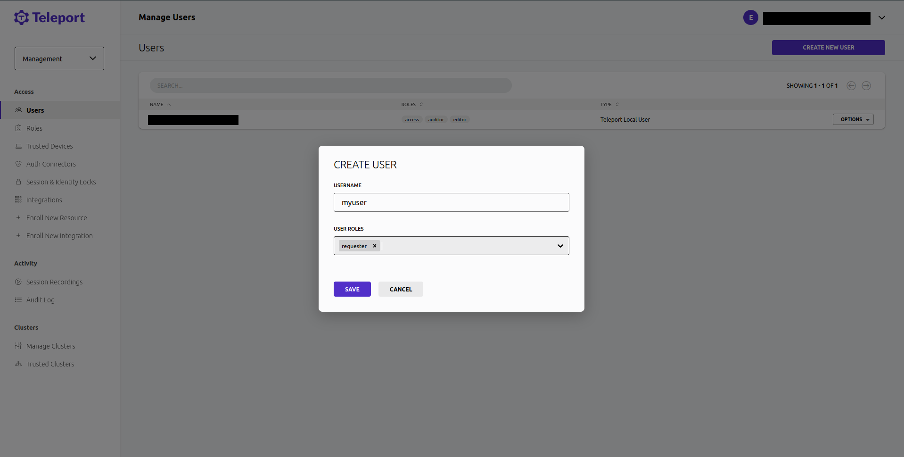
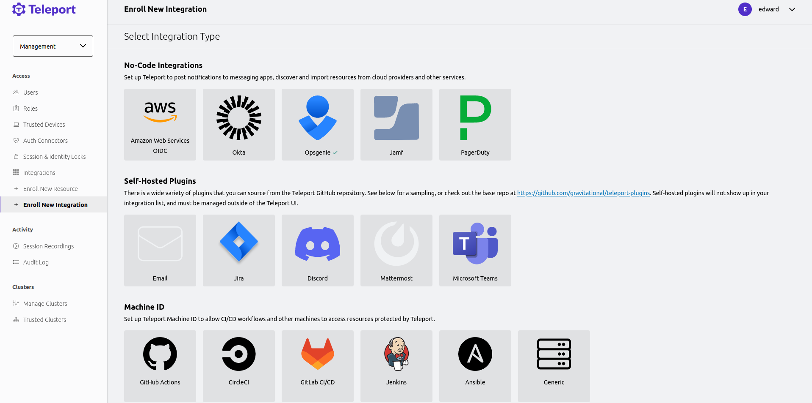

With Teleport's Opsgenie integration, engineers can access the infrastructure
they need to resolve alerts quickly, without longstanding admin permissions
that can become a vector for attacks.

Teleport's Opsgenie integration allows you to treat Teleport Role Access
Requests as Opsgenie alerts, notify the appropriate on-call team, and
approve or deny the requests via Teleport. You can also configure the plugin to
approve Role Access Requests automatically if the user making the request is on
the on-call team for a service affected by an alert.

This guide will explain how to set up Teleport's Access Request plugin for
Opsgenie.

## Prerequisites

- A Teleport Enterprise Cloud account.

- The `tctl` admin tool and `tsh` client tool version >= (=teleport.version=). 
  
  You can verify the tools you have installed by running the following commands:

  ```code
  $ tctl version
  # Teleport v(=teleport.version=) go(=teleport.golang=)
  
  $ tsh version
  # Teleport v(=teleport.version=) go(=teleport.golang=)
  ```

  You can download these tools by following the appropriate [Installation 
  instructions](../../../installation.mdx) for your environment and Teleport edition.

- An Opsgenie account with the ability to create API keys with the 'read' and
  'create and update' access rights.

- (!docs/pages/includes/tctl.mdx!)

## Step 1/5. Create services

Create an Opsgenie team named `teleport-access-request-notifications`.

We will configure the Opsgenie plugin to create an alert for the
`teleport-access-request-notifications` team when certain users
create an Access Request.

## Step 2/5. Define RBAC resources

The Teleport Opsgenie plugin works by receiving Access Request events from the
Teleport Auth Service and, based on these events, interacting with the Opsgenie
API.

### Create a requester role

To create a user, first navigate to **Access -> Roles**. Then select **Create
New Role** and create the requester role.

```
kind: role
version: v5
metadata:
  name: requester
spec:
  allow:
    request:
      roles: ['editor']
      thresholds:
        - approve: 1
          deny: 1
      annotations:
        teleport.dev/notify-services: ['teleport-access-request-notifications']
        teleport.dev/teams: ['teleport-team']
        teleport.dev/schedules: ['teleport-access-alert-schedules']
```

The `teleport.dev/notify-services` annotation specifies the schedules the alert will be created for.
The `teleport.dev/teams` annotation specifies the teams the alert will be created for. This is useful when you
have multiple schedules with escalations or an Opsgenie integration that only works with teams.
The `teleport.dev/schedules` annotation specifies the schedules the alert will check, and auto approve the
Access Request if the requesting user is on-call.

### Create a user who will request access

Create a user called `myuser` who has the `requester` role. Later in this
guide, you will create an Access Request as this user to test the Opsgenie
plugin:

To create a user first navigate to Management -> Access -> Users



Then select 'Create New User' and create a user with the requester role.



## Step 3/5. Set up an Opsgenie API key

Generate an API key that the Opsgenie plugin will use to create and modify
alerts as well as list users, services, and on-call policies.

In your Opsgenie dashboard, go to **SETTINGS → INTEGRATIONS**

See https://support.atlassian.com/opsgenie/docs/create-a-default-api-integration/ for more details.

## Step 4/5. Configure the Opsgenie plugin

At this point, you have generated credentials that the Opsgenie plugin will use
to connect to the Opsgenie API. To configure the plugin to use this API key navigate
to Management -> Integrations -> Enroll New Integration.



## Step 5/5. Test the Opsgenie plugin

### Create an Access Request

As the Teleport user `myuser`, create an Access Request for the `editor` role:

(!docs/pages/includes/plugins/create-request.mdx!)

In Opsgenie, you will see a new alert containing information about the
Access Request in either the default schedule specified when enrolling the plugin,
or in the schedules specified by `teleport.dev/notify-services` annotation in the requester's role.

### Resolve the request

(!docs/pages/includes/plugins/resolve-request.mdx!)

<Admonition type="info" title="Auditing Access Requests">

When the Opsgenie plugin sends a notification, anyone who receives the
notification can follow the enclosed link to an Access Request URL. While users
must be authorized via their Teleport roles to review Access Request, you
should still check the Teleport audit log to ensure that the right users are
reviewing the right requests.

When auditing Access Request reviews, check for events with the type `Access
Request Reviewed` in the Teleport Web UI.

</Admonition>
