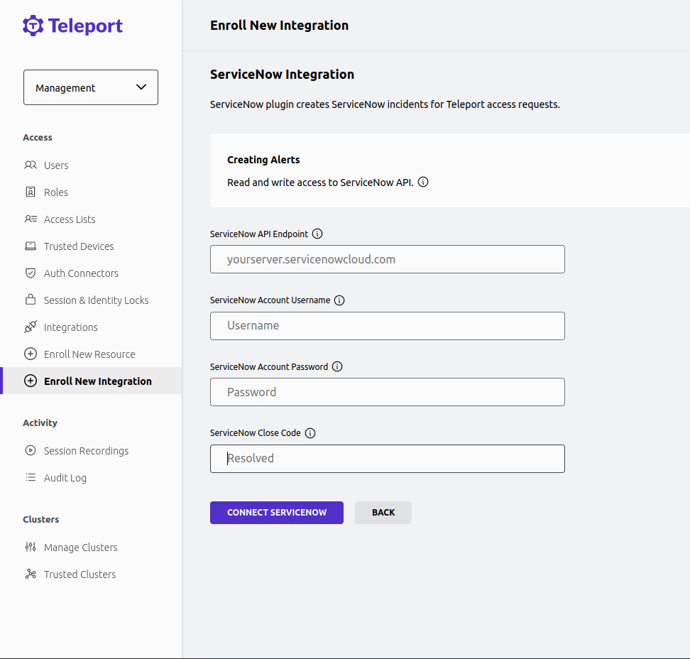

With Teleport's ServiceNow integration, engineers can access the infrastructure
they need to resolve incidents quickly, without granting longstanding admin permissions
that can become a vector for attacks.

Teleport's ServiceNow integration allows you to treat Teleport Access
Requests as ServiceNow incidents, notify the appropriate on-call team, and
approve or deny the requests via Teleport. You can also configure the plugin to
approve Access Requests automatically if the user making the request is in
a specific on-call rotation.

This guide will explain how to set up Teleport's Access Request plugin for
ServiceNow.

## Prerequisites

(!docs/pages/includes/commercial-prereqs-tabs.mdx!)

- An ServiceNow account with access to read and write to and from the 'incident' table.
- (!docs/pages/includes/tctl.mdx!)

## Step 1/4. Create services

We will configure the ServiceNow plugin to create an incident when
certain users create an Access Request.

## Step 2/4. Define RBAC resources

The Teleport ServiceNow plugin works by receiving Access Request events from the
Teleport Auth Service and, based on these events, interacting with the ServiceNow
API.

Before making the access request ensure the user making the request has
the `requester` role.

For the plugin to know which ServiceNow rotations to check for the
auto approval flow, the rotation you wish users to be checked against
must be included in one of the requesting user's roles. To do so, add the `teleport.dev/schedules` annotation as shown in the following example: 

```yaml
kind: role
version: v5
metadata:
  name: YOUR_ROLE_NAME_HERE
spec:
  allow:
    request:
      roles: ['editor']
      thresholds:
        - approve: 1
          deny: 1
      annotations:
        teleport.dev/schedules:
        - YOUR_SERVICENOW_ROTA_ID_HERE
```

To retrieve the ServiceNow rotation ID, navigate to the group record
of the ServiceNow group the rotation belongs to and right click on
header, then click 'Select copy sys_id' to copy the ID.

Then using the ServiceNow endpoint `/api/now/on_call_rota/workbench/group/{groupSysId}`
retrieve the group's on-call rota information.
Select the value of the desired 'rota' from the response.

## Step 3/4. Configure the ServiceNow plugin

At this point, you have a ServiceNow user that the ServiceNow plugin will use
to connect to the ServiceNow API. To configure the plugin to use this user navigate
to Management -> Integrations -> Enroll New Integration.



The plugin requires credentials that can read and write to the incident table.

The "Close Code" specified here will be the one used when resolving ServiceNow
incidents. The "Caller" will be the username of the requesting Teleport user.
(The "Caller" field will only be filled if there is an existing ServiceNow user of the same name.)

## Step 4/4. Test the ServiceNow plugin

### Create an Access Request

As the Teleport user `myuser`, create an Access Request for the `editor` role:

(!docs/pages/includes/plugins/create-request.mdx!)

In ServiceNow, you will see a new incident containing information about the
Access Request.

If the a ServiceNow rotation was specified in the requester's role annotations,
then the ServiceNow plugin will check that the requester's username matches the
ServiceNow user currently on-call in that rotation and approve the Access Request.

### Resolve the request

(!docs/pages/includes/plugins/resolve-request.mdx!)
