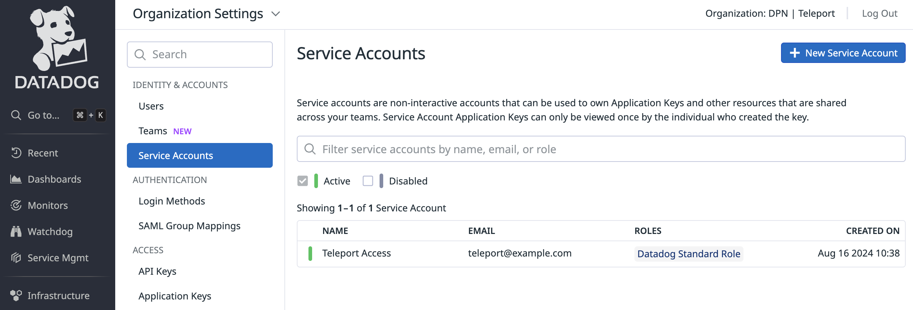

## How it works

With Teleport's Datadog Incident Management integration, engineers can access the
infrastructure they need to resolve incidents without longstanding admin
permissions that can become a vector for attacks.

Teleport's Datadog Incident Management integration allows you to treat Teleport
Role Access Requests as Datadog incidents, notify the appropriate on-call team,
and approve or deny the requests via Teleport.

<Details title="This integration is hosted on Teleport Enterprise (Cloud)" open={false}>

(!docs/pages/includes/plugins/enroll.mdx name="the Datadog Incident Management integration"!)

</Details>

This guide will explain how to set up Teleport's Access Request plugin for Datadog.


## Prerequisites

(!docs/pages/includes/commercial-prereqs-tabs.mdx!)

(!docs/pages/includes/machine-id/plugin-prerequisites.mdx!)

- A Datadog account with the role "Datadog Admin Role". The admin role is required to
  create a Service Account and generate required credentials for the plugin.

  You can see your role by visiting your user page in Datadog and navigating to
  **Personal Settings -> Profile** and checking the value of the **Roles** field.

- Either a Linux host or Kubernetes cluster where you will run the Datadog plugin.

- (!docs/pages/includes/tctl.mdx!)

## Step 1/9. Create Datadog team

To demonstrate the Datadog Incident Management plugin, create a team in Datadog.
In the Datadog web UI, navigate to the **Teams** tab and click on **New Team** to
create a new Datadog team. Name it "Teleport Access".

We will configure the Datadog Incident Management plugin to route certain access
requests to the "Teleport Access" team.

## Step 2/9. Define RBAC resources

Before you set up the Datadog Incident Management plugin, you will need to enable
Role Access Requests in your Teleport cluster.

(!/docs/pages/includes/plugins/editor-request-rbac.mdx!)

## Step 3/9. Install the Teleport Datadog Incident Management plugin

(!docs/pages/includes/plugins/install-access-request.mdx name="datadog"!)

## Step 4/9. Create a user and role for the plugin

(!docs/pages/includes/plugins/rbac-with-friendly-name.mdx!)

(!/docs/pages/includes/plugins/rbac-impersonate.mdx!)

## Step 5/9. Export the access plugin identity

Give the plugin access to a Teleport identity file. We recommend using Machine
ID for this in order to produce short-lived identity files that are less
dangerous if exfiltrated, though in demo deployments, you can generate
longer-lived identity files with `tctl`:

<Tabs>
<TabItem label="Machine ID">
(!docs/pages/includes/plugins/tbot-identity.mdx secret="teleport-plugin-datadog-identity"!)
</TabItem>
<TabItem label="Long-lived identity files">
(!docs/pages/includes/plugins/identity-export.mdx user="access-plugin" secret="teleport-plugin-datadog-identity"!)
</TabItem>
</Tabs>

## Step 6/9. Generate Datadog credentials

The Access Request plugin for Datadog receives Access Request events from the Teleport
Auth Service, formats them into Datadog incidents, and sends them to the Datadog
API. For this to work, you must provide a valid Datadog API and Application key
to the Teleport plugin.

### Generate a Datadog API key

First, in the Datadog web UI navigate to **Organization Setttings -> Access -> API Keys**
to view your organization's API keys. To generate a new API key, click on **New Key**
and name it "Teleport Access". Copy the API key to paste in a later step.


### Create a Datadog Service Account

Next, navigate to **Organization Settings -> Identity & Accounts -> Service Accounts**
to view your organization's service accounts. To create a new service account, click
on **New Service Account** and name it "Teleport Access". You can provide whatever
email you'd like to associate with the service account, then assign the role
"Datadog Standard Role". This role provides the required permissions necessary to
manage the Teleport Access Request incidents.



Now click on the "Teleport Access" service account that was just created and click
on the **Application Keys** tab and click on **New Key** and name it "Teleport Access"
to create a new Application key. Copy the Application key to paste in a later step.


## Step 7/9. Configure the Teleport Datadog Incident Management plugin

At this point, the Teleport Datadog Incident Management plugin has the credentials
it needs to communicate with your Teleport cluster and the Datadog API. In this step,
you will configure the Datadog Incident Management plugin to use these credentials.
You will also configure the plugin to notify the desired recipient when it receives
an Access Request update.

### Create a configuration file

<Tabs>
<TabItem label="Executable or Docker">
The Teleport Datadog Incident Management plugin uses a configuration file in TOML
format. Generate a boilerplate configuration by running the following command
(the plugin will not run unless the config file is in `/etc/teleport-datadog.toml`):

```code
$ teleport-datadog configure | sudo tee /etc/teleport-datadog.toml > /dev/null
```

This should result in a configuration file like the one below:

```toml
(!examples/resources/plugins/teleport-datadog.toml!)
```
</TabItem>
<TabItem label="Helm Chart">
The Datadog Helm Chart uses a YAML values file to configure the plugin.
On your local workstation, create a file called `teleport-datadog-helm.yaml`
based on the following example:

```toml
(!examples/resources/plugins/teleport-datadog-helm.yaml!)
```

</TabItem>
</Tabs>

### Edit the configuration file

Open the configuration file created for the Teleport Datadog Incident Management
plugin and update the following fields:

**`[teleport]`**

The Slack plugin uses this section to connect to your Teleport cluster:

(!docs/pages/includes/plugins/config-toml-teleport.mdx!)

(!docs/pages/includes/plugins/refresh-plugin-identity.mdx!)

**`[datadog]`**

`api_endpoint`: Specifies the desired Datadog API endpoint. See
[`https://docs.datadoghq.com/getting_started/site/#access-the-datadog-site`](https://docs.datadoghq.com/getting_started/site/#access-the-datadog-site),
for available Datadog regions.

`api_key`: Open [`https://app.datadoghq.com/organization-settings/api-keys`](https://app.datadoghq.com/organization-settings/api-keys),
find the "Teleport Access" API key you created earlier and copy the key into this
field.

`application_key`: Open [`https://app.datadoghq.com/organization-settings/application-keys`](https://app.datadoghq.com/organization-settings/application-keys),
find the "Teleport Access" Application key you created for your service account
and copy the key into this field.

`severity`: Specifies the Datadog incident severity.

**`[role_to_recipients]`**

The `role_to_recipients` map configures the recipients that the Datadog Incident Management
plugin will notify when a user requests access to a specific role. When the plugin
receives an Access Request from the Auth Service, it will look up the role being
requested and identify the Datadog users or teams to notify.

<Tabs>
<TabItem label="Executable or Docker">
Here is an example of a `role_to_recipients` map:

```toml
[role_to_recipients]
"*" = ["admin-team"]
"dev" = ["dev-team", "admin-team"]
"dba" = ["user@example.com"]
```
</TabItem>
<TabItem label="Helm Chart">
In our Helm chart, the `role_to_recipients` field is called `roleToRecipients`
and uses the following format:

```yaml
roleToRecipients:
  "*": 
    - "admin-team"
  "dev":
    - "dev-team"
    - "admin-team"
  "dba":
    - "user@example.com"
```
</TabItem>
</Tabs>

In the `role_to_recipients` map, each key is the name of a Teleport role. Each
value configures the Datadog users or teams to notify. The value accepts an
array of strings. Each string must be either the name of a Datadog team or the
email address of a Datadog user.

The `role_to_recipients` map must also include an entry for `"*"`, which the
plugin looks up if no other entry matches a given role name. In the example
above, requests for roles aside from `dev` and `dba` will notify the
`admin-team` team.

If the recipient is a Datadog team, the team name will be added to the Datadog incident
teams attribute. The plugin will not manually send notifications to members of the
team. Instead you will want to navigate to **Incidents -> Setttings -> Notifications -> Rules**
and add a notification rule for when an incident with the matching teams attribute
is created or updated.


<Details title="Suggested reviewers">

Users can suggest reviewers when they create an Access Request, e.g.,:

```code
$ tsh request create --roles=dbadmin --reviewers=alice@example.com,ivan@example.com
```

If an Access Request includes suggested reviewers, the Datadog Incident Management
plugin will add these to the list of users to notify.

</Details>

Configure the Datadog Incident Management plugin to notify you when a user requests
the `editor` role by adding the following to your `role_to_recipients` config
(replace `TELEPORT_USERNAME` with the user you assigned the `editor-reviewer` role
earlier):

<Tabs>
<TabItem label="Executable or Docker">
```toml
[role_to_recipients]
"*" = ["teleport-access"]
"editor" = ["TELEPORT_USERNAME"]
```
</TabItem>
<TabItem label="Helm Chart">
```yaml
roleToRecipients:
  "*": ["teleport-access"]
  "editor": ["TELEPORT_USERNAME"]
```
</TabItem>
</Tabs>

## Step 8/9. Test your Datadog Incident Management plugin

Once Teleport is running and the plugin is configured, you can now run the plugin
and test the workflow.


<Tabs>
<TabItem label="Executable">
Start the plugin:

```code
$ teleport-datadog start
```

If everything works fine, the log output should look like this:

```code
$ teleport-datadog start
INFO   Starting Teleport Access Datadog Plugin 17.2.1: datadog/app.go:80
INFO   Plugin is ready datadog/app.go:101
```
</TabItem>
<TabItem label="Docker">
run the plugin:

```code
$ docker run -v <path-to-config>:/etc/teleport-datadog.toml public.ecr.aws/gravitational/teleport-plugin-datadog:(=teleport.version=) start
```
</TabItem>
<TabItem label="Helm Chart">
Install the plugin:

```code
$ helm upgrade --install teleport-plugin-datadog teleport/teleport-plugin-datadog --values teleport-datadog-helm.yaml
```

To inspect the plugin's logs, use the following command:

```code
$ kubectl logs deploy/teleport-plugin-datadog
```

Debug logs can be enabled by setting `log.severity` to `DEBUG` in
`teleport-datadog-helm.yaml` and executing the `helm upgrade ...` command
above again. Then you can restart the plugin with the following command:

```code
$ kubectl rollout restart deployment teleport-plugin-datadog
```
</TabItem>
</Tabs>

Create an Access Request and check if the plugin works as expected with the
following steps.

### Create an Access Request

As the Teleport user `myuser`, create an Access Request for the `editor` role:

(!docs/pages/includes/plugins/create-request.mdx!)

You should see a log resembling the following on your Datadog plugin host:

```
INFO   Successfully posted messages channel_id:89935da0-e611-5755-b440-400c7fdc8efb message_id:89935da0-e611-5755-b440-400c7fdc8efb
request_id:0191e259-f3aa-73bc-920b-2e91e41994df request_op:put
request_state:PENDING accessrequest/app.go:325
```

In Datadog, you will see a new incident containing information about the
Access Request:


### Resolve the request

(!docs/pages/includes/plugins/resolve-request.mdx!)

<Admonition title="Auditing Access Requests">

When the Datadog plugin sends a notification, anyone who receives the
notification can follow the enclosed link to an Access Request URL. While users
must be authorized via their Teleport roles to review Access Request, you
should still check the Teleport audit log to ensure that the right users are
reviewing the right requests.

When auditing Access Request reviews, check for events with the type `Access
Request Reviewed` in the Teleport Web UI.

</Admonition>

## Step 9/9. Set up systemd

This section is only relevant if you are running the Teleport Datadog Incident Management
plugin on a Linux host.

In production, we recommend starting the Teleport plugin daemon via an init system
like systemd. Here's the recommended Teleport plugin service unit file for systemd:

```ini
(!examples/systemd/plugins/teleport-datadog.service!)
```

Save this as `teleport-datadog.service` in either `/usr/lib/systemd/system/`
or another [unit file load
path](https://www.freedesktop.org/software/systemd/man/systemd.unit.html#Unit%20File%20Load%20Path)
supported by systemd.

Enable and start the plugin:

```code
$ sudo systemctl enable teleport-datadog
$ sudo systemctl start teleport-datadog
```