This guide will explain how to set up Microsoft Teams to receive Access Request messages
from Teleport. Teleport's Microsoft Teams integration notifies individuals of
Access Requests. Users can then approve and deny Access Requests by following the
message link, making it easier to implement security best practices without
compromising productivity.

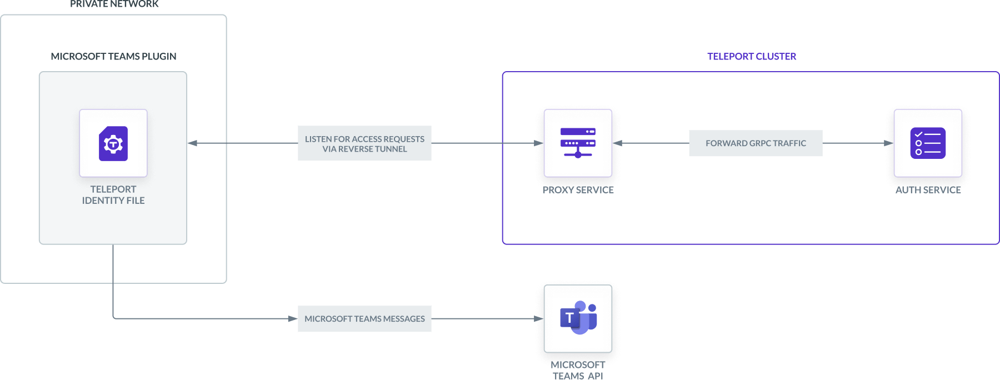

<details>
<summary>This integration is hosted on Teleport Enterprise (Cloud)</summary>

(!docs/pages/includes/plugins/enroll.mdx name="the Microsoft Teams integration"!)

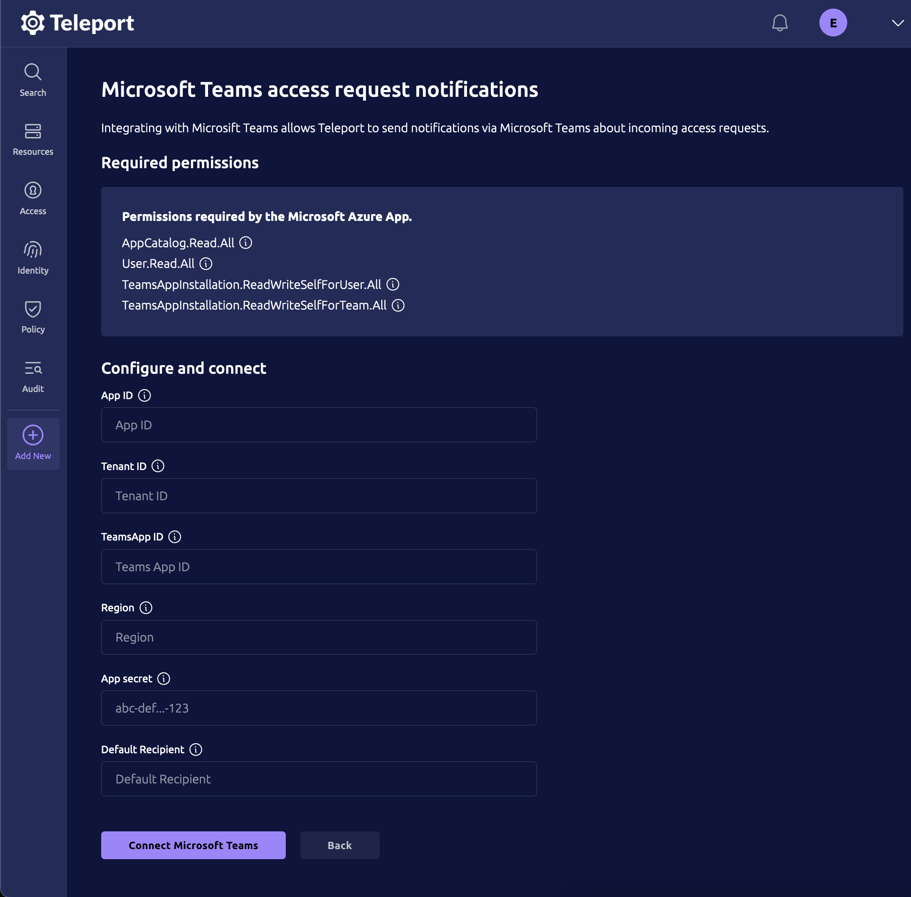

Once enrolled you can download the required `app.zip` file from the integrations status page.

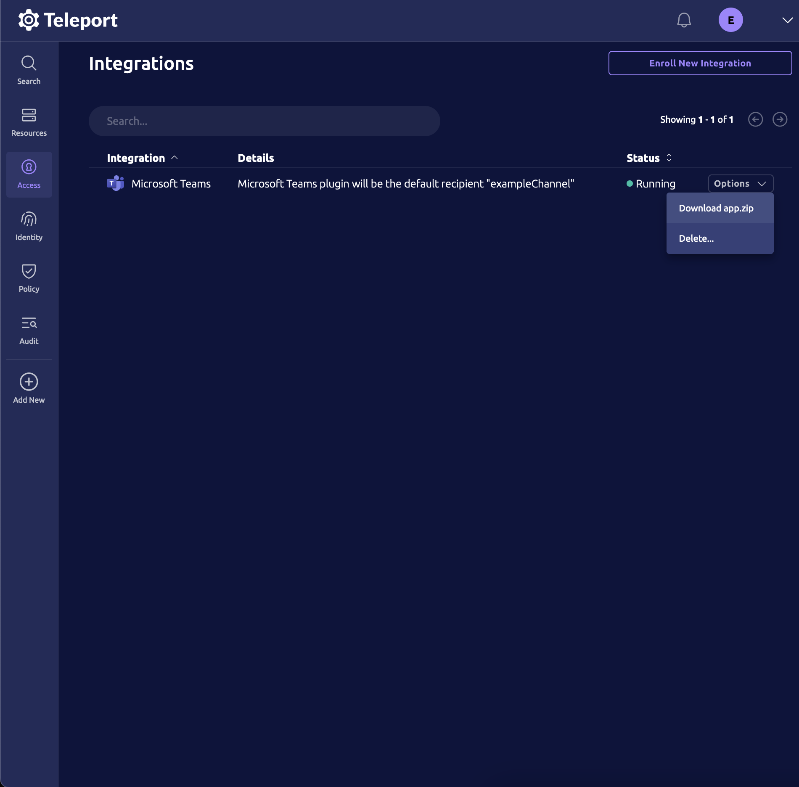

</details>

## Prerequisites

(!docs/pages/includes/commercial-prereqs-tabs.mdx!)

(!docs/pages/includes/machine-id/plugin-prerequisites.mdx!)

- A Microsoft Teams License (Microsoft 365 Business).
- Azure console access in the organization/directory holding the Microsoft Teams
  License.
- An Azure resource group in the same directory. This will host resources for
  the Microsoft Teams Access Request plugin. You should have enough
  permissions to create and edit Azure Bot Services in this resource group.
- Someone with Global Admin rights on Microsoft Entra ID in order to grant
  permissions to the plugin.
- Someone with the `Teams administrator` role that can approve installation
  requests for Microsoft Teams Apps.
- Either an Azure virtual machine or Kubernetes cluster where you will run the
  Teleport Microsoft Teams plugin.

(!/docs/pages/includes/tctl.mdx!)

## Step 1/9. Define RBAC resources

Before you set up the Microsoft Teams plugin, you will need to enable Role Access Requests
in your Teleport cluster. 

(!/docs/pages/includes/plugins/editor-request-rbac.mdx!)

## Step 2/9. Install the Teleport Microsoft Teams plugin

Install the Microsoft Teams plugin on your workstation. If you are deploying the
plugin on Kubernetes, you will still need to install the plugin locally in order
to generate an application archive to upload later in this guide.

(!docs/pages/includes/plugins/install-access-request.mdx name="msteams"!)

## Step 3/9. Create a user and role for the plugin

(!docs/pages/includes/plugins/rbac.mdx!)

(!/docs/pages/includes/plugins/rbac-impersonate.mdx!)

## Step 4/9. Export the access plugin identity

Give the plugin access to a Teleport identity file. We recommend using Machine
ID for this in order to produce short-lived identity files that are less
dangerous if exfiltrated, though in demo deployments, you can generate
longer-lived identity files with `tctl`:

<Tabs>
<TabItem label="Machine ID">
(!docs/pages/includes/plugins/tbot-identity.mdx secret="teleport-plugin-msteams-identity"!)
</TabItem>
<TabItem label="Long-lived identity files">
(!docs/pages/includes/plugins/identity-export.mdx user="access-plugin" secret="teleport-plugin-msteams-identity"!)
</TabItem>
</Tabs>

## Step 5/9. Register an Azure Bot

The Access Request plugin for Microsoft Teams receives Access Request events from the
Teleport Auth Service, formats them into Microsoft Teams messages, and sends them to the
Microsoft Teams API to post them in your workspace. For this to work, you must register a
new Azure Bot. Azure Bot is a managed service by Microsoft that allows to
develop bots that interact with users through different channels, including
Microsoft Teams.

### Register a new Azure bot

Visit [https://portal.azure.com/#create/Microsoft.AzureBot](https://portal.azure.com/#create/Microsoft.AzureBot)
to create a new bot. Choose the bot handle so you can find the bot later in the Azure console (the bot handle will
not be displayed to the user or used to configure the Microsoft Teams plugin). Also edit the Azure subscription,
the resource group and the bot pricing tier.

In the "Microsoft App ID" section choose "Single Tenant" and "Create new
Microsoft App ID".

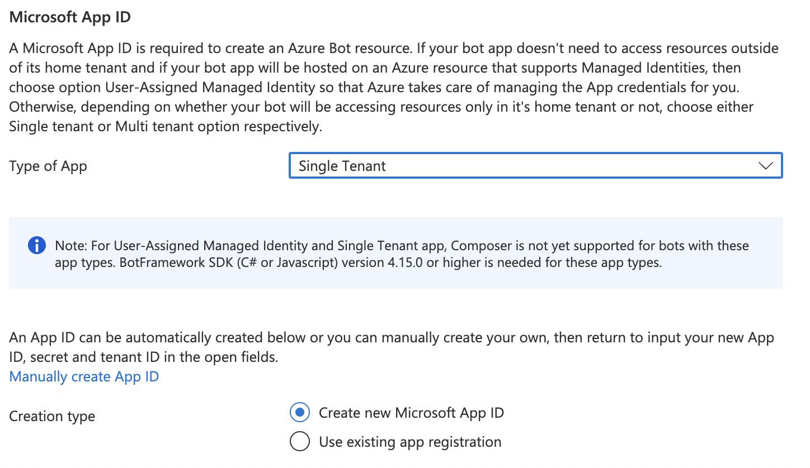

### Connect the bot to Microsoft Teams

Once the bot is created, open its resource page on the Azure console and
navigate to the "Channels" tab. Click "Microsoft Teams" and add the Microsoft Teams
channel.

The result should be as follows:


### Obtain information about your Microsoft App

On the bot's "Configuration" tab, copy and keep in a safe place the values of
"Microsoft App ID" and "App Tenant ID". Those two UUIDs will be used in the
plugin configuration.

Click the "Manage" link next to "Microsoft App ID". This will open the app management view.

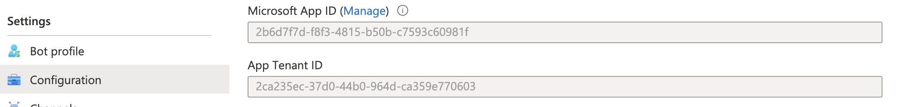

Then, go to the "Certificates & Secrets" section and choose to create a "New client secret".
Use the "Copy" icon to copy the newly created secret and keep it with the
previously recovered App ID and Tenant ID.

The client secret will be used by the Teleport plugin to authenticate as the bot's app when
searching users and posting messages.

### Specify the permissions used by the app

Still in the app management view ("Configuration", then "Manage" the Microsoft App ID),
go to the "API permissions" tab.

Add the following Microsoft Graph Application permissions:

| Permission name | Reason |
|---|---|
| `AppCatalog.Read.All` | Used to list Teams Apps and check the app is installed. |
| `User.Read.All` | Used to get notification recipients. |
| `TeamsAppInstallation.ReadWriteSelfForUser.All` | Used to initiate communication with a user that never interacted with the Teams App before. |
| `TeamsAppInstallation.ReadWriteSelfForTeam.All` | Used to discover if the app is installed in the Team. |

At this point the app declares the required permissions but those have not been granted.

If you are an admin, click "Grant admin consent for \<directory name\>". If you are not an admin,
contact an admin user to grant the permissions.

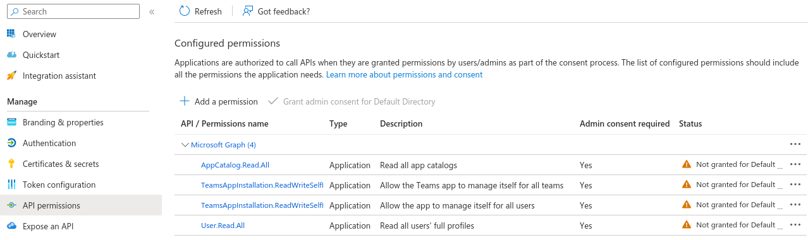

Once permissions have been approved, refresh the page and check the approval status.
The result should be as follows:

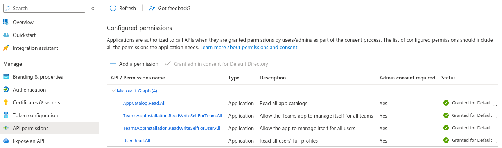

## Step 6/9. Configure the Teleport Microsoft Teams plugin

At this point, the Teleport Microsoft Teams plugin has the credentials it needs to
communicate with your Teleport cluster and Azure APIs, but the app has not been
installed to Microsoft Teams yet.

In this step, you will configure the Microsoft Teams plugin to use the Azure
credentials and generate the Teams App package that will be used to install the
Microsoft Teams App. You will also configure the plugin to notify
the right Microsoft Teams users when it receives an Access Request update.

### Generate a configuration file and assets

Generate a configuration file for the plugin. The instructions depend on whether
you are deploying the plugin on a virtual machine or Kubernetes:

<Tabs>
<TabItem label="Virtual Machine">

The Teleport Microsoft Teams plugin uses a config file in TOML format.  The
`configure` subcommand generates the directory
`/var/lib/teleport/plugins/msteams/assets` containing the TOML configuration
file and an `app.zip` file that will be used later to add the Teams App into the
organization catalog.

Run the following command on your virtual machine:

```code
$ export AZURE_APPID="your-appid"
$ export AZURE_TENANTID="your-tenantid"
$ export AZURE_APPSECRET="your-appsecret"
$ teleport-msteams configure /var/lib/teleport/plugins/msteams/assets --appID "$AZURE_APPID" --tenantID "$AZURE_TENANTID" --appSecret "$AZURE_APPSECRET"
```

This should result in a config file like the one below:

```toml
(!examples/resources/plugins/teleport-msteams.toml!)
```

Copy the `/var/lib/teleport/plugins/msteams/assets/app.zip` file to your local
computer. You will have to upload it to Microsoft Teams later.

On the host where you will run the Microsoft Teams plugin, move the file
`/var/lib/teleport/plugins/msteams/assets/teleport-msteams.toml` to
`/etc/teleport-msteams.toml`. You can then edit the copy located in `/etc/`.

</TabItem>
<TabItem label="Kubernetes">

Run the following command on your local machine:

```code
$ export AZURE_APPID="your-appid"
$ export AZURE_TENANTID="your-tenantid"
$ export AZURE_APPSECRET="your-appsecret"
$ teleport-msteams configure /var/lib/teleport/plugins/msteams/assets --appID "$AZURE_APPID" --tenantID "$AZURE_TENANTID" --appSecret "$AZURE_APPSECRET"
```

This command generates an application archive at
`/var/lib/teleport/plugins/msteams/assets/app.zip`. You will upload it to
Microsoft Teams later in this guide.

Create a file on your workstation called `teleport-msteams-helm.yaml` with the
following content:

```yaml
(!examples/resources/plugins/teleport-msteams-helm.yaml!)
```

You will edit this file in the next section.

</TabItem>
</Tabs>

<Admonition type="warning" title="Configure command">
The `configure` command is not idempotent. It generates a new Microsoft Teams
application UUID with each execution. It is not possible to use an `app.zip` and
a TOML configuration generated by two different executions.
</Admonition>

### Edit the configuration file

Edit the configuration file according to the instructions below.

#### `[teleport]`

The Microsoft Teams plugin uses this section to connect to your Teleport
cluster.

(!docs/pages/includes/plugins/config-toml-teleport.mdx!)

(!docs/pages/includes/plugins/refresh-plugin-identity.mdx!)

#### `[msapi]`/`msTeams`

<Tabs>
<TabItem label="Executable or Docker">

Make sure the `app_id`, `app_secret`, `tenant_id`, and `teams_app_id` fields are
filled in with the correct information, which you obtained earlier in this
guide.
</TabItem>
<TabItem label="Helm Chart">

Make sure the `appID`, `tenantID`, and `teamsAppID` fields are filled in with
the correct information, which you obtained earlier in this guide.

</TabItem>
</Tabs>

#### `[role_to_recipients]`

The `role_to_recipients` map (`roleToRecipients` for Helm users) configures the
users and channels that the Microsoft Teams plugin will notify when a user
requests access to a specific role. When the Microsoft Teams plugin receives an
Access Request from the Auth Service, it will look up the role being requested
and identify the Microsoft Teams users and channels to notify.

<Tabs>
<TabItem label="Executable or Docker">

Here is an example of a `role_to_recipients` map. Each value can be a single
string or an array of strings:

```toml
[role_to_recipients]
"*" = "alice@example.com"
"dev" = ["alice@example.com", "bob@example.com"]
"dba" = "https://teams.microsoft.com/l/channel/19%3somerandomid%40thread.tacv2/ChannelName?groupId=xxxxxxxx-xxxx-xxxx-xxxx-xxxxxxxxxxxx&tenantId=xxxxxxxx-xxxx-xxxx-xxxx-xxxxxxxxxxxx"
```
</TabItem>
<TabItem label="Helm Chart">

In the Helm chart, the `role_to_recipients` field is called `roleToRecipients`
and uses the following format, where keys are strings and values are arrays of
strings:

```toml
roleToRecipients:
  "*": "alice@example.com"
  "dev": ["alice@example.com", "bob@example.com"]
  "dba": "https://teams.microsoft.com/l/channel/19%3somerandomid%40thread.tacv2/ChannelName?groupId=xxxxxxxx-xxxx-xxxx-xxxx-xxxxxxxxxxxx&tenantId=xxxxxxxx-xxxx-xxxx-xxxx-xxxxxxxxxxxx"
```
</TabItem>
</Tabs>

In the `role_to_recipients` map, each key is the name of a Teleport role. Each
value configures the Teams user (or users) to notify. Each string must be either
the email address of a Microsoft Teams user or a channel URL.

You can find the URL of a channel by opening the channel and clicking the button
"Get link to channel":

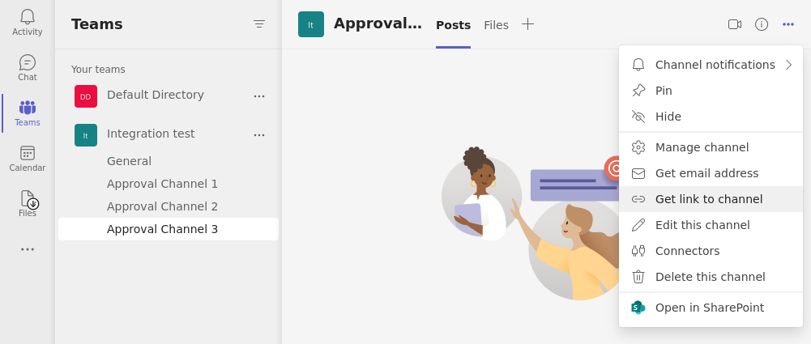

The `role_to_recipients` map must also include an entry for `"*"`, which the
plugin looks up if no other entry matches a given role name. In the example
above, requests for roles aside from `dev` and `dba` will notify `alice@example.com`.

<details>
<summary>Suggested reviewers</summary>

Users can suggest reviewers when they create an Access Request, e.g.,:

```code
$ tsh request create --roles=dbadmin --reviewers=alice@example.com,ivan@example.com
```

If an Access Request includes suggested reviewers, the Microsoft Teams plugin will add
these to the list of channels to notify. If a suggested reviewer is an email
address, the plugin will look up the direct message channel for that
address and post a message in that channel.

</details>

Configure the Microsoft Teams plugin to notify you when a user requests the `editor` role
by adding the following to your `role_to_recipients` config (replace
`TELEPORT_USERNAME` with the email of the user you assigned the `editor-reviewer`
role earlier):

<Tabs>
<TabItem label="Executable or Docker">

```toml
[role_to_recipients]
"*" = "TELEPORT_USERNAME"
"editor" = "TELEPORT_USERNAME"
```
</TabItem>
<TabItem label="Helm Chart">

```toml
roleToRecipients:
  "*": "TELEPORT_USERNAME"
  "editor": "TELEPORT_USERNAME"
```
</TabItem>
</Tabs>

The final configuration file should resemble the following:

<Tabs>
<TabItem label="Executable or Docker">
```toml
(!examples/resources/plugins/teleport-msteams.toml!)
```
</TabItem>
<TabItem label="Helm Chart">
```yaml
(!examples/resources/plugins/teleport-msteams-helm.yaml!)
```
</TabItem>
</Tabs>

## Step 7/9. Add and configure the Teams App

### Upload the Teams App

Open Microsoft Teams and go to "Apps", "Manage your apps", then in the additional
choices menu choose "Upload an App".

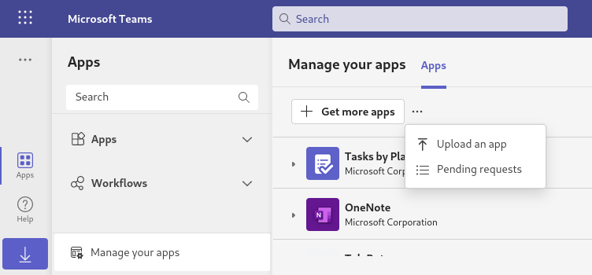

If you're a Teams admin, choose "Upload an app to your org's app catalog".
This will allow you to skip the approval step.
If you're not a Microsoft Teams admin, choose "Submit an app to your org".

Upload the `app.zip` file you generated earlier.

### Approve the Teams App

If you are not a Teams admin and chose "Submit an app to your org",
you will have to ask a Teams admin to approve it.

They can do so by connecting to the
[Teams admin dashboard](https://admin.teams.microsoft.com/policies/manage-apps),
searching "TeleBot", selecting it and choosing "Allow".

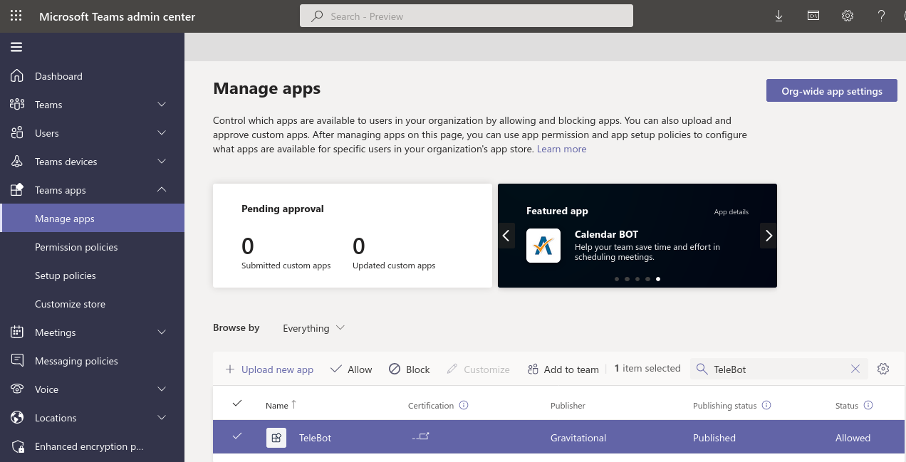

### Add the Teams App to a Team

Once the app is approved it should appear in the "Apps built for your org" section.
Add the newly uploaded app to a team. Open the app, click "Add to a team",
choose the "General" channel of your team and click "Set up a bot".

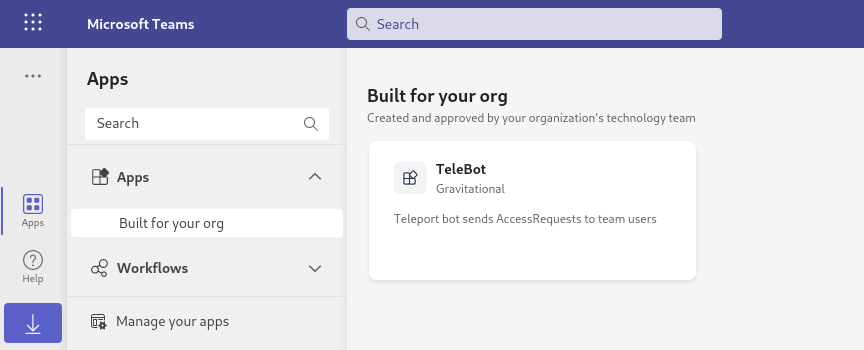

Note: Once an app is added to a team, it can post on all channels.

## Step 8/9. Test the Teams App

Once Teleport is running, you've created the Teams App, and the plugin is
configured, you can now run the plugin and test the workflow.

### Test Microsoft Teams connectivity

Start the plugin in validation mode:

```code
$ teleport-msteams validate <email of your teams account>
```

If everything works fine, the log output should look like this:

```text
teleport-msteams v(=teleport.plugin.version=) go(=teleport.golang=)

 - Checking application xxxxxxxx-xxxx-xxxx-xxxx-xxxxxxxxxxxx status...
 - Application found in the team app store (internal ID: xxxxxxxx-xxxx-xxxx-xxxx-xxxxxxxxxxxx)
 - User xxxxxx@xxxxxxxxx.xxx found: xxxxxxxx-xxxx-xxxx-xxxx-xxxxxxxxxxxx
 - Application installation ID for user: XXXXXXXXXXXXXXXXXXXXXXXXXXXXXXXXXXXXXXXXXXXXXXXXXXXXXXXXXXXXXXXXXXXXXXXXXXXXXXXXXXXXXXXXXXXXXXXXXXXX
 - Chat ID for user: 19:xxxxxxxx-xxxx-xxxx-xxxx-xxxxxxxxxxxx_xxxxxxxx-xxxx-xxxx-xxxx-xxxxxxxxxxxx@unq.gbl.spaces
 - Chat web URL: https://teams.microsoft.com/l/chat/19%3Axxxxxxxx-xxxx-xxxx-xxxx-xxxxxxxxxxxx_xxxxxxxx-xxxx-xxxx-xxxx-xxxxxxxxxxxx%40unq.gbl.spaces/0?tenantId=xxxxxxxx-xxxx-xxxx-xxxx-xxxxxxxxxxxx
 - Hailing the user...
 - Message sent, ID: XXXXXXXXXXXXX

Check your MS Teams!
```

The plugin should exit and you should have received two messages through Microsoft Teams.

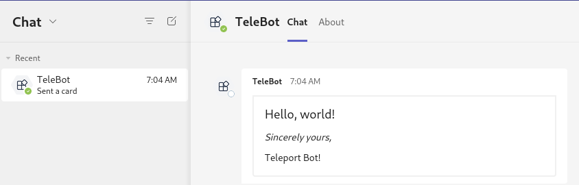

### Start the MS Teams Plugin

After you configured and validated the MS Teams plugin, you can now run the
plugin and test the workflow.

<Tabs>
<TabItem label="Executable">

Run the following command to start the Teleport MS Teams plugin.  The `-d` flag
will provide debug information to ensure that the plugin can connect to MS Teams
and your Teleport cluster:

```code
$ teleport-msteams start -d
DEBU   DEBUG logging enabled msteams/main.go:120
INFO   Starting Teleport MS Teams Plugin (=teleport.plugin.version=): msteams/app.go:74
DEBU   Attempting GET teleport.example.com:443/webapi/find webclient/webclient.go:129
DEBU   Checking Teleport server version msteams/app.go:242
INFO   MS Teams app found in org app store id:292e2881-38ab-7777-8aa7-cefed1404a63 name:TeleBot msteams/app.go:179
INFO   Preloading recipient data... msteams/app.go:185
INFO   Recipient found, chat found chat_id:19:a8c06deb-aa2b-4db5-9c78-96e48f625aef_a36aec2e-f11c-4219-b79a-19UUUU57de70@unq.gbl.spaces kind:user recipient:jeff@example.com msteams/app.go:195
INFO   Recipient data preloaded and cached. msteams/app.go:198
DEBU   Watcher connected watcherjob/watcherjob.go:121
INFO   Plugin is ready msteams/app.go:227
```

</TabItem>
<TabItem label="Docker">
Run the plugin:

```code
$ docker run -v <path-to-config>:/etc/teleport-msteams.toml public.ecr.aws/gravitational/teleport-plugin-msteams:(=teleport.version=) start
```

</TabItem>
<TabItem label="Helm Chart">
Install the plugin:

```code
$ helm upgrade --install teleport-plugin-msteams teleport/teleport-plugin-msteams --values teleport-msteams-helm.yaml
```

To inspect the plugin's logs, use the following command:

```code
$ kubectl logs deploy/teleport-plugin-msteams
```

Debug logs can be enabled by setting `log.severity` to `DEBUG` in
`teleport-msteams-helm.yaml` and executing the `helm upgrade ...` command
above again. Then you can restart the plugin with the following command:

```code
$ kubectl rollout restart deployment teleport-plugin-msteams
```

</TabItem>
</Tabs>

### Create an Access Request

Create an Access Request and check if the plugin works as expected with the
following steps.

(!docs/pages/includes/plugins/create-request.mdx!)

The user you configured earlier to review the request should receive a direct
message from "TeleBot" in Microsoft Teams allowing them to visit a link in the Teleport
Web UI and either approve or deny the request.

### Resolve the request

(!docs/pages/includes/plugins/resolve-request.mdx!)

Once the request is resolved, the Microsoft Teams bot will update the Access Request message
to reflect its new status.

<Admonition title="Auditing Access Requests">

When the Microsoft Teams plugin posts an Access Request notification to a channel, anyone
with access to the channel can view the notification and follow the link. While
users must be authorized via their Teleport roles to review Access Requests, you
should still check the Teleport audit log to ensure that the right users are
reviewing the right requests.

When auditing Access Request reviews, check for events with the type `Access
Request Reviewed` in the Teleport Web UI.

</Admonition>

## Step 9/9. Set up systemd

This section is only relevant if you are running the Teleport Microsoft Teams
plugin on a virtual machine.

In production, we recommend starting the Teleport plugin daemon via an init
system like systemd.  Here's the recommended Teleport plugin service unit file
for systemd:

```ini
(!examples/systemd/plugins/teleport-msteams.service!)
```

Save this as `teleport-msteams.service` in either `/usr/lib/systemd/system/` or
another [unit file load
path](https://www.freedesktop.org/software/systemd/man/systemd.unit.html#Unit%20File%20Load%20Path)
supported by systemd.

Enable and start the plugin:

```code
$ sudo systemctl enable teleport-msteams
$ sudo systemctl start teleport-msteams
```

## Next steps

- Read our guides to configuring [Resource Access
    Requests](../access-requests/resource-requests.mdx) and [Role Access
    Requests](../access-requests/role-requests.mdx) so you can get the most out
    of your Access Request plugins.
