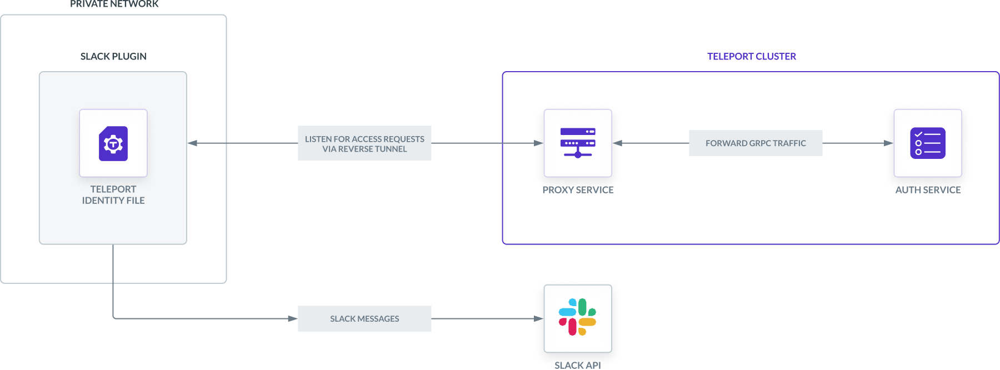
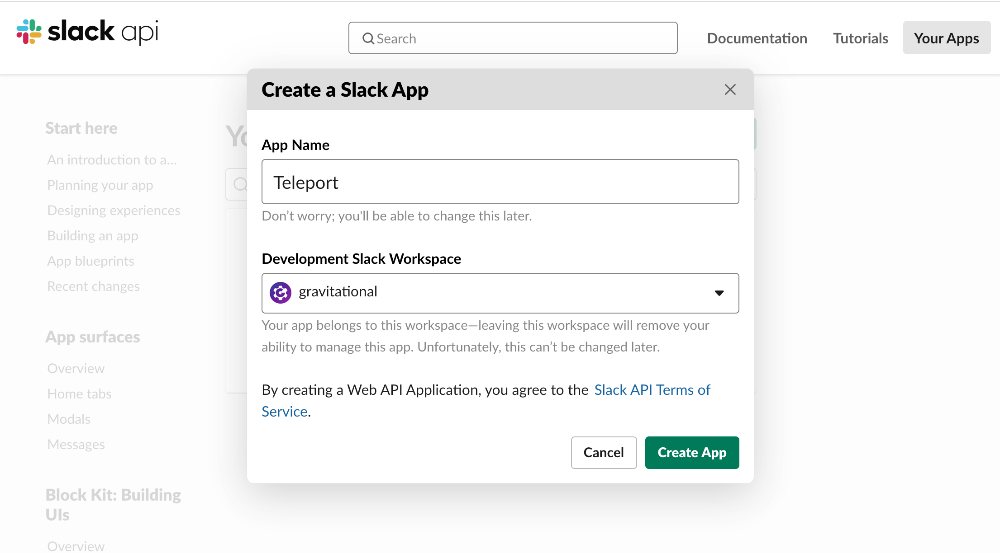
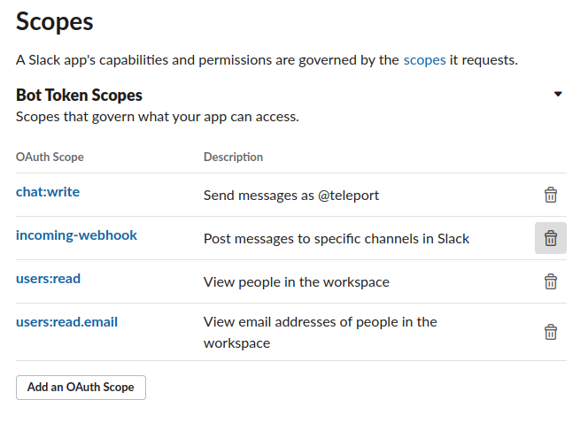

This guide will explain how to set up Slack to receive Access Request messages
from Teleport. Teleport's Slack integration notifies individuals and channels of
Access Requests. Users are then directed to log in to the Teleport cluster where
they can approve and deny Access Requests, making it easier to implement security 
best practices without compromising productivity.

<Details title="This integration is hosted on Teleport Cloud" open={false}>

(!docs/pages/includes/plugins/enroll.mdx name="the Slack integration"!)

</Details>



Here is an example of sending an Access Request via Teleport's Slack plugin:

<video controls>
  <source
    src="../../../img/enterprise/plugins/slack/slack.mp4"
    type="video/mp4"
  />

  <source
    src="../../../img/enterprise/plugins/slack/slack.webm"
    type="video/webm"
  />

  Your browser does not support the video tag.
</video>

## Prerequisites

(!docs/pages/includes/commercial-prereqs-tabs.mdx!)

(!docs/pages/includes/machine-id/plugin-prerequisites.mdx!)

- Slack admin privileges to create an app and install it to your workspace. Your
  Slack profile must have the "Workspace Owner" or "Workspace Admin" banner
  below your profile picture.
- Either a Linux host or Kubernetes cluster where you will run the Slack plugin.

(!/docs/pages/includes/tctl.mdx!)

## Step 1/8. Define RBAC resources

Before you set up the Slack plugin, you will need to enable Role Access Requests
in your Teleport cluster.

(!/docs/pages/includes/plugins/editor-request-rbac.mdx!)

## Step 2/8. Install the Teleport Slack plugin

(!docs/pages/includes/plugins/install-access-request.mdx name="slack"!)

## Step 3/8. Create a user and role for the plugin

(!docs/pages/includes/plugins/rbac-with-friendly-name.mdx!)

(!/docs/pages/includes/plugins/rbac-impersonate.mdx!)

## Step 4/8. Export the access plugin identity

Give the plugin access to a Teleport identity file. We recommend using Machine
ID for this in order to produce short-lived identity files that are less
dangerous if exfiltrated, though in demo deployments, you can generate
longer-lived identity files with `tctl`:

<Tabs>
<TabItem label="Machine ID">
(!docs/pages/includes/plugins/tbot-identity.mdx secret="teleport-plugin-slack-identity"!)
</TabItem>
<TabItem label="Long-lived identity files">
(!docs/pages/includes/plugins/identity-export.mdx user="access-plugin" secret="teleport-plugin-slack-identity"!)
</TabItem>
</Tabs>

## Step 5/8. Register a Slack app

The Access Request plugin for Slack receives Access Request events from the
Teleport Auth Service, formats them into Slack messages, and sends them to the
Slack API to post them in your workspace. For this to work, you must register a
new app with the Slack API.

### Create your app

Visit [https://api.slack.com/apps](https://api.slack.com/apps) to create a new
Slack app. Click "Create an App", then "From scratch". Fill in the form as shown
below:



The "App Name" should be "Teleport". Click the "Development Slack Workspace"
dropdown and choose the workspace where you would like to see Access Request
messages.

### Generate an OAuth token with scopes

Next, configure your application to authenticate to the Slack API. We will do
this by generating an OAuth token that the plugin will present to the Slack API.

We will restrict the plugin to the narrowest possible permissions by using OAuth
scopes. The Slack plugin needs to post messages to your workspace. It also needs
to read usernames and email addresses in order to direct Access Request
notifications from the Auth Service to the appropriate Teleport users in Slack.

After creating your app, the Slack website will open a console where you can
specify configuration options. On the sidebar menu under "Features", click
"OAuth & Permissions".

Scroll to the "Scopes" section and click "Add an OAuth Scope" for each of the
following scopes:

- `chat:write`
- `incoming-webhook`
- `users:read`
- `users:read.email`

The result should look like this:



After you have configured scopes for your plugin, scroll back to the top of the
OAuth & Permissions page, find the "OAuth Tokens for Your Workspace" section,
and click "Install to Workspace". You will see a summary of the permission you
configured for the Slack plugin earlier.

In "Where should Teleport post?", choose "Slackbot" as the default channel the
plugin will post to. The plugin will post here when sending direct messages.
Later in this guide, we will configure the plugin to post in other channels as
well.

After submitting this form, you will see an OAuth token in the "OAuth &
Permissions" tab under "Tokens for Your Workspace":


You will use this token later when configuring the Slack plugin.

## Step 6/8. Configure the Teleport Slack plugin

At this point, the Teleport Slack plugin has the credentials it needs to
communicate with your Teleport cluster and the Slack API. In this step, you will
configure the Slack plugin to use these credentials. You will also configure the
plugin to notify the right Slack channels when it receives an Access Request
update.

### Create a configuration file

<Tabs>
<TabItem label="Executable or Docker">
The Teleport Slack plugin uses a configuration file in TOML format. Generate a
boilerplate configuration by running the following command (the plugin will not run
unless the config file is in `/etc/teleport-slack.toml`):

```code
$ teleport-slack configure | sudo tee /etc/teleport-slack.toml > /dev/null
```

This should result in a configuration file like the one below:

```toml
(!examples/resources/plugins/teleport-slack.toml!)
```
</TabItem>
<TabItem label="Helm Chart">
The Slack Helm Chart uses a YAML values file to configure the plugin.
On your local workstation, create a file called `teleport-slack-helm.yaml`
based on the following example:

```toml
(!examples/resources/plugins/teleport-slack-helm.yaml!)
```

</TabItem>
</Tabs>

### Edit the configuration file

Open the configuration file created for the Teleport Slack plugin and update the following fields:

**`[teleport]`**

The Slack plugin uses this section to connect to your Teleport cluster:

(!docs/pages/includes/plugins/config-toml-teleport.mdx!)

(!docs/pages/includes/plugins/refresh-plugin-identity.mdx!)

**`[slack]`**

`token`: Open [`https://api.slack.com/apps`](https://api.slack.com/apps), find
the Slack app you created earlier, navigate to the "OAuth & Permissions" tab,
copy the "Bot User OAuth Token", and paste it into this field.

**`[role_to_recipients]`**

The `role_to_recipients` map configure the channels that the Slack plugin will
notify when a user requests access to a specific role. When the Slack plugin
receives an Access Request from the Auth Service, it will look up the role being
requested and identify the Slack channels to notify.

<Tabs>
<TabItem label="Executable or Docker">
Here is an example of a `role_to_recipients` map. Each value can be a
single string or an array of strings:

```toml
[role_to_recipients]
"*" = "admin-slack-channel"
"dev" = ["dev-slack-channel", "admin-slack-channel"]
"dba" = "alex@gmail.com"
```
</TabItem>
<TabItem label="Helm Chart">
In the Helm chart, the `role_to_recipients` field is called `roleToRecipients`
and uses the following format, where keys are strings and values are arrays of
strings:

```yaml
roleToRecipients:
  "*": ["admin-slack-channel"]
  "dev":
    - "dev-slack-channel"
    - "admin-slack-channel"
  "dba": ["alex@gmail.com"]
```
</TabItem>
</Tabs>

In the `role_to_recipients` map, each key is the name of a Teleport role. Each
value configures the Slack channel (or channels) to notify. Each string must be
either the name of a Slack channel (including a user's direct message channel)
or the email address of a Slack user. If the recipient is an email address, the
Slack plugin will use that email address to look up a direct message channel.

The `role_to_recipients` map must also include an entry for `"*"`, which the
plugin looks up if no other entry matches a given role name. In the example
above, requests for roles aside from `dev` and `dba` will notify the
`admin-slack-channel` channel.

<Details title="Suggested reviewers">

Users can suggest reviewers when they create an Access Request, e.g.,:

```code
$ tsh request create --roles=dbadmin --reviewers=alice@example.com,ivan@example.com
```

If an Access Request includes suggested reviewers, the Slack plugin will add
these to the list of channels to notify. If a suggested reviewer is an email
address, the plugin will look up the direct message channel for that
address and post a message in that channel.

</Details>

Configure the Slack plugin to notify you when a user requests the `editor` role
by adding the following to your `role_to_recipients` config (replace
`TELEPORT_USERNAME` with the user you assigned the `editor-reviewer` role
earlier):

<Tabs>
<TabItem label="Executable or Docker">
```toml
[role_to_recipients]
"*" = "access-requests"
"editor" = "TELEPORT_USERNAME"
```
</TabItem>
<TabItem label="Helm Chart">
```yaml
roleToRecipients:
  "*": "access-requests"
  "editor": "TELEPORT_USERNAME"
```
</TabItem>
</Tabs>

Either create an `access-requests` channel in your Slack workspace or rename the
value of the `"*"` key to an existing channel.

### Invite your Slack app

Once you have configured the channels that the Slack plugin will notify when it
receives an Access Request, you will need to ensure that the plugin can post in
those channels.

You have already configured the plugin to send direct messages as Slackbot. For
any other channel you mention in your `role_to_recipients` map, you will need
to invite the plugin to that channel. Navigate to each channel and enter `/invite
@teleport` in the message box.

## Step 7/8. Test your Slack app

Once Teleport is running, you've created the Slack app, and the plugin is
configured, you can now run the plugin and test the workflow.

<Tabs>
<TabItem label="Executable">
Start the plugin:

```code
$ teleport-slack start
```

If everything works fine, the log output should look like this:

```code
$ teleport-slack start
INFO   Starting Teleport Access Slack Plugin 7.2.1: slack/app.go:80
INFO   Plugin is ready slack/app.go:101
```
</TabItem>
<TabItem label="Docker">
run the plugin:

```code
$ docker run -v <path-to-config>:/etc/teleport-slack.toml public.ecr.aws/gravitational/teleport-plugin-slack:(=teleport.version=) start
```
</TabItem>
<TabItem label="Helm Chart">
Install the plugin:

```code
$ helm upgrade --install teleport-plugin-slack teleport/teleport-plugin-slack --values teleport-slack-helm.yaml
```

To inspect the plugin's logs, use the following command:

```code
$ kubectl logs deploy/teleport-plugin-slack
```

Debug logs can be enabled by setting `log.severity` to `DEBUG` in
`teleport-slack-helm.yaml` and executing the `helm upgrade ...` command
above again. Then you can restart the plugin with the following command:

```code
$ kubectl rollout restart deployment teleport-plugin-slack
```
</TabItem>
</Tabs>

Create an Access Request and check if the plugin works as expected with the
following steps.

### Create an Access Request

(!docs/pages/includes/plugins/create-request.mdx!)

The user you configured earlier to review the request should receive a direct
message from "Teleport" in Slack allowing them to visit a link in the Teleport
Web UI and either approve or deny the request.

### Resolve the request

(!docs/pages/includes/plugins/resolve-request.mdx!)

Once the request is resolved, the Slack bot will add an emoji reaction of ✅ or
❌ to the Slack message for the Access Request, depending on whether the request
was approved or denied.

<Admonition title="Auditing Access Requests">

When the Slack plugin posts an Access Request notification to a channel, anyone
with access to the channel can view the notification and follow the link. While
users must be authorized via their Teleport roles to review Access Requests, you
should still check the Teleport audit log to ensure that the right users are
reviewing the right requests.

When auditing Access Request reviews, check for events with the type `Access
Request Reviewed` in the Teleport Web UI.

</Admonition>

## Step 8/8. Set up systemd

This section is only relevant if you are running the Teleport Slack plugin on a
Linux host.

In production, we recommend starting the Teleport plugin daemon via an init
system like systemd.  Here's the recommended Teleport plugin service unit file
for systemd:

```ini
(!examples/systemd/plugins/teleport-slack.service!)
```

Save this as `teleport-slack.service` in either `/usr/lib/systemd/system/` or
another [unit file load
path](https://www.freedesktop.org/software/systemd/man/systemd.unit.html#Unit%20File%20Load%20Path)
supported by systemd.

Enable and start the plugin:

```code
$ sudo systemctl enable teleport-slack
$ sudo systemctl start teleport-slack
```

## Next steps

- Read our guides to configuring [Resource Access
    Requests](../access-requests/resource-requests.mdx) and [Role Access
    Requests](../access-requests/role-requests.mdx) so you can get the most out
    of your Access Request plugins.
