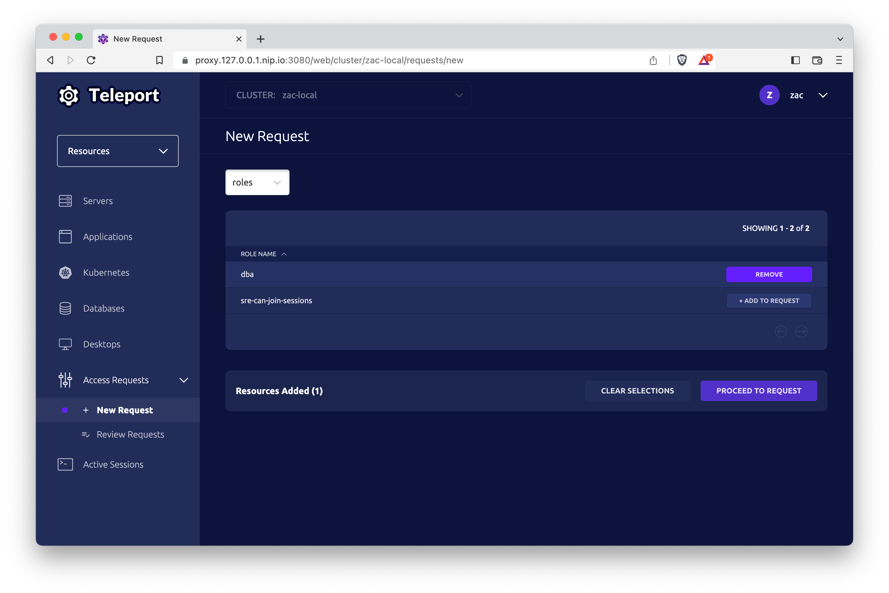
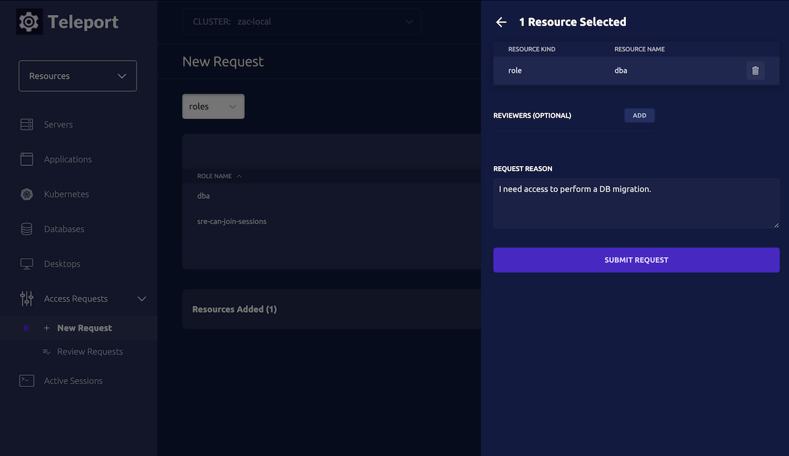

Teleport's Just-in-time Access Requests allow users to request access to
additional roles in order to elevate their privileges. Requests can be escalated
via ChatOps or anywhere else via our flexible Authorization Workflow API.

## Prerequisites

(!docs/pages/includes/commercial-prereqs-tabs.mdx!)

- (!docs/pages/includes/tctl.mdx!)

## RBAC Setup

In this example, we will define three roles:

- `contractor`: users with this role can request elevated access to the `dba` role
- `dba`: this role grants access to databases
- `approver`: users with this role can approve requests for access to the `dba` role

**Contractor Role**

Users with this role can request access to the `dba` role.

```yaml
kind: role
version: v5
metadata:
  name: contractor
spec:
  allow:
    request:
      roles: ['dba']
```

**DBA Role**

This role grants access to databases.

```yaml
kind: role
version: v5
metadata:
  name: dba
spec:
  allow:
    db_labels:
      '*': '*'
  options:
    # Only allows the contractor to use this role for 1 hour from time of request.
    max_session_ttl: 1h
```

**Approver Role**

This role allows users to approve requests for the `dba` role.

```yaml
kind: role
version: v5
metadata:
  name: approver
spec:
  allow:
    # `review_requests` permits the listed roles to be approved
    review_requests:
      roles:
      - 'dba'
```

<Admonition type="warning" title="Requires Teleport Enterprise">
Roles containing a `review_requests` rule can only be used in Teleport
Enterprise. In Teleport Community Edition, Access Requests must be approved by an admin
running `tctl` on the Auth Service.
</Admonition>

## Requesting Access

While Teleport Enterprise supports the same CLI-based workflows for requesting
access to roles, most users will prefer to request access via the web UI.

To request access to one or more roles, navigate to the Access Requests page.
You can find this page by selecting **Resources** on the side bar, expanding the
*Access Requests* menu, and selecting **New Request**.

From here, the dropdown will allow you to request access to roles or to specific
resources. Select roles in this dropdown and you will be presented with a list
of roles you are permitted to request access to.

Click **ADD TO REQUEST** to include a role in the pending request.

Note: Access Requests must either contain roles or a set of specific resources.
You can not mix the two. For more information on how to request access to
specific resources, see the
[Resource Access Requests Guide](./resource-requests.mdx).



When all desired roles have been added, click **PROCEED TO REQUEST**, where you
can review and submit the request.



## Reviewing Access Requests via the Web UI

Reviewers can see a list of open requests by navigating to
**Management** > **Access Requests** > **Review Requests** in the web UI.

<Admonition type="warning">
Granting access to a role with the ability to edit other roles could allow a
user to **permanently** upgrade their privileges. When reviewing requests, it's
important to carefully consider the role(s) being requested and what permissions
will be applied to the user if the request is approved.
</Admonition>

## Reviewing Access Requests via `tsh`

Teleport Enterprise users with appropriate permissions can also approve requests
with the `tsh` command line:

```code
$ tsh request review --approve <request-id>
```

## Using an approved Access Request

Once a request has been approved, the requestor can elevate their access for
both command-line workflows and web UI workflows.

For command-line use, the requestor should log in using the approved request ID:

```code
# log in with an approved access request
$ tsh login --request-id=bc8ca931-fec9-4b15-9a6f-20c13c5641a9
```

In the web UI, the requestor can open their request on the **Review Requests**
page and click **ASSUME ROLES** to gain access to additional roles. Note:
role-based Access Requests are additive. The user will have access to their
standard role set in addition to the roles granted by the request.

A banner will appear at the top of the page while the approved Access Request is
active. When elevated access is no longer necessary, click **Switch Back** to revert
to the original set of roles.

## Next Steps

### Automatically request access for SSH

Once you have configured Role Access Requests,
`tsh ssh` is able to automatically create a Role Access Request for you when access is denied,
allowing you to skip the `tsh request search` and `tsh request create` steps.
If more than one role would grant access to the target node, you will be prompted
to select a role to request.

```code
$ tsh ssh --request-mode role alice@iot
ERROR: access denied to alice connecting to iot on cluster teleport.example.com

You do not currently have access to alice@iot, attempting to request access.

Choose role to request [node-access, node-access-alt]: node-access
Enter request reason: please
Creating request...

Waiting for request approval...

Approval received, reason="okay"
Getting updated certificates...

iot:~ alice$
```

Note that in order to make a Role Access Request this way, the role you request
access with must have `search_as_role` set so you can read the node you want to
ssh into.

```yaml
# requester.yaml
kind: role
version: v5
metadata:
  name: requester
spec:
  allow:
    request:
      roles:
        - node-access
      search_as_roles:
        # does not need to match roles, just needs to be able to access nodes
        # that you want to ssh into
        - access
```

### Integrate with an external tool

With Teleport's Access Request plugins, users can manage Access Requests from
within your organization's existing messaging and project management solutions.

(!docs/pages/includes/access-request-integrations.mdx!)

### Learn how to configure Access Requests

See the [Access Request Configuration](./access-request-configuration.mdx) guide
for a detailed description of all the options you can configure to set up a
just-in-time Access Request workflow for your organization.

### Set up Access Lists

Access Lists enable you to assign privileges to groups of users for a fixed
period of time. Learn more about Access Lists in the
[documentation](../access-lists/access-lists.mdx).

