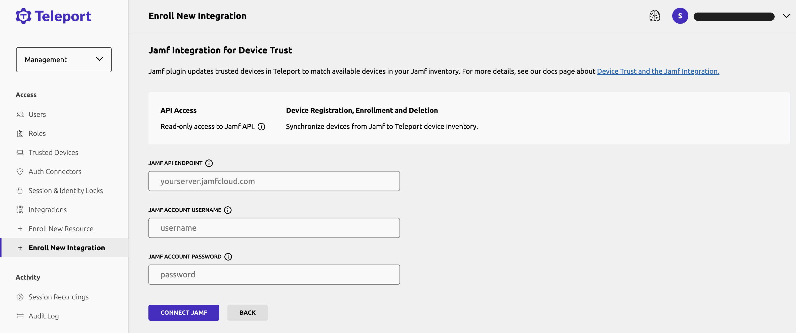

Device Trust Jamf Pro integration lets you automatically sync your Jamf Pro computer
inventory into Teleport.

The Teleport Jamf Pro service is a distinct `teleport` process that periodically
reads your computer inventory from Jamf Pro and syncs it to Teleport. It performs
both incremental (called "partial") and full syncs, as well as removals from
Teleport if a computer is removed from Jamf Pro.

Syncing devices from Jamf Pro is an **inventory management** step, equivalent to
automatically running the corresponding `tctl devices add` commands.

See the [Device Trust guide](device-trust.mdx) for fundamental Device Trust concepts
and behavior.

<details>
<summary>This integration is hosted on Teleport Cloud"</summary>

(!docs/pages/includes/plugins/enroll.mdx name="the Jamf Pro integration"!)

</details>

## Prerequisites

(!docs/pages/includes/commercial-prereqs-tabs.mdx!)

(!docs/pages/includes/device-trust/prereqs.mdx!)

## Step 1/4. Create Jamf API credentials

<Admonition type="note" title="v16.0.0 or lower">
  Teleport versions v16.0.0 or lower don't support Jamf API credentials. Follow
  the instructions under [Using Jamf user and password authentication](
  #optional-using-jamf-user-and-password-authentication) instead.
</Admonition>

Follow the instructions at [Jamf API Roles and Clients](
https://learn.jamf.com/en-US/bundle/jamf-pro-documentation-current/page/API_Roles_and_Clients.html)
to create a role and an API client. We recommend creating a role and API client
specific for Teleport.

Make sure that your Jamf role has the "Read Computers" privilege.

You can test your client credentials using the following Jamf query:

```code
$ URL='<Var name="(=jamf.api_endpoint=)" description="Jamf API URL"/>'
$ CLIENT_ID='<Var name="(=jamf.client_id=)" description="Jamf API client ID" />'
$ CLIENT_SECRET='<Var name="(=jamf.client_secret=)" description="Jamf API client secret" />'

## Acquire access token from Jamf.
$ TOKEN_RESP="$(curl -X POST "$URL/api/oauth/token" \
  -H 'Content-Type: application/x-www-form-urlencoded' \
  --data-urlencode 'grant_type=client_credentials' \
  --data-urlencode "client_id=$CLIENT_ID" \
  --data-urlencode "client_secret=$CLIENT_SECRET" -s)"
$ echo "$TOKEN_RESP"
$ ACCESS_TOKEN="$(echo "$TOKEN_RESP" | jq -r .access_token)"

## Test access token privileges.
$ curl -H "Authorization: Bearer $ACCESS_TOKEN" "$URL/api/v1/computers-inventory?page-size=1"
```

The query above should print an inventory entry from Jamf. If you get permission
errors (401 or 403), double check your client credentials, role privileges and
try to recreate your API client.

## Step 2/4. Configure Jamf service

<Admonition type="tip" title="Hosted Jamf plugin">
  Teleport Cloud users can quickly get started with Jamf integration by using
  the hosted Jamf plugin in the Web UI.
  <details>
  <summary>Configure Jamf hosted plugin" min="13.2" close</summary>
    Select the Jamf plugin:
    
    Fill in the required information and click "Connect Jamf" button:
    
  </details>
</Admonition>

Jamf inventory sync is performed by a separate `teleport` process, configured
using the `jamf_service` key. It is recommended to run the service isolated from
other Teleport processes, as it requires the Jamf credentials created in the
step above.

Save the following file as `/var/lib/teleport.yaml` and edit as needed:

```yaml
version: v3
teleport:
  # Necessary to write devices back to Teleport.
  proxy_server: (=clusterDefaults.clusterName=):443 # CHANGEME
  join_params:
    token_name: "/tmp/token"

jamf_service:
  enabled: true
  name: jamf
  api_endpoint: (=jamf.api_endpoint=) #CHANGEME
  client_id:    (=jamf.client_id=) #CHANGEME
  client_secret_file: /var/lib/teleport/jamf_client_secret.txt

auth_service:
  enabled: false

proxy_service:
  enabled: false

ssh_service:
  enabled: false
```

Change the following settings, as appropriate:

- teleport.proxy_server
- jamf_service.api_endpoint
- jamf_service.client_id

Finally, write your Jamf client secret to the
`/var/lib/teleport/jamf_client_secret` file:

```code
$ sudo nano /var/lib/teleport/jamf_client_secret # or use your favorite editor

# Only the OS user that runs `teleport` should have access to the secret file.
$ sudo chmod 400 /var/lib/teleport/jamf_client_secret
$ sudo chown teleport /var/lib/teleport/jamf_client_secret
```

## Step 3/4. Create a join token

Jamf service requires an MDM token to write devices to Teleport.
On your local workstation, create the token as shown below:

```code
$ tctl tokens add --type=mdm
The invite token: (=presets.tokens.second=)
This token will expire in 30 minutes.

From the Jamf service host, use this token to add an MDM service to Teleport.

> teleport start \
   --token=(=presets.tokens.second=) \
   --ca-pin=(=presets.ca_pin=)\
   --config=/path/to/teleport.yaml
```

On the Jamf service host, write the token to a file called `/tmp/token`.

## Step 4/4. Start Jamf service

Using the token created above, start the service:

(!docs/pages/includes/start-teleport.mdx!)

The initial sync should happen in a few minutes. You can confirm from the Teleport service logs:

```
2023-06-21T17:26:40-03:00 INFO [JAMF:1]    Jamf service successfully started pid:25757.1 service/service.go:228
2023-06-21T17:26:40-03:00 INFO [JAMF:1]    Starting sync CutTime:0001-01-01 00:00:00 +0000 UTC FilterRSQL: Mode:1 OnMissing:DELETE pid:25757.1 service/service.go:261
2023-06-21T17:26:40-03:00 INFO [JAMF:1]    Device sync report, page #0 deletes:0 failures:0 pid:25757.1 upserts:1 service/service.go:666
2023-06-21T17:26:40-03:00 INFO [JAMF:1]    Sync complete pid:25757.1 service/service.go:277
```

Using the default configuration, the service will sync devices from Jamf every
few hours. Once a day a full inventory sync is performed, enumerating all
devices from Jamf and reflecting any additions or removals on Teleport.

After the initial sync happens, you may verify the synced devices using `tctl
devices ls`:

```code
$ tctl devices ls
Asset Tag    OS      Enroll Status Device ID
------------ ------- ------------- ------------------------------------
CXXXXXXXXX17 macOS   not enrolled  20ec6373-9e8e-46e0-8f1c-47ad6b06a768
CXXXXXXXXX2T macOS   not enrolled  79755778-7cbe-4e2c-83ec-7eaa3d4d7e36
CXXXXXXXXX3T macOS   not enrolled  665e59d5-393a-4894-841d-edad06329717
CXXXXXXXXX4T macOS   not enrolled  dd032e90-bfb0-47d5-bce5-e57545f6788f
CXXXXXXXXX5T macOS   not enrolled  bf189863-a94a-40dc-9013-d96f8dada2f1
(...)
```

## Optional: Customize the sync schedule

When using the minimal configuration, described in the steps above, Jamf service
utilizes a default sync schedule. It is possible to customize sync intervals, as
well as the set of devices synced from Jamf, by applying RSQL filters provided
by the [Jamf Pro API](
https://developer.jamf.com/jamf-pro/reference/get_v1-computers-inventory).
Jamf recommends a full sync no more than once every 24 hours.

The default "inventory" configuration is roughly equivalent to the one below:

```yaml
jamf_service:
  enabled: true
  # ...
  inventory:
  - sync_period_partial: 6h
    sync_period_full: 24h
    on_missing: DELETE
    filter_rsql: general.remoteManagement.managed==true
```

Unpacking the configuration, we have the following keys:

### `sync_period_*`

- `sync_period_partial`: period for partial syncs. A partial sync attempts to
  fetch new and modified devices, but won't scan the entire Jamf inventory.
- `sync_period_full`: period for full syncs. A full sync scans the entire Jamf
  inventory, processing new/modified devices and removals from Jamf.

Both sync periods may be disabled by setting the period to `0` or `-1`. It is
recommended to do a full sync with some regularity, so Teleport has the chance
to fully synchronize both inventories.

### `on_missing`

The `on_missing` key determines what to do with devices deleted from Jamf, but
present in Teleport. The possible actions are:

- `DELETE`: devices removed from Jamf are eventually removed from Teleport.
  (Requires a full sync.)
- `NOOP`: devices removed from Jamf are allowed to remain in the Teleport
  inventory.

Only devices synced by Jamf are susceptible to deletion in this manner. Devices
written manually via `tctl devices add` or written by other sources won't be
deleted.

For immediate removal of unwanted devices first lock the device on Teleport,
then remove it from Jamf:

```code
$ tctl devices lock --asset-tag=SERIAL_NUMBER --message='reason for locking'
Created a lock with name "a2f1491c-4a3e-4daf-9c83-2fe931668076".
```

Manual removal via `tctl devices rm` is possible, but note that if the device is
still in the Jamf inventory, it'll be recreated during the next sync.

### `filter_rsql`

The `filter_rsql` key applies a Jamf Pro API filter when querying for devices.
Refer to
https://developer.jamf.com/jamf-pro/reference/get_v1-computers-inventory for the
possible filter values.

## Optional: Sync multiple sources

When syncing inventory, Jamf service claims ownership of all synced devices.
This can be verified by inspecting a device's `source` field:

```yaml
# tctl get device/mydevice
kind: device
metadata:
  name: 20ec6373-9e8e-46e0-8f1c-47ad6b06a768
spec:
  asset_tag: mydevice
  os_type: macos
  # ...
  source:         # Set during inventory sync
    name: jamf    # Copied from jamf_service.name
    origin: jamf  # Always "jamf" for Jamf service
  update_time: "2023-06-21T19:44:40.40601Z"
version: v1
```

Device ownership is important in a few situations, but it is particularly
important when running "on\_missing=DELETE" syncs, as only the devices owned by
the sync source are considered for deletion.

If you want to run multiple Jamf sources you can simply run multiple Jamf
services, each with its configuration and credentials. Just make sure that each
service has a different "jamf\_service.name". For example:

`teleport.yaml` - Service #1:

```diff
version: v3
teleport:
  proxy_server: (=clusterDefaults.clusterName=):443

jamf_service:
  enabled: true
+ name: jamf1
+ api_endpoint: https://tenant1.jamfcloud.com
+ client_id: tenant1-id
+ client_secret_file: /var/lib/teleport/jamf1_client_secret.txt

auth_service:
  enabled: false

proxy_service:
  enabled: false

ssh_service:
  enabled: false
```

`teleport.yaml` - Service #2:

```diff
version: v3
teleport:
  proxy_server: teleport.example.com:443

jamf_service:
  enabled: true
+ name: jamf2
+ api_endpoint: https://tenant2.jamfcloud.com
+ client_id: tenant2-id
+ client_secret_file: /var/lib/teleport/jamf2_client_secret.txt

auth_service:
  enabled: false

proxy_service:
  enabled: false

ssh_service:
  enabled: false
```

## Optional: Using Jamf user and password authentication

<Admonition type="note" title="v16.1.0+">
  Teleport versions v16.1.0 and higher support [Jamf API credentials](
  #step-14-create-jamf-api-credentials). Prefer using API credentials instead
  of username and password authentication.
</Admonition>

Create a readonly Jamf user for inventory sync.

1. Access `(=jamf.api_endpoint=)/accounts.html`, replacing
   `yourtenant` with your Jamf Pro account.

1. Create a new Standard Account with the following settings:

   - Username: teleport (change as desired)
   - Access Level: Full Access
   - Privilege Set: Custom
   - Access Status: Enabled
   - Password: (a strong password of your choice)
   - Privileges:
     - Advanced Computer Searches: Read
     - Computers: Read

   Take note of the user and password.

   User account setup: 

   Privileges setup: 

## Next steps

Automatically enroll synced devices on user login with
[auto-enrollment](./device-management.mdx#auto-enrollment).
