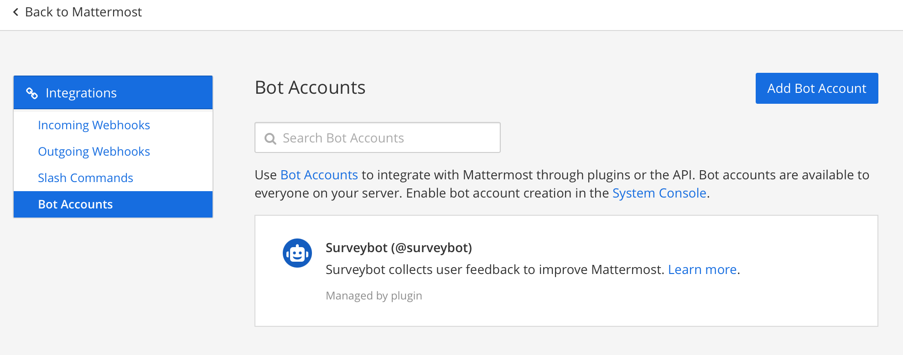
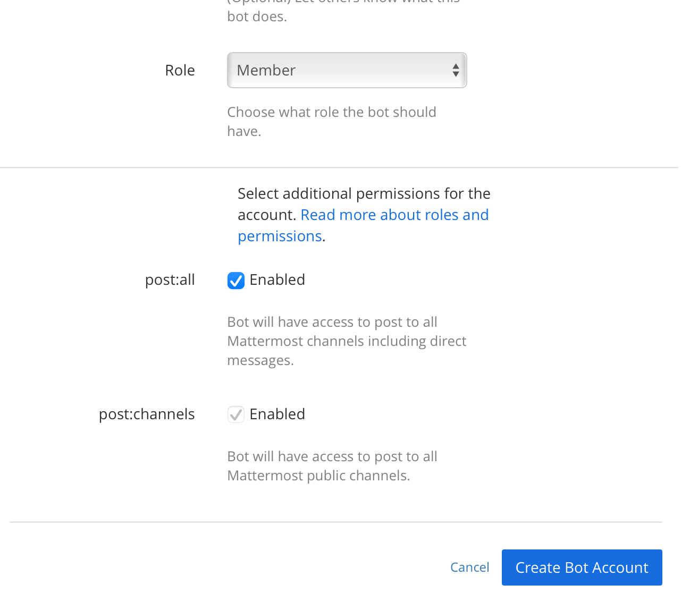
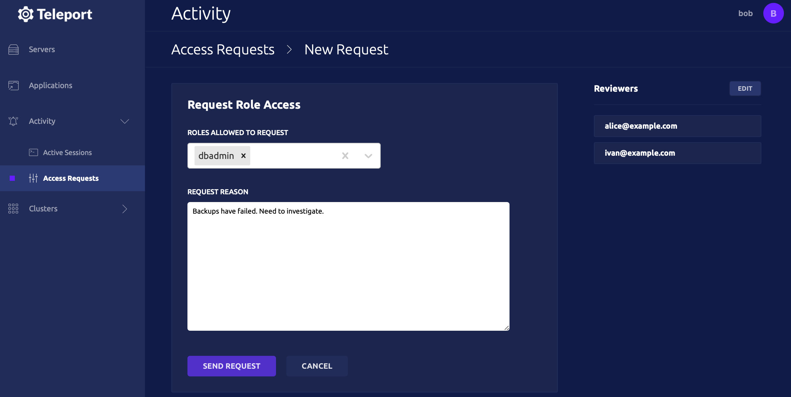
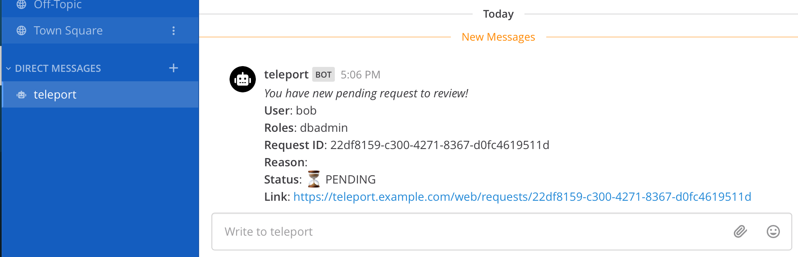
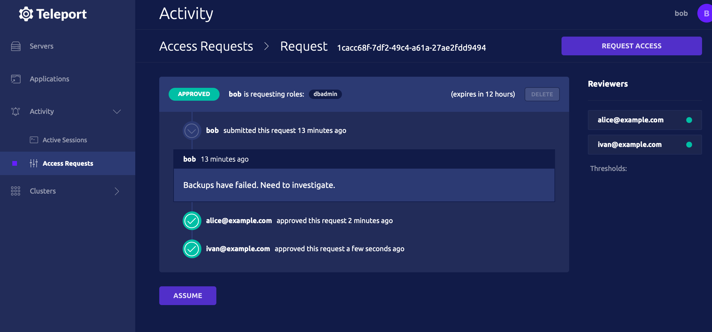

You can set up Teleport to require the approval of multiple team members to perform some critical actions.
Here are the most common scenarios:

- Improve the security of your system and prevent one successful phishing attack from compromising your system.
- Satisfy FedRAMP AC-3 Dual authorization control that requires approval of two authorized individuals.

In this guide, we will set up Teleport's Just-in-Time Access Requests to require
the approval of two team members for a privileged role `dbadmin`.

The steps below describe how to use Teleport with Mattermost. You can also
[integrate with many other providers](../access-requests/access-requests.mdx).

<Admonition type="warning">

Dual Authorization requires Teleport Enterprise.

</Admonition>

## Prerequisites

- Mattermost installed.

(!docs/pages/includes/commercial-prereqs-tabs.mdx!)

<Admonition
  type="tip"
  title="Running Mattermost locally with Docker"
>
  ```code
  $ docker run --name mattermost-preview -d --publish 8065:8065 --add-host dockerhost:127.0.0.1 mattermost/mattermost-preview
  ```

</Admonition>

- (!docs/pages/includes/tctl.mdx!)

## Step 1/2. Set up a Teleport bot

### Create a bot within Mattermost

Enable bot account creation in "System Console -> Integrations".

Toggle `Enable Bot Account Creation`.


Go back to your team settings, navigate to "Integrations -> Bot Accounts". Press "Add Bot Account".



Add the "Post All" permission on the new account.



Create the bot and save the access token.

### Set up RBAC for the plugin

(!docs/pages/includes/plugins/rbac.mdx!)

(!/docs/pages/includes/plugins/rbac-impersonate.mdx!)

### Export the access-plugin identity files

(!docs/pages/includes/plugins/identity-export.mdx user="access-plugin"!)

We'll reference the exported file(s) later when configuring the plugin.

### Install the plugin

<Tabs>
<TabItem label="Download">
  Access Request Plugins are available as `amd64` or `arm64` Linux binaries for downloading.
  Replace `ARCH` with your required version.

  ```code
  $ curl -L https://cdn.teleport.dev/teleport-access-mattermost-v(=teleport.plugin.version=)-linux-<Var name="ARCH" />-bin.tar.gz
  $ tar -xzf teleport-access-mattermost-v(=teleport.plugin.version=)-linux-<Var name="ARCH" />-bin.tar.gz
  $ cd teleport-access-mattermost
  $ ./install
  ```
</TabItem>
<TabItem label="From Source">
  To install from source you need `git` and `go >= (=teleport.golang=)` installed.

  ```code
  # Checkout the Teleport repo and go in the mattermost access plugin directory
  $ git clone https://github.com/gravitational/teleport.git -b branch/v(=teleport.major_version=)
  $ cd teleport/integrations/access/mattermost
  $ git checkout (=teleport.plugin.version=)
  $ make
  ```
</TabItem>
</Tabs>

```code
$ teleport-mattermost configure > /etc/teleport-mattermost.toml
```

Update the config with the Teleport address, Mattermost URL, and a bot token:

```yaml
(!examples/resources/plugins/teleport-mattermost-cloud.toml!)
```

## Step 2/2. Configure dual authorization

In this section, we will use an example to show you how to require dual
authorization for a user to assume a role.

### Require dual authorization for a role

Alice and Ivan are reviewers. They can approve requests for assuming role
`dbadmin`. Bob is a DevOps engineer and can assume the `dbadmin` role if two members
of the `reviewer` role approve the request.

Create the following `dbadmin`, `dbreviewer` and `devops` roles:

```yaml
kind: role
version: v5
metadata:
  name: dbreviewer
spec:
  allow:
    review_requests:
      roles: ['dbadmin']
---
kind: role
version: v5
metadata:
  name: devops
spec:
  allow:
    request:
      roles: ['dbadmin']
      thresholds:
        - approve: 2
          deny: 1
---
kind: role
version: v5
metadata:
  name: dbadmin
spec:
  allow:
    logins: ['root']
    node_labels:
      'env': 'prod'
      'type': 'db'
```

The commands below create the local users Bob, Alice, and Ivan.

```code
$ tctl users add bob@example.com --roles=devops
$ tctl users add alice@example.com --roles=dbreviewer
$ tctl users add ivan@example.com --roles=dbreviewer
```

### Create an Access Request

Bob does not have a role `dbadmin` assigned to him, but can create an Access Request for it.

Bob can create an Access Request for the `dbadmin` role in the Web UI or CLI:

<Tabs>
<TabItem label="Web UI">
  
</TabItem>
<TabItem label="Terminal">
  ```code
  # Bob has to set valid emails of Alice and Ivan matching in Mattermost.
  $ tsh request create --roles=dbadmin --reviewers=alice@example.com,ivan@example.com
  ```
</TabItem>
</Tabs>

Chatbot will notify both Alice and Ivan:



Alice and Ivan can review and approve request using Web UI or CLI:

<Tabs>
  <TabItem label="Web UI">
    
  </TabItem>

  <TabItem label="CLI">
    ```code
    $ tsh request list

    # ID                                   User             Roles   Created (UTC)       Status
    # ------------------------------------ ---------------  ------- ------------------- -------
    # 9c721e54-b049-4ef8-a7f6-c777aa066764 bob@example.com  dbadmin 03 Apr 21 03:58 UTC PENDING

    $ tsh request review --approve --reason="hello" 9c721e54-b049-4ef8-a7f6-c777aa066764
    # Successfully submitted review.  Request state: APPROVED
    ```
  </TabItem>
</Tabs>

If Bob has created a request using CLI, he will assume it once it has been approved.
Bob can also assume granted Access Request roles using Web UI:




## Troubleshooting

### Certificate errors in self-hosted deployments

You may be getting certificate errors if Teleport's Auth Service is missing an address in the server certificate:

```txt
authentication handshake failed: x509: cannot validate certificate for 127.0.0.1 because it doesn't contain any IP SANs
```

```txt
x509: certificate is valid for,*.teleport.cluster.local, teleport.cluster.local, not example.com
```

To fix the problem, update the Auth Service with a public address, and restart Teleport:

```yaml
auth_service:
  public_addr: ['localhost:3025', 'example.com:3025']
```
