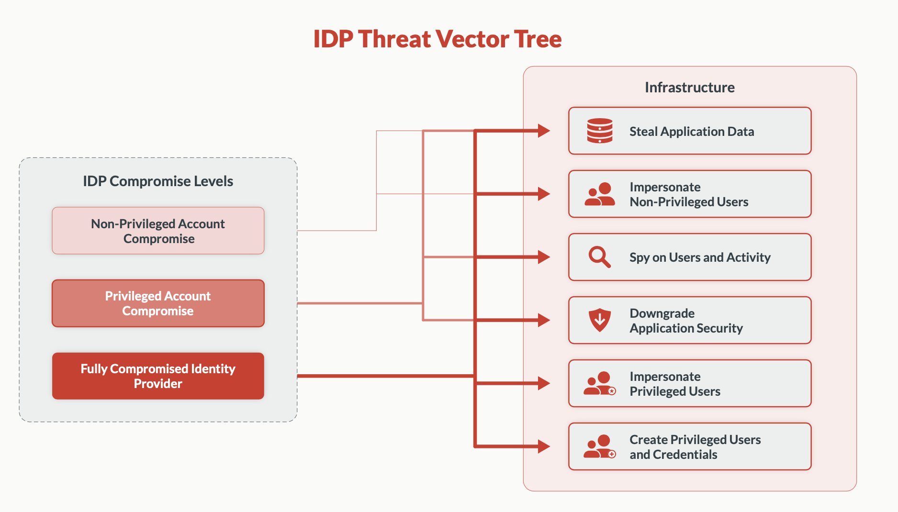

This guide aims to help you fortify your identity infrastructure and mitigate the risks associated with IdP weaknesses.

An IdP compromise occurs when an attacker gains unauthorized access to your identity management
system, potentially allowing them to impersonate legitimate users, escalate privileges, or access
sensitive information. This can happen through various means, such as exploiting software vulnerabilities,
stealing credentials, or social engineering attacks.

While many organizations have implemented basic security measures like single sign-on (SSO) and multi-factor authentication (MFA),
these alone may not be sufficient to protect against sophisticated attacks targeting your IdP.
Attackers are constantly evolving their techniques, and traditional security measures may have limitations
or vulnerabilities that can be exploited.



To enhance your defense against IdP compromises, we recommend implementing the following comprehensive security measures.

## Set up cluster-wide WebAuthn
Implement strong, phishing-resistant authentication across
your entire infrastructure using WebAuthn standards. WebAuthn, a W3C standard and part of FIDO2,
enables public-key cryptography for web authentication. Teleport supports WebAuthn as a multi-factor
for logging into Teleport (via tsh login or Web UI) and accessing SSH nodes or Kubernetes clusters.
It's compatible with hardware keys (e.g., YubiKeys, SoloKeys) and biometric authenticators like Touch ID and Windows Hello.

### Prerequisites

- A running Teleport cluster or Teleport Cloud, version 16 or later. If you want to get started with Teleport,
[sign up](https://goteleport.com/signup) for a free trial.

- The `tctl` admin tool and `tsh` client tool.

  Visit [Installation](../../../installation.mdx) for instructions on downloading `tctl` and `tsh`.

- WebAuthn hardware device, such as YubiKey or SoloKey

- A Web browser with [WebAuthn support](https://developers.yubico.com/WebAuthn/WebAuthn_Browser_Support/)

- (!docs/pages/includes/tctl.mdx!)

### Step 1/3. Enable WebAuthn support

WebAuthn is disabled by default. To enable WebAuthn support, update your
Teleport configuration as below:

  Edit the `cluster_auth_preference` resource:

  ```code
  $ tctl edit cap
  ```

 Update the `cluster_auth_preference` definition to include the following content:

  ```yaml
  kind: cluster_auth_preference
  version: v2
  metadata:
    name: cluster-auth-preference
  spec:
    type: local
    # To enable WebAuthn support, include "webauthn" as a second factor method.
    second_factors: ["webauthn"]
    webauthn:
      # Required, replace with proxy web address (example.com, example.teleport.sh).
      # rp_id is the public domain of the Teleport Proxy Service, *excluding* protocol
      # (https://) and port number.
      rp_id: example.com
      # Optional, attestation_allowed_cas is an optional allow list
      # of certificate authorities.
      attestation_allowed_cas:
      # Entries can be paths to certificate files:
      - "/path/to/allowed_ca.pem"
      # Entries can also be inline certificates:
      - |
        -----BEGIN CERTIFICATE-----
        ...
        -----END CERTIFICATE-----
      # Optional, attestation_denied_cas is an optional deny list
      # of certificate authorities.
      attestation_denied_cas:
      # Entries can be paths to certificate files:
      - "/path/to/denied_ca.pem"
      # Entries can also be inline certificates:
      - |
        -----BEGIN CERTIFICATE-----
        ...
        -----END CERTIFICATE-----
  ```

  Save and exit the file. `tctl` will update the remote definition:

  ```text
  cluster auth preference has been updated
  ```

### `webauthn` fields definitions

`rp_id` is the public domain of the Teleport Proxy Service, *excluding* protocol
  (`https://`) and port number.

`attestation_allowed_cas` is an optional allow list of certificate authorities
(as local file paths or inline PEM certificate strings) for
[device verification](
https://developers.yubico.com/WebAuthn/WebAuthn_Developer_Guide/Attestation.html).

This field allows you to restrict which device models and vendors you trust.
Devices outside of the list will be rejected during registration. By default all
devices are allowed. If you must use attestation, consider using
`attestation_denied_cas` to forbid troublesome devices instead.

`attestation_denied_cas` is an optional deny list of certificate authorities (as
local file paths or inline PEM certificate strings) for [device verification](
https://developers.yubico.com/WebAuthn/WebAuthn_Developer_Guide/Attestation.html).

This field allows you to forbid specific device models and vendors, while
allowing all others (provided they clear `attestation_allowed_cas` as well).
Devices within this list will be rejected during registration. By default no
devices are forbidden.

### Step 2/3. Register WebAuthn devices as a user

A user can register multiple WebAuthn devices using `tsh`:

```code
$ tsh mfa add
# Choose device type [TOTP, WEBAUTHN]: webauthn
# Enter device name: desktop yubikey
# Tap any *registered* security key or enter a code from a *registered* OTP device:
# Tap your *new* security key
# MFA device "desktop yubikey" added.
```

### Step 3/3. Log in using WebAuthn

Once a WebAuthn device is registered, the user will be prompted for it on login:

```code
$ tsh login --proxy=example.teleport.sh
# Enter password for Teleport user codingllama:
# Tap any security key or enter a code from a OTP device:
# > Profile URL:        https://example.teleport.sh
#   Logged in as:       codingllama
#   Cluster:            example.teleport.sh
#   Roles:              access, editor, reviewer
#   Logins:             codingllama
#   Kubernetes:         enabled
#   Valid until:        2021-10-04 23:32:29 -0700 PDT [valid for 12h0m0s]
#   Extensions:         permit-agent-forwarding, permit-port-forwarding, permit-pty
```

<Admonition type="note">
  WebAuthn for logging in to Teleport is only required for [local users](
  ../../../reference/access-controls/authentication.mdx#local-no-authentication-connector).
  SSO users should configure multi-factor authentication in their SSO provider.
</Admonition>

## Configure per-session MFA
Ensure that multi-factor authentication is required for each session, not just at initial login,
to maintain continuous security. Teleport's per-session MFA enhances security by protecting
against compromised on-disk certificates. It requires additional MFA checks when initiating new SSH, Kubernetes, database, or desktop sessions.

Teleport supports requiring additional multi-factor authentication checks
when starting new:

- SSH connections (a single `tsh ssh` call, Web UI SSH session or Teleport Connect SSH session)
- Kubernetes sessions (a single `kubectl` call)
- Database sessions (a single `tsh db connect` call)
- Application sessions
- Desktop sessions

<Admonition type="note">
  In addition to per-session MFA, enable login MFA in your SSO provider and/or
  for all [local Teleport
  users](../../../reference/access-controls/authentication.mdx)
  to improve security.
</Admonition>

To enforce MFA checks for all roles, edit your cluster authentication
configuration:

Edit your `cluster_auth_preference` resource:

```code
$ tctl edit cap
```

Ensure that the resource contains the following content:

```yaml
kind: cluster_auth_preference
metadata:
  name: cluster-auth-preference
spec:
  require_session_mfa: true
version: v2
```

Save and close the file in your editor to apply your changes.


### Per role

To enforce MFA checks for a specific role, update the role to contain:

```yaml
kind: role
version: v7
metadata:
  name: example-role-with-mfa
spec:
  options:
    # require per-session MFA for this role
    require_session_mfa: true
  allow:
    ...
  deny:
    ...
```

## Implement cluster-wide Device Trust
Develop a system to verify and manage trusted devices across your organization, reducing the risk
of unauthorized access from unknown or compromised devices. Device Trust adds an extra layer of security by requiring the use of trusted devices
for accessing protected resources, complementing user identity and role enforcement. This can be
configured cluster-wide or via RBAC. Supported resources include apps (role-based only), SSH nodes,
databases, Kubernetes clusters, and first MFA device enrollment. The latter helps prevent auto-provisioning of new users through compromised IdPs.

<Admonition type="warning" title="Machine ID and Device Trust">

  We do not currently support Machine ID and Device Trust. Requiring Device Trust
  cluster-wide or for roles impersonated by Machine ID will prevent credentials
  produced by Machine ID from being used to connect to resources.

  As a work-around, configure Device Trust enforcement on a role-by-role basis and
  ensure that it is not required for roles that you will impersonate using Machine ID.
</Admonition>

### Prerequisites

(!docs/pages/includes/device-trust/prereqs.mdx!)

The `tctl` tool is used to manage the device inventory. A device admin is
responsible for managing devices, adding new devices to the inventory and
removing devices that are no longer in use.

<Admonition type="tip" title="Self enrollment">
  Users with the preset `editor` or `device-admin` role
  can register and enroll their device in a single step with the following command:
  ```code
  $ tsh device enroll --current-device
  ```
</Admonition>

### Step 1/3. Register a trusted device

Before you can enroll the device, you need to register it. To register
a device, you first need to determine its serial number.

Retrieve device serial number with `tsh` (must be run on the device you want to register):
```code
$ tsh device asset-tag
(=devicetrust.asset_tag=)
```
<details>
<summary>Manually retrieving device serial</summary>
  <Tabs>
  <TabItem label="macOS">
    The serial number is visible under Apple menu -> "About This Mac" -> "Serial number".
  </TabItem>

  <TabItem label="Windows and Linux">
    Windows and Linux devices can have multiple serial numbers depending on the
    configuration made by the manufacturer.

    Teleport will pick the first available value from the following:
    - System asset tag
    - System serial number
    - Baseboard serial number

    To find the value chosen by Teleport, run the following command:

    ```code
    $ tsh device asset-tag
    (=devicetrust.asset_tag=)
    ```
  </TabItem>
</Tabs>
</details>

Replace 
<Var name="(=devicetrust.asset_tag=)" description="The serial number to be registered"/> 
with the serial number of the device you wish to enroll, and
<Var name="macos" /> with your operating system. Run the
`tctl devices add` command:

```code
$ tctl devices add --os='<Var name="macos"/>' --asset-tag='<Var name="(=devicetrust.asset_tag=)"/>'
Device <Var name="(=devicetrust.asset_tag=)"/>/macos added to the inventory
```

Use `tctl` to check that the device has been registered:

```code
$ tctl devices ls
Asset Tag    OS    Enroll Status Device ID
------------ ----- ------------- ------------------------------------
(=devicetrust.asset_tag=) macOS not enrolled  (=devicetrust.device_id=)
```

### Step 2/3. Create a device enrollment token

A registered device becomes a trusted device after it goes through the
enrollment ceremony. To enroll the device, a device enrollment token is
necessary. The token is created by a device admin and sent to the person
performing the enrollment off-band (for example, via a corporate chat).

To create an enrollment token run the command below, where `--asset-tag` is
the serial number of the device we want to enroll:

```code
$ tctl devices enroll --asset-tag="(=devicetrust.asset_tag=)"
Run the command below on device "(=devicetrust.asset_tag=)" to enroll it:
tsh device enroll --token=(=devicetrust.enroll_token=)
```

### Step 3/3. Enroll a trusted device

To perform the enrollment ceremony, using the device specified above, type the
command printed by `tctl devices enroll`:

```code
$ tsh device enroll --token=(=devicetrust.enroll_token=)
Device "(=devicetrust.asset_tag=)"/macOS enrolled

$ tsh logout
$ tsh login --proxy=(=clusterDefaults.clusterName=) --user=(=clusterDefaults.username=) # fetch new certificates
Enter password for Teleport user (=clusterDefaults.username=):
Tap any security key
Detected security key tap
> Profile URL:        (=clusterDefaults.clusterName=):443
  Logged in as:       (=clusterDefaults.username=)
  Cluster:            (=clusterDefaults.clusterName=)
  Roles:              access, editor
  Logins:             (=clusterDefaults.username=)
  Kubernetes:         enabled
  Valid until:        2023-06-23 02:47:05 -0300 -03 [valid for 12h0m0s]
  Extensions:         teleport-device-asset-tag, teleport-device-credential-id, teleport-device-id
```
The presence of the `teleport-device-*` extensions shows that the device was
successfully enrolled and authenticated. The device above is now a trusted device.

### Auto-Enrollment

Distributing enrollment tokens to many users can be challenging. To address that,
Teleport supports auto-enrollment. When enabled, auto-enrollment automatically
enrolls the user's device in their next Teleport (`tsh`) login.

For auto-enrollment to work, the following conditions must be met:
- A device must be registered. Registration may be [manual](#implement-cluster-wide-device-trust) or performed using an
integration, like the [Jamf Pro integration](../../../identity-governance/device-trust/jamf-integration.mdx).
- Auto-enrollment must be enabled in the cluster setting.

### Step 1/2. Enable auto-enrollment in your cluster settings

Modify the dynamic config resource using `tctl edit cluster_auth_preference`:

```diff
kind: cluster_auth_preference
version: v2
metadata:
  name: cluster-auth-preference
spec:
  # ...
  device_trust:
    mode: "required"
+   auto_enroll: true
```

### Step 2/2. Log out and back in

Once enabled, users with their device registered in Teleport will have their
device enrolled to Teleport in their next login.

```code
$ tsh logout
All users logged out.
$ tsh login --proxy=(=clusterDefaults.clusterName=) --user=(=clusterDefaults.username=)
Enter password for Teleport user (=clusterDefaults.username=):
Tap any security key
Detected security key tap
> Profile URL:        (=clusterDefaults.clusterName=):443
  Logged in as:       (=clusterDefaults.username=)
  Cluster:            (=clusterDefaults.clusterName=)
  Roles:              access, editor
  Logins:             (=clusterDefaults.username=)
  Kubernetes:         enabled
  Valid until:        2023-06-23 02:47:05 -0300 -03 [valid for 12h0m0s]
  Extensions:         teleport-device-asset-tag, teleport-device-credential-id, teleport-device-id
```

The presence of the `teleport-device-*` extensions shows that the device was
successfully enrolled and authenticated.

## Require MFA for administrative actions

Add an extra layer of security for sensitive administrative operations by requiring multi-factor authentication
for these high-privilege actions. Teleport enforces additional MFA verification for administrative
actions across all clients (tctl, tsh, Web UI, and Connect). This feature adds an extra security
layer by re-verifying user identity immediately before any admin action, mitigating risks from compromised admin accounts.

By adopting these advanced security measures, you can create a robust defense against IdP compromises and significantly reduce your organization's attack surface.
In the following sections, we'll dive deeper into each of these recommendations, providing step-by-step guidance on implementation and best practices.

<Admonition type="warning">
  When MFA for administrative actions is enabled, user certificates produced
  with `tctl auth sign` will no longer be suitable for automation due to the
  additional MFA checks.

  We recommend using Machine ID to issue certificates for automated workflows,
  which uses role impersonation that is not subject to MFA checks.

  Certificates produced with `tctl auth sign` directly on an Auth Service instance using the super-admin
  role are not subject to MFA checks to support legacy self-hosted setups.
</Admonition>

### Prerequisites

- (!docs/pages/includes/tctl.mdx!)
- [WebAuthn configured](#set-up-cluster-wide-WebAuthn) on this cluster
- Multi-factor hardware device, such as YubiKey or SoloKey
- A Web browser with [WebAuthn support](https://developers.yubico.com/WebAuthn/WebAuthn_Browser_Support/) (if using
  SSH or desktop sessions from the Teleport Web UI).

MFA for administrative actions is automatically enforced for clusters where WebAuthn is the only form of multi-factor allowed.

<Admonition type="note">
  In a future major version, Teleport may enforce MFA for administrative actions
  for a wider range of cluster configurations.
</Admonition>

Examples of administrative actions include, but are not limited to:

- Resetting or recovering user accounts
- Inviting new users
- Updating cluster configuration resources
- Modifying access management resources
- Approving Access Requests
- Generating new join tokens
- Impersonation
- Creating new bots for Machine ID

This is an advanced security feature that protects users against compromises of
their on-disk Teleport certificates.

### Step 1/2. Edit the resource

  Edit the `cluster_auth_preference` resource:

  ```code
  $ tctl edit cap
  ```

Update the `cluster_auth_preference` definition to include the following content:

  ```yaml
  kind: cluster_auth_preference
  version: v2
  metadata:
    name: cluster-auth-preference
  spec:
    type: local
    second_factors: ["webauthn"]
    webauthn:
      rp_id: example.com
  ```

  ### Step 2/2. Save and exit the file

  The command `tctl` will update the remote definition:

  ```text
  cluster auth preference has been updated
  ```

## Next steps
For additional cluster hardening measures, see:

- [Passwordless Authentication](./passwordless.mdx): Provides passwordless and usernameless authentication.
- [Locking](../../../identity-governance/locking.mdx): Lock access to active user sessions or hosts.
- [Moderated Sessions](./joining-sessions.mdx): Require session auditors and allow fine-grained live session access.
- [Hardware Key Support](./hardware-key-support.mdx): Enforce the use of hardware-based private keys.
