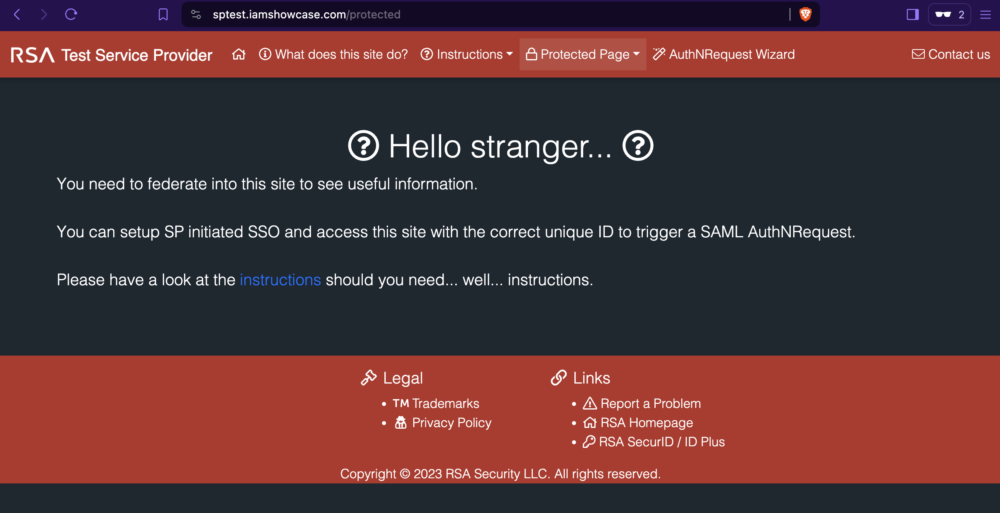
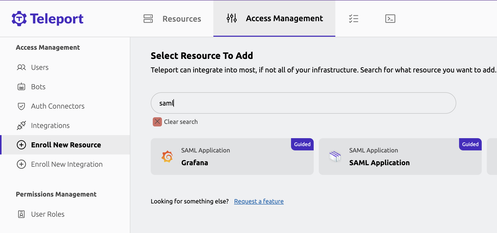
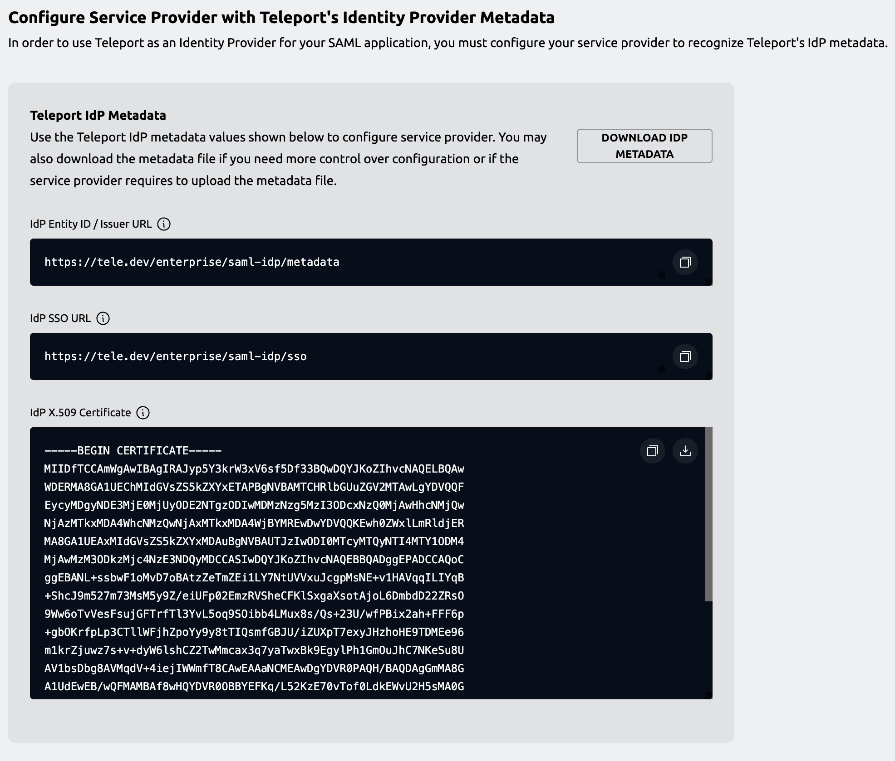
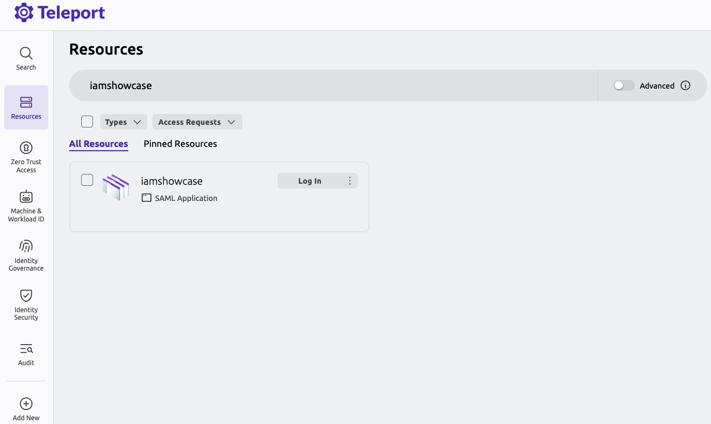
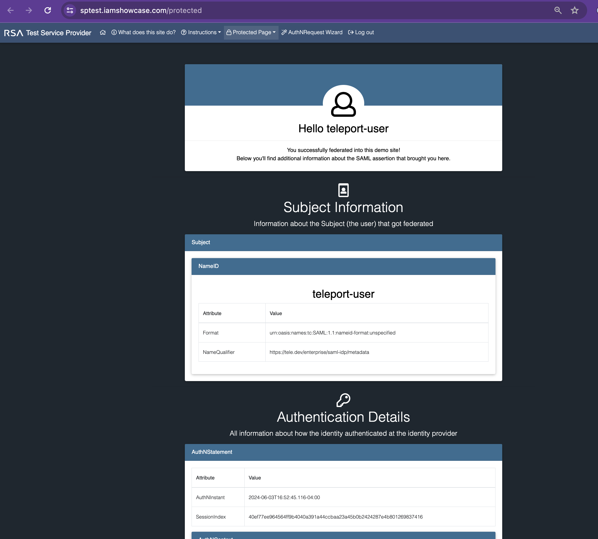

This guide details an example on how to use Teleport as a SAML identity provider
(IdP). You can set up the Teleport SAML IdP to enable Teleport users to
authenticate to external services through Teleport.

## Prerequisites

(!docs/pages/includes/commercial-prereqs-tabs.mdx!)

- (!docs/pages/includes/tctl.mdx!)
- If you're new to SAML, consider reviewing our [SAML Identity Provider
  Reference](../../../reference/access-controls/saml-idp.mdx) before proceeding.
- User with permission to create service provider resource. The preset `editor` role has this permission.
- SAML application (also known as a SAML service provider or SP) for testing. For this guide, we'll be using
[RSA Simple Test Service Provider](https://sptest.iamshowcase.com/) - a free test service that
lets us test Teleport SAML IdP. The test service has a protected page, which can be accessed only after a
user is federated to the site with a valid SAML assertion flow.


## Step 1/3. Add a service provider to Teleport

To add a service provider to Teleport, you must configure a service provider
metadata. This can be configured by either providing an **Entity ID** and **ACS URL** values of the
service provider or by providing an entity descriptor value (also known as metadata file, which is an XML file)
of the service provider.

Below we'll show both of the configuration options.

First, in the Web UI, under **Access Management**, click **Enroll New Resource** menu.
In the search box, enter "saml", which will show the SAML application
integration tile. Click the tile.



The first configuration step, **Configure Service Provider with Teleport's Identity Provider Metadata**
shows Teleport SAML IdP metadata values. For this guide, you can move to next step by clicking **Next** button
which takes to **Add Service Provider To Teleport** step.

### Option 1: Configure with Entity ID and ACS URL

With this option, the minimum configuration values required to add a service provider are:
1. **Entity ID:** The SAML metadata value or an endpoint of the service provider.
1. **ACS URL:** The endpoint where users will be redirected after SAML authentication. ACS URL
is also referred to as SAML SSO URL.

To configure Simple Test Service Provider, the values you need to provide are the following:
- **App Name:** `iamshowcase`
- **SP Entity ID / Audience URI:** `iamshowcase`
- **ACS URL / SP SSO URL:** `https://sptest.iamshowcase.com/acs`

Click **Finish** button, the `iamshowcase` app is now added to Teleport.

<Details title="Reference `tctl` based configuration" closed>

The following `saml_idp_service_provider` spec is a reference for adding Simple Test
Service Provider to Teleport:
```yaml
kind: saml_idp_service_provider
metadata:
  # The friendly name of the service provider. This is used to manage the
  # service provider as well as in identity provider initiated SSO.
  name: iamshowcase
spec:
  # entity_id is the metadata value or an endpoint of service provider
  # that serves entity descriptor, aka SP metadata.
  entity_id: iamshowcase
  # acs_url is the endpoint where users will be redirected after
  # SAML authentication.
  acs_url: https://sptest.iamshowcase.com/acs
version: v1
```

Add the spec to Teleport using `tctl`:

```code
$ tctl create iamshowcase.yaml
# SAML IdP service provider 'iamshowcase' has been created.
```
</Details>

<Admonition type="note">
With this configuration method, Teleport first tries to fetch an entity descriptor by
querying the `entity_id` endpoint. If an entity descriptor is not found at that endpoint,
Teleport will generate a new entity descriptor with the given `entity_id` and `acs_url` values.
</Admonition>

### Option 2: Configure with Entity Descriptor file

If the service provider provides an option to download an entity descriptor file or you
need more control over the entity descriptor, this is the recommended option to add a service provider
to Teleport.

With this option, you provide service provider entity descriptor file, which has all the details
required to configure service provider metadata.


In the **Add Service Provider To Teleport** page, provide a SAML service provider name (`iamshowcase`).
Now click **+ Add Entity Descriptor (optional)** button, which will expand entity descriptor editor.
Copy Simple Test Service Provider metadata file, which is available at the URL `https://sptest.iamshowcase.com/testsp_metadata.xml`
and paste it to entity descriptor editor in Teleport Web UI.

Click **Finish** button, the `iamshowcase` app is now added to Teleport.

<Details title="Reference `tctl` based configuration" closed>

First download the service provider metadata from Simple Test Service Provider as `iamshowcase.xml`:

```code
$ curl -o iamshowcase.xml https://sptest.iamshowcase.com/testsp_metadata.xml
```

Using the template below, create a file called `iamshowcase.yaml`. Assign the
metadata you just downloaded to the `entity_descriptor` field in the
`saml_idp_service_provider` object:

```yaml
kind: saml_idp_service_provider
metadata:
  # The friendly name of the service provider. This is used to manage the
  # service provider as well as in identity provider initiated SSO.
  name: iamshowcase
spec:
  # The entity_descriptor is the service provider XML.
  entity_descriptor: |
    <md:EntityDescriptor xmlns:md="urn:oasis:names:tc:SAML:2.0:metadata"...
version: v1
```

Add this to Teleport using `tctl`:

```code
$ tctl create iamshowcase.yaml
# SAML IdP service provider 'samltest-id' has been created.
```
</Details>

<Admonition type="important">
If an `entity_descriptor` is provided, its content takes preference over values provided in `entity_id` and `acs_url`.

Teleport only tries to fetch or generate entity descriptor when service provider is created for the first time.
Subsequent updates require an entity descriptor to be present in the service provider spec. As such, when updating
service provider, you should first fetch the spec that is stored in Teleport and only then edit the configuration.
```code
# get service provider spec
$ tctl get saml_idp_service_provider/<service provider name> > service-provider.yml
```
</Admonition>

## Step 2/3. Configure the service provider to recognize Teleport's SAML IdP

This step varies from service provider to service provider. Some service provider may ask to
provide Teleport SAML IdP Entity ID, SSO URL and X.509 certificate. Other's may ask to upload
an Teleport SAML IdP metadata file.

You will find these values in the Teleport Web UI under the
**Configure Service Provider with Teleport's Identity Provider Metadata** UI which is the first step
shown in the SAML app enrollment flow.



In the case of Simple Test Service Provider, which this guide is based on, the sample app is designed to grant access protected page
for any well formatted IdP federated SAML assertion data.

As such, when you click **Finish** button in the previous step, the protected page of the Simple Test Service Provider is
already available to access under resources page.

## Step 3/3. Verify access to iamshowcase protected page

To verify everything works, navigate to **Resources** page in Teleport Web UI.



The "iamshowcase" app will now appear under resources tile. Inside this tile,
click **Login** button, which will now forward you to iamshowcase protected page.



This page shows Teleport user details along with other attributes such as roles are
federated by Teleport SAML IdP.

This demonstrates adding a service provider to Teleport configured with a working idp-initiated SSO login flow.

## Recommended: Creating dedicated role to manage service provider

For production, we recommend creating a dedicated role to manage service provider.

To create a dedicated role, first, ensure you are logged into Teleport as a user that has
permissions to read and modify `saml_idp_service_provider` objects. The default `editor` role
has access to this already, but in case you are using a more customized configuration,
create a role called `sp-manager.yaml` with the following contents:

```yaml
kind: role
metadata:
  name: sp-manager
spec:
  allow:
    rules:
    - resources:
      - saml_idp_service_provider
      verbs:
      - list
      - create
      - read
      - update
      - delete
version: v7
```

Create the role with `tctl`:

```code
$ tctl create sp-manager.yaml
role 'saml-idp-service-provider-manager' has been created
```

(!docs/pages/includes/create-role-using-web.mdx!)

Next, add the role to your user.

(!docs/pages/includes/add-role-to-user.mdx role="sp-manager"!)

## Next steps
- Configure [SAML Attribute Mapping](./saml-attribute-mapping.mdx).
