This guide explains how to integrate the Teleport SAML IdP with [Microsoft Entra External ID](https://learn.microsoft.com/en-us/entra/external-id/)
so that users can access Azure Portal and the Azure CLI by authenticating with Teleport.

## Prerequisites

- A running Teleport Enterprise cluster version (=teleport.version=) or above. If you
  want to get started with Teleport, [sign up](https://goteleport.com/signup)
  for a free trial.
- If you're new to SAML, consider reviewing our [SAML identity provider (IdP)](../../../reference/access-controls/saml-idp.mdx) 
reference before proceeding.
- Teleport user with permission to create a SAML service provider resource. The preset `editor` role has this permission.
- Access to Microsoft Entra ID tenant and Azure subscription. 
- Microsoft Entra ID user with permissions to create an identity provider, create and manage users, assign roles,
and manage billing subscriptions. The "Global Administrator" role grants all the required permissions to follow this guide. We 
recommend to scope down administrative permission in production.

## Step 1/5. Determine if DNS update is required

When you create an identity provider in Microsoft Entra External ID, you need to associate a 
domain name with the identity provider.

For example, given a user account `alice@example.com`, in order to authenticate this user with Teleport, 
the domain `example.com` must be associated with the Teleport SAML IdP. 

A domain can be associated with an IdP in two places:
- Assign a domain name to the IdP when adding that IdP to the Microsoft Entra External ID. 
- Assign a domain name to the IdP after the IdP is created.

In both the cases, if your Teleport cluster and the user account belong to different domains, 
you must update the DNS `TXT` record of the domain that the user account belongs to. 
Refer to the table below. 

| Domain | User account | Teleport cluster | Domain association |
| - | - | - | - |
| example.com | alice@example.com | https://example.com, https://teleport.example.com | Domain can be associated without DNS update. |
| example.com | alice@example.com | https://example.teleport.sh| Domain can be associated but DNS update is required. |

In the second example where the DNS update is required, you need to update the `TXT` record of the `example.com` so that 
the `DirectFedAuthUrl` value of the `TXT` record points to SAML IdP SSO URL of the Teleport cluster `example.teleport.sh`.  
```
example.com.  IN   TXT   DirectFedAuthUrl=https://example.teleport.sh/enterprise/saml-idp/sso
```

For the self-hosted Teleport cluster, determine if DNS update is required based on the reference table shown above. 

For the Teleport Cloud cluster, you must update the DNS record of your domain. Because your Teleport cluster is 
always hosted under `example.teleport.sh` domain and your user account will not belong to the `teleport.sh` domain.

## Step 2/5. Configure Teleport as an identity provider

In this step, we configure Teleport SAML IdP as an identity provider in Microsoft Entra External ID
and add Microsoft Entra External ID as a service provider in Teleport. Teleport Web UI offers a guided 
flow to configure end-to-end SAML integration.

From the Teleport Web UI, locate **Add New > Resource** menu. From the list of resource catalog
select **Microsoft Entra External ID** tile. 

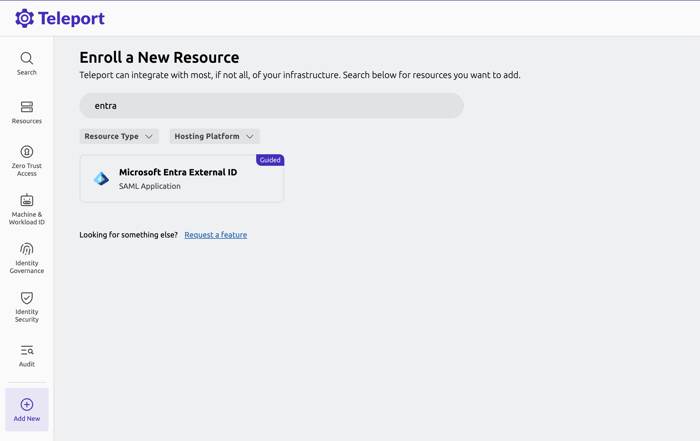

Once you click on the tile, the Web UI guides you through steps of adding 
Teleport as an identity provider in Microsoft Entra External ID.

You can locate **Microsoft Entra External ID** in Azure portal under Azure services.

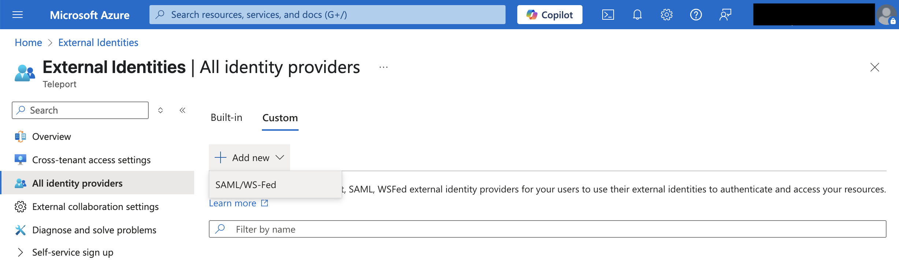

Note that while adding Teleport as an identity provider, you need to provide domain name 
as explained in the Step 1 of this guide.

Once you add Teleport as SAML IdP in Microsoft Entra External ID, you will need to copy the Entra ID `Tenant ID` from
Azure portal and provide the value to the Web UI and move to the next step of the SAML service provider configuration. 

As a second step of the SAML service provider configuration, you will notice that the Web UI already configures 
the SAML service provider entity ID, ACS URL and default attribute mapping value that is required for the integration. 
These values are generated based on preset values and Entra ID `Tenant ID`.

For reference, the values that are auto-configured are listed below:

- Entity ID: `https://login.microsoftonline.com/<entra-id-tenant-id>/`
- ACS URL: `https://login.microsoftonline.com/login.srf`
- Attribute:
  - Name: `http://schemas.xmlsoap.org/ws/2005/05/identity/claims/emailaddress`
  - Value: `uid`
- Launch URL: `https://portal.azure.com/<entra-id-tenant-id>`. The launch URL is where users are sent to after
a successful authentication with Teleport.

Provide a display name for this integration (e.g. "azure-portal") and click on button named 
`Finish` to register service provider. 

## Step 3/5. Create and invite user

In this step, we will create and invite an external user that authenticates with the Teleport SAML IdP.
<Admonition type="info" title="User account domain name">
The user that is invited should have a matching domain name associated with the Teleport SAML IdP. 
Refer to the Step 1 of this guide.
</Admonition>

Locate and select **Users** menu under Azure services.
From the **Users** page, click `+ New User` button and select "Invite external user" option. 

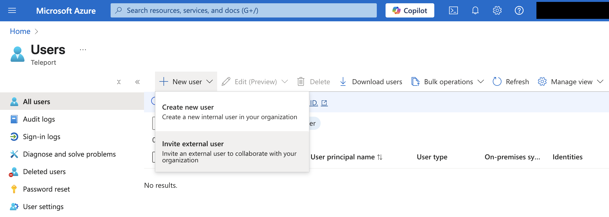

Enter the details for this user as needed to set up the account. You will notice that the a default value for
the "Invite redirect URL" field that points to `https://myapplications.microsoft.com/` is set for this user. 
This URL is where Microsoft will redirect the user after their first authentication. You can update this URL 
if you wish to redirect user to a different URL or keep it as it is.

Ensure that the default user type "Guest" remains unchanged. Click the `Review + invite` button to invite this user. 

For this guide, we created a user named `alice@example.com`

As an invited user, the first step is to redeem the invitation. They can do so by clicking on 
invitation link that can be found in the invitation email. As part of the redemption process, 
Microsoft asks users to confirm their consent to share user details with the IdP.

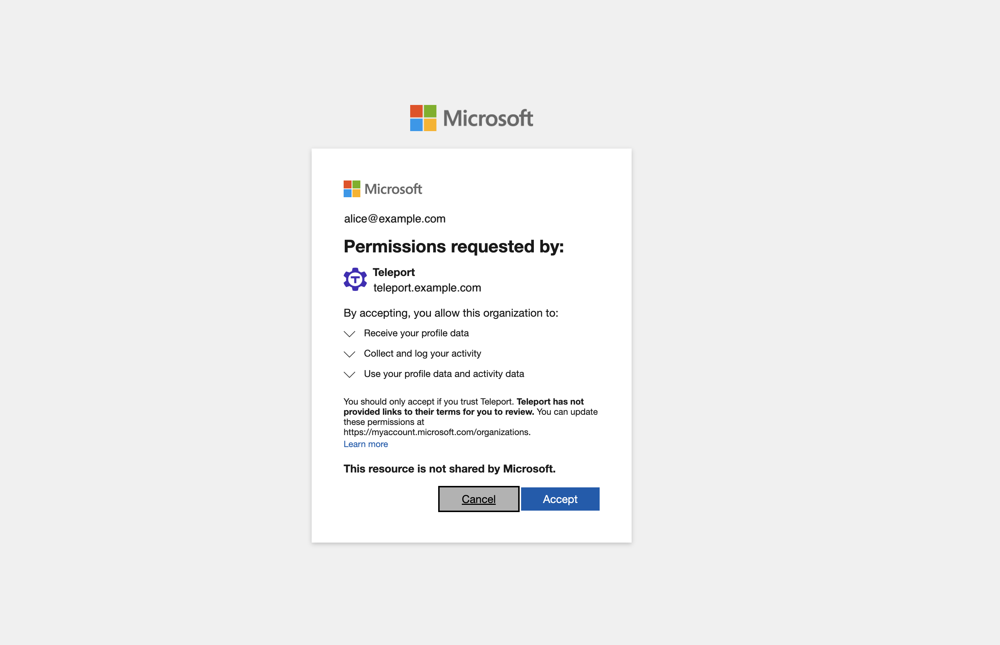

Users must accept the consent in order to enable authentication via Teleport. 


## Step 4/5. Grant Azure roles to the user

By default, there aren't any permissions granted to the invited users. The general process to grant a role is 
to create the Azure resource group that maps Azure roles with users and groups.

The example below demonstrates role assignment for a user group. Say we want to grant 
user `alice@example.com` an Azure role to manage virtual machines.

First, in Azure portal, select the **Groups** menu under Azure services.
Create a user group named `teleport-dev-vm` with user `alice@example.com` as its member.

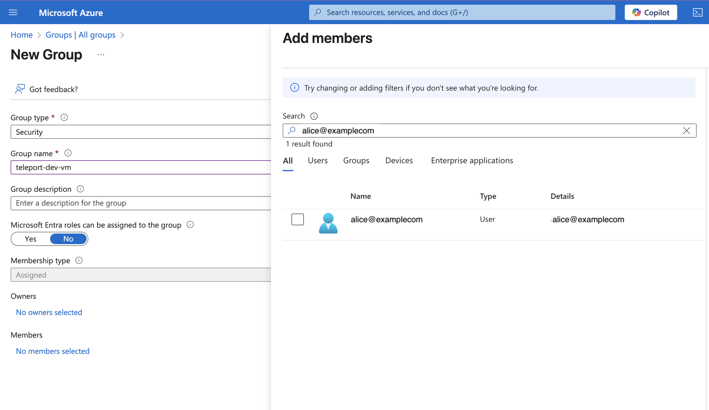

In Azure portal, select the **Resource Groups** menu and create a new resource group named `teleport-dev-vm-pool`.
Make a note of the subscription that you selected for this resource group. We will need this subscription in the next step.

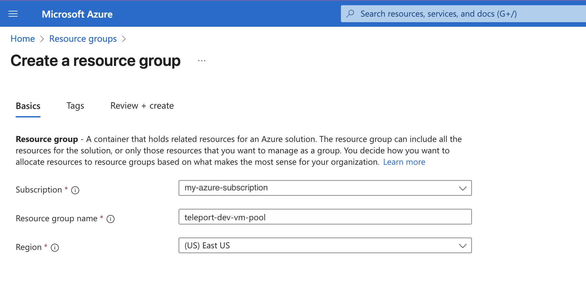

Select the `teleport-dev-vm-pool` resource group.
Then under the **Access control (IAM)** menu, click the `+ Add` button and select "Add role assignment"

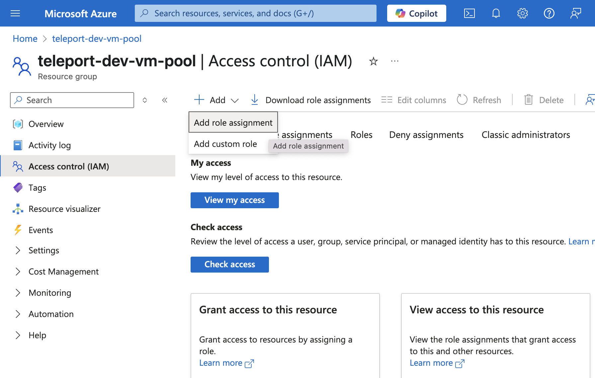

In the role assignment UI, first, select the "Virtual Machine Contributor" role. This role allows assigned users or groups
to manage VMs in Azure. Next, select the group `teleport-dev-vm` as its member. Finally, create the role assignment.

Your review assignment UI should look like the image below.

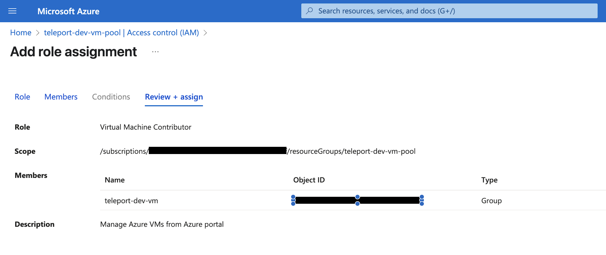

Click the `Review + assign` button to finish the role assignment.

We've now created a role and resource assignment, where users that are member of `teleport-dev-vm` group can access 
resource under the `teleport-dev-vm-pool` resource group with the privilege granted by the "Virtual Machine Contributor" role.

## Step 5/5. Link Azure subscription to Microsoft Entra External ID

The Microsoft Entra External ID must be linked with an existing billing subscription. 

This is required so the users can access and billed for Azure resources available under the linked subscription. 

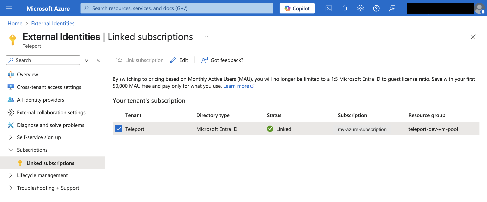

In the Azure portal, under **Microsoft Entra External ID** page, link an active subscription to External ID. 
Make sure to select the same subscription that you selected while creating the resource group in Step 4. 

Once the subscription is linked, user `alice@example.com` will be able to access VM resources available
under `teleport-dev-vm-pool` resource group.

## Azure CLI access

Users can authenticate the Azure CLI with Teleport by providing a tenant ID to the `az login` command.
```code
az login --tenant <tenant_id>
```

The command will open a web browser window that redirects the user to authenticate with Teleport SAML IdP. 
Upon successful authentication, Microsoft Entra ID responds with credentials for the CLI.

## User access audit logs

User access logs can be found in both the Teleport Web UI and in the Azure Portal.

In Teleport, each user authentication with the SAML IdP is logged and the event can be found in the audit log.
```json
{
  "cluster_name": "example.teleport.sh",
  "code": "TSI000I",
  "ei": 0,
  "event": "saml.idp.auth",
  "service_provider_entity_id": "https://login.microsoftonline.com/<tenant_id>/",
  "sid": "",
  "success": true,
  "time": "2025-04-15T14:43:40.057Z",
  "uid": "d6fa48a4-8bfd-420c-992c-24bba11fb30a",
  "user": "alice@example.com"
}
```

The same login event can also be found in Azure portal under **User > Sign-in logs** page.

## FAQ

### How can I automate external user invitation?

Users can be bulk invited using the [Microsoft Graph API](https://learn.microsoft.com/en-us/graph/api/invitation-post?view=graph-rest-1.0&tabs=powershell#example-1-invite-a-guest-user).

### How can I associate multiple domain names?

Multiple domain can be federated as long as DNS of those domain name is updated to let the Microsoft 
Entra ID knows that each such domain is associated with Teleport SAML IdP. 

First, open domain configuration menu for the selected identity provider
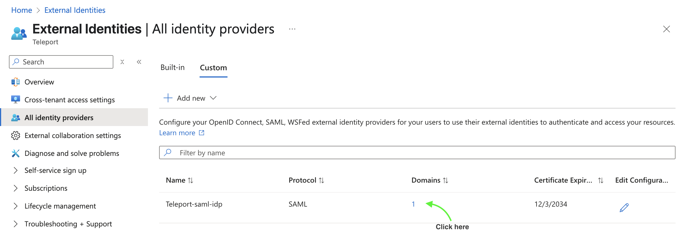

Then add a new domain name.
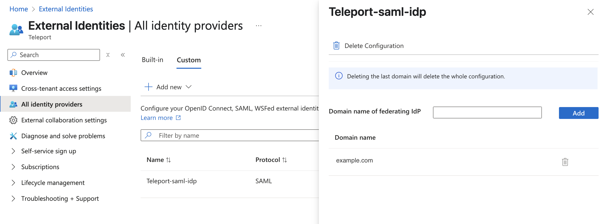

Note that the rules of DNS update apply here as well. 

## Troubleshooting

### Issues related to identity provider configuration

Refer to official the [Microsoft Entra External ID SAML federation](https://learn.microsoft.com/en-us/entra/external-id/direct-federation) docs for general configuration.

### Issues related to user invitation and user type conversion
For issues related to user invitation, or internal to external user type conversion, refer to the [Microsoft Entra B2B collaboration](https://learn.microsoft.com/en-us/entra/external-id/troubleshoot) troubleshooting docs.


