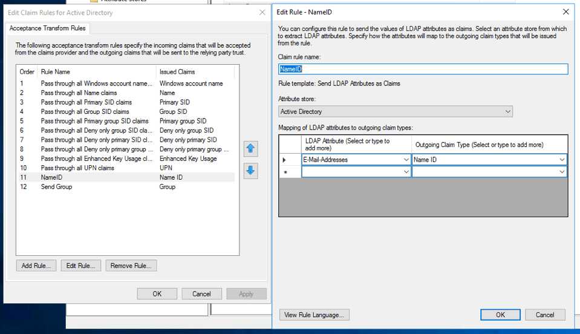
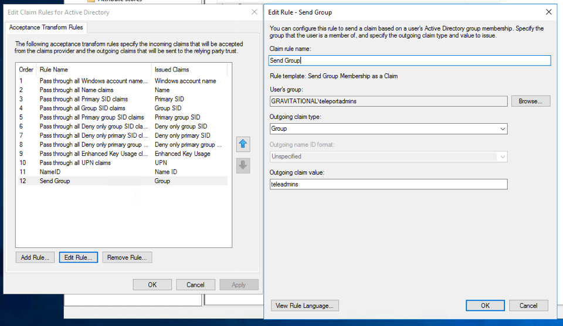
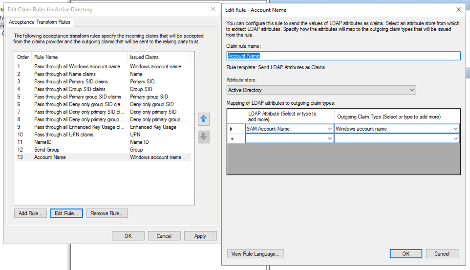
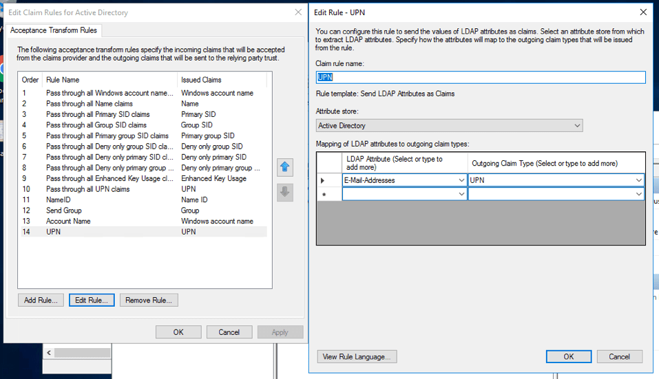
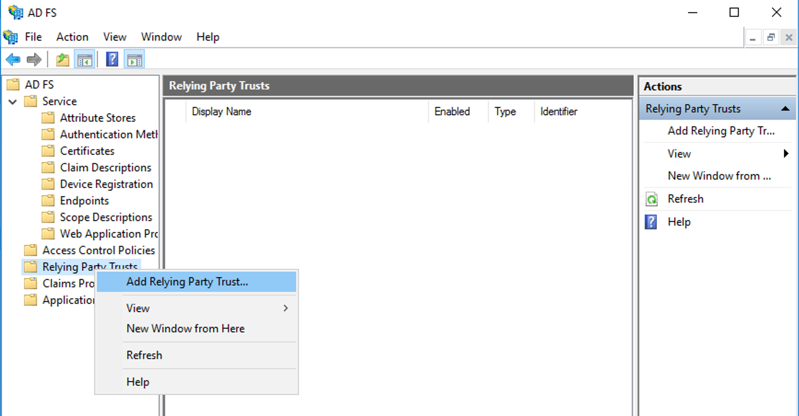
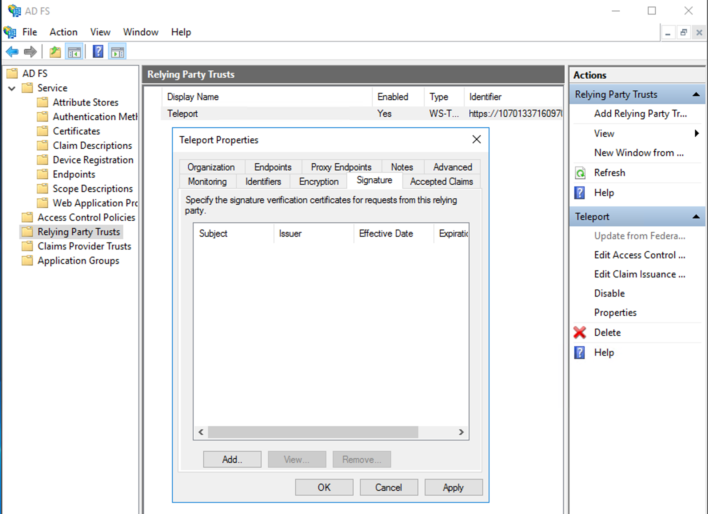

This guide will explain how to configure Active Directory Federation Services
([ADFS](https://en.wikipedia.org/wiki/Active_Directory_Federation_Services)) to be
a single sign-on (SSO) provider to issue login credentials to specific groups
of users. When used in combination with role based access control (RBAC), it
allows Teleport administrators to define policies like:

- Only members of "DBA" group can SSH into machines running PostgreSQL.
- Developers must never SSH into production servers.

## Prerequisites

- ADFS installation with Admin access and users assigned to at least two groups.
- Teleport role with access to maintaining `saml` resources.  This is available in the default `editor` role.

(!docs/pages/includes/commercial-prereqs-tabs.mdx!)

- (!docs/pages/includes/tctl.mdx!)

## Step 1/3. Configure ADFS

You'll need to configure ADFS to export claims about a user (Claims Provider
Trust in ADFS terminology) and you'll need to configure ADFS to trust
Teleport (a Relying Party Trust in ADFS terminology).

For Claims Provider Trust configuration, open the **AD FS** management window.
Under **Claims Provider Trusts**, right-click on **Active Directory** and
select **Edit Claim Rules**. You'll need to specify at least the following two
incoming claims: `Name ID` and `Group`.

- `Name ID` should be a mapping of the LDAP Attribute `E-Mail-Addresses` to
  `Name ID`.

  

- A group membership claim should be used to map users to roles (for example to
  separate normal users and admins).

  

- If you are using dynamic roles (see below), it may be useful to map the LDAP
  Attribute `SAM-Account-Name` to `Windows account name`:

  

- And create another mapping of `E-Mail-Addresses` to `UPN`:

  

You'll also need to create a Relying Party Trust. Use the below information to
help guide you through the Wizard.

- Create a Relaying Party Trust:
  
- Enter data about the relying party manually.
- Set the display name to something along the lines of `Teleport`.
- Skip the token encryption certificate.
- Select *"Enable support for SAML 2.0 Web SSO protocol"* and set the URL to
  `https://teleport.example.com/v1/webapi/saml/acs`, replacing the domain name
  with your Teleport proxy URL.
- Set the relying party trust identifier to
  `https://teleport.example.com/v1/webapi/saml/acs` as well.
- For access control policy select *"Permit everyone"*.

Once the Relying Party Trust has been created, update the Claim Issuance Policy
for it. Like before, make sure you send at least `Name ID` and `Group` claims to the
relying party (Teleport). If you are using dynamic roles, it may be useful to
map the LDAP Attribute `SAM-Account-Name` to *"Windows account name"* and create
another mapping of `E-Mail-Addresses` to *"UPN"*.

Lastly, ensure the user you create in Active Directory has an email address
associated with it. To check this open Server Manager then
*"Tools -> Active Directory Users and Computers"* and select the user and right
click and open properties. Make sure the email address field is filled out.

## Step 2/3. Create Teleport roles

Let's create two Teleport roles: one for administrators and the other for
normal users. You can create them using the `tctl create {file name}` CLI command
or via the Web UI.

```yaml
# admin-role.yaml
kind: "role"
version: "v3"
metadata:
  name: "admin"
spec:
  options:
    max_session_ttl: "8h0m0s"
  allow:
    logins: [ root ]
    node_labels:
      "*": "*"
    rules:
      - resources: ["*"]
        verbs: ["*"]
```

```yaml
# user-role.yaml
kind: "role"
version: "v3"
metadata:
  name: "dev"
spec:
  options:
    # regular users can only be guests and their certificates will have a TTL of 1 hour:
    max_session_ttl: "1h"
  allow:
    # only allow login as either ubuntu or the 'windowsaccountname' claim
    logins: [ '{{external["http://schemas.microsoft.com/ws/2008/06/identity/claims/windowsaccountname"]}}', ubuntu ]
    node_labels:
      "access": "relaxed"
```

This role declares:

- Devs are only allowed to log in to nodes labeled `access: relaxed`.
- Developers can log in as the `ubuntu` user.
- Developers will not be able to see or replay past sessions or
  re-configure the Teleport cluster.

The login
<nobr>`{{external["http://schemas.microsoft.com/ws/2008/06/identity/claims/windowsaccountname"]}}`</nobr>
configures Teleport to look at the
`http://schemas.microsoft.com/ws/2008/06/identity/claims/windowsaccountname`
attribute and use that field as an allowed login for each user. Since the name
of the attribute contains characters besides letters, numbers, and underscores,
you must use double quotes (`"`) and square brackets (`[]`) around the name of
the attribute.

## Step 3/3. Create a SAML connector

Create a SAML connector resource using `tctl`:

```code
$ tctl sso configure saml --acs https://teleport.example.com/v1/webapi/saml/acs \
  --preset adfs \
  --entity-descriptor https://adfs.example.com/FederationMetadata/2007-06/FederationMetadata.xml \
  --attributes-to-roles http://schemas.xmlsoap.org/claims/Group,teleadmins,editor \
  --attributes-to-roles http://schemas.xmlsoap.org/claims/Group,Users,access \
  > adfs.yaml
```

The `acs` field should match the value you set in ADFS earlier and you can
obtain the `entity_descriptor_url` from ADFS under *"ADFS -> Service -> Endpoints -> Metadata"*.

The `attributes_to_roles` is used to map attributes to the Teleport roles you
just created. In our situation, we are mapping the *"Group"* attribute whose full
name is `http://schemas.xmlsoap.org/claims/Group` with a value of *"teleadmins"*
to the *"editor"* role. Groups with the value *"users"* is being mapped to the
*"users"* role.

You can test this connector before applying it (`cat adfs.yaml | tctl sso test`),
but until we complete the next step the authentication process will not complete.

Apply the connector:

```code
$ tctl create -f adfs.yaml
```

### Export the signing key

For the last step, you'll need to export the signing key:

```code
$ tctl saml export adfs > saml.cer
```

Copy `saml.cer`, to ADFS server, open the "Relying Party Trust" and add this
file as one of the signature verification certificates:



The Web UI will now contain a new button: "Login with MS Active Directory". The CLI is
the same as before:

```code
$ tsh --proxy=proxy.example.com login
```

This command will print the SSO login URL and try to open it
automatically in a browser.

<Admonition
  type="tip"
  title="Tip"
>
  Teleport can use multiple SAML connectors. In this case a connector name
  can be passed via `tsh login --auth=connector_name`
</Admonition>

(!docs/pages/includes/enterprise/samlauthentication.mdx!)

## Troubleshooting

(!docs/pages/includes/sso/loginerrortroubleshooting.mdx!)

## Next steps

In the Teleport role we illustrated in this guide, `external` traits
are replaced with values from the single sign-on provider that the user
used to authenticate to Teleport. For full details on how traits
work in Teleport roles, see the [Teleport Access Controls
Reference](../../../reference/access-controls/roles.mdx).

