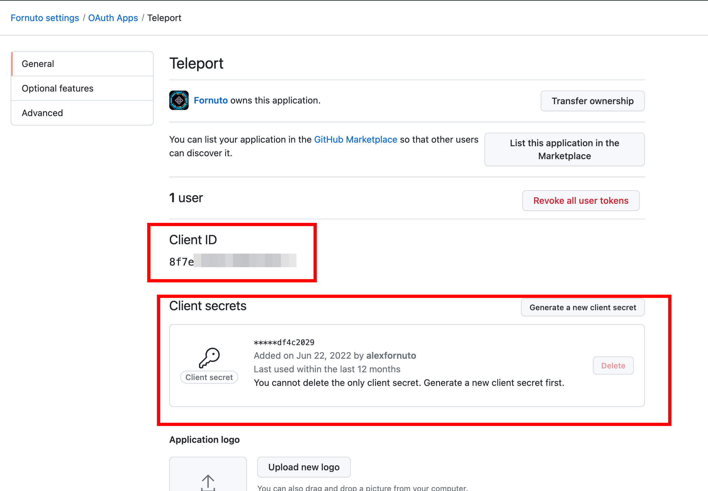
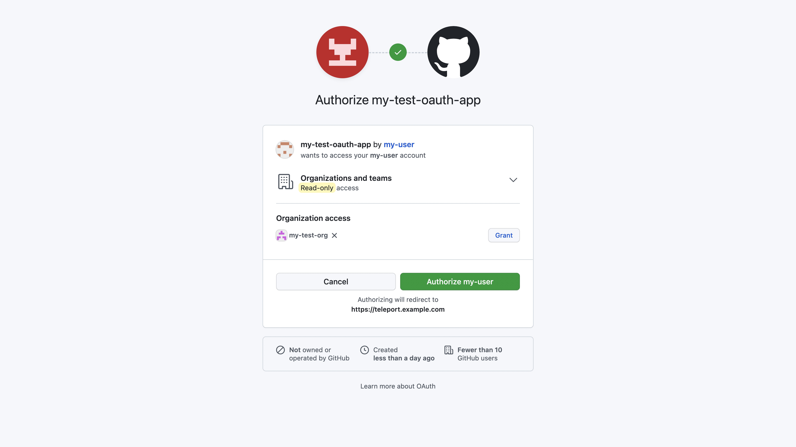

This guide explains how to set up GitHub Single Sign On (SSO) so you can
automatically map teams in your GitHub organization to users and roles in
Teleport.

## How it works

A Teleport administrator creates a GitHub authentication connector on the
Teleport Auth Service backend and requires Teleport users to authenticate
through GitHub by creating a cluster authentication preference.

When a user authenticates to Teleport, they receive instructions to finish
authenticating using GitHub. The Teleport Auth Service receives an OAuth 2.0
access token from GitHub and authenticates the token. (The GitHub authentication
connector acts as an OAuth 2.0
[client](https://datatracker.ietf.org/doc/html/rfc6749#section-4.1).)

The Auth Service then issues short-lived TLS and SSH certificates to the user by
reading data from the OAuth 2.0 access token. In particular, the Auth Service:
- Maps the user's GitHub teams to Teleport roles in order to assign the user
  permissions. 
- Assigns the user's Teleport username to their GitHub username.

<Admonition type="warning">

GitHub usernames are not formatted as email addresses. As a result, any Teleport
plugin that expects to send email to a user based on their Teleport username
will not work as expected. For example, the [PagerDuty Access Request
plugin](../access-request-plugins/ssh-approval-pagerduty.mdx) has this
limitation.

</Admonition>

## Prerequisites

- A GitHub organization with at least one team. 

  In Teleport Community Edition, this organization must not have external SSO
  set up, or Teleport will refuse to create the GitHub authentication connector.

  In Teleport Enterprise and Enterprise Cloud, organization can be hosted from
  either GitHub Cloud or GitHub Enterprise Server.

- Teleport role with access to maintaining `github` resources for using `tctl`
  from the Desktop. This is available in the default `editor` role.

(!docs/pages/includes/edition-prereqs-tabs.mdx!)

- (!docs/pages/includes/tctl.mdx!)

## Step 1/4. Create a GitHub OAuth app

Create and register a GitHub OAuth App. When you do so, ensure that your OAuth
App's "Authentication callback URL" is the following:

```
https://PROXY_ADDRESS/v1/webapi/github/
```

Replace `PROXY_ADDRESS` with be the public address of the Teleport Proxy Service
or your Teleport Cloud workspace URL (e.g., `example.teleport.sh`).

The app must have the `read:org` scope in order to be able to read org and team
membership details.

Instructions for creating a GitHub OAuth app are available in [GitHub's
documentation](https://docs.github.com/en/developers/apps/building-oauth-apps/creating-an-oauth-app)

Create a client secret to use along with the client ID in the next step:



## Step 2/4. Create a GitHub authentication connector

In this section, you will define a GitHub authentication connector using `tctl`.

On your workstation, create a file called `client-secret.txt` consisting only of
your client secret.

Update this example command with:

- Your OAuth app's client ID and client secret created during the previous step.
- The roles you want to map from your GitHub organization to Teleport roles.
  Roles are defined in the **Repository roles** section of your organization's
  settings.

See [tctl sso configure github](../../../reference/cli/tctl.mdx)
for a full reference of flags for this command:

```code
$ tctl sso configure github \
--id=<Var name="GITHUB-CLIENT-ID"/> \
--secret=$(cat client-secret.txt) \
--teams-to-roles=<Var name="ORG-NAME,github-team,access,editor"/> \
> github.yaml
```
<Admonition type="tip">
  GitHub organizations and teams should be referred to by their slug, not display name.
  To create the team slug, GitHub replaces special characters in the name string, changes all words to lowercase,
  and replaces spaces with a `-` separator. For example, `My TEam Näme` would become `my-team-name`.
  The organization slug is treated the same except the organization is not changed to lowercase.
  You can confirm the slug in GitHub Web application URLs or via the GitHub API.
  Example: navigate to the team `My Team` in the GitHub web application.
  The URL `https://github.com/orgs/org-name/teams/my-team`
  shows the slug is `my-team`.
</Admonition>

The contents of `github.yaml` should resemble the following:

<Tabs>
<TabItem scope={["oss"]} label="Teleport Community Edition">
```yaml
kind: github
metadata:
  name: github
spec:
  api_endpoint_url: ""
  client_id: <client-id>
  client_secret: <client-secret>
  display: GitHub
  endpoint_url: ""
  redirect_url: https://<proxy-address>/v1/webapi/github/callback
  teams_to_logins: null
  teams_to_roles:
    - organization: ORG-NAME
      roles:
        - access
        - editor
      team: github-team
version: v3
```
</TabItem>

<TabItem scope={["enterprise", "cloud"]} label="Commercial">
```yaml
kind: github
metadata:
  name: github
spec:
  api_endpoint_url: https://api.github.com
  client_id: <client-id>
  client_secret: <client-secret>
  display: GitHub
  endpoint_url: https://github.com
  redirect_url: https://<proxy-address>/v1/webapi/github/callback
  teams_to_logins: null
  teams_to_roles:
    - organization: org-name
      roles:
        - access
        - editor
        - reviewer
      team: github-team
version: v3
```
</TabItem>

</Tabs>

<details>
<summary>Mapping multiple roles</summary>
You can add multiple instances of the `--teams-to-roles` flag or edit the connector
file to define multiple mappings. For example:

```code
$  tctl sso configure github \
--id=<Var name="GITHUB-CLIENT-ID"/> \
--secret=$(cat client-secret.txt) \
--teams-to-roles=<Var name="ORG-NAME,github-team,access,editor"/> \
--teams-to-roles="org-name,administrators,admins \
--teams-to-roles="different-org,developers,dev \
> github.yaml
```

```yaml
spec.
  teams_to_roles:
    - organization: org-name
      roles:
        - access
        - editor
      team: github-team
    - organization: org-name
      roles:
        - admins
      team: administrators
    - organization: different-org
      roles:
        - devs
      team: developers
```

</details>

<details>
<summary>Self-hosting GitHub Enterprise?</summary>

For self-hosted GitHub Enterprise servers, you can specify the server instance
endpoints with the `--endpoint-url`, `--api-endpoint-url` parameters, replacing
<Var name="github-enterprise-server-address"/> with your endpoint URL and 
<Var name="api-github-enterprise-server-address"/> with your API endpoint URL:

```code
$ tctl sso configure github \
--id=<Var name="GITHUB-CLIENT-ID"/> \
--secret=$(cat client-secret.txt) \
--teams-to-roles=<Var name="ORG-NAME,github-team,access,editor"/> \
--endpoint-url=https://<Var name="github-enterprise-server-address"/>
--api-endpoint-url=https://<Var name="api-github-enterprise-server-address"/>
> github.yaml
```

```yaml
...
spec:
  ...
  api_endpoint_url: https://<api-github-enterprise-server-address>
  endpoint_url: https://<github-enterprise-server-address>
  ...
```

</details>

You can test the connector configuration before applying it to your cluster.
This is strongly encouraged to avoid interruption to active clusters:

```code
$ cat github.yaml | tctl sso test
If browser window does not open automatically, open it by clicking on the link:
 http://127.0.0.1:52690/35714f6b-...
Success! Logged in as: alice
--------------------------------------------------------------------------------
Authentication details:
   roles:
   - access
   - editor
   traits:
     github_teams:
     - admins
     kubernetes_groups: null
     kubernetes_users: null
     logins:
     - alice
   username: alice
--------------------------------------------------------------------------------
[GitHub] Received claims:
organization_to_teams:
  Octocats:
  - admins
teams:
- admins
username: alice

--------------------------------------------------------------------------------
[GitHub] Connector team to roles mapping:
- organization: Octocats
  roles:
  - access
  - editor
  team: admins

--------------------------------------------------------------------------------
For more details repeat the command with --debug flag.
```

Finally, create the connector using `tctl`:

```code
$ tctl create -f github.yaml
authentication connector "github" has been created
```

<Admonition type="tip">
  When going through the GitHub authentication flow for the first time,
  the application must be granted access to all organizations that are
  present in the "teams to logins" mapping, otherwise Teleport will not be
  able to determine team memberships for these organizations.
</Admonition>

After a user authenticates, Teleport will add the user's GitHub username to their
`internal.logins` trait for their Teleport session. The preset `access` role has this
trait variable configured to include the GitHub user as an authorized SSH login.
Here is an example role configuration snippet using the trait variable:

```yaml
  allow:
    # List of allowed SSH logins
    logins: ['{{internal.logins}}', ubuntu, debian]

    # List of node labels that users can SSH into
    node_labels:
      '*': '*'
```

## Step 3/4. Log in to Teleport using GitHub

You can now log in with Teleport using GitHub SSO. Run the following to log out
of Teleport and log in again using GitHub SSO.

<Tabs>
<TabItem scope={["oss", "enterprise"]} label="Self-Hosted">

```code
$ tsh logout
# Logged out all users from all proxies.
$ tsh login --proxy=tele.example.com --auth=github
If browser window does not open automatically, open it by clicking on the link:
 http://127.0.0.1:56334/6bf976e6-a4be-4898-94eb-8a7b01af2158
```

</TabItem>
<TabItem scope={["cloud"]} label="Teleport Enterprise Cloud">

```code
$ tsh logout
# Logged out all users from all proxies.
$ tsh login --proxy=mytenant.teleport.sh --auth=github
If browser window does not open automatically, open it by clicking on the link:
 http://127.0.0.1:56334/6bf976e6-a4be-4898-94eb-8a7b01af2158
```

</TabItem>

</Tabs>

You can also log to the web UI using GitHub by clicking **Other sign-in options** at the login screen.

When you sign in for the first time, you will see a prompt to authorize your
GitHub OAuth app:



Teleport will request only the `read:org` OAuth scope. Read more about OAuth scopes in GitHub's documentation:
[GitHub OAuth scopes](https://developer.github.com/apps/building-oauth-apps/understanding-scopes-for-oauth-apps/)

After logging in, you will receive a "Login Successful" window, which you can then close.

You will receive the details of your user session within the CLI:

<Tabs>
<TabItem scope={["oss"]} label="Teleport Community Edition">

```code
> Profile URL:        https://tele.example.com:443
  Logged in as:       jeff
  Cluster:            tele.example.com
  Roles:              access
  Logins:             jeff, ubuntu, debian
  Kubernetes:         enabled
  Kubernetes users:   dev
  Kubernetes groups:  developer
  Valid until:        2023-03-08 17:13:50 -0600 CST [valid for 7h51m0s]
  Extensions:         permit-port-forwarding, permit-pty, private-key-policy
```

</TabItem>


<TabItem scope={["enterprise"]} label="Teleport Enterprise">

```code
> Profile URL:        https://tele.example.com:443
  Logged in as:       jeff
  Cluster:            tele.example.com
  Roles:              access, requester
  Logins:             jeff, ubuntu, debian
  Kubernetes:         enabled
  Kubernetes users:   dev
  Kubernetes groups:  developer
  Valid until:        2023-03-08 17:13:50 -0600 CST [valid for 7h51m0s]
  Extensions:         permit-port-forwarding, permit-pty, private-key-policy
```

</TabItem>

<TabItem scope={["cloud"]} label="Teleport Enterprise Cloud">

```code
> Profile URL:        https://mytenant.teleport.sh:443
  Logged in as:       jeff
  Cluster:            mytenant.teleport.sh
  Roles:              access, requester
  Logins:             jeff, ubuntu, debian
  Kubernetes:         enabled
  Kubernetes users:   dev
  Kubernetes groups:  developer
  Valid until:        2023-03-08 17:13:50 -0600 CST [valid for 7h51m0s]
  Extensions:         permit-port-forwarding, permit-pty, private-key-policy

```

</TabItem>

</Tabs>

## Step 4/4. Configure authentication preference

In the previous step we signed in to Teleport using GitHub credentials by
specifying GitHub as our auth type. By editing the `cluster_auth_preference`
resource we can make it the default auth type.

Edit the existing `cluster_auth_preference` resource using `tctl`:

```code
$ tctl edit cap
```

A temporary file will open in your default editor with your `cluster_auth_preference` definition.

Ensure that `cap.yaml` includes the following content:

```yaml
kind: cluster_auth_preference
metadata:
  name: cluster-auth-preference
spec:
  type: github
  webauthn:
    rp_id: 'example.teleport.sh'
version: v2
```

For `rp_id`, use the public address of your Teleport Proxy Service or Teleport
Cloud workspace.

When you save and close the temporary file, `tctl` will update the resource:

```code
#cluster auth preference has been updated
```

<details>
<summary>Static configuration file</summary>

You can also edit your Teleport configuration file to include the following:

```yaml
# Snippet from /etc/teleport.yaml
auth_service:
  authentication:
    type: github
```

</details>

After logging out of `tsh`, you can log back in without specifying
`--auth=github`. You will automatically be redirected to the GitHub auth flow.

## Troubleshooting

(!docs/pages/includes/sso/loginerrortroubleshooting.mdx!)

### Teams Not Mapping to Roles

If you are not seeing teams mapping to roles as expected confirm you 
are using the slug of the organizations and teams in the connector.
To create the slug, GitHub replaces special characters in the name string,
changes all words to lowercase, and replaces spaces with a `-` separator.
For example, "My TEam Näme" would become `my-team-name`.
The GitHub Web application URLs and GitHub API can provide the slug.

Example: navigate to the team `My Team` in the GitHub web application.
The URL `https://github.com/orgs/org-name/teams/my-team`
shows the slug is `my-team`. Update the teams to roles mapping.

```yaml
  teams_to_roles:
    - organization: my-org
      roles:
        - access
        - editor
        - reviewer
      team: my-team
```

## Next steps


The role we illustrated in this guide uses the `internal.logins` trait,
which Teleport replaces with values from the Teleport local user
database. For full details on how traits work in Teleport roles,
see the [Access Controls
Reference](../../../reference/access-controls/roles.mdx).

