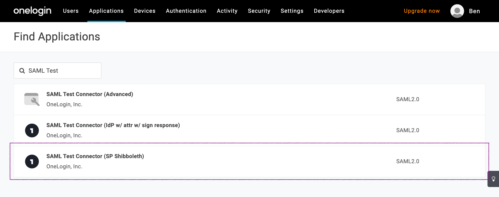
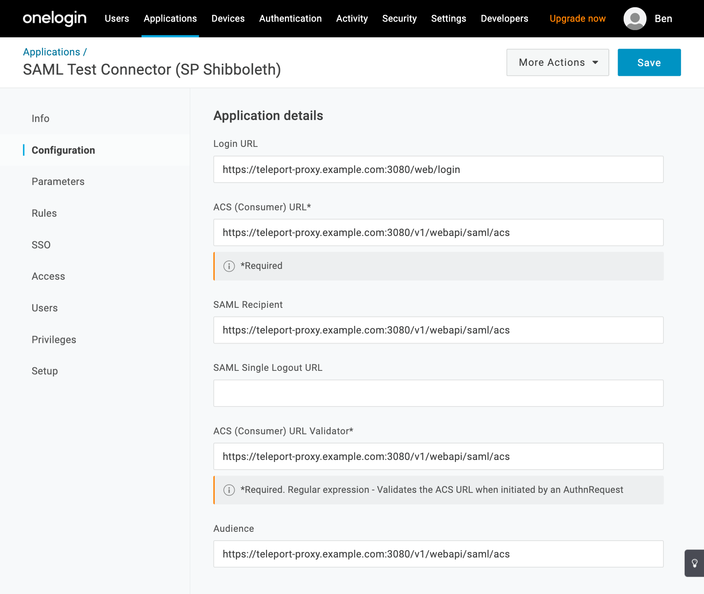
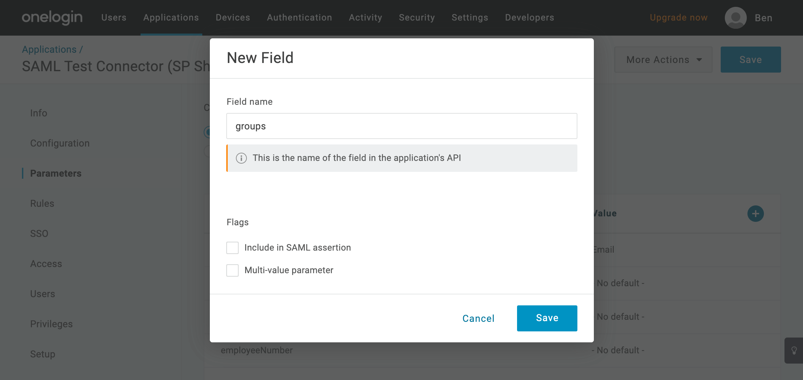
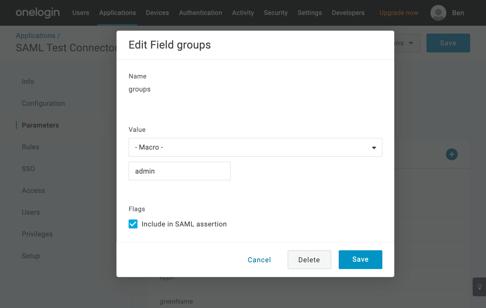
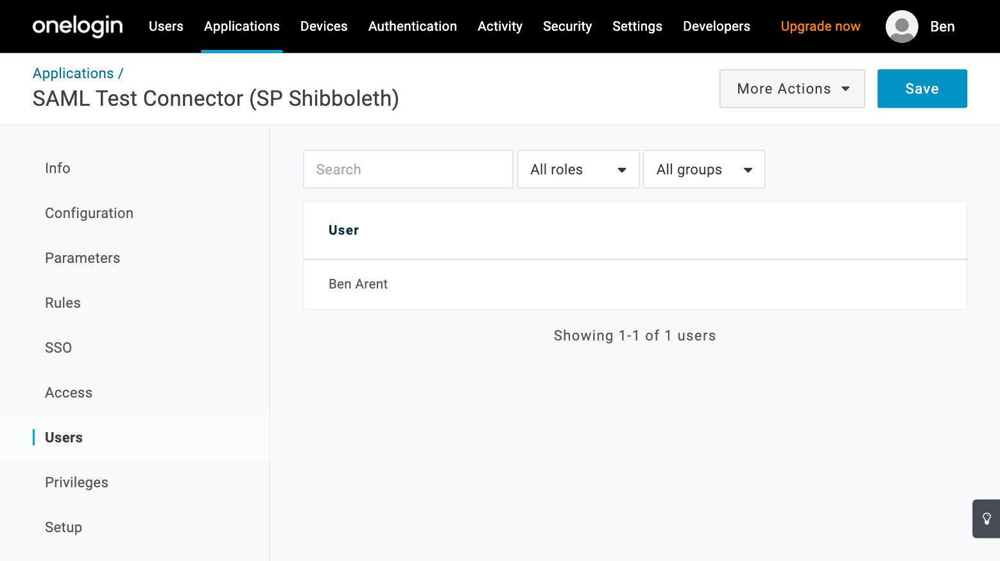
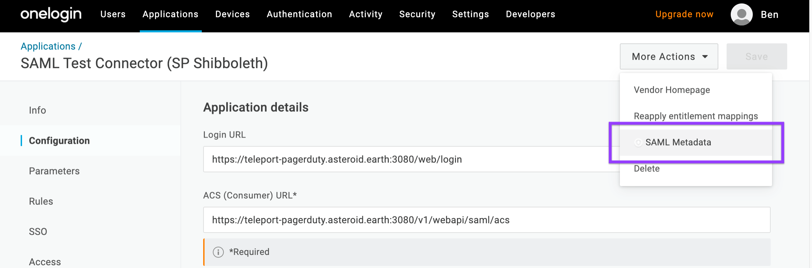

This guide will explain how to configure [OneLogin](https://www.onelogin.com/)
to issue Teleport credentials to specific groups of users. When used in
combination with role based access control (RBAC) it allows SSH administrators
to define policies like:

- Only members of "DBA" group can connect to PostgreSQL databases.
- Developers must never SSH into production servers.
- ... and many others.

## Prerequisites

- A OneLogin account with admin access, and users assigned to at least two groups.
- Teleport role with access to maintaining `saml` resources.  This is available
  in the default `editor` role.

(!docs/pages/includes/commercial-prereqs-tabs.mdx!)

- (!docs/pages/includes/tctl.mdx!)

## Step 1/3. Create Teleport application in OneLogin

1. In the OneLogin control panel's main menu navigate to **Applications** ->
   **Add App**. Using the search box, select "SAML Custom Connector (SP
   Shibboleth)":

   

1. Define the new application:

   

   You can find Teleport icons to upload from the following links:

   - [Square Icon](../../../../img/sso/onelogin/teleport.png)
   - [Rectangular Icon](../../../../img/sso/onelogin/teleportlogo@2x.png)

1. From the application's **Configuration** page, set the following values:

   <Admonition type="tip">
   Set <Var name="teleport.example.com:443" description="Your Teleport Proxy Service address and port, or cloud tenant." />
   here with your Teleport Proxy Service address and port, or Teleport Enterprise
   Cloud tenant (e.g. `company.teleport.sh:443`) to fill out the values below.
   </Admonition>
   
   - **Login URL**:
     - `https://`<Var name="teleport.example.com:443"/>`/web/login`
   - **ACS (Consumer) URL**, **SAML Recipient**, **ACS (Consumer) URL Validator**, & **Audience**:
     - `https://`<Var name="teleport.example.com:443"/>`/v1/webapi/saml/acs/onelogin`

   

1. Teleport needs to assign groups to users. From the **Parameters** page,
   configure the application with some parameters exposed as SAML attribute
   statements:

   
   
   
   
   <Admonition
     type="warning"
     title="Important"
   >
     Make sure to check `Include in SAML assertion` checkbox.
   </Admonition>

1. Add users to the application:

   

1. Obtain SAML metadata for your authentication connector. Once the application
   is set up, navigate to the the **More Actions** menu and find the **SAML
   Metadata** option:

   

   You can either left-click the option and download the XML document as a local
   file or right-click the option and copy the link address. The Teleport Auth
   Service either reads the provided document or queries the address to obtain
   SAML metadata. We recommend copying the address so the Auth Service can use
   the most up-to-date information.

## Step 2/3. Create a SAML connector

Create a SAML connector using `tctl`. Update <Var name="xml-path"/> to the URL
of the XML document that you copied in the previous step. If you downloaded the
XML document instead, use the path to the XML metadata file:

```code
$ tctl sso configure saml --preset onelogin \
--entity-descriptor <Var name="xml-path"/> \
--attributes-to-roles groups,admin,editor \
--attributes-to-roles groups,dev,access > onelogin.yaml
```

This will create `onelogin.yaml`, describing the connector resource:

```yaml
(!examples/resources/onelogin-connector.yaml!)
```

Test the newly created configuration:

```code
$ cat onelogin.yaml | tctl sso test
```

`tctl sso test` will open the browser and attempt to authenticate with OneLogin.
If it succeeds the output will print what SAML attributes are received and mapped
to Teleport roles. If the test fails, the output will help you troubleshoot your
configuration.

Create the connector using `tctl` tool:

```code
$ tctl create -f onelogin.yaml
```

(!docs/pages/includes/enterprise/samlauthentication.mdx!)

## Step 3/3. Create a new Teleport role

We are going to create a new that'll use external username data from OneLogin
to map to a host linux login.

In the role described below, Devs are only allowed to login to nodes labelled with
`access: relaxed` Teleport label. Developers can log in as either `ubuntu` to a
username that arrives in their assertions. Developers also do not have any
rules needed to obtain admin access to Teleport.

```yaml
# dev.yaml
kind: role
version: v5
metadata:
  name: dev
spec:
  options:
    max_session_ttl: "24h"
  allow:
    logins: [ "{{external.username}}", ubuntu ]
    node_labels:
      access: relaxed
```

**Notice:** Replace `ubuntu` with linux login available on your servers!

Create the role:

```code
$ tctl create -f dev.yaml
```

(!docs/pages/includes/create-role-using-web.mdx!)

## Troubleshooting

(!docs/pages/includes/sso/loginerrortroubleshooting.mdx!)

## Next steps

In the Teleport role we illustrated in this guide, `external` traits
are replaced with values from the single sign-on provider that the user
used to authenticate to Teleport. For full details on how traits
work in Teleport roles, see the [Teleport Access Controls
Reference](../../../reference/access-controls/roles.mdx).

